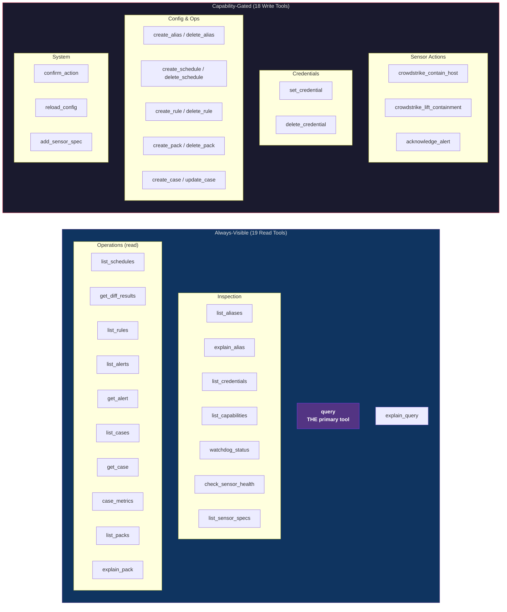
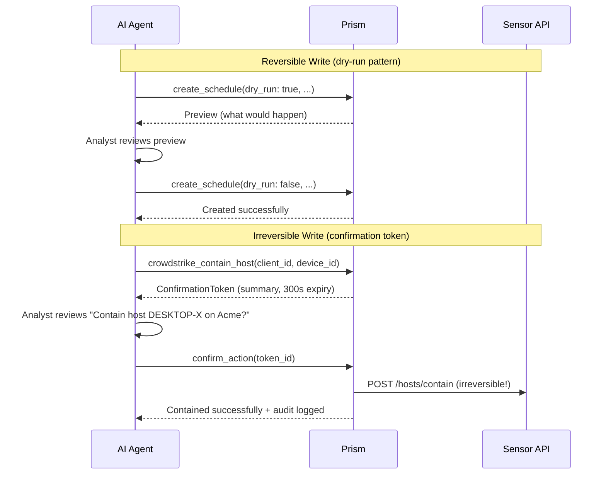

# API Surface

## Interface Model

Prism exposes functionality exclusively via the Model Context Protocol (MCP) over stdio transport. There is no REST API, no gRPC endpoint, no web UI. The MCP interface is consumed by Claude Code (AI agent), not directly by humans.

## Tool Registry Overview



## Write Tool Confirmation Flows



## Tool Registry Details

Tools are organized by subsystem. Write tools follow the hidden-tools pattern (BC-2.04.005): disabled tools are omitted from `tools/list` entirely.

### Always-Visible Tools (Read-Only)

| Tool | Subsystem | Parameters | Description |
|------|-----------|-----------|-------------|
| `query` | SS-11 | clients, sensors, sources, query, force_refresh | Execute PrismQL query over sensor APIs and/or internal tables |
| `explain_query` | SS-11 | clients, sensors, sources, query | Dry-run: show alias expansion, planned API calls, estimated record count |
| `list_aliases` | SS-11 | client_id | List all aliases visible to a client (global + per-client merged) |
| `explain_alias` | SS-11 | alias_name, client_id | Show alias definition, parameters, expanded query |
| `check_sensor_health` | SS-08 | client_id, sensor_id | On-demand connectivity/auth/rate-limit check |
| `list_credentials` | SS-03 | client_id | List credential names (never values) for a client |
| `list_capabilities` | SS-04 | client_id | Show full capability matrix with explain() trace |
| `watchdog_status` | SS-15 | clear_denylist (optional bool) | Current limits, denylisted queries, resource history. With `clear_denylist: true`, removes all denylist entries — this sub-operation is capability-gated by `watchdog.write` at invocation time (not via hidden-tools pattern). If `watchdog.write` is denied, `clear_denylist: true` returns `E-FLAG-001` while the read portion still succeeds. The tool always appears in `tools/list` regardless of `watchdog.write` capability. |
| `list_schedules` | SS-12 | client_id | List active schedules with next run times |
| `get_diff_results` | SS-12 | query_name, client_id | Retrieve differential results for a schedule |
| `list_rules` | SS-13 | client_id, scope | List active rules by scope with provenance |
| `list_alerts` | SS-13 | client_id, severity, rule_id, status, since | Paginated alert listing |
| `get_alert` | SS-13 | alert_id | Full alert detail with matched events |
| `list_cases` | SS-14 | client_id, status, severity | Filter cases by status/client/severity |
| `get_case` | SS-14 | case_id | Full case detail with timeline and linked alerts |
| `case_metrics` | SS-14 | client_id | MTTD/MTTR and case status counts |
| `list_packs` | SS-12 | — | List query packs with contents and status. Pack definitions are global (not client-scoped) — all analysts see all pack definitions. Per-client activation is determined by discovery queries, not pack ownership. |
| `explain_pack` | SS-12 | pack_id, client_id | Show pack contents, discovery status, client assignments |
| `list_sensor_specs` | SS-16 | — | List loaded sensor specs with table schemas |

### Capability-Gated Tools (Hidden When Disabled)

| Tool | Capability Path | Risk Tier | Parameters |
|------|----------------|-----------|-----------|
| `set_credential` | credential.write | Irreversible (update, confirmation token) / None (create) | client_id, sensor_id, name, value |
| `delete_credential` | credential.write | Irreversible | client_id, sensor_id, name |
| `crowdstrike_contain_host` | sensor.crowdstrike.containment | Irreversible | client_id, device_id |
| `crowdstrike_lift_containment` | sensor.crowdstrike.containment | Reversible | client_id, device_id |
| `acknowledge_alert` | alert.write | Reversible | alert_id |
| `create_case` | case.write | None (create) | client_id, title, alert_ids, severity |
| `update_case` | case.write | Reversible | case_id, status, disposition, annotation |
| `create_alias` | alias.write | Reversible (create) / Irreversible (update) | name, query, scope, params |
| `delete_alias` | alias.write | Irreversible | name, scope |
| `create_schedule` | schedule.write | Reversible | query_name, query, interval, clients |
| `delete_schedule` | schedule.write | Irreversible | query_name |
| `create_rule` | rule.write | Reversible | rule definition |
| `delete_rule` | rule.write | Irreversible | rule_id, scope |
| `create_pack` | pack.write | Reversible | pack_name, queries, rules, aliases |
| `delete_pack` | pack.write | Irreversible | pack_id |
| `confirm_action` | (same as original tool) | — | token_id |
| `reload_config` | config.reload | Reversible | dry_run |
| `add_sensor_spec` | sensor_spec.write | Reversible | spec TOML content |

### Write Tool Confirmation Flow

```
Reversible writes: tool(dry_run: true) -> preview -> tool(dry_run: false) -> executed
Irreversible writes: tool(params) -> ConfirmationToken -> confirm_action(token) -> executed
```

## MCP Resources

| URI | Description | Update Notification |
|-----|-------------|-------------------|
| `clients://` | List of configured clients with sensor mappings | On config reload |
| `sensors://` | Sensor inventory with health status | On health change |
| `alerts://{client_id}` | Alert feed per client | On new alert (detection fires) |

## MCP Prompts

| Prompt | Description |
|--------|-------------|
| `triage-alerts` | Guided workflow for daily alert triage across clients |
| `investigate-incident` | Cross-sensor investigation workflow for a specific client |
| `client-posture` | Security posture summary for a specific client |

## Error Contract

All errors follow the `E-{CATEGORY}-{NNN}` format with structured envelope:

```json
{
  "isError": true,
  "content": [{
    "type": "text",
    "text": "{structured error JSON}"
  }],
  "_meta": {
    "error_code": "E-QUERY-009",
    "category": "validation",
    "severity": "broken",
    "retryable": false,
    "retry_after_seconds": null,
    "suggestion": "Add a WHERE clause constraining required column 'timestamp'",
    "original_params_valid": true
  }
}
```

27 error categories, 90+ error codes. Full taxonomy in prd-supplements/error-taxonomy.md.
