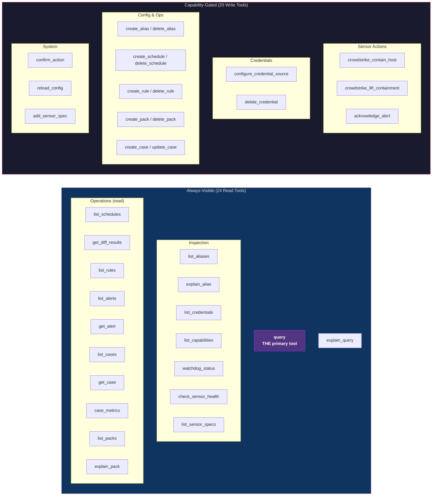
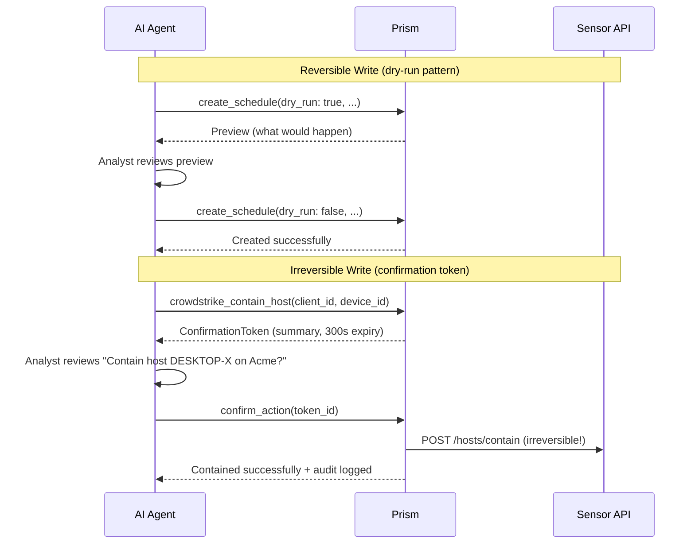
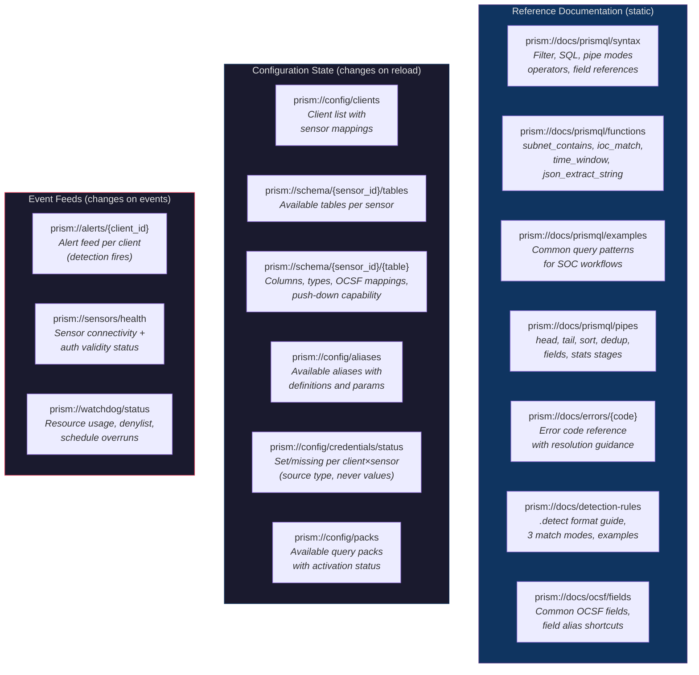

# API Surface

## Interface Model

Prism exposes functionality exclusively via the Model Context Protocol (MCP) over stdio transport. There is no REST API, no gRPC endpoint, no web UI. The MCP interface is consumed by Claude Code (AI agent), not directly by humans.

## Tool Registry Overview



## Write Tool Confirmation Flows



## Tool Registry Details

Tools are organized by subsystem. Write tools follow the hidden-tools pattern (BC-2.04.005): disabled tools are omitted from `tools/list` entirely.

### Always-Visible Tools (Read-Only)

| Tool | Subsystem | Parameters | Description |
|------|-----------|-----------|-------------|
| `query` | SS-11 | clients, sensors, sources, query, force_refresh, force_execute | Execute PrismQL query over sensor APIs and/or internal tables. `force_execute`: optional bool, bypasses denylist for a single execution (BC-2.15.008). |
| `explain_query` | SS-11 | clients, sensors, sources, query | Dry-run: show alias expansion, planned API calls, estimated record count |
| `list_aliases` | SS-11 | client_id | List all aliases visible to a client (global + per-client merged) |
| `explain_alias` | SS-11 | alias_name, client_id | Show alias definition, parameters, expanded query |
| `check_sensor_health` | SS-08 | client_id, sensor_id | On-demand connectivity/auth/rate-limit check |
| `list_credentials` | SS-03 | client_id | List credential names (never values) for a client |
| `credential_status` | SS-03 | client_id | Show set/missing status per credential with source type (keyring, env, vault, file). Values never returned. |
| `list_capabilities` | SS-04 | client_id | Show full capability matrix with explain() trace |
| `watchdog_status` | SS-15 | clear_denylist (optional bool) | Current limits, denylisted queries, resource history. With `clear_denylist: true`, removes all denylist entries — this sub-operation is capability-gated by `watchdog.write` at invocation time (not via hidden-tools pattern). If `watchdog.write` is denied, `clear_denylist: true` returns `E-FLAG-001` while the read portion still succeeds. The tool always appears in `tools/list` regardless of `watchdog.write` capability. |
| `list_schedules` | SS-12 | client_id | List active schedules with next run times |
| `get_diff_results` | SS-12 | query_name, client_id | Retrieve differential results for a schedule |
| `list_rules` | SS-13 | client_id, scope | List active rules by scope with provenance |
| `list_alerts` | SS-13 | client_id, severity, rule_id, status, since | Paginated alert listing |
| `get_alert` | SS-13 | alert_id | Full alert detail with inline event snapshots — includes the actual sensor data that triggered the alert (captured at alert creation time from the ephemeral differential RecordBatch). No re-query of sensor APIs needed. |
| `list_cases` | SS-14 | client_id, status, severity | Filter cases by status/client/severity |
| `get_case` | SS-14 | case_id | Full case detail with timeline and linked alerts |
| `case_metrics` | SS-14 | client_id | MTTD/MTTR and case status counts |
| `list_packs` | SS-12 | — | List query packs with contents and status. Pack definitions are global (not client-scoped) — all analysts see all pack definitions. Per-client activation is determined by discovery queries, not pack ownership. |
| `explain_pack` | SS-12 | pack_id, client_id | Show pack contents, discovery status, client assignments |
| `list_sensor_specs` | SS-16 | — | List loaded sensor specs with table schemas |
| `list_infusions` | SS-17 | client_id (optional) | List all loaded infusion specs with status, source type, data age, and cache hit rates |
| `infusion_status` | SS-17 | infusion_id | Detailed status for a named infusion: data file path, age, records loaded, three-tier cache stats, next scheduled reload |
| `list_plugins` | SS-18 | — | List all loaded WASM plugins with load status, ABI version, memory usage, and CPU epoch stats |
| `plugin_status` | SS-18 | plugin_id | Detailed status for a named WASM plugin: load time, invoke latency histogram, memory peak, CPU epoch consumption, last error if any |
| `list_actions` | SS-12 | client_id (optional) | List configured actions with status, trigger type, last fired |
| `action_status` | SS-12 | action_id | Detailed status: last fire time, success/failure count, rate limit state, suppressed count |
| `get_help` | SS-11 | topic | Returns documentation for a topic (prismql, prismql.functions, prismql.pipes, prismql.examples, ocsf.fields, detection-rules, errors, errors.{code}). Bridge tool — reads same content as prism://docs/ resources. |
| `get_diagnostics` | SS-15 | subsystem, client_id (optional), since (optional) | Operational diagnostics for a subsystem: scheduler, detection, actions, config, plugins, infusions, credentials, fanout, watchdog, storage. Returns aggregated state, counts, recent errors/warnings. See observability.md. |

### Capability-Gated Tools (Hidden When Disabled)

| Tool | Capability Path | Risk Tier | Parameters |
|------|----------------|-----------|-----------|
| `configure_credential_source` | credential.write | Reversible | client_id, sensor_id, name, source (enum: env, file, vault, keyring — references only, NEVER raw values) |
| `delete_credential` | credential.write | Irreversible | client_id, sensor_id, name |
| `crowdstrike_contain_host` | sensor.crowdstrike.containment | Irreversible | client_id, device_id |
| `crowdstrike_lift_containment` | sensor.crowdstrike.containment | Reversible | client_id, device_id |
| `acknowledge_alert` | alert.write | Reversible | alert_id |
| `create_case` | case.write | None (create) | client_id, title, alert_ids, severity |
| `update_case` | case.write | Reversible | case_id, status, disposition, annotation |
| `create_alias` | alias.write | Reversible (create) / Irreversible (update) | name, query, scope, params |
| `delete_alias` | alias.write | Irreversible | name, scope |
| `create_schedule` | schedule.write | Reversible | query_name, query, interval, clients |
| `delete_schedule` | schedule.write | Irreversible | query_name |
| `create_rule` | rule.write | Reversible | rule definition |
| `delete_rule` | rule.write | Irreversible | rule_id, scope |
| `create_pack` | pack.write | Reversible | pack_name, queries, rules, aliases |
| `delete_pack` | pack.write | Irreversible | pack_id |
| `confirm_action` | (same as original tool) | — | token_id |
| `reload_config` | config.reload | Reversible | dry_run |
| `add_sensor_spec` | sensor_spec.write | Reversible | spec TOML content |
| `fire_action` | action.write | Reversible | action_id, context (JSON) — manually trigger an action |
| `test_action` | action.write | Reversible | action_id — send test payload to validate destination connectivity |
| `reload_infusion` | infusion.write | Reversible | infusion_id — trigger immediate data reload for the named infusion (re-reads source file, arc-swaps registry) |
| `reload_plugin` | plugin.write | Reversible | plugin_id — hot-reload a WASM plugin: compile new module, instantiate, swap after in-flight calls drain |
| `create_action` | action.write | Reversible | spec_toml — validate and load a new action spec; write to `{config_dir}/actions/{action_id}.action.toml` |
| `delete_action` | action.write | Irreversible | action_id — remove action spec file and unregister from ActionEngine; in-flight executions drain before removal |

### Write Tool Confirmation Flow

```
Reversible writes: tool(dry_run: true) -> preview -> tool(dry_run: false) -> executed
Irreversible writes: tool(params) -> ConfirmationToken -> confirm_action(token) -> executed
```

## MCP Resources

Resources provide the AI agent with reference documentation and live state. Three categories: reference docs (static), configuration state (changes on reload), and event feeds (changes on events).

### Resource Architecture



### Reference Documentation Resources (Static)

| URI | mimeType | Size | Description |
|-----|----------|------|-------------|
| `prism://docs/prismql/syntax` | text/markdown | ~3 KB | PrismQL language overview: three modes (filter, SQL, pipe), mode auto-detection, operators, field reference syntax, value types, security limits |
| `prism://docs/prismql/functions` | text/markdown | ~2 KB | Built-in functions: `subnet_contains`, `ioc_match`, `time_window`, `mitre_tactic`, `severity_label`, `json_extract_string` with signatures and examples |
| `prism://docs/prismql/pipes` | text/markdown | ~2 KB | Pipe stages: `head`, `tail`, `sort`, `dedup`, `fields`, `stats` with syntax and examples |
| `prism://docs/prismql/examples` | text/markdown | ~3 KB | Common query patterns organized by SOC workflow: triage queries, hunt queries, compliance queries, cross-sensor correlation examples |
| `prism://docs/ocsf/fields` | text/markdown | ~2 KB | Common OCSF hot column fields with descriptions, plus field alias shortcuts (src_ip → src_endpoint.ip, hostname → device.hostname, etc.) |
| `prism://docs/detection-rules` | text/markdown | ~3 KB | .detect format guide: rule structure, three match modes with examples, alert template variables, validation rules |
| `prism://docs/errors/{code}` | application/json | ~500 B | Error code lookup (resource template). Returns: code, severity, category, message format, retryable flag, resolution guidance, related tool suggestions |
| `prism://docs/errors` | application/json | ~4 KB | Full error code catalog with short descriptions (for bulk loading) |

### Configuration State Resources (Dynamic — Update on `reload_config`)

| URI | mimeType | Description | Notification |
|-----|----------|-------------|-------------|
| `prism://config/clients` | application/json | Client inventory: IDs, names, sensor mappings, credential status summary | `notifications/resources/updated` on reload |
| `prism://schema/{sensor_id}/tables` | application/json | Resource template. Available tables for a sensor with row counts and descriptions. Auto-completion on `sensor_id` | On reload |
| `prism://schema/{sensor_id}/{table_name}` | application/json | Resource template. Full column schema: name, type, OCSF mapping, push-down capability (REQUIRED/INDEX/ADDITIONAL), description | On reload |
| `prism://config/aliases` | application/json | All aliases (global + per-client) with definitions, parameters, composition chains | On reload |
| `prism://config/credentials/status` | application/json | Set/missing status per `(client_id, sensor_id, credential_name)` with source type (keyring, env, vault). Values NEVER included. | On reload |
| `prism://config/packs` | application/json | Query pack inventory: pack names, contents (schedules + rules + aliases), discovery query status per client | On reload |

### Event Feed Resources (Dynamic — Update on Events)

| URI | mimeType | Description | Notification |
|-----|----------|-------------|-------------|
| `prism://alerts/{client_id}` | application/json | Resource template. Recent alerts for a client with severity, rule name, and matched event summary. Updated when detection rules fire. | `notifications/resources/updated` on new alert |
| `prism://sensors/health` | application/json | Sensor health matrix: connectivity, auth validity, rate limit state, last successful query per `(client_id, sensor_id)` | On health change |
| `prism://watchdog/status` | application/json | Current watchdog limits, denylisted queries, active schedule count, resource usage history | On denylist change |

### Diagnostic Resources (Dynamic — Update on State Change)

| URI | mimeType | Description | Notification |
|-----|----------|-------------|-------------|
| `prism://diagnostics/summary` | application/json | Overall health — errors, warnings, subsystem status | On error/warning |
| `prism://diagnostics/{subsystem}` | application/json | Resource template. Per-subsystem diagnostic state (same data as `get_diagnostics` tool) | On state change |
| `prism://diagnostics/trace/{trace_id}` | application/json | Resource template. Full trace of a specific operation across all subsystems. Returns `E-DIAG-001` if trace ID not found or logs rotated. | — |

### Bridge Tool: `get_help`

Because MCP resources are application-controlled (Claude Code decides when to load them, not the LLM), we provide a **bridge tool** the LLM can actively invoke:

| Tool | Parameters | Description |
|------|-----------|-------------|
| `get_help` | topic (string) | Returns documentation for a topic. Topics: `prismql`, `prismql.functions`, `prismql.pipes`, `prismql.examples`, `ocsf.fields`, `detection-rules`, `errors`, `errors.{code}`. Internally reads the same content as the corresponding `prism://docs/` resource. |

This ensures the AI can always access reference material regardless of whether Claude Code has pre-loaded the resources. The `get_help` tool is always-visible (read-only, no capability gate).

## MCP Prompts

Prompts are user-triggered guided workflows that appear as slash commands in Claude Code. Each prompt bundles instructional text with embedded resources so the LLM receives everything it needs in one shot.

### Prompt Registry

| Prompt | Arguments | Embedded Resources | Description |
|--------|-----------|-------------------|-------------|
| `/triage` | `client_id` (optional), `severity_threshold` (optional, default: high) | PrismQL examples, OCSF fields, client list, sensor schemas for scoped sensors | Daily alert triage workflow: check differential results across sensors, review new alerts, prioritize by severity, create cases for confirmed threats |
| `/hunt` | `client_id` (required), `indicator` (optional — IP, hostname, or hash to hunt for) | PrismQL syntax, PrismQL functions, PrismQL pipes, sensor schemas for client's sensors | Threat hunting session: cross-sensor indicator search, timeline reconstruction, lateral movement analysis, IOC correlation |
| `/investigate` | `case_id` or `alert_id` (required) | Case management guide, alert detail (embedded), sensor schemas for relevant sensors | Investigation workflow: review alert context, enrich with cross-sensor data, timeline annotation, disposition guidance |
| `/onboard` | `client_id` (required) | Credential setup guide, sensor configuration reference | Client onboarding: credential setup checklist, sensor health verification, pack activation, first-query validation |
| `/status` | `client_id` (optional — all clients if omitted) | Sensor health, credential status, schedule overview | Operational status check: sensor connectivity, credential validity, schedule overruns, alert volume trends, watchdog state |

### Prompt Example: `/triage`

When the analyst types `/triage` in Claude Code:

```json
{
  "messages": [
    {
      "role": "user",
      "content": { "type": "text", "text": "Run the daily triage workflow for all clients. Check for new high-severity alerts, review differential results, and create cases for confirmed threats." }
    },
    {
      "role": "user", 
      "content": { "type": "resource", "resource": { "uri": "prism://docs/prismql/examples", "mimeType": "text/markdown" } }
    },
    {
      "role": "user",
      "content": { "type": "resource", "resource": { "uri": "prism://docs/ocsf/fields", "mimeType": "text/markdown" } }
    },
    {
      "role": "user",
      "content": { "type": "resource", "resource": { "uri": "prism://config/clients", "mimeType": "application/json" } }
    }
  ]
}
```

The LLM receives the workflow instructions + query examples + OCSF field reference + client list in one shot, then begins executing the triage procedure using Prism's tools.

## Error Contract

All errors follow the `E-{CATEGORY}-{NNN}` format with structured envelope:

```json
{
  "isError": true,
  "content": [{
    "type": "text",
    "text": "{structured error JSON}"
  }],
  "_meta": {
    "error_code": "E-QUERY-009",
    "category": "validation",
    "severity": "broken",
    "retryable": false,
    "retry_after_seconds": null,
    "suggestion": "Add a WHERE clause constraining required column 'timestamp'",
    "original_params_valid": true
  }
}
```

27 error categories, 90+ error codes. Full taxonomy in prd-supplements/error-taxonomy.md.

## Changelog

| Version | Date | Burst | Change |
|---------|------|-------|--------|
| 1.1 | 2026-04-19 | Burst 35 | Added 8 Tool Registry rows for S-5.06 tools missing from registry. Always-visible: `list_infusions` (SS-17), `infusion_status` (SS-17), `list_plugins` (SS-18), `plugin_status` (SS-18). Capability-gated: `reload_infusion` (`infusion.write`), `reload_plugin` (`plugin.write`), `create_action` (`action.write`), `delete_action` (`action.write`). Fixes pass-34 finding P3P34-A-M-002. |
| 1.0 | 2026-04-15 | Phase 1b | Initial API surface specification. |
