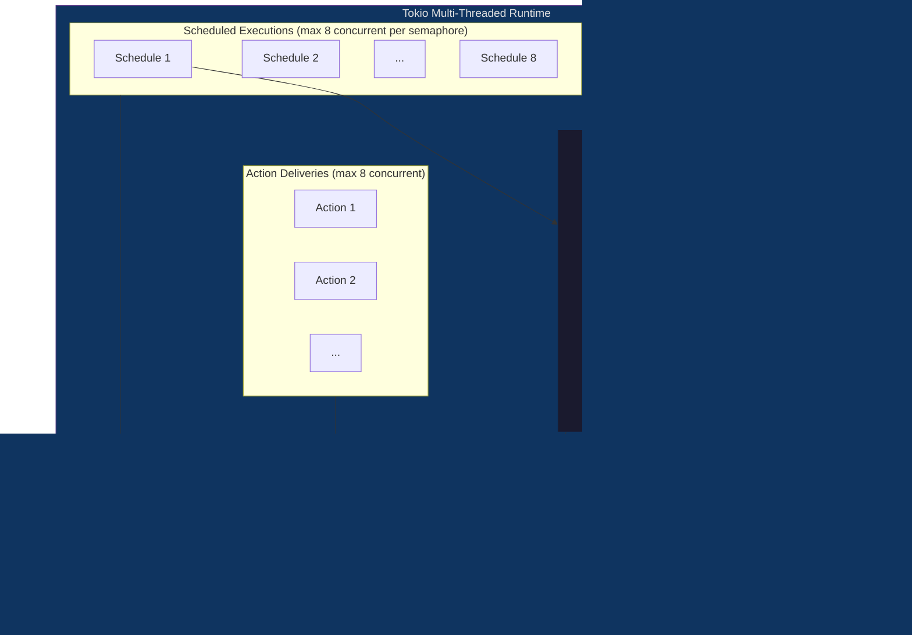
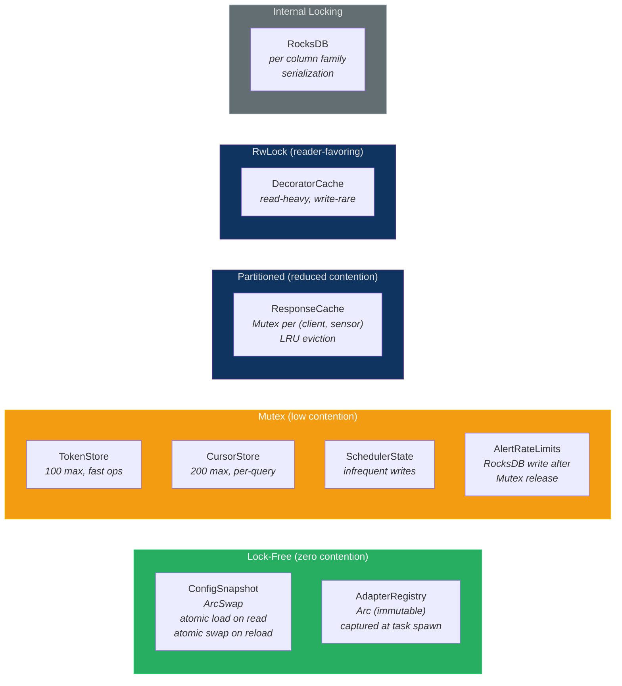
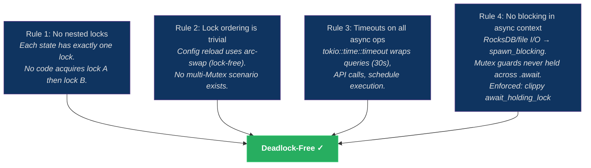

# Concurrency Architecture

## Concurrency Overview



## Shared State Protection



## Deadlock Prevention Rules



## Threading Model

### Decision: Tokio Multi-Threaded Runtime (AD-013)

**Status:** accepted
**Context:** Prism needs concurrent sensor fan-out, DataFusion uses tokio internally, rmcp requires tokio.
**Decision:** Tokio multi-threaded runtime (default configuration).
**Rationale:** All major dependencies (rmcp, DataFusion, reqwest) require tokio. Multi-threaded runtime enables parallel sensor fan-out across CPU cores. The single-process model (DI-017) means all concurrency is within-process.
**Consequences:** All async functions run on the tokio runtime. Blocking operations (RocksDB reads, file I/O) use `tokio::task::spawn_blocking`. No manual thread management.

## Shared State

| State | Type | Protection | Access Pattern | Contention Risk |
|-------|------|-----------|---------------|-----------------|
| ConfigSnapshot | `ArcSwap<ConfigSnapshot>` | Lock-free read, atomic swap on reload | Read-heavy (every query), write-rare (reload) | None (lock-free) |
| AdapterRegistry | `Arc<AdapterRegistry>` | Rebuilt on config reload, swapped atomically | Read-heavy (every query) | None (immutable after construction) |
| RocksDB | `Arc<DB>` (multi-threaded mode) | RocksDB internal locking per column family | Mixed (reads per query, writes per schedule/detection) | Low (column family isolation) |
| ConfirmationTokenStore | `Arc<Mutex<HashMap<String, Token>>>` | Mutex | Write on create/consume, read on validate | Low (100 max tokens, fast operations) |
| CursorStore | `Arc<Mutex<HashMap<String, Cursor>>>` | Mutex | Write on create, read on page fetch, cleanup on expiry | Low (200 max cursors, per-query lifetime) |
| ResponseCache | `Arc<Mutex<LruCache>>` per (client, sensor) | Mutex per cache instance | Read/write per query | Low (per-client-per-sensor partitioning reduces contention) |
| Scheduler State | `Arc<Mutex<SchedulerState>>` | Mutex | Write on schedule creation/deletion, read on tick | Low (ticks are infrequent vs query load) |
| Schedule Executor Semaphore | Module-private Semaphore (8 permits, prism-operations::scheduler per D-209 LOCKED) | Tokio semaphore | Acquire on schedule execution, release on completion | High (bounds concurrent schedule fan-out) |
| Action Delivery Semaphore | Module-private Semaphore (8 permits, prism-operations::action_delivery per D-209 LOCKED) | Tokio semaphore | Acquire on action fire, release on completion | High (bounds concurrent action delivery) |
| Decorator Cache | `Arc<RwLock<HashMap<String, Value>>>` | RwLock | Read-heavy (every query), write-rare (periodic refresh) | None (RwLock favors readers) |
| AlertRateLimitState | `Arc<Mutex<AlertRateLimits>>` | Mutex | Write on alert persistence (per-rule + global counters), read on rate check | Low (held only during counter increment + comparison, fast operation). Contains both per-rule hourly counters and global hourly counter. All rate limit checks and increments are performed under this single Mutex — the "same lock" referenced in detection-rule-format.md. **RocksDB persistence:** The durable write to `detection_state` rate limit key happens **after the Mutex is released**, via `spawn_blocking` (consistent with CI-004 and the spawn_blocking pattern). This means a crash between Mutex release and RocksDB write can lose at most one increment — the rate limit counter on restart reads from the last persisted value. This bounded under-count (at most `concurrent_schedule_tasks` increments, typically 1-16) is an accepted trade-off: the rate limit is a best-effort mechanism, not a security invariant. The global 1,000/hr limit absorbs this margin. |

## Concurrency Patterns

### Sensor Fan-Out

Per-query fan-out uses `tokio::JoinSet` for concurrent `(client_id, sensor_id)` API calls:

```rust
let mut join_set = JoinSet::new();
for (client_id, sensor_id) in scope {
    let adapter = registry.get(client_id, sensor_id)?;
    join_set.spawn(async move {
        adapter.fetch(table, push_down_filters).await
    });
}
// Collect results, partial failures go to sensor_errors
while let Some(result) = join_set.join_next().await { ... }
```

Cross-client fan-out is bounded by two concurrency controls:
1. **Per-query semaphore** (default 10): Limits concurrent `(client_id, sensor_id)` API calls within a single query. Configurable via `[defaults.limits].max_concurrent_api_calls_per_query` in TOML or `PRISM_MAX_API_CALLS_PER_QUERY` env var.
2. **Global HTTP connection semaphore** (default 200): Limits total concurrent HTTP connections across all queries and schedules. Configurable via `[defaults.limits].max_concurrent_http_connections` in TOML or `PRISM_MAX_HTTP_CONNECTIONS` env var. This prevents aggregate fan-out amplification: (2 ad-hoc queries + 16 schedules) × 10 per-query = 180 connections, within the 200 global cap. Semaphore acquisition uses `tokio::time::timeout`-bounded `acquire().await` with the remaining query timeout budget as the deadline. If the semaphore wait exceeds the remaining budget, the fan-out task returns `E-QUERY-004` (query timeout) — the per-query `tokio::time::timeout` wrapper cancels all outstanding fan-out tasks including those waiting for semaphore permits.

### Schedule Execution

Scheduled queries and action deliveries run on spawned tokio tasks, gated by independent 8-permit semaphores per D-209 LOCKED (no shared concurrency budget). See also ADR-013 §2.3 and ADR-016 §2.11.

```rust
// prism-operations::scheduler — schedule execution semaphore
match schedule_executor_semaphore.try_acquire() {
    Ok(permit) => {
        tokio::spawn(async move {
            let _permit = permit; // held for duration
            execute_scheduled_query(schedule, query_engine).await
        });
    }
    Err(TryAcquireError::NoPermits) => {
        tracing::warn!(schedule = %schedule.name, "Skipping: all 8 schedule executor permits occupied");
        // Do NOT increment epoch/counter — retry on next tick
    }
}

// prism-operations::action_delivery — action delivery semaphore (independent pool)
match action_delivery_semaphore.try_acquire() {
    Ok(permit) => {
        tokio::spawn(async move {
            let _permit = permit; // held for duration
            deliver_action(action, context).await
        });
    }
    Err(TryAcquireError::NoPermits) => {
        tracing::warn!(action = %action.name, "Skipping: all 8 action delivery permits occupied");
    }
}
```

Excess executions are skipped (not queued) when all permits are held. The `try_acquire()` (non-blocking) pattern is used instead of `acquire().await` (blocking) to prevent tasks from piling up in tokio's task queue when all permits are occupied. Skipped executions retry on the next tick interval. The two semaphore pools are independent — a burst of action deliveries cannot starve schedule execution and vice versa (D-209 LOCKED).

### Blocking I/O

RocksDB operations and credential store access use `spawn_blocking`:

```rust
let value = tokio::task::spawn_blocking(move || {
    db.get_cf(&cf_handle, key)
}).await??;
```

## Deadlock Prevention

1. **No nested locks.** Each shared state has exactly one lock. No code path acquires lock A then lock B.
2. **Lock ordering is trivial.** The only multi-lock scenario is ConfigSnapshot reload, which uses arc-swap (lock-free) — no Mutex involved.
3. **Timeouts on all async operations.** `tokio::time::timeout` wraps query execution (30s), sensor API calls (per NFR-001), and schedule execution.
4. **No blocking in async context.** All blocking operations go through `spawn_blocking`. Mutex guards are never held across `.await` points.

## Concurrency Invariants

| ID | Invariant | Enforcement |
|----|-----------|-------------|
| CI-001 | ConfigSnapshot reads are wait-free | arc-swap: single atomic load, no lock |
| CI-002 | In-flight queries see a consistent config snapshot | Arc reference captured at query start; mid-query reloads do not affect |
| CI-003 | RocksDB access is serialized per column family | RocksDB internal locking + column family isolation |
| CI-004 | No Mutex guards held across await points | Code review convention + clippy lint `await_holding_lock` |
| CI-005 | Schedule execution is bounded at 8 concurrent; action delivery is bounded at 8 concurrent (independent pools, D-209 LOCKED) | Two module-private Tokio semaphores with fixed permit counts (ADR-013 §2.3, ADR-016 §2.11) |
| CI-006 | Cursor and token stores never exceed their caps | Cap check under lock before insertion |
| CI-007 | Scheduled task captures Arc<AdapterRegistry> at spawn time | Schedule execution `tokio::spawn` captures `registry.load()` before the task runs; in-flight tasks use the captured reference, not a dynamic lookup. Config reloads swap the ArcSwap but do not affect already-spawned tasks. This implements DEC-039 (old credentials used for in-flight executions). |

## Changelog

| Version | Burst | Date | Author | Change |
|---------|-------|------|--------|--------|
| 1.1 | F-PreP22-H-001 | 2026-05-03 | architect | D-209 LOCKED split-semaphore propagation: replaced single 16-permit Schedule semaphore with two independent 8-permit pools (schedule_executor_semaphore in prism-operations::scheduler, action_delivery_semaphore in prism-operations::action_delivery). Updated Mermaid diagram, Shared State table, Schedule Execution prose+code, CI-005. References: D-209 LOCKED, ADR-013 §2.3, ADR-016 §2.11. |
| 1.0 | Phase 1b | 2026-04-15 | architect | Initial concurrency architecture. |
