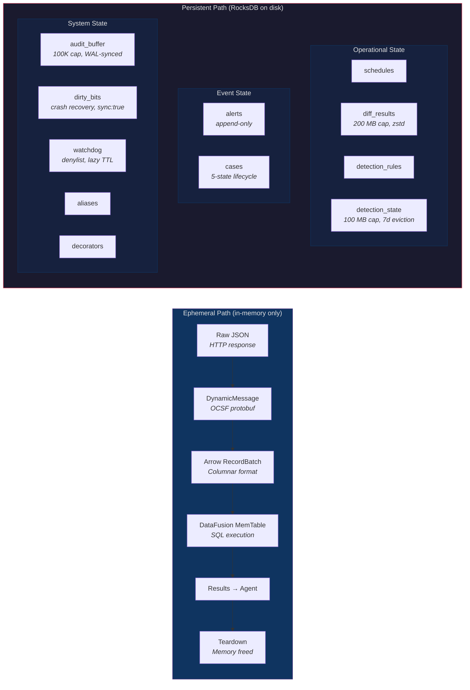
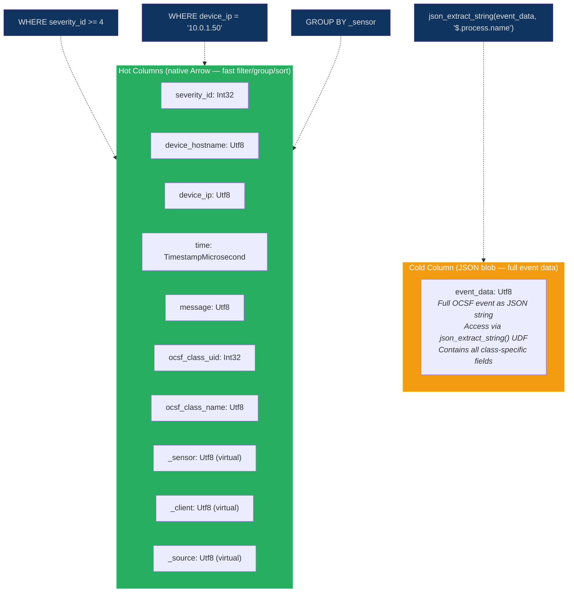
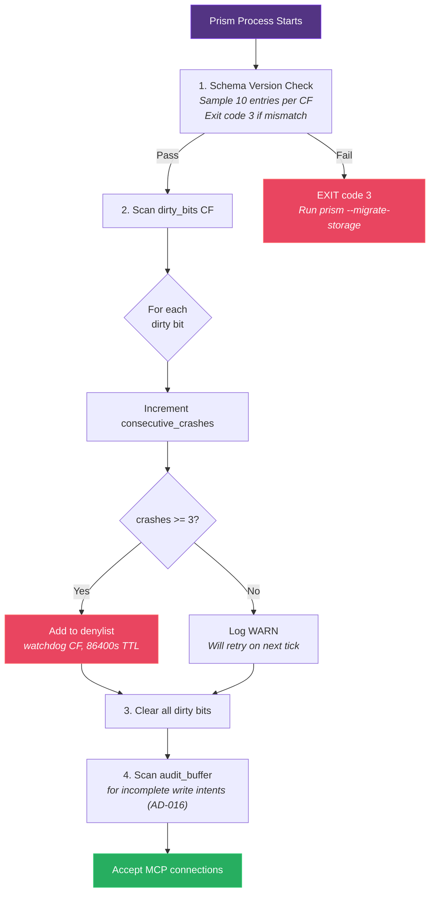

# Data Layer

## Storage Architecture Overview



## Arrow Schema — Two-Tier Design



## Crash Recovery Startup Sequence



Prism has two distinct data paths: **ephemeral** (sensor query data, in-memory only) and **persistent** (operational state, RocksDB).

### Ephemeral Data Path (Query Execution)

Sensor data exists only during query execution. The materialization chain:

1. **Raw JSON** — HTTP responses from sensor APIs (reqwest response body)
2. **DynamicMessage** — OCSF-normalized protobuf messages (prost-reflect)
3. **Arrow RecordBatch** — Columnar in-memory format (apache-arrow)
4. **DataFusion MemTable** — Registered in ephemeral SessionContext
5. **Query results** — Returned to MCP client
6. **Teardown** — SessionContext dropped, all memory freed

No sensor data touches disk. The response cache (CAP-014) holds serialized adapter responses in memory with TTL-based expiration.

### Persistent Data Path (RocksDB)

RocksDB stores operational state organized by 12 column families. Each column family maps to a `StorageDomain` enum variant.

| Column Family | Domain | Key Pattern | Value Format | Access Pattern |
|--------------|--------|------------|-------------|---------------|
| `default` | Default | — | — | RocksDB creates this CF automatically. Prism does not write to it. Reserved for future use. |
| `schedules` | Schedules | `{query_name}:{client_id}` | bincode | Read on tick, write on execution |
| `diff_results` | DiffResults | `{query_name}:{client_id}` | bincode (zstd-compressed Arrow RecordBatch) | Read/write per schedule execution |
| `detection_rules` | DetectionRules | `{scope}:{rule_id}` | bincode | Read per detection evaluation |
| `detection_state` | DetectionState | `[rule_id_len: u16][rule_id bytes][type_tag: u8][payload bytes]` (length-prefix with type tag — see operational-pipeline.md; type \x00=group, \x01=rate_limit, \x02=dedup) | bincode | Read/write per detection evaluation. Size cap: 100 MB. Eviction: correlation/sequence group entries (type \x00) not updated in 7 days are purged on periodic sweep (every 3600s). Rate limit (type \x01) and dedup (type \x02) entries are exempt from time-based eviction — evicted only when their owning rule is deleted. |
| `alerts` | Alerts | `{alert_id}` (UUID v7, time-sortable) | bincode | Append-only, scan by prefix |
| `cases` | Cases | `{case_id}` (UUID v7) | bincode | CRUD on case lifecycle |
| `audit_buffer` | AuditBuffer | `{timestamp_nanos}:{trace_id}` | bincode | Append, sequential scan, delete on ack |
| `dirty_bits` | DirtyBits | `{query_hash}` | bincode (DirtyBitEntry) | Set before query, clear after; crash recovery on startup |
| `watchdog` | Watchdog | `{query_hash}` | bincode (DenylistEntry with expiry_timestamp) | Read on query start (check if denylisted + check expiry), write on denylist add. TTL enforcement: expired entries are lazily removed when checked at query start. No periodic sweep needed — expiry is checked inline. |
| `aliases` | Aliases | `{scope}:{alias_name}` | bincode | Read on query, write on create/delete |
| `decorators` | Decorators | `{decorator_name}` | bincode | Read per query, write on periodic refresh |

### Decision: Bincode for Value Serialization (AD-012)

**Status:** accepted
**Context:** RocksDB values need a serialization format. Options: JSON, bincode, MessagePack, postcard.
**Options considered:**
1. JSON — human-readable but 3-5x larger than binary; parsing overhead
2. bincode — compact binary, zero-copy deserialization for simple types, Rust-native
3. MessagePack — compact, cross-language, but no zero-copy in Rust
4. postcard — embedded-focused, smaller but less ecosystem adoption
**Decision:** bincode 1.x (serde-based) for all RocksDB values.
**Rationale:** Prism is a single-language system (Rust). Bincode 1.x uses serde as the serialization framework, making `#[serde(default)]` work for backward-compatible field additions. Bincode 2.x was considered but rejected because it uses its own `Encode`/`Decode` derives instead of serde, creating incompatibility with the schema evolution strategy (which relies on `#[serde(default)]`). Schema evolution is handled by versioned keys — when a schema changes, a migration reads old-format values and writes new-format values.
**Consequences:** RocksDB data is not human-readable. Debugging requires a Prism CLI tool to decode values. Cross-language access (if ever needed) would require a format migration.

**Schema versioning convention:** All RocksDB values are prefixed with a 2-byte version tag: `[major: u8, minor: u8]`. The current version for all domains is `[1, 0]`. On deserialization:
1. Read the first 2 bytes as `(major, minor)`
2. If `major` matches the current schema major version: deserialize with the current struct definition (minor additions are backward-compatible via `#[serde(default)]` on new fields)
3. If `major` does not match: attempt migration via `prism --migrate-storage`. Without migration, deserialization failures are logged at WARN level and the entry is skipped (BC-2.15.002: deserialization failure handling)

The `prism --migrate-storage` command:
1. Scans each column family sequentially
2. For each entry: reads version tag, applies the appropriate migration function chain (v1 -> v2 -> ... -> current), re-serializes, writes back
3. **Idempotency guarantee:** Migration functions must produce identical output when applied to already-migrated entries (the version tag check ensures the function chain starts at the correct step). Running migration multiple times is safe by construction — each entry's version tag determines its migration path.
4. **Interruption safety:** If migration is interrupted mid-column-family (power loss, disk full), the partially-migrated column family contains a mix of old and new versions. On next run, `prism --migrate-storage` resumes from the beginning of the column family (re-scanning all entries). Already-migrated entries are detected by their version tag and skipped (no work repeated). Unmigrated entries are processed normally. No data is lost from interruption.
5. **Startup with mixed versions:** If Prism starts without running migration, entries with old version tags fail deserialization and are logged at WARN + skipped (BC-2.15.002). Skipped entries remain in RocksDB and become accessible after migration is run. They are NOT deleted — the skip is read-side only.
6. Progress is logged per column family with entry counts and a final summary of migrated/skipped/failed entries
7. **Exit code:** If any entry fails to write during migration, the process exits with code 1 after completing the current column family scan (best-effort: migrate as many entries as possible, then exit non-zero). The operator must investigate before starting Prism. A successful migration with zero write failures exits code 0.

This convention ensures that adding a new field to a persisted struct requires only: (a) add the field with `#[serde(default)]`, (b) keep `minor` version. Removing or renaming a field requires: (a) bump `major` version, (b) write a migration function.

## Arrow Schema Design

The materialized table uses a two-tier columnar layout:

**Hot columns** (flat Arrow columns for common OCSF fields):
- `severity_id: Int32` — OCSF severity
- `device_hostname: Utf8` — normalized device name
- `device_ip: Utf8` — normalized IP address
- `time: TimestampMicrosecond` — event timestamp
- `message: Utf8` — event summary
- `_sensor: Utf8` — virtual field (source sensor identifier)
- `_client: Utf8` — virtual field (TenantId value)
- `_source: Utf8` — virtual field (specific table name, e.g., `crowdstrike_detections`)

**Cold column** (full event data):
- `event_data: Utf8` — full OCSF event as JSON string, accessed via `json_extract_string()` UDF for ad-hoc field access

This two-tier design keeps hot-path queries (filtering by severity, hostname, IP) operating on native Arrow columns while preserving access to the full event for deep inspection.

**Additional hot columns:**
- `ocsf_class_uid: Int32` — OCSF event class ID (e.g., 2001 for SecurityFinding, 4001 for NetworkActivity). Exposed as a hot column to enable efficient `GROUP BY ocsf_class_uid` and `WHERE ocsf_class_uid = 2001` filtering.
- `ocsf_class_name: Utf8` — Human-readable OCSF class name (derived from `ocsf_class_uid` via lookup table)

**Cross-sensor schema unification:** When a composite source (e.g., `FROM EVENTS`) materializes records from multiple sensors with different OCSF event classes, all records share the same Arrow schema (the hot columns above). The `event_data` JSON blob contains the full OCSF event with class-specific fields. This means:
- Queries on hot columns work uniformly across all sensors and OCSF classes
- Queries on class-specific fields use `json_extract_string(event_data, '$.field_path')` — this returns `Utf8` regardless of the underlying OCSF type
- For `ORDER BY` or `GROUP BY` on extracted fields, the `json_extract_string()` UDF returns string values. Numeric ordering requires explicit `CAST` in SQL mode: `ORDER BY CAST(json_extract_string(event_data, '$.severity_id') AS INT)`
- The MemTable is registered with a single schema definition per query, not per-sensor schemas with UNION ALL

## Cache Architecture

| Cache | Scope | Eviction | Invalidation |
|-------|-------|----------|-------------|
| Response cache | per (client_id, sensor_id, source_id, query_hash) | LRU, 50 entries per client per sensor | Synchronous on write operations; bypass with force_refresh |
| In-query cache | per query execution | Dropped with SessionContext | N/A (per-query lifetime) |
| Discovery cache | per (pack_id, client_id) | TTL 3600s | Config reload |
| Decorator cache | per decorator_name | Configurable refresh interval | Refresh failure uses stale value |

## RocksDB Configuration

```
state_dir: ./state (configurable via --state-dir)
WAL: enabled (crash safety)
Column families: 12 (created at first open)
LOCK file: prevents multi-process access (DI-017)
Sync writes: enabled for audit_buffer domain only (DI-026)
Compaction: level-based (default)
Block cache: 32 MB (explicit cap to control memory within 512 MB RSS budget)
```

### Crash Recovery via Dirty Bits (BC-2.15.005)

The `dirty_bits` column family implements crash recovery markers. Each entry is a `DirtyBitEntry`:

```rust
struct DirtyBitEntry {
    query_hash: String,          // Hash of the query that was executing
    query_source: QuerySource,   // AdHoc | Scheduled { schedule_name, client_id }
    started_at: SystemTime,      // When the query began
    consecutive_crashes: u32,    // Incremented on each uncleared detection
}
```

**Startup recovery protocol** (executed by `prism-bin` before accepting MCP connections):

1. **Schema version check (fast-path heuristic):** Sample up to 10 entries from each non-empty column family (first 5 + last 5 by key order). If any sampled entry has a `major` version tag that does not match the current schema version, log ERROR: `"Column family '{cf}' contains entries with schema version {found}.x (current: {current}.x). Run 'prism --migrate-storage' before starting."` and exit with code 3. Override with `--allow-unmigrated-data` flag. **Note:** This is a heuristic — partially-migrated column families (from interrupted `prism --migrate-storage` runs) may pass the check if all sampled entries happen to be already-migrated. The authoritative handling for un-migrated entries is the WARN+skip path at read time (BC-2.15.002), which ensures no data corruption regardless of whether the startup check catches the mismatch.
2. **Scan** `dirty_bits` column family for all entries
3. **For each entry:**
   - Increment `consecutive_crashes` count
   - If `consecutive_crashes >= 3`: add `query_hash` to denylist (`watchdog` column family) with 86400s expiry and reason `"crash_recovery"`. Log at ERROR level.
   - If `consecutive_crashes < 3` and source is `Scheduled`: log at WARN level ("schedule execution was interrupted by crash, will retry on next tick"). No further action — the scheduler will re-execute on its next tick.
   - If source is `AdHoc`: log at WARN level only — ad-hoc queries are not retried automatically.
4. **Clear** all dirty bits after processing (the recovery action has been taken)
5. **Scan** `audit_buffer` for write intent records without completion records (AD-016 ordering). Log each as WARN ("write operation attempted but outcome unknown").

**Dirty bit lifecycle:**
- **Set:** Before query execution begins (before any sensor API calls). Written to RocksDB with `sync: true` (durability required — dirty bits must survive OOM kills and SIGKILL, which do not flush page cache). The cost is one fsync per query start, which is acceptable given queries are bounded at 2 concurrent ad-hoc + 16 scheduled. If the dirty bit write fails (disk full, I/O error), the query is aborted with `E-STORE-009` — fail-closed to preserve the denylist safety mechanism. A query that executes without a dirty bit cannot be denylisted on crash.
- **Cleared on success:** After query execution completes (success or handled error). Removed from RocksDB.
- **Cleared on graceful kill:** When the watchdog terminates a query (DEC-033), the dirty bit is cleared because the termination is handled.
- **Not cleared on crash:** If the process crashes (OOM kill, SIGSEGV, power loss), the bit remains in RocksDB and is detected on next startup.

### DiffResults Storage Bounds

The `diff_results` column family stores previous query results for differential computation. Storage bounds:

- **Per-entry size cap:** 2 MB (zstd-compressed). Entries exceeding this after compression are truncated with a warning and the next execution produces a full diff.
- **Total column family size cap:** 200 MB on disk. Monitored by the storage subsystem; oldest entries are evicted when the cap is reached. The 200 MB cap (not 500 MB) accounts for RocksDB's RSS overhead from compaction, filter blocks, and open SST file handles — which are proportional to on-disk data size. At 200 MB on disk, the RSS contribution from diff_results read/compaction paths stays within the ~40 MB RocksDB RSS budget in system-overview.md.
- **Cleanup on schedule deletion:** When a schedule is deleted via `delete_schedule`, its corresponding `diff_results` entry is removed in the same RocksDB `WriteBatch`.
- **Compression:** Arrow RecordBatches are zstd-compressed before bincode serialization, typically achieving 3-5x compression for tabular security data.
- **Worst case derivation:** 500 schedules × 50 clients = 25,000 possible entries. At the 200 MB column family cap, the average per-entry budget is ~8 KB. Typical entries are 5-20 KB compressed (10K records × 200 bytes ÷ 5x compression = ~400 KB uncompressed → ~80 KB compressed; schedules with fewer records are smaller). The 200 MB cap accommodates ~2,500-10,000 active entries comfortably. At scale (25,000 potential entries), oldest entries are evicted via LRU when the cap is reached — the next execution for an evicted entry produces a full diff (treating all results as "added"). This degradation is acceptable: evicted entries are the least-recently-executed schedules.

### Decision: StorageBackend Trait for Testability (AD-004)

**Status:** accepted
**Context:** Tests need to run without RocksDB on disk.
**Decision:** Define `StorageBackend` trait with `get/put/put_batch/remove/scan/prefix_scan` methods. Two implementations: `RocksDbBackend` (production) and `InMemoryBackend` (tests, uses `BTreeMap`).
**Rationale:** Reference: osquery uses a similar pattern with `DatabasePlugin` trait backed by RocksDB in production and in-memory stores for testing. This enables fast, isolated unit tests for all storage-dependent code.
**Consequences:** All storage access goes through the trait. No direct RocksDB calls outside `prism-storage`.
