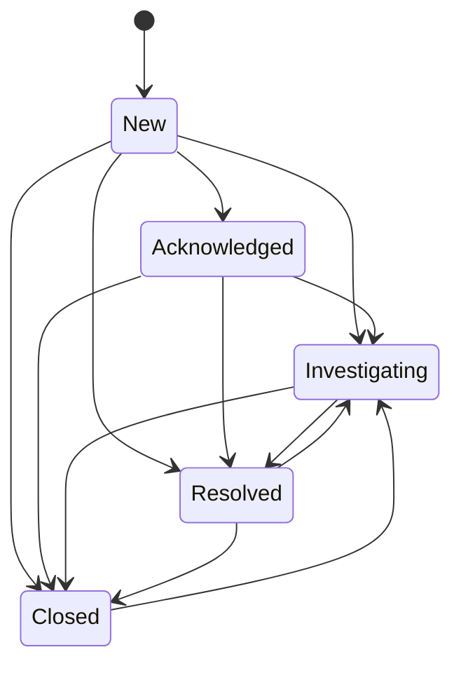

# ADR-017: Case Lifecycle Invariants

## Status

PROPOSED v0.4 — 2026-05-03. Authored by architect as part of Wave 4 Phase 4.A ADR drafting
(D-207). Pending acceptance by product-owner review.

---

## 1. Context

### 1.1 Origin of the Case State Machine

The `Case` entity and its lifecycle state machine were introduced in Wave 1 (S-1.02).
The Kani-verified implementation lives at `crates/prism-core/src/case.rs` and has been
stable since that wave. The state machine encodes exactly 5 states and 12 valid transitions
(VP-005, VP-006, VP-051). No changes to the core machine are proposed or permitted by
this ADR; the Kani proofs lock the transition table.

### 1.2 What Wave 4 Adds

Wave 4 introduces `prism-operations` as a new crate that implements the operational
layer over the case domain: S-4.06 (Case Management) provides the MCP tool surface and
persistence layer for case CRUD; S-4.07 (Case Metrics / Acknowledge Alert) consumes
the lifecycle to emit percentile metrics (TTR, MTTR, acknowledge rate).

These operational concerns require invariants that live *above* `prism-core::case`:

- **Disposition enforcement** — `DispositionCode` is defined in `prism-core::case:138`
  with a comment at line 137 explicitly deferring enforcement to `prism-operations`.
- **Time-to-Resolution semantics** — TTR is a computed metric; S-4.07 consumes it.
  The pinning semantics (first-resolution only) must be specified.
- **OrgId / ClientId scoping** — Per D-208, all Wave 4 operational objects scope as
  `(OrgId, ClientId)`; the cases CF key gains a prefix per ADR-008.
- **Cross-org access control** — Case data is org-scoped; requests must be bounded
  by `org_id` before returning data.

This ADR formalizes those Wave 4 invariants without touching `prism-core::case`.

### 1.3 Relationship to D-213

Decision D-213 (STATE.md, 2026-05-02) governs the narrative posture: the 5-state
machine is "1898-curated, industry-informed." This ADR adopts that framing. The
industry citations in Section 5 are informational — they document inputs to the
design process, not normative bindings.

---

## 2. Reference: Canonical State Machine in prism-core

**Source of truth:** `crates/prism-core/src/case.rs` — `VALID_TRANSITIONS` const array
(lines 28–44), `CaseStatus` enum (lines 51–57), `advance_case_state` function (lines
118–130).

**DO NOT modify `prism-core::case` based on this ADR.** Any future change to the
transition table requires: (1) updating `VALID_TRANSITIONS`, (2) re-running Kani proofs
in `crates/prism-core/src/proofs/case_status.rs` and
`crates/prism-core/src/proofs/case_status_exhaustive.rs`, (3) amending this ADR to
reflect the new shape.

### 2.1 State Diagram (Reader Convenience)

The diagram below is reproduced from `prism-core/src/case.rs` header comments for
reader convenience. It is not authoritative; the const array is.



**Transition categories (12 total):**

| Category | Transitions |
|----------|-------------|
| Forward linear (4) | New→Ack, Ack→Investigating, Investigating→Resolved, Resolved→Closed |
| Skip-ahead (6) | New→{Investigating,Resolved,Closed}, Ack→{Resolved,Closed}, Investigating→Closed |
| Reopen (2) | Resolved→Investigating, Closed→Investigating |

Self-transitions: all 5 are invalid (VP-006). Invalid non-self transitions: 8 additional.

### 2.2 Error Codes from prism-core

`advance_case_state` returns `Err(CaseTransitionError::SelfTransition)` → E-CASE-005
and `Err(CaseTransitionError::InvalidTransition)` → E-CASE-004. These codes originate
in `prism-core`; `prism-operations` re-surfaces them to callers without redefining them.

---

## 3. Decision

### 3.1 prism-core as Canonical State Machine Authority

**Decision:** `prism-operations` MUST call `advance_case_state` (or
`CaseStatus::can_transition_to`) from `prism-core::case` for all state transition
logic. It MUST NOT re-implement or fork the transition table. The Kani proofs in
`prism-core` constitute the formal proof of correctness for the state machine.

Referencing ADR-008 because its universal re-keying rule applies to the cases CF
key prefix. Referencing ADR-006 §2.1 because `OrgId` is the org-scoping axis for
the cases CF.

### 3.2 Disposition-on-Resolved Enforcement

**Decision:** Any transition into `CaseStatus::Resolved` MUST be accompanied by a
`disposition: Some(DispositionCode)` value. If `disposition` is `None` at the time
of a Resolved transition, `prism-operations` MUST return `E-CASE-DISPOSITION-REQUIRED`
(exact error code string to be finalized in S-4.06 implementation).

**Scope:** This enforcement lives in `prism-operations`, not in `prism-core::case`.
The comment at `crates/prism-core/src/case.rs:137` is explicit: "Enforcement (requiring
a code on Resolved transitions) lives in prism-operations (S-4.06), not here." The
`DispositionCode` enum variants (`TruePositive`, `FalsePositive`, `Benign`,
`Inconclusive`, `Duplicate`, `TestAlert`) are defined at `prism-core/src/case.rs:138-146`
and are NOT extended by this ADR.

**Verification:** VP-053 is the Kani proof in `prism-operations` verifying INV-CASE-001.

### 3.3 First-Resolution TTR Semantics

**Decision:** `time_to_resolution: Option<Duration>` is computed and pinned the first
time a case transitions into `CaseStatus::Resolved`. Subsequent reopen/re-resolve
cycles (via `Resolved → Investigating → Resolved` or `Closed → Investigating → Resolved`)
MUST NOT overwrite or recompute `time_to_resolution`. The field is write-once.

**Rationale:** TTR measures the latency from detection to first analyst resolution.
Reopens are a distinct quality signal (false negative rate, alert enrichment quality).
Conflating reopens with TTR inflates reported resolution speed on cases that required
multiple investigation cycles. S-4.07 exposes TTR as a percentile metric; the pinning
semantics must be enforced at write time to prevent metric corruption.

**Reopen count:** Cases that reopen MUST track `reopen_count: u32` (incremented on
every `Resolved → Investigating` or `Closed → Investigating` transition, per INV-CASE-006).
Never reset. S-4.06 owns the field implementation; this ADR establishes the invariant.
See INV-CASE-006 in §4 and VP-145.

**Verification:** VP-054 is the proptest property in `prism-operations` verifying
INV-CASE-002.

### 3.4 OrgId / ClientId Scoping (D-208)

**Decision:** Every `Case` in `prism-operations` MUST carry:
- `org_id: OrgId` — the MSSP tenant (1898 & Co's customer organization), UUID v7
  per ADR-006 §2.1.
- `client_id: ClientId` — the downstream protected entity within that tenant (the
  customer's customer, per D-208).

`OrgId` and `ClientId` are DISTINCT concepts. `OrgId` identifies the MSSP tenant;
`ClientId` identifies the protected entity managed by that tenant. The hierarchy is:
MSSP operator > `OrgId` (tenant) > `ClientId` (protected entity).

**RocksDB cases CF key pattern** (per ADR-008 universal re-keying rule):

```
{org_id}:case:{client_id}:{case_id}
```

All three UUID components are UUID v7. The `{org_id}:` prefix comes FIRST per ADR-008's universal re-keying rule; the `case:` type discriminator follows the OrgId prefix. This ensures that RocksDB range scans are naturally org-scoped; the cases CF key space for Org A and Org B never overlaps. Note: the previous key format `case:{org_id}:...` violated ADR-008's mandatory `{org_id}:`-first rule — this is the corrected form. Story-writer must apply the same correction to S-4.06.

### 3.5 Cross-Org Access Control

**Decision:** Any API or MCP tool call that retrieves, modifies, or transitions case
state MUST verify that the calling session's `org_id` matches `case.org_id` BEFORE
returning or mutating case data. A mismatch MUST return `E-CASE-ORG-MISMATCH` and
MUST NOT leak any case field values (including the case's existence).

**Implementation site:** `prism-operations`, at the case-fetch and case-update
boundaries. This check is the runtime complement to the structural key isolation
provided by the `{org_id}:case:{client_id}:{case_id}` RocksDB key pattern (per §3.4).

**Verification:** VP-138 formally verifies INV-CASE-003 via proptest in
`prism-operations` (see Section 8).

### 3.6 Timeline Integration

**Decision (informational):** Every state transition executed via `advance_case_state`
MUST produce a `TimelineEntryType::StatusChange` entry in the case's timeline
(`TimelineEntryType` defined at `crates/prism-core/src/case.rs:150-158`). This
provides the audit trail required by S-4.06.

Each `TimelineEntry` carries `id: Uuid` (UUID v7) per `prism-core::case::TimelineEntry`. This `id` field is the `timeline_entry_id` that ADR-016 §2.4 uses as the `idempotency_key` for case-trigger action delivery dedup. The `TimelineEntry.id` is stable for the lifetime of the entry and uniquely identifies a specific state-change event, guaranteeing that at-least-once dedup for case triggers is scoped to the individual timeline event, not the case as a whole.

This ADR does NOT specify timeline storage mechanics; that is S-4.06's implementation
scope. The constraint is: no transition completes without a corresponding timeline entry.

### 3.7 Disposition Code Invariant: Ordering

**Decision:** Within a single `update_case` call that both sets `disposition` and
transitions status to `Resolved`, the disposition field MUST be applied before the
status transition is evaluated. This is VP-052's invariant (already registered; proptest,
`prism-operations`, anchor S-4.06). This ADR reproduces it as a scope reminder —
VP-052 is not new to ADR-017.

---

## Rationale

The core rationale for this ADR is the clean separation between the domain model
(`prism-core::case`) and the enforcement layer (`prism-operations`). The state machine
itself is formally verified by Kani proofs (VP-005, VP-006, VP-051) locked in Wave 1.
Re-specifying it in `prism-operations` would duplicate the source of truth and invalidate
those proofs without benefit. By referencing `prism-core::case` as canonical, this ADR
ensures that any future machine change flows through the proof layer first.

The disposition-on-Resolved requirement (INV-CASE-001) satisfies BC-2.14.002's implicit
analyst accountability constraint: a case cannot be declared resolved without a recorded
analytical judgment. The six `DispositionCode` variants cover the full range of MSSP
triage outcomes (TruePositive, FalsePositive, Benign, Inconclusive, Duplicate, TestAlert),
matching common SOAR platform taxonomy (Splunk SOAR, Cortex XSOAR) while remaining
domain-specific rather than platform-bound.

The write-once TTR semantics (INV-CASE-002) are required by S-4.07's percentile metric
consumers. If TTR were allowed to reset on reopen, the P50/P95 TTR metrics would
systematically underreport resolution latency for cases that required multiple investigation
cycles — a common failure mode in MSSP environments where alerts are initially closed as
false positives and later reopened. Pinning TTR to the first resolution preserves the
detection-to-first-closure signal as a distinct, uncontaminated metric axis.

The OrgId/ClientId dual hierarchy (INV-CASE-003/§3.4) is a direct consequence of D-208,
which establishes that `OrgId` (MSSP tenant) and `ClientId` (protected entity within
that tenant) are structurally distinct. The RocksDB key prefix `{org_id}:case:{client_id}:{case_id}` (per §3.4) mirrors
the universal re-keying rule established by ADR-008 for all Security Telemetry DTU state.
The structural key isolation plus the runtime org-mismatch check compose defense-in-depth:
the key space cannot physically overlap, and the access-control check provides an
explicit error on any code path that attempts a cross-org lookup without going through
the key format.

The "1898-curated, industry-informed" framing (D-213) avoids standards-binding while
documenting design inputs transparently. NIST SP 800-61 r2's four-phase model, ITIL v3's
transition conventions, and XSOAR/Splunk SOAR's state taxonomies all informed the design,
but none maps precisely to the MSSP analyst workflow this product targets. The curated
label signals intentional divergence without obscuring the influences.

---

## 4. Lifecycle Invariant Catalog

| ID | Invariant | Enforced In | VP | Notes |
|----|-----------|-------------|-----|-------|
| INV-CASE-001 | Transition into `Resolved` requires `disposition: Some(DispositionCode)` | `prism-operations` | VP-053 | Wave 4. Error: `E-CASE-DISPOSITION-REQUIRED`. `DispositionCode` defined in `prism-core`. |
| INV-CASE-002 | `time_to_resolution` pinned at first `Resolved` transition; never reset on reopen | `prism-operations` | VP-054 | Wave 4. Write-once field. |
| INV-CASE-003 | Cross-org case access denied; `case.org_id` must match session `org_id` | `prism-operations` | VP-138 | Wave 4. Error: `E-CASE-ORG-MISMATCH`. Existence not leaked on mismatch. |
| INV-CASE-004 | Self-transitions invalid (E-CASE-005) | `prism-core::case` | VP-006 | Existing. Reproduced as scope reminder. |
| INV-CASE-005 | `Closed` state transitions only to `{Investigating}` | `prism-core::case` | VP-005 | Existing. Informational duplicate of the prism-core Kani-verified property. References `prism-core::case::VALID_TRANSITIONS` for the canonical 12-transition table. |
| INV-CASE-006 | `reopen_count` is incremented on every `Resolved → Investigating` and `Closed → Investigating` transition. Never reset. | `prism-operations` | VP-145 | Wave 4. Used by S-4.07 metrics for case-quality measurement. |
| INV-CASE-007 | Case timeline entries are append-only and ordered by `created_at` ascending. Concurrent transitions on the same case serialized via per-case Mutex. | `prism-operations` | — | Wave 4. Implementation detail owned by S-4.06. |

---

## 5. (Reserved — see Annex A for Industry-Informed Narrative)

The industry-informed narrative (formerly §5) has been moved to Annex A at the end of this document to make clear that it is informational context, not normative specification. Sections §5.1–§5.4 are deleted; Annex A is the canonical location for all industry-informed content (NIST SP 800-61, ITIL v3, Cortex XSOAR, Splunk SOAR). No normative requirements trace to this section.

---

## 6. Consequences

### Positive

1. **Clean crate separation.** `prism-core::case` is a pure domain type library with
   Kani-verified state machine semantics. `prism-operations` is the effectful enforcement
   layer. The separation is structurally enforced by crate boundaries.

2. **Reduced ADR scope.** By referencing `prism-core::case` rather than re-specifying
   it, this ADR avoids duplicating the source of truth and cannot drift from it.

3. **Kani coverage of the state machine is already complete.** VP-005, VP-006, and VP-051
   were proven in Wave 1. Wave 4 adds VP-053, VP-054, and VP-138 for the enforcement
   layer — each has a clear proptest/Kani strategy against a pure function in
   `prism-operations`.

4. **Explicit 1898-curated framing.** Avoids standards-binding obligations. The ADR
   can adopt the most ergonomic model for MSSP operations without needing to reconcile
   with NIST r3's CSF 2.0 outcome functions or ITIL 4's value streams.

5. **OrgId structural isolation.** The `{org_id}:case:{client_id}:{case_id}` key pattern
   provides structural isolation in RocksDB (per ADR-008); cross-org access control
   (INV-CASE-003) provides the runtime enforcement layer.

### Negative / Trade-offs

1. **Cross-crate dependency.** `prism-operations` depends on `prism-core` for
   `CaseStatus`, `advance_case_state`, `DispositionCode`, and `TimelineEntryType`.
   Any future change to the state machine requires coordination across both crates
   and re-running Kani proofs.

2. **Future state-machine changes require Kani re-proofs in prism-core.** Adding a
   state (e.g., "Pending Closure") would require modifying `VALID_TRANSITIONS`,
   updating both proof files, and amending this ADR. This cost is intentional — it
   enforces deliberateness in lifecycle changes.

3. **DispositionCode enum changes are prism-core scope.** If a new disposition variant
   is needed, it must be added to `prism-core::case:138` and reviewed for Kani impact,
   not added to `prism-operations`.

---

## 7. Alternatives Considered

### 7.1 Re-specify the State Machine in prism-operations

**Rejected.** Duplicating `VALID_TRANSITIONS` in `prism-operations` would create two
sources of truth that could drift. The Kani proofs in `prism-core` prove the const
array; a copy in `prism-operations` would not automatically be covered by those proofs.
This alternative defeats the verification strategy.

### 7.2 Claim NIST SP 800-61 r3 Traceability

**Rejected per D-213.** NIST SP 800-61 r3 (April 2025) abandoned the four-phase
lifecycle model in favor of CSF 2.0 outcome-driven functions. There is no state-machine
reference in r3 to which the 5-state machine could be traced. Claiming r3 traceability
would require either misrepresenting r3's content or fundamentally restructuring the
case lifecycle around CSF 2.0 functions (Govern, Identify, Protect, Detect, Respond,
Recover) — a model that maps poorly to analyst workflow at MSSP scale.

### 7.3 XSOAR 4-State + Sub-Status Model

**Rejected per D-213.** Collapsing the 5-state machine to Cortex XSOAR's 4-state
model (Pending / Active / Closed / Archived) and adding sub-statuses would require
reworking `prism-core::case` (invalidating VP-005/006/051), rebuilding the Kani
proofs, and adding sub-status management complexity to `prism-operations`. The
1898-curated 5-state machine already accommodates the XSOAR model as a projection;
no rework provides no clear benefit.

### 7.4 Single org_id Field Only (No ClientId)

**Rejected per D-208.** ClientId is the downstream protected entity — the customer's
customer. In MSSP deployments where a single tenant manages multiple subsidiaries or
business units as distinct protected entities, `OrgId` alone is insufficient. D-208
explicitly retains both fields as distinct concepts.

---

## 8. Verification Plan

| VP | Property | Method | Module | Priority | Status |
|----|----------|--------|--------|----------|--------|
| VP-005 | Case state machine: exactly 12 valid transitions | Kani | prism-core | P0 | draft (Wave 1) |
| VP-006 | Case state machine: no self-transitions | Kani | prism-core | P0 | draft (Wave 1) |
| VP-051 | Exhaustive 5×5 transition table — 12 accept, 13 reject | Kani | prism-core | P0 | draft (Wave 1) |
| VP-052 | update_case: disposition applied before status transition | Proptest | prism-operations | P0 | draft (Wave 4 / S-4.06) |
| VP-053 | Resolved case always has non-null disposition; transition rejects without disposition | Kani | prism-operations | P0 | draft (Wave 4 / S-4.06) |
| VP-054 | TTR uses first resolution timestamp across reopen cycles | Proptest | prism-operations | P1 | draft (Wave 4 / S-4.06) |
| VP-138 | Cross-org case lookup returns empty/Err; org_id_A case not returned for org_id_B | Proptest | prism-operations | P0 | draft (Wave 4 / S-4.06) |
| VP-145 | reopen_count monotonically incremented on every reopen transition; never reset | Proptest | prism-operations | P1 | draft (Wave 4 / S-4.06) |

### 8.1 VP-138 Proof Strategy

VP-138 (cross-org case access denied — INV-CASE-003) uses a proptest harness that:
1. Generates two distinct `OrgId` values (`org_a != org_b`).
2. Writes a `Case` under `org_a` via the operations layer.
3. Attempts a lookup with `org_b` as the calling session's `org_id`.
4. Asserts the result is `Err(E-CASE-ORG-MISMATCH)` or `None` — never `Ok(case)`.

This strategy mirrors VP-077/078 (prism-sensors cross-org isolation) and VP-081
(prism-credentials cross-org credential isolation), applying the same proptest
pattern to the cases CF.

### 8.2 VP-053 Proof Strategy

VP-053 uses a Kani harness over the `prism-operations` enforcement function that
wraps `advance_case_state`. The harness generates symbolic `(current_status,
disposition)` inputs and asserts: if `next_status == CaseStatus::Resolved` and
`disposition.is_none()`, then the result is `Err(E-CASE-DISPOSITION-REQUIRED)`.

---

## 9. Migration Path

Not applicable. `prism-operations` is a new crate introduced in Wave 4. The cases CF
and all enforcement invariants are greenfield implementations anchored to S-4.06. No
migration of existing case data is required.

---

## Source / Origin

This ADR is a greenfield Wave 4 architectural decision. Its provenance spans three layers:

- **Behavioral contract:** BC-2.14.002 (`domain-spec/`) specifies the case lifecycle
  state machine and is the normative requirement source for the 5-state, 12-transition
  model.
- **Code as-built (state machine):** `crates/prism-core/src/case.rs` — `VALID_TRANSITIONS`
  const array (lines 28–44), `CaseStatus` enum (lines 51–57), `DispositionCode` enum
  (lines 138–146), `TimelineEntryType` enum (lines 150–158). The comment at line 137
  explicitly delegates disposition enforcement to `prism-operations`, which is the direct
  code-as-built origin for decisions §3.2 and INV-CASE-001.
- **Kani proofs as-built:** `crates/prism-core/src/proofs/case_status.rs` (VP-005,
  VP-006) and `crates/prism-core/src/proofs/case_status_exhaustive.rs` (VP-051) lock
  the transition table and are the formal verification evidence that the machine is
  correct.
- **Architectural decisions:** D-207 (ADR topology), D-208 (OrgId/ClientId hierarchy),
  D-213 (1898-curated narrative) — all logged in `.factory/STATE.md` on 2026-05-02 as
  part of Wave 4 Phase 4.A pre-flight resolution.
- **Prior ADRs:** ADR-006 §2.1 (OrgId identity model) and ADR-008 §2.1 (universal
  re-keying rule) are the authoritative sources for the RocksDB key format and
  `OrgId`-scoping decisions in §3.4.
- **Cycle manifest:** `.factory/cycles/wave-4-operations/cycle-manifest.md` and the
  architect ADR identification preflight finding document the business rationale for
  introducing this ADR in Wave 4 rather than earlier.

---

## 10. References

| Ref | Description | Path / URL |
|-----|-------------|------------|
| prism-core::case | Canonical state machine source | `crates/prism-core/src/case.rs` |
| prism-core proofs | VP-005/006 Kani harnesses | `crates/prism-core/src/proofs/case_status.rs` |
| prism-core proofs (exhaustive) | VP-051 Kani harness | `crates/prism-core/src/proofs/case_status_exhaustive.rs` |
| ADR-006 §2.1 | OrgId identity model; UUID v7 requirement | `.factory/specs/architecture/decisions/ADR-006-multi-tenant-dtu-topology.md` |
| ADR-008 §2.1 | Universal re-keying rule; RocksDB key prefix pattern | `.factory/specs/architecture/decisions/ADR-008-dtu-state-segregation.md` |
| D-208 | OrgId / ClientId dual hierarchy retained | `.factory/STATE.md` line ~448 |
| D-213 | ADR-017 narrative position: 1898-curated, industry-informed | `.factory/STATE.md` line ~453 |
| NIST SP 800-61 r2 | Four-phase incident lifecycle (cited despite r3 supersession) | https://csrc.nist.gov/publications/detail/sp/800-61/rev-2/final |
| NIST SP 800-61 r3 | CSF 2.0 outcome functions (does not provide state-machine model) | https://csrc.nist.gov/pubs/sp/800/61/r3/final |
| ITIL v3 | Incident management process state conventions | ITIL v3 Service Operation (2007) |
| Cortex XSOAR | Pending/Active/Closed/Archived incident lifecycle | Palo Alto Cortex XSOAR documentation |
| Splunk SOAR | New/Open/Resolved/Closed case status taxonomy | Splunk SOAR platform documentation |
| R-11 | Research finding: NIST r3 abandons four-phase model | `.factory/cycles/wave-4-operations/preflight-findings/research-findings.md` |

---

## Phase 4.A Pre-Pass-14 Remediation Notes

Applied during Wave 4 Phase 4.A pre-Pass-14 sweep (2026-05-03). Version bumped 0.3 → 0.4.

| 0.4 | F-PreP14-H-003 | 2026-05-03 | architect | Pre-Pass-14 sweep (TD-VSDD-039 codified methodology): fixed sister-section partial-fix regression inside ADR-017 — lines ~230 (§3.5 Implementation Site) and ~282 (Rationale section) updated stale `case:{org_id}:...` body prose to canonical `{org_id}:case:{client_id}:{case_id}` per §3.4. Section §3.4 was corrected in P1-ADR-017-A-M-003 but propagation to §3.5/Rationale was missed. |

---

## Phase 4.A Pass 2 Remediation Notes

Applied during Wave 4 Phase 4.A adversarial Pass 2 fix-burst (2026-05-02). Version bumped 0.2 → 0.3.

- **P2-ADR-017-A-L-001 fix (§5 / Annex A duplication):** §5.1–§5.4 inline content deleted. §5 now contains only the redirect note pointing to Annex A as the canonical location. Annex A (NIST SP 800-61, ITIL v3, Cortex XSOAR, Splunk SOAR) is unchanged and remains the authoritative informational narrative per D-213.
- **P2-ADR-016-A-H-002 alignment fix:** §3.6 Timeline Integration extended with an explicit reference: each `TimelineEntry` carries `id: Uuid` (UUID v7) per `prism-core::case::TimelineEntry`. ADR-016 §2.4 case-trigger dedup uses this `id` as `idempotency_key`. The `TimelineEntry.id` is stable and unique per state-change event, providing correct at-least-once dedup granularity for case triggers.

## Phase 4.A Pass 1 Remediation Notes

Applied during Wave 4 Phase 4.A adversarial Pass 1 fix-burst (2026-05-02). Version bumped 0.1 → 0.2.

- **P1-ADR-017-A-H-001 fix:** §3.3 `reopen_count` changed from SHOULD to MUST. INV-CASE-006 added to §4: `reopen_count` incremented on every `Resolved → Investigating` and `Closed → Investigating` transition; never reset; used by S-4.07 metrics. VP-145 assigned.
- **P1-ADR-017-A-M-002 fix:** INV-CASE-005 in §4 retains the existing text; informational note added clarifying it references `prism-core::case::VALID_TRANSITIONS` for the canonical 12-transition table and is an informational duplicate of the prism-core Kani-verified property.
- **P1-ADR-017-A-M-003 fix:** §3.4 RocksDB key format corrected from `case:{org_id}:{client_id}:{case_id}` to `{org_id}:case:{client_id}:{case_id}` per ADR-008 universal re-keying rule (OrgId prefix must come first). Story-writer to apply same fix to S-4.06.
- **P1-ADR-017-A-M-004 fix:** §5 Industry-Informed Narrative moved to Annex A (appended below References). Section heading replaced with a redirect note. Content is informational, not normative.
- **P1-ADR-017-A-M-005 fix:** INV-CASE-007 added to §4: case timeline entries append-only, ordered by `created_at` ascending; concurrent transitions serialized via per-case Mutex.

---

## Annex A: Industry-Informed Narrative (D-213)

This annex is informational. It documents the industry inputs that informed the 1898-curated 5-state case lifecycle design. It is not normative; no implementation requirement traces to this annex alone.

**Authoritative position:** The 5-state, 12-transition machine is 1898-curated. It is
informed by but does not strictly trace to any single standard. This framing is locked
per D-213.

### A.1 NIST SP 800-61

**NIST SP 800-61 r2** (Computer Security Incident Handling Guide, August 2012;
https://csrc.nist.gov/publications/detail/sp/800-61/rev-2/final) defines a four-phase
incident lifecycle: Preparation → Detection and Analysis → Containment, Eradication and
Recovery → Post-Incident Activity. Phases map loosely to case states: Detection/Analysis
≈ New/Acknowledged; Containment/Eradication ≈ Investigating; Recovery ≈ Resolved;
Post-Incident ≈ Closed.

> **Footnote — r3 supersession:** NIST SP 800-61 r3 (April 2025;
> https://csrc.nist.gov/pubs/sp/800/61/r3/final) abandoned the four-phase lifecycle
> in favor of CSF 2.0 outcome-driven functions (Govern, Identify, Protect, Detect,
> Respond, Recover). r3 provides no state-machine reference model. r2 is cited despite
> supersession because it provides the closest normative phase model to a case lifecycle
> state machine. ADR-017 does NOT claim r3 traceability.

### A.2 ITIL Incident Management

**ITIL v3** Incident Management (IT Infrastructure Library, v3 Service Operation, 2007)
defines an incident workflow with states commonly implemented by ITSM tools as:
New → Assigned → In Progress → On Hold → Resolved → Closed. The
Resolved → Closed promotion pattern and the reopen path (Resolved/Closed →
In Progress) are direct ITIL v3 conventions preserved in the 1898-curated machine.

> **Footnote — ITIL 4:** ITIL 4 (2019 onwards) abandoned prescriptive process flows
> in favor of value streams. ITIL 4 provides no equivalent state-machine reference.
> This citation refers to ITIL v3 conventions still widely deployed in ServiceNow,
> Jira Service Management, and similar ITSM platforms encountered at MSSP scale.

### A.3 Cortex XSOAR

Palo Alto Cortex XSOAR (formerly Demisto) incident lifecycle: Pending → Active →
Closed → Archived. The Pending/Active split (similar to New/Acknowledged) and the
Closed terminal state informed the design. XSOAR does not natively expose a
"Resolved" pending-closure state; the 1898-curated machine adds that step to
distinguish analyst sign-off (Resolved) from final archival (Closed).

### A.4 Splunk SOAR

Splunk SOAR (formerly Phantom) case status taxonomy: New → Open → Resolved → Closed,
with workbook phases overlaid on top. The four-status linear progression is structurally
similar; the 1898-curated machine extends it with skip-ahead transitions (New → Resolved,
New → Closed) and reopen paths (Resolved/Closed → Investigating) that Splunk SOAR
handles via workbook restart rather than first-class status transitions.
