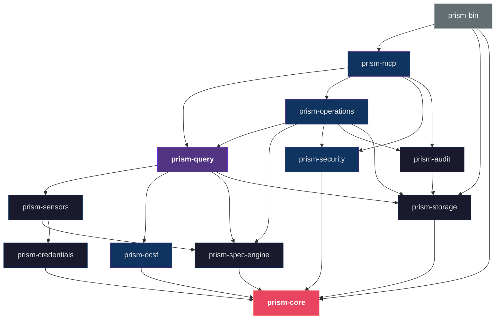

# Dependency Graph

## [Section Content]

## Inter-Crate Dependencies

All arrows point downward (toward prism-core). The graph is strictly acyclic — no circular dependencies.



## Build Order Visualization

```mermaid
gantt
    title Topological Build Order (parallel within levels)
    dateFormat X
    axisFormat %s

    section Level 0
    prism-core           :core, 0, 1

    section Level 1
    prism-ocsf           :ocsf, 1, 2
    prism-credentials    :cred, 1, 2
    prism-security       :sec, 1, 2
    prism-spec-engine    :spec, 1, 2

    section Level 2
    prism-storage        :stor, 2, 3

    section Level 3
    prism-audit          :aud, 3, 4
    prism-sensors        :sens, 3, 4

    section Level 4
    prism-query          :query, 4, 5

    section Level 5
    prism-operations     :ops, 5, 6

    section Level 6
    prism-mcp            :mcp, 6, 7

    section Level 7
    prism-bin            :bin, 7, 8
```



## Topological Build Order

Build order from leaves to root (each level can build in parallel):

| Level | Crates | Dependencies Satisfied |
|-------|--------|----------------------|
| 0 | prism-core | (none — leaf crate) |
| 1 | prism-ocsf, prism-credentials, prism-security, prism-spec-engine | prism-core |
| 2 | prism-storage | prism-core |
| 3 | prism-audit, prism-sensors | prism-storage, prism-credentials, prism-spec-engine, prism-core |
| 4 | prism-query | prism-sensors, prism-ocsf, prism-storage, prism-spec-engine, prism-core |
| 5 | prism-operations | prism-query, prism-spec-engine, prism-security, prism-audit, prism-storage, prism-core |
| 6 | prism-mcp | prism-query, prism-operations, prism-security, prism-audit, prism-core |
| 7 | prism-bin | prism-mcp, prism-storage, prism-core |

## Dependency Rules

1. **prism-core depends on nothing.** It is the leaf crate. All shared types, errors, and config structures live here.
2. **No upward dependencies.** Lower-layer crates never depend on higher-layer crates. prism-storage never imports from prism-mcp.
3. **No peer dependencies between infrastructure crates.** prism-credentials does not depend on prism-storage; prism-audit does not depend on prism-credentials. They communicate through traits defined in prism-core.
4. **prism-query depends on prism-sensors but not vice versa.** The query engine orchestrates sensor adapters, not the other way around. Sensor adapters do not know about DataFusion or PrismQL.
5. **prism-operations depends on prism-query.** The scheduler and detection engine use the query engine to execute queries. They do not directly call sensor adapters.
6. **Feature-gated dependencies.** Write-operation code paths in prism-mcp are behind Cargo feature gates (e.g., `crowdstrike-write`). If the feature is not enabled, the dependency on write-specific sensor adapter code is not compiled.

## DTU Crates (Dev-Only Dependencies)

The 11 DTU crates are Axum-based HTTP servers (and in-process receivers) that clone external service API behavior for integration testing. They are **never** compiled into the production binary. `prism-dtu-common` is the shared test infrastructure hub; all 10 per-surface crates depend on it.

**CRITICAL:** No DTU crate depends on any `prism-*` production crate. They are standalone Axum servers that speak the real external-service API protocol over localhost HTTP. They mimic external APIs, not Prism internals.

```mermaid
graph TD
    subgraph DTU["DTU Crates — 11 total (dev-dependency only)"]
        DTUCOMMON["prism-dtu-common<br/><i>BehavioralClone trait<br/>LatencyLayer, FailureLayer<br/>fixture_loader<br/>SyslogReceiver<br/>WebhookReceiver</i>"]

        subgraph SENSORS["Sensor clones"]
            DTUC["prism-dtu-crowdstrike<br/><i>L4 adversarial</i>"]
            DTUCL["prism-dtu-claroty<br/><i>L4 adversarial</i>"]
            DTUCY["prism-dtu-cyberint<br/><i>L2 stateful</i>"]
            DTUA["prism-dtu-armis<br/><i>L2 stateful</i>"]
        end

        subgraph ACTIONS["Action clones"]
            DTUSLK["prism-dtu-slack<br/><i>L2 stateful</i>"]
            DTUPD["prism-dtu-pagerduty<br/><i>L3 behavioral</i>"]
            DTUJR["prism-dtu-jira<br/><i>L3 behavioral</i>"]
        end

        subgraph INFUSIONS["Infusion clones"]
            DTUTI["prism-dtu-threatintel<br/><i>L2 stateful</i>"]
            DTUNVD["prism-dtu-nvd<br/><i>L2 stateful</i>"]
        end

        subgraph LOGFWD["Log-forwarding clones"]
            DTUDD["prism-dtu-datadog<br/><i>L2 stateful</i>"]
            DTUSH["prism-dtu-splunk-hec<br/><i>L2 stateful</i>"]
            DTUES["prism-dtu-elasticsearch<br/><i>L2 stateful</i>"]
            DTUOT["prism-dtu-otlp<br/><i>L2 stateful</i>"]
        end
    end

    subgraph CONSUMERS["Consumers (via dev-dependency)"]
        SENS_TEST["prism-sensors/tests"]
        OPS_TEST["prism-operations/tests"]
        OBS_TEST["prism-mcp/tests (log fwd)"]
        INFUSE_TEST["prism-spec-engine/tests (infusions)"]
    end

    SENS_TEST -.->|"dev-dep"| DTUC
    SENS_TEST -.->|"dev-dep"| DTUCY
    SENS_TEST -.->|"dev-dep"| DTUCL
    SENS_TEST -.->|"dev-dep"| DTUA
    OPS_TEST -.->|"dev-dep"| DTUC
    OPS_TEST -.->|"dev-dep"| DTUSLK
    OPS_TEST -.->|"dev-dep"| DTUPD
    OPS_TEST -.->|"dev-dep"| DTUJR
    OBS_TEST -.->|"dev-dep"| DTUDD
    OBS_TEST -.->|"dev-dep"| DTUSH
    OBS_TEST -.->|"dev-dep"| DTUES
    OBS_TEST -.->|"dev-dep"| DTUOT
    INFUSE_TEST -.->|"dev-dep"| DTUTI
    INFUSE_TEST -.->|"dev-dep"| DTUNVD

    DTUC --> DTUCOMMON
    DTUCL --> DTUCOMMON
    DTUCY --> DTUCOMMON
    DTUA --> DTUCOMMON
    DTUSLK --> DTUCOMMON
    DTUPD --> DTUCOMMON
    DTUJR --> DTUCOMMON
    DTUNVD --> DTUCOMMON
    DTUDD --> DTUCOMMON
    DTUSH --> DTUCOMMON
    DTUES --> DTUCOMMON
    DTUOT --> DTUCOMMON
    DTUTI --> DTUCOMMON

    DTUCOMMON --> AXM2["axum + tokio + tower + serde<br/><i>(external)</i>"]

    style DTU fill:#2d3436,stroke:#b2bec3,color:#e0e0e0,stroke-dasharray:5 5
    style SENSORS fill:#1a1a2e,stroke:#0f3460,color:#e0e0e0
    style ACTIONS fill:#0f3460,stroke:#533483,color:#e0e0e0
    style INFUSIONS fill:#533483,stroke:#7c3aed,color:#fff
    style LOGFWD fill:#1a1a2e,stroke:#0f3460,color:#e0e0e0
    style CONSUMERS fill:#2d3436,stroke:#636e72,color:#e0e0e0
    style AXM2 fill:#636e72,stroke:#b2bec3,color:#fff
    style DTUCOMMON fill:#2d3436,stroke:#e94560,color:#e0e0e0,font-weight:bold
```



**DTU gate:** All 14 crates are compiled only under `#[cfg(any(test, feature = "dtu"))]`. The `dtu` Cargo feature is never enabled in release builds. The production `Cargo.toml` workspace root lists them as:

```toml
[dev-dependencies]
# Shared infrastructure (required by all per-surface crates)
prism-dtu-common          = { path = "prism-dtu-common" }

# Sensor behavioral clones
prism-dtu-crowdstrike     = { path = "prism-dtu-crowdstrike" }
prism-dtu-claroty         = { path = "prism-dtu-claroty" }
prism-dtu-cyberint        = { path = "prism-dtu-cyberint" }
prism-dtu-armis           = { path = "prism-dtu-armis" }

# Action behavioral clones
prism-dtu-slack           = { path = "prism-dtu-slack" }
prism-dtu-pagerduty       = { path = "prism-dtu-pagerduty" }
prism-dtu-jira            = { path = "prism-dtu-jira" }

# Infusion behavioral clones
prism-dtu-threatintel     = { path = "prism-dtu-threatintel" }
prism-dtu-nvd             = { path = "prism-dtu-nvd" }

# Log-forwarding behavioral clones
prism-dtu-datadog         = { path = "prism-dtu-datadog" }
prism-dtu-splunk-hec      = { path = "prism-dtu-splunk-hec" }
prism-dtu-elasticsearch   = { path = "prism-dtu-elasticsearch" }
prism-dtu-otlp            = { path = "prism-dtu-otlp" }
```

**DTU dependency edges:** All 10 per-surface crates depend on `prism-dtu-common` for shared tower middleware (LatencyLayer, FailureLayer), the `BehavioralClone` trait, fixture loading, and the generic `SyslogReceiver` + `WebhookReceiver`. Each per-surface crate then adds its own route handlers and state stores on top. **No DTU crate depends on any prism-* production crate** — they are standalone Axum servers that speak the real external-service API protocol over localhost HTTP.

## External Dependency Summary

| External Crate | Used By | Purpose | Version |
|----------------|---------|---------|---------|
| rmcp | prism-mcp | MCP SDK (server, tools, transport) | 1.4 |
| datafusion | prism-query | SQL execution engine | 53 |
| arrow | prism-query, prism-ocsf | Columnar in-memory format | 53 |
| chumsky | prism-query | PrismQL parser combinator | 0.12 |
| rust-rocksdb | prism-storage | Persistent key-value storage | 0.24 |
| prost | prism-ocsf | Protobuf message encoding | 0.13 (pin exact in Cargo.toml — proto field stability per ASM-005) |
| prost-reflect | prism-ocsf | DynamicMessage runtime reflection | 0.14 (pin exact — DynamicMessage API stability critical) |
| keyring | prism-credentials | OS keyring access | 3.x (verify cross-platform per ASM-003) |
| vaultrs | prism-credentials | HashiCorp Vault client (feature: `vault`) | 0.8 |
| aws-sdk-secretsmanager | prism-credentials | AWS Secrets Manager (feature: `aws-sm`) | latest |
| azure_security_keyvault_secrets | prism-credentials | Azure Key Vault (feature: `azure-kv`) | latest |
| google-cloud-secretmanager-v1 | prism-credentials | GCP Secret Manager (feature: `gcp-sm`) | latest |
| reqwest | prism-sensors | HTTP client for sensor APIs | 0.12 |
| tokio | all crates | Async runtime | 1.x |
| serde / serde_json | all crates | Serialization | 1.x |
| arc-swap | prism-spec-engine, prism-core | Lock-free config access | 1.x |
| notify | prism-spec-engine | Cross-platform filesystem watcher (inotify/FSEvents/ReadDirectoryChangesW) | 7.x |
| git2 | prism-spec-engine | Git repo operations for config source sync (libgit2 bindings) | latest |
| wasmtime | prism-spec-engine | WASM Component Model runtime for sensor plugin execution | latest stable |
| wit-bindgen | (plugin authors) | WIT interface code generation for plugin development | latest stable |
| bincode | prism-storage | Binary serialization for RocksDB values | 2.x |
| uuid | prism-core | UUID v7 generation for alerts/cases | 1.x |
| tracing | all crates | Structured logging | 0.1 |
| ipnet | prism-operations | subnet_contains() UDF for detection rules | latest |
| regex | prism-security, prism-query | Pattern matching (injection detection, IOC match) | latest |
| scopeguard | prism-operations | RAII guard for SessionContext drop on error/panic (VP-036) | 1.x |
| cron | prism-operations | Cron expression parsing for action scheduled triggers (AD-021) | 0.12 |
| blake3 | prism-operations | Row hashing for differential result computation | 1.x |
| toml | prism-spec-engine, prism-operations | TOML parsing for sensor specs, detection rules, packs | 0.8 |
| ariadne | prism-query | Error formatting with source spans for PrismQL parse errors | 0.4 |
| maxminddb | prism-spec-engine | MaxMind MMDB reader for GeoIP infusion | latest |
| lru | prism-spec-engine | In-memory LRU cache for infusion Tier 2 caching | 0.12 |
| lettre | prism-operations | SMTP email delivery for action framework | 0.11 |
| sha2 | prism-operations | SHA-256 hashing for action deduplication keys | 0.10 |

## Changelog

| Version | Date | Author | Change |
|---------|------|--------|--------|
| 1.1 | 2026-04-27 | product-owner | Pass 15 sweep: DTU crate count corrected 14→11 total, 13→10 per-surface (log-forwarding DTUs planned, not yet in Cargo.toml); Mermaid subgraph label updated; added `## [Section Content]` template compliance marker. |
