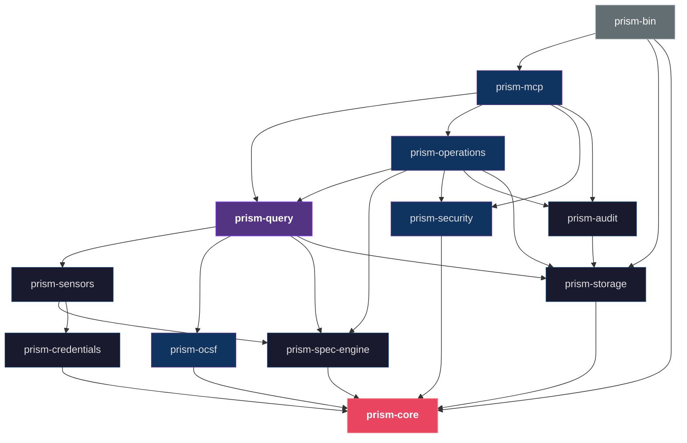

# Dependency Graph

## [Section Content]

## Inter-Crate Dependencies

All arrows point downward (toward prism-core). The graph is strictly acyclic — no circular dependencies.


```mermaid
graph TD
    BIN["prism-bin"]
    MCP["prism-mcp"]
    QUERY["prism-query"]
    OPS["prism-operations"]
    SENS["prism-sensors"]
    SPEC["prism-spec-engine"]
    OCSF["prism-ocsf"]
    SEC["prism-security"]
    CRED["prism-credentials"]
    STOR["prism-storage"]
    AUD["prism-audit"]
    CORE["prism-core"]

    BIN --> MCP
    BIN --> STOR
    BIN --> CORE

    MCP --> QUERY
    MCP --> OPS
    MCP --> SEC
    MCP --> AUD

    QUERY --> SENS
    QUERY --> OCSF
    QUERY --> SPEC
    QUERY --> STOR

    OPS --> QUERY
    OPS --> SPEC
    OPS --> SEC
    OPS --> AUD
    OPS --> STOR

    SENS --> SPEC
    SENS --> CRED

    AUD --> STOR

    SPEC --> CORE
    OCSF --> CORE
    SEC --> CORE
    CRED --> CORE
    STOR --> CORE

    style CORE fill:#e94560,stroke:#ff6b6b,color:#fff,font-weight:bold
    style QUERY fill:#533483,stroke:#7c3aed,color:#fff,font-weight:bold
    style BIN fill:#636e72,stroke:#b2bec3,color:#fff
    style MCP fill:#0f3460,stroke:#533483,color:#e0e0e0
    style OPS fill:#0f3460,stroke:#533483,color:#e0e0e0
    style SENS fill:#1a1a2e,stroke:#0f3460,color:#e0e0e0
    style SPEC fill:#1a1a2e,stroke:#0f3460,color:#e0e0e0
    style OCSF fill:#0f3460,stroke:#533483,color:#e0e0e0
    style SEC fill:#0f3460,stroke:#533483,color:#e0e0e0
    style CRED fill:#1a1a2e,stroke:#0f3460,color:#e0e0e0
    style STOR fill:#1a1a2e,stroke:#0f3460,color:#e0e0e0
    style AUD fill:#1a1a2e,stroke:#0f3460,color:#e0e0e0
```

## Build Order Visualization


```mermaid
gantt
    title Topological Build Order (parallel within levels)
    dateFormat X
    axisFormat %s

    section Level 0
    prism-core           :core, 0, 1

    section Level 1
    prism-ocsf           :ocsf, 1, 2
    prism-credentials    :cred, 1, 2
    prism-security       :sec, 1, 2
    prism-spec-engine    :spec, 1, 2

    section Level 2
    prism-storage        :stor, 2, 3

    section Level 3
    prism-audit          :aud, 3, 4
    prism-sensors        :sens, 3, 4

    section Level 4
    prism-query          :query, 4, 5

    section Level 5
    prism-operations     :ops, 5, 6

    section Level 6
    prism-mcp            :mcp, 6, 7

    section Level 7
    prism-bin            :bin, 7, 8
```

## Topological Build Order

Build order from leaves to root (each level can build in parallel):

| Level | Crates | Dependencies Satisfied |
|-------|--------|----------------------|
| 0 | prism-core | (none — leaf crate) |
| 1 | prism-ocsf, prism-credentials, prism-security, prism-spec-engine | prism-core |
| 2 | prism-storage | prism-core |
| 3 | prism-audit, prism-sensors | prism-storage, prism-credentials, prism-spec-engine, prism-core |
| 4 | prism-query | prism-sensors, prism-ocsf, prism-storage, prism-spec-engine, prism-core |
| 5 | prism-operations | prism-query, prism-spec-engine, prism-security, prism-audit, prism-storage, prism-core |
| 6 | prism-mcp | prism-query, prism-operations, prism-security, prism-audit, prism-core |
| 7 | prism-bin | prism-mcp, prism-storage, prism-core |

## Dependency Rules

1. **prism-core depends on nothing.** It is the leaf crate. All shared types, errors, and config structures live here.
2. **No upward dependencies.** Lower-layer crates never depend on higher-layer crates. prism-storage never imports from prism-mcp.
3. **No peer dependencies between infrastructure crates.** prism-credentials does not depend on prism-storage; prism-audit does not depend on prism-credentials. They communicate through traits defined in prism-core.
4. **prism-query depends on prism-sensors but not vice versa.** The query engine orchestrates sensor adapters, not the other way around. Sensor adapters do not know about DataFusion or PrismQL.
5. **prism-operations depends on prism-query.** The scheduler and detection engine use the query engine to execute queries. They do not directly call sensor adapters.
6. **Feature-gated dependencies.** Write-operation code paths in prism-mcp are behind Cargo feature gates (e.g., `crowdstrike-write`). If the feature is not enabled, the dependency on write-specific sensor adapter code is not compiled.

## DTU Crates (Dev-Only Dependencies)

The 12 on-disk DTU crates are Axum-based HTTP servers (and in-process receivers) that clone external service API behavior for integration testing (4 log-forwarding clones are additionally planned and not yet in Cargo.toml). They are **never** compiled into the production binary. `prism-dtu-common` is the shared test infrastructure hub; the other 11 on-disk DTU crates (9 per-surface clones plus `prism-dtu-demo-server` and `prism-dtu-harness`) depend on it.

**CRITICAL:** No DTU crate depends on any `prism-*` production crate, with one bounded exception: 10 of the 12 on-disk DTU crates (all except `prism-dtu-threatintel` and `prism-dtu-nvd`) consume `prism-core` for shared multi-tenant identity types (OrgId/OrgSlug) — verified against `crates/prism-dtu-*/Cargo.toml` `[dependencies]`. No DTU crate depends on any other production crate (mcp/query/sensors/spec-engine/etc.), and no production crate depends on a DTU crate outside its own `[dev-dependencies]`. The clones are standalone Axum servers that speak the real external-service API protocol over localhost HTTP. They mimic external APIs, not Prism internals.


```mermaid
graph TD
    subgraph DTU["DTU Crates — 12 on disk + 4 planned log-forwarding (dev-dependency only)"]
        DTUCOMMON["prism-dtu-common<br/><i>BehavioralClone trait<br/>LatencyLayer, FailureLayer<br/>fixture_loader<br/>SyslogReceiver<br/>WebhookReceiver</i>"]

        subgraph SENSORS["Sensor clones"]
            DTUC["prism-dtu-crowdstrike<br/><i>L4 adversarial</i>"]
            DTUCL["prism-dtu-claroty<br/><i>L4 adversarial</i>"]
            DTUCY["prism-dtu-cyberint<br/><i>L2 stateful</i>"]
            DTUA["prism-dtu-armis<br/><i>L2 stateful</i>"]
        end

        subgraph ACTIONS["Action clones"]
            DTUSLK["prism-dtu-slack<br/><i>L2 stateful</i>"]
            DTUPD["prism-dtu-pagerduty<br/><i>L3 behavioral</i>"]
            DTUJR["prism-dtu-jira<br/><i>L3 behavioral</i>"]
        end

        subgraph INFUSIONS["Infusion clones"]
            DTUTI["prism-dtu-threatintel<br/><i>L2 stateful</i>"]
            DTUNVD["prism-dtu-nvd<br/><i>L2 stateful</i>"]
        end

        subgraph HARNESS["Harness & scaffold"]
            DTUDS["prism-dtu-demo-server<br/><i>L2 stateful scaffold</i>"]
            DTUH["prism-dtu-harness<br/><i>multi-tenant harness (ADR-011)</i>"]
        end

        subgraph LOGFWD["Log-forwarding clones (planned — not yet in Cargo.toml)"]
            DTUDD["prism-dtu-datadog<br/><i>L2 stateful</i>"]
            DTUSH["prism-dtu-splunk-hec<br/><i>L2 stateful</i>"]
            DTUES["prism-dtu-elasticsearch<br/><i>L2 stateful</i>"]
            DTUOT["prism-dtu-otlp<br/><i>L2 stateful</i>"]
        end
    end

    subgraph CONSUMERS["Consumers (via dev-dependency)"]
        SENS_TEST["prism-sensors/tests"]
        OPS_TEST["prism-operations/tests"]
        OBS_TEST["prism-mcp/tests (log fwd)"]
        INFUSE_TEST["prism-spec-engine/tests (infusions)"]
    end

    SENS_TEST -.->|"dev-dep"| DTUC
    SENS_TEST -.->|"dev-dep"| DTUCY
    SENS_TEST -.->|"dev-dep"| DTUCL
    SENS_TEST -.->|"dev-dep"| DTUA
    OPS_TEST -.->|"dev-dep"| DTUC
    OPS_TEST -.->|"dev-dep"| DTUSLK
    OPS_TEST -.->|"dev-dep"| DTUPD
    OPS_TEST -.->|"dev-dep"| DTUJR
    OBS_TEST -.->|"dev-dep"| DTUDD
    OBS_TEST -.->|"dev-dep"| DTUSH
    OBS_TEST -.->|"dev-dep"| DTUES
    OBS_TEST -.->|"dev-dep"| DTUOT
    INFUSE_TEST -.->|"dev-dep"| DTUTI
    INFUSE_TEST -.->|"dev-dep"| DTUNVD

    DTUC --> DTUCOMMON
    DTUCL --> DTUCOMMON
    DTUCY --> DTUCOMMON
    DTUA --> DTUCOMMON
    DTUSLK --> DTUCOMMON
    DTUPD --> DTUCOMMON
    DTUJR --> DTUCOMMON
    DTUNVD --> DTUCOMMON
    DTUDD --> DTUCOMMON
    DTUSH --> DTUCOMMON
    DTUES --> DTUCOMMON
    DTUOT --> DTUCOMMON
    DTUTI --> DTUCOMMON
    DTUDS --> DTUCOMMON
    DTUH --> DTUCOMMON

    DTUCOMMON --> AXM2["axum + tokio + tower + serde<br/><i>(external)</i>"]

    style DTU fill:#2d3436,stroke:#b2bec3,color:#e0e0e0,stroke-dasharray:5 5
    style SENSORS fill:#1a1a2e,stroke:#0f3460,color:#e0e0e0
    style ACTIONS fill:#0f3460,stroke:#533483,color:#e0e0e0
    style INFUSIONS fill:#533483,stroke:#7c3aed,color:#fff
    style LOGFWD fill:#1a1a2e,stroke:#0f3460,color:#e0e0e0,stroke-dasharray:5 5
    style HARNESS fill:#2d3436,stroke:#533483,color:#e0e0e0
    style CONSUMERS fill:#2d3436,stroke:#636e72,color:#e0e0e0
    style AXM2 fill:#636e72,stroke:#b2bec3,color:#fff
    style DTUCOMMON fill:#2d3436,stroke:#e94560,color:#e0e0e0,font-weight:bold
```

**DTU gate:** All 12 on-disk DTU crates are compile-gated out of production builds (the 4 planned log-forwarding clones will follow the same ADR-002 template gate when created). Gate precision: `prism-dtu-common` and the four generator-backed sensor clones (`prism-dtu-claroty`, `prism-dtu-armis`, `prism-dtu-crowdstrike`, `prism-dtu-cyberint`) carry the 3-way crate gate `#![cfg(any(test, feature = "dtu", feature = "fixture-gen"))]` (BC-3.4.001 v0.10 Invariant 4 / D-056; generator-backed clones per BC-2.06.018 / S-3.7.02–S-3.7.05); all other DTU crates carry the 2-way gate `#[cfg(any(test, feature = "dtu"))]`. Neither the `dtu` nor `fixture-gen` Cargo feature is ever enabled in release builds. The workspace root `Cargo.toml` lists the 12 on-disk DTU crates as workspace `members` (it is a virtual manifest — consumer crates such as `prism-bin`, `prism-spec-engine`, and `prism-query` pull individual DTU crates in via their own `[dev-dependencies]`):

```toml
[workspace]
members = [
    # ... 14 non-DTU members ...
    "crates/prism-dtu-common",        # shared infrastructure (consumed by all other DTU crates)
    "crates/prism-dtu-crowdstrike",   # sensor clones
    "crates/prism-dtu-claroty",
    "crates/prism-dtu-cyberint",
    "crates/prism-dtu-armis",
    "crates/prism-dtu-threatintel",   # infusion clones
    "crates/prism-dtu-nvd",
    "crates/prism-dtu-pagerduty",     # action clones
    "crates/prism-dtu-jira",
    "crates/prism-dtu-slack",
    "crates/prism-dtu-demo-server",   # all-clone scaffold (ADR-007 D-051)
    "crates/prism-dtu-harness",       # multi-tenant harness (ADR-011)
]
# Planned, not yet members: prism-dtu-datadog, prism-dtu-splunk-hec,
# prism-dtu-elasticsearch, prism-dtu-otlp (log-forwarding clones)
```

**DTU dependency edges:** All 11 other on-disk DTU crates (9 per-surface clones plus `prism-dtu-demo-server` and `prism-dtu-harness`) depend on `prism-dtu-common` for shared tower middleware (LatencyLayer, FailureLayer), the `BehavioralClone` trait, fixture loading, and the generic `SyslogReceiver` + `WebhookReceiver`. Each per-surface crate then adds its own route handlers and state stores on top. **No DTU crate depends on any prism-* production crate other than the bounded `prism-core` shared-types exception noted above** — they are standalone Axum servers that speak the real external-service API protocol over localhost HTTP.

## External Dependency Summary

| External Crate | Used By | Purpose | Version |
|----------------|---------|---------|---------|
| rmcp | prism-mcp | MCP SDK (server, tools, transport) | 1.7 |
| datafusion | prism-query | SQL execution engine | 53 |
| arrow | prism-query, prism-ocsf | Columnar in-memory format | 53 |
| chumsky | prism-query | PrismQL parser combinator | 0.12 |
| rust-rocksdb | prism-storage | Persistent key-value storage | 0.24 |
| prost | prism-ocsf | Protobuf message encoding | 0.13 (pin exact in Cargo.toml — proto field stability per ASM-005) |
| prost-reflect | prism-ocsf | DynamicMessage runtime reflection | 0.14 (pin exact — DynamicMessage API stability critical) |
| keyring | prism-credentials | OS keyring access | 3.x (verify cross-platform per ASM-003) |
| vaultrs | prism-credentials | HashiCorp Vault client (feature: `vault`) | 0.8 |
| aws-sdk-secretsmanager | prism-credentials | AWS Secrets Manager (feature: `aws-sm`) | latest |
| azure_security_keyvault_secrets | prism-credentials | Azure Key Vault (feature: `azure-kv`) | latest |
| google-cloud-secretmanager-v1 | prism-credentials | GCP Secret Manager (feature: `gcp-sm`) | latest |
| reqwest | prism-sensors | HTTP client for sensor APIs | 0.12 |
| tokio | all crates | Async runtime | 1.x |
| serde / serde_json | all crates | Serialization | 1.x |
| arc-swap | prism-spec-engine, prism-core | Lock-free config access | 1.x |
| notify | prism-spec-engine | Cross-platform filesystem watcher (inotify/FSEvents/ReadDirectoryChangesW) | 7.x |
| git2 | prism-spec-engine | Git repo operations for config source sync (libgit2 bindings) | latest |
| wasmtime | prism-spec-engine | WASM Component Model runtime for sensor plugin execution | latest stable |
| wit-bindgen | (plugin authors) | WIT interface code generation for plugin development | latest stable |
| bincode | prism-storage | Binary serialization for RocksDB values | 2.x |
| uuid | prism-core | UUID v7 generation for alerts/cases | 1.x |
| tracing | all crates | Structured logging | 0.1 |
| ipnet | prism-operations | subnet_contains() UDF for detection rules | latest |
| regex | prism-security, prism-query | Pattern matching (injection detection, IOC match) | latest |
| scopeguard | prism-operations | RAII guard for SessionContext drop on error/panic (VP-036) | 1.x |
| cron | prism-operations | Cron expression parsing for action scheduled triggers (AD-021) | 0.12 |
| blake3 | prism-operations | Row hashing for differential result computation | 1.x |
| toml | prism-spec-engine, prism-operations | TOML parsing for sensor specs, detection rules, packs | 0.8 |
| ariadne | prism-query | Error formatting with source spans for PrismQL parse errors | 0.4 |
| maxminddb | prism-spec-engine | MaxMind MMDB reader for GeoIP infusion | latest |
| lru | prism-spec-engine | In-memory LRU cache for infusion Tier 2 caching | 0.12 |
| lettre | prism-operations | SMTP email delivery for action framework | 0.11 |
| sha2 | prism-operations | SHA-256 hashing for action deduplication keys | 0.10 |

## Changelog

| Version | Date | Author | Change |
|---------|------|--------|--------|
| 1.3 | 2026-06-10 | architect | DTU cascade P7-01/P7-03 burst (residue of P6-01). **P7-01:** "DTU gate" paragraph + v1.2-row generator-story cite "S-3.7.04" → S-3.7.02–S-3.7.05 (S-3.7.01 is the catalog/GenOpts story per STORY-INDEX + BC-3.4.004; v1.2 row corrected in place pre-commit — uncommitted at fix time, ARCH-INDEX v2.121 fold-companion precedent). **P7-03:** DTU crate counts reconciled to disk (`ls crates/` + root Cargo.toml members on develop): "The 11 DTU crates" / Mermaid "11 total" / "All 14 crates" → **12 on-disk DTU crates** (common + 9 per-surface + demo-server + harness) + 4 planned log-forwarding clones explicitly marked planned; Mermaid gains demo-server/harness nodes with edges to prism-dtu-common and LOGFWD subgraph marked planned/dashed; false workspace-root `[dev-dependencies]` snippet replaced with the actual `[workspace] members` excerpt (root is a virtual manifest; consumers pull DTU crates via their own `[dev-dependencies]` — verified prism-bin/prism-spec-engine/prism-query); "All 10 per-surface crates depend on prism-dtu-common" → all 11 other on-disk DTU crates. Same-burst precision fix verified against `crates/prism-dtu-*/Cargo.toml`: blanket "No DTU crate depends on any prism-* production crate" CRITICAL claim bounded — 10 of 12 on-disk DTU crates (all except threatintel/nvd) consume `prism-core` identity types (OrgId/OrgSlug, Wave 3 multi-tenancy); no other production-crate deps; reverse direction (production→DTU) confirmed dev-dependencies-only. |
| 1.2 | 2026-06-10 | architect | DTU cascade P6-01 stale gate-string sweep: "DTU gate" paragraph blanket claim "All 14 crates are compiled only under `#[cfg(any(test, feature = "dtu"))]`" made precise — `prism-dtu-common` + 4 generator-backed sensor clones (claroty/armis/crowdstrike/cyberint) are 3-way gated `#![cfg(any(test, feature = "dtu", feature = "fixture-gen"))]` (BC-3.4.001 v0.10 Invariant 4 / D-056; BC-2.06.018 / S-3.7.02–S-3.7.05 *[row corrected in place pre-commit by P7-01; originally mis-cited "S-3.7.04"]*); all other DTU crates 2-way gated. Verified against `crates/prism-dtu-*/src/lib.rs` on disk. Production-exclusion guarantee unchanged ("never enabled in release builds" extended to cover `fixture-gen`). |
| 1.1 | 2026-04-27 | product-owner | Pass 15 sweep: DTU crate count corrected 14→11 total, 13→10 per-surface (log-forwarding DTUs planned, not yet in Cargo.toml); Mermaid subgraph label updated; added `## [Section Content]` template compliance marker. |
