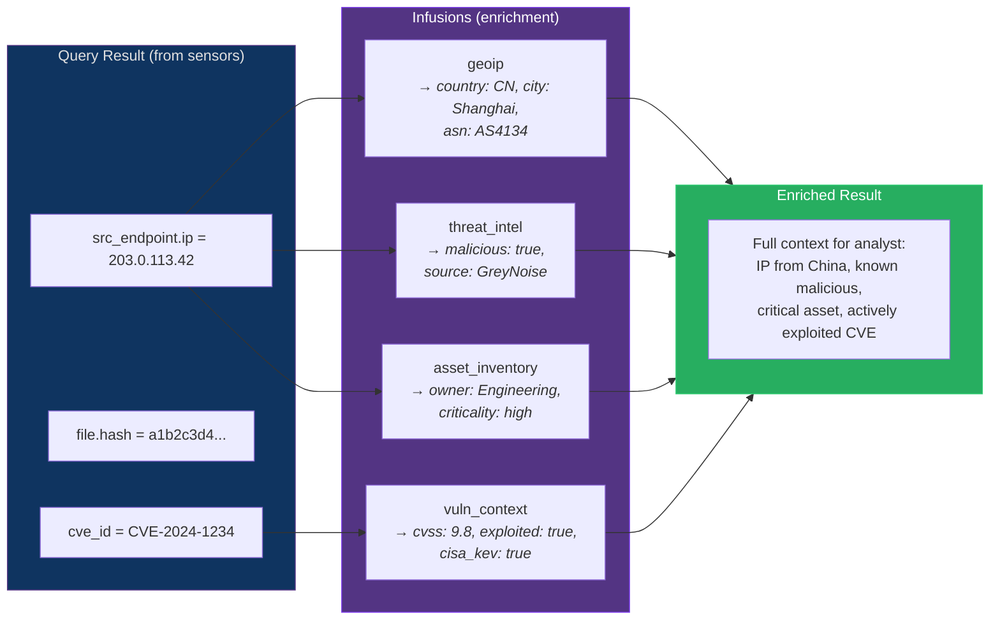

# Infusions — Enrichment Framework

## Overview

Infusions are Prism's enrichment system — they augment query results with additional context that doesn't come from the queried sensors. Where sensor adapters answer "what happened?", infusions answer "what does this mean?"



## Design Principle: Same Two-Tier Pattern as Sensors

Infusions follow the same architecture as sensor adapters — TOML spec for simple lookups, `.prx` WASM plugin for complex external API calls. This means:
- Same file watching and hot-reload (AD-018)
- Same plugin sandbox security model (AD-019)
- Same polyglot support (Rust, Go, Python, JS, C#)
- Same eat-our-own-dog-food philosophy

### Decision: Infusions as Composable Enrichment (AD-020)

**Status:** accepted
**Context:** Security analysts need context beyond raw sensor data — GeoIP, threat intelligence, asset inventory, vulnerability scores. These enrichments come from local databases, external APIs, and custom data sources. They must be composable, hot-reloadable, and not tightly coupled to the query engine.
**Decision:** Infusions are declared in `.infusion.toml` files and optionally backed by `.prx` WASM plugins. They register as DataFusion UDFs (for inline enrichment in PrismQL) and as pipe stages (for bulk enrichment of result sets).
**Rationale:** Using UDFs leverages DataFusion's existing execution model — no new execution path needed. The TOML + `.prx` pattern is proven in sensor adapters. Hot-reload via file watcher means adding a new enrichment source requires zero restart.
**Consequences:** Enrichment latency adds to query execution time. Infusions that call external APIs are bounded by the query timeout (30s). Caching is critical for performance.

## Two Access Patterns

### Pattern 1: UDF (Inline in PrismQL)

Infusions register as DataFusion UDFs, callable directly in queries:

```sql
-- GeoIP enrichment inline
SELECT device_ip, geoip_country(device_ip), geoip_asn(device_ip), severity
FROM EVENTS
WHERE severity_id >= 4 AND geoip_country(device_ip) != 'US'

-- Threat intel lookup inline
SELECT device_ip, threat_score(device_ip), severity
FROM EVENTS
WHERE threat_score(device_ip) > 80

-- CVSS score for vulnerability correlation
SELECT cve_id, cvss_score(cve_id), cvss_severity(cve_id)
FROM armis_vulnerabilities
WHERE cvss_score(cve_id) >= 9.0
```

### Pattern 2: Pipe Stage (Bulk Enrichment)

The `enrich` pipe stage applies an infusion to the entire result set, adding new columns:

```prismql
-- Enrich all results with GeoIP
FROM EVENTS | where severity_id >= 4 | enrich geoip on device_ip | sort country

-- Enrich with threat intel
FROM EVENTS | enrich threat_intel on device_ip | where threat_score > 80

-- Chain multiple enrichments
FROM EVENTS
  | where severity_id >= 4
  | enrich geoip on device_ip
  | enrich threat_intel on device_ip
  | enrich asset_inventory on device_ip
  | sort threat_score desc
  | head 20

-- Enrich vulnerabilities with CVSS context
FROM armis_vulnerabilities | enrich vuln_context on cve_id | where cvss >= 9.0 | sort cvss desc
```

## Infusion Spec Files

### Tier 1: No-Code (Local Lookup Tables)

For enrichments backed by local data files (GeoIP databases, asset CSV exports, static lookup tables):

```toml
# geoip.infusion.toml
[infusion]
infusion_id = "geoip"
name = "GeoIP Enrichment"
type = "local_lookup"
description = "Enriches IP addresses with geolocation data"

[infusion.source]
type = "maxmind_mmdb"                    # Built-in source type for MaxMind databases
path = "{config_dir}/data/GeoLite2-City.mmdb"
refresh_interval = "24h"                 # Re-read file every 24 hours

[[infusion.fields]]
name = "geoip_country"
input_field = "ip"
input_type = "ip_address"
output_type = "String"
description = "ISO country code"

[[infusion.fields]]
name = "geoip_city"
input_field = "ip"
input_type = "ip_address"
output_type = "String"

[[infusion.fields]]
name = "geoip_asn"
input_field = "ip"
input_type = "ip_address"
output_type = "String"
description = "Autonomous System Number and name"

[[infusion.fields]]
name = "geoip_is_tor"
input_field = "ip"
input_type = "ip_address"
output_type = "Boolean"

[infusion.pipe_stage]
name = "geoip"                           # Usage: | enrich geoip on device_ip
input_field = "ip"                       # Which infusion input maps to the ON field
adds_columns = ["geoip_country", "geoip_city", "geoip_asn", "geoip_is_tor"]
```

```toml
# asset_inventory.infusion.toml
[infusion]
infusion_id = "asset_inventory"
name = "Asset Inventory"
type = "local_lookup"

[infusion.source]
type = "csv"                             # Built-in source type for CSV files
path = "{config_dir}/data/asset_inventory.csv"
key_column = "ip_address"
refresh_interval = "1h"

[[infusion.fields]]
name = "asset_owner"
input_field = "ip"
output_type = "String"
csv_column = "department"

[[infusion.fields]]
name = "asset_criticality"
input_field = "ip"
output_type = "String"
csv_column = "criticality_level"

[[infusion.fields]]
name = "asset_location"
input_field = "ip"
output_type = "String"
csv_column = "physical_location"

[infusion.pipe_stage]
name = "asset_inventory"
input_field = "ip"
adds_columns = ["asset_owner", "asset_criticality", "asset_location"]
```

### Tier 2: Plugin (External API Enrichment)

For enrichments requiring external API calls (threat intel, live vulnerability databases):

```toml
# threat_intel.infusion.toml
[infusion]
infusion_id = "threat_intel"
name = "Threat Intelligence"
type = "plugin"
plugin = "threat_intel.prx"             # WASM plugin for API calls

[infusion.plugin_config]
# Plugin-specific config
greynoise_enabled = "true"
virustotal_enabled = "true"
abuseipdb_enabled = "true"
cache_ttl_seconds = "3600"

# Credentials for external APIs (reference-based, never values)
[infusion.credentials]
greynoise_api_key = { source = "env", key = "PRISM_GREYNOISE_API_KEY" }
virustotal_api_key = { source = "env", key = "PRISM_VIRUSTOTAL_API_KEY" }
abuseipdb_api_key = { source = "env", key = "PRISM_ABUSEIPDB_API_KEY" }

[[infusion.fields]]
name = "threat_score"
input_field = "ip"
input_type = "ip_address"
output_type = "Integer"
description = "Combined threat score (0-100)"

[[infusion.fields]]
name = "threat_sources"
input_field = "ip"
input_type = "ip_address"
output_type = "String"
description = "Comma-separated list of sources reporting this IP"

[[infusion.fields]]
name = "threat_is_known_malicious"
input_field = "ip"
input_type = "ip_address"
output_type = "Boolean"

[infusion.pipe_stage]
name = "threat_intel"
input_field = "ip"
adds_columns = ["threat_score", "threat_sources", "threat_is_known_malicious"]
```

### Infusion Plugin WIT Interface

Infusion plugins use a simplified WIT interface focused on field enrichment:

```wit
// prism-infusion-plugin.wit
package prism:infusion-plugin@0.1.0;

interface enrichment {
    /// Enrich a single value — returns JSON object with output field values
    /// Called once per unique input value (results are cached per query)
    enrich-single: func(input-value: string, input-type: string) -> option<string>;

    /// Batch enrich — more efficient for external APIs (reduces round-trips)
    /// Returns JSON array of results matching input order
    enrich-batch: func(input-values: list<string>, input-type: string) -> list<option<string>>;

    /// Plugin metadata
    name: func() -> string;
    version: func() -> string;
}

/// Same host interface as sensor plugins
interface host {
    record http-header { name: string, value: string }
    record http-response { status: u16, headers: list<http-header>, body: string }

    http-request: func(method: string, url: string, headers: list<http-header>, body: option<string>) -> http-response;
    log: func(level: log-level, message: string);
    get-config: func(key: string) -> option<string>;
    enum log-level { trace, debug, info, warn, error }
}
```

## Caching Strategy

Infusion results are cached aggressively because the same IP or CVE often appears in many records within a single query:

| Cache Level | Scope | TTL | Purpose |
|-------------|-------|-----|---------|
| **Per-query dedup** | Single query execution | Query lifetime | Deduplicate: if 500 events have the same `device_ip`, call `geoip_country` once |
| **In-memory LRU** | Process lifetime | Configurable per infusion (default 1h) | Avoid repeated external API calls across queries |
| **Persistent** | RocksDB `decorators` CF | Configurable per infusion (default 24h) | Survive restarts for expensive lookups |

Per-query dedup is critical: a query returning 10K events might have only 200 unique IPs. The infusion is called 200 times, not 10,000.

## Built-In Infusion Source Types

| Source Type | Configuration | Use case |
|-------------|--------------|----------|
| `maxmind_mmdb` | Path to MaxMind GeoLite2/GeoIP2 `.mmdb` file | GeoIP enrichment |
| `csv` | Path to CSV file with key column | Asset inventory, custom lookup tables |
| `json_lookup` | Path to JSON file with key-value structure | Static reference data |
| `plugin` | `.prx` WASM plugin (polyglot) | External APIs, complex transformations |

## Infusion in Detection Rules

Infusion UDFs are available in detection rule filters, enabling enrichment-aware detection:

```toml
# detect_external_threat.detect
[meta]
rule_id = "external_threat_activity"
name = "Activity from Known Malicious External IP"
severity = "critical"

[condition]
mode = "single"
source = "EVENTS"
filter = 'threat_is_known_malicious(device_ip) = TRUE AND geoip_country(device_ip) != "US"'

[alert]
title = "Malicious external IP ${device_ip} (${geoip_country(device_ip)}) detected"
description = "Activity from known malicious IP. Threat score: ${threat_score(device_ip)}. Sources: ${threat_sources(device_ip)}."
```

## File Organization

```
~/.prism/config/
  sensors/                          # Data IN
    crowdstrike.sensor.toml
    cyberint.sensor.toml
    claroty.sensor.toml
    armis.sensor.toml
  infusions/                        # Data ENRICHMENT
    geoip.infusion.toml
    asset_inventory.infusion.toml
    threat_intel.infusion.toml
    vuln_context.infusion.toml
  actions/                          # Data OUT
    slack_soc.action.toml
    pagerduty_oncall.action.toml
    jira_case_sync.action.toml
  rules/                            # What to DETECT
    global/
      brute_force.detect
      critical_severity.detect
    clients/
      acme/
        ot_threat.detect
  plugins/                          # WASM plugins (all types)
    threat_intel.prx
    vuln_context.prx
    pagerduty.prx
    jira.prx
  ioc/                              # IOC pattern files
    known_bad_ips.ioc
    suspicious_hashes.ioc
  data/                             # Lookup data
    GeoLite2-City.mmdb
    asset_inventory.csv
  templates/                        # Report/email templates
    daily_digest.html
  prism.toml                        # Main config
  aliases.toml                      # Query aliases
```

## Hot Reload

Infusions participate in the same filesystem watching system (AD-018):

- **Watch paths:** `{config_dir}/infusions/*.infusion.toml`, `{config_dir}/plugins/*.prx`, `{config_dir}/data/*`
- **On spec change:** Re-validate, re-register UDFs and pipe stages, swap via arc-swap
- **On data file change:** Re-read lookup table (MaxMind, CSV, JSON), invalidate in-memory cache
- **On plugin change:** Recompile WASM module, validate WIT interface, swap
- **In-flight queries:** Continue using captured snapshot (CI-002)

## PrismQL Grammar Addition

```ebnf
(* New pipe stage for enrichment *)
enrich_stage = "ENRICH" , infusion_name , "ON" , field_ref ;
infusion_name = identifier ;
(* Example: | enrich geoip on device_ip *)
(* Adds columns declared in the infusion's adds_columns list *)
```

## Security Considerations

- Infusion plugins run in the same WASM sandbox as sensor plugins (AD-019) — no direct network, no filesystem, no process access
- External API credentials use the same AI-opaque credential model (AD-017) — referenced in `[infusion.credentials]`, never values in TOML
- Infusion results that contain external data inherit `trust_level: "untrusted_external"` — same injection defense as sensor data
- Infusion API calls are audit-logged at the same granularity as sensor API calls
