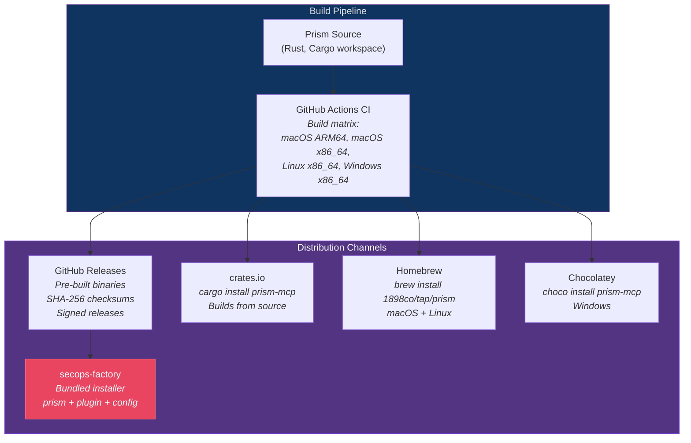
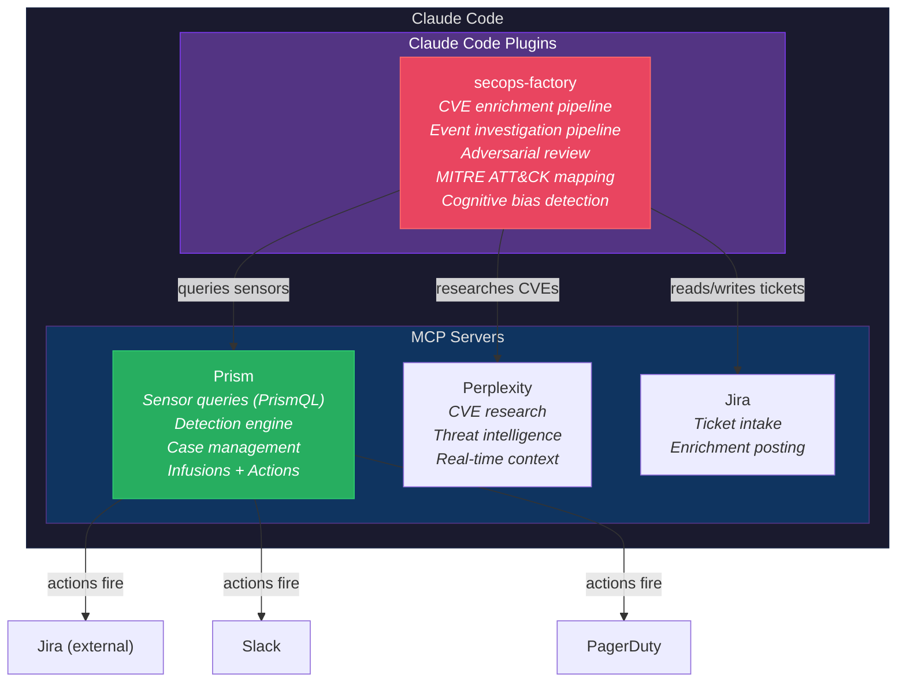

# Installation & Distribution

## Distribution Channels



### Channel Details

| Channel | Command | Platform | Audience |
|---------|---------|----------|----------|
| **GitHub Releases** | Download from releases page | All | Primary — versioned binaries with checksums |
| **Cargo** | `cargo install prism-mcp` | All (requires Rust) | Developers, CI pipelines |
| **Homebrew** | `brew install 1898co/tap/prism` | macOS, Linux | macOS analysts (auto-updates via `brew upgrade`) |
| **Chocolatey** | `choco install prism-mcp` | Windows | Windows analysts |
| **secops-factory** | `prism install-secops-factory` | All | Full-stack install — Prism + secops-factory plugin + default config |

### Build Matrix

| Target | Binary | Notes |
|--------|--------|-------|
| `aarch64-apple-darwin` | `prism-aarch64-apple-darwin` | Apple Silicon (M1/M2/M3/M4) |
| `x86_64-apple-darwin` | `prism-x86_64-apple-darwin` | Intel Mac |
| `x86_64-unknown-linux-gnu` | `prism-x86_64-unknown-linux-gnu` | Linux (glibc) |
| `x86_64-unknown-linux-musl` | `prism-x86_64-unknown-linux-musl` | Linux (static, Alpine/containers) |
| `x86_64-pc-windows-msvc` | `prism-x86_64-pc-windows-msvc.exe` | Windows |

Each release includes SHA-256 checksums and (future) GPG-signed binaries.

## CLI Commands

### `prism init` — Bootstrap Config Directory

```bash
$ prism init
# Or with custom paths:
$ prism init --config-dir /etc/prism/config --state-dir /var/lib/prism/state
```

Creates the complete directory structure:

```
~/.prism/
  config/
    prism.toml              # Main config (generated with guided defaults)
    aliases.toml            # Query aliases (empty, with examples commented)
    sensors/                # Sensor spec files
    infusions/              # Enrichment specs
    actions/                # Action specs
    rules/                  # Detection rules (.detect files)
    plugins/                # WASM plugins (.prx files)
    ioc/                    # IOC pattern files
    data/                   # Lookup data (GeoIP, asset inventory)
    templates/              # Report/email templates
  state/                    # RocksDB state directory (auto-created on first run)
```

**Interactive mode** (default): Prompts the analyst for basic config:

```
$ prism init

Prism Configuration Setup
─────────────────────────

Config directory [~/.prism/config]: 
State directory [~/.prism/state]: 

Client Setup
  Client ID (short identifier, e.g., "acme"): acme
  Client display name: Acme Corporation
  
  Sensors for acme:
    CrowdStrike Falcon? [y/N]: y
    Cyberint Argos? [y/N]: n
    Claroty xDome? [y/N]: y
    Armis Centrix? [y/N]: n
  
  Add another client? [y/N]: y
  Client ID: globex
  ...

Generated: ~/.prism/config/prism.toml
Generated: ~/.prism/config/aliases.toml
Generated: ~/.prism/config/sensors/crowdstrike.sensor.toml
Generated: ~/.prism/config/sensors/claroty.sensor.toml

Next steps:
  1. Set up credentials:
     prism credential set --client acme --sensor crowdstrike --name client_id
     prism credential set --client acme --sensor crowdstrike --name client_secret
     prism credential set --client acme --sensor claroty --name api_key
  
  2. Register with Claude Code:
     prism register
  
  3. Verify connectivity:
     prism health
```

**Non-interactive mode** (for automation):

```bash
prism init --non-interactive --clients acme,globex --sensors crowdstrike,claroty
```

### `prism register` — Register with Claude Code

```bash
$ prism register

Registering Prism as MCP server in Claude Code...

  Settings file: ~/.claude/settings.json
  Command: prism serve --config-dir ~/.prism/config --state-dir ~/.prism/state
  
  Added MCP server configuration:
  {
    "mcpServers": {
      "prism": {
        "command": "prism",
        "args": ["serve", "--config-dir", "~/.prism/config", "--state-dir", "~/.prism/state"],
        "env": {
          "PRISM_LOG_LEVEL": "info"
        }
      }
    }
  }

Prism registered ✓
Restart Claude Code to connect.
```

**Options:**

```bash
# Register with custom paths
prism register --config-dir /etc/prism/config --state-dir /var/lib/prism/state

# Register in project-level settings (not global)
prism register --project

# Register with environment variables for credentials
prism register --env PRISM_MASTER_KEY_FILE=/run/secrets/master_key

# Unregister
prism unregister
```

### `prism install-secops-factory` — Install SecOps Factory Plugin

Installs the secops-factory Claude Code plugin alongside Prism, giving the analyst the full security operations stack:

```bash
$ prism install-secops-factory

Installing SecOps Factory v0.5.3...

  Source: github.com/1898co/secops-factory
  Destination: ~/.claude/plugins/secops-factory/

  Installing components:
    ✓ agents/        (8 security analyst agents)
    ✓ skills/        (CVE enrichment, event investigation pipelines)
    ✓ hooks/         (quality enforcement, JIRA integration)
    ✓ commands/      (slash commands for security workflows)
    ✓ checklists/    (quality scoring dimensions)
    ✓ templates/     (analysis templates)
    ✓ data/          (MITRE ATT&CK, priority scoring)

  Configuring MCP integrations:
    ✓ Prism MCP server (sensor queries, detection, case management)
    ✓ Perplexity MCP server (CVE research, threat intelligence)
    ✓ Jira MCP server (ticket intake, enrichment posting)

SecOps Factory installed ✓

The following Claude Code plugins are now active:
  • Prism — sensor queries, detection, case management
  • SecOps Factory — CVE enrichment, event investigation, adversarial review
  
Restart Claude Code to activate.
```

**Options:**

```bash
# Specific version
prism install-secops-factory --version 0.5.3

# Update to latest
prism install-secops-factory --update

# Uninstall
prism uninstall-secops-factory

# Check installed version
prism secops-factory-version
```

### `prism credential set` — Set Credentials (Out-of-Band)

See security-architecture.md (AD-017) for full details. Credentials never transit through the AI.

```bash
# Interactive hidden prompt
prism credential set --client acme --sensor crowdstrike --name client_secret

# From file
prism credential set --client acme --sensor claroty --name api_key --from-file /path/to/key

# From stdin (pipe-safe)
echo "$SECRET" | prism credential set --client acme --sensor armis --name api_secret --from-stdin

# Import all from env vars matching PRISM_{CLIENT}_{SENSOR}_{NAME} pattern
prism credential import --from-env --client acme

# Check status
prism credential status --client acme
```

### `prism health` — Verify Connectivity

```bash
$ prism health

Prism Health Check
──────────────────

Config:     ~/.prism/config/prism.toml ✓
State:      ~/.prism/state/ ✓ (RocksDB healthy)
Keyring:    macOS Keychain ✓

Clients:
  acme (Acme Corporation)
    crowdstrike:  ✓ authenticated (OAuth2, token valid 24m remaining)
    claroty:      ✓ authenticated (Bearer, API key valid)
    cyberint:     ✗ credentials missing (run: prism credential set --client acme --sensor cyberint --name api_token)
    armis:        — not configured

  globex (Globex Inc)
    crowdstrike:  ✓ authenticated
    armis:        ✓ authenticated

Infusions:
  geoip:          ✓ loaded (GeoLite2-City.mmdb, 2026-04-01)
  threat_intel:   ✓ plugin loaded (threat_intel.prx)
  asset_inventory: ✓ loaded (asset_inventory.csv, 847 entries)

Actions:
  slack_soc:      ✓ webhook reachable
  jira_sync:      ✓ plugin loaded, Jira reachable
  pagerduty:      ✗ credentials missing

Schedules:  12 active (3 packs loaded)
Rules:      47 active (8 global, 39 per-client)
IOC files:  3 loaded (12,847 patterns)

Overall: HEALTHY (2 warnings — see above)
```

### `prism serve` — Run as MCP Server

This is the command Claude Code invokes. Not typically called directly:

```bash
# Normal mode (Claude Code calls this)
prism serve --config-dir ~/.prism/config --state-dir ~/.prism/state

# With debug logging
PRISM_LOG_LEVEL=debug prism serve --config-dir ~/.prism/config --state-dir ~/.prism/state

# Disable file watching (managed config deployments)
prism serve --no-file-watch --config-dir /etc/prism/config

# Dry-run (validate config, don't start server)
prism serve --dry-run --config-dir ~/.prism/config
```

### `prism migrate-storage` — Schema Migration

```bash
# Run migration (required after major version upgrade)
prism migrate-storage --state-dir ~/.prism/state

# Dry-run (show what would change)
prism migrate-storage --dry-run --state-dir ~/.prism/state
```

### `prism logs` — Query Diagnostic Logs

```bash
prism logs --subsystem detection --since 1h
prism logs --trace-id 01905a7b
prism logs --follow --subsystem scheduler
prism logs --level warn --since 24h
prism logs --grep "rate limit" --since 6h
```

See observability.md for full details on 18 subsystem targets and log storage.

### `prism config` — Config Inspection

```bash
prism config diff                        # What changed since last reload
prism config diff --pending              # What would change on next reload
prism config show --effective            # Merged config from all sources
prism config show --trace defaults.limits.max_schedules  # Where a value comes from
```

See config-schema.md for full details.

## SecOps Factory Integration



**SecOps Factory is the analyst's workflow engine. Prism is the data engine.** Together they provide:

| Capability | Prism | SecOps Factory |
|-----------|-------|---------------|
| Query sensor data | ✓ (PrismQL) | Uses Prism's query tool |
| Detect threats | ✓ (detection rules) | Receives alert notifications |
| Enrich with context | ✓ (infusions) | Adds business context via skills |
| CVE analysis | GeoIP/CVSS infusions | 8-stage enrichment pipeline |
| Event investigation | Alert + case tools | 7-stage investigation pipeline |
| Quality assurance | — | Adversarial convergence review |
| Cognitive bias detection | — | Mandatory bias audits |
| MITRE ATT&CK mapping | `mitre_tactic()` UDF | Full matrix coverage |
| Case management | ✓ (5-state lifecycle) | Investigation workflow |
| Jira integration | ✓ (case-triggered actions) | Direct ticket manipulation |

The `prism install-secops-factory` command sets up both systems as a unified security operations stack.
