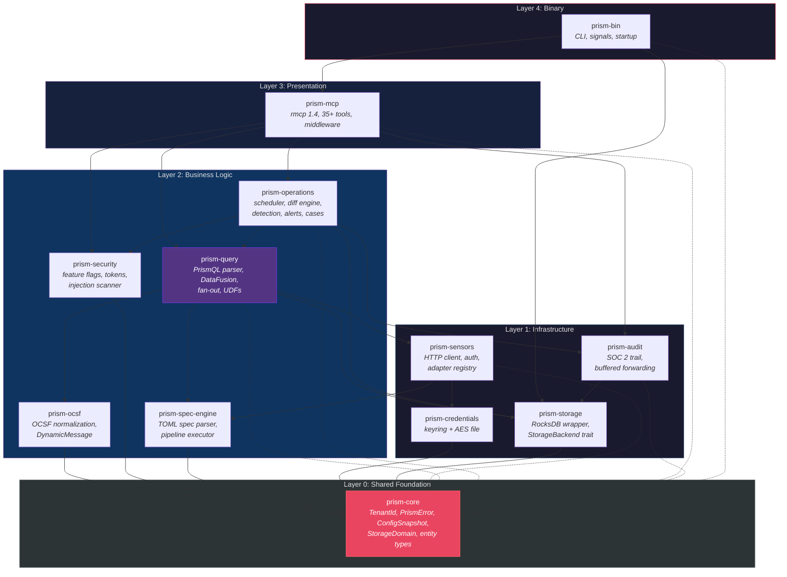
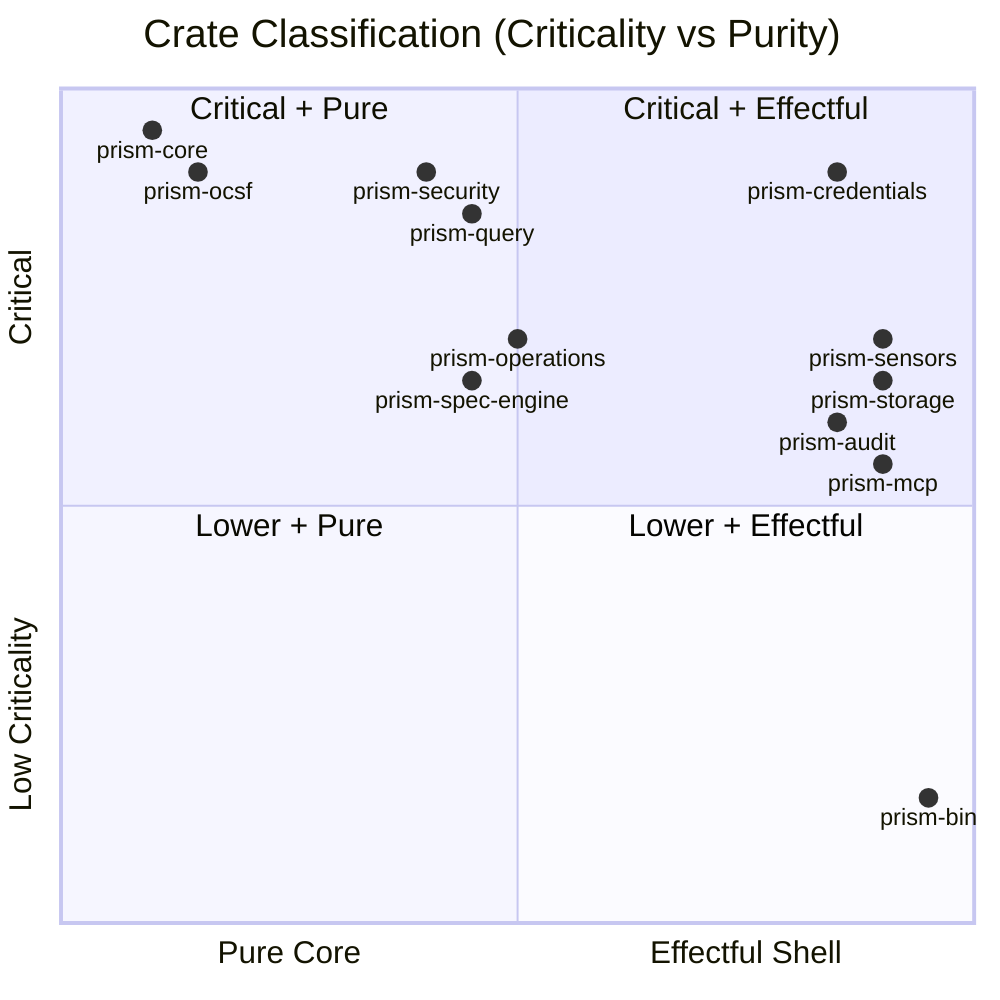

# Module Decomposition

## Cargo Workspace Structure

Prism is a Cargo workspace with 12 crates organized in 4 layers: binary, application, domain, and infrastructure. Each crate has a single responsibility and explicit public API.

```
prism/
  Cargo.toml          (workspace root)
  prism-bin/           (binary crate — main entry point)
  prism-mcp/           (MCP server, tool registration, routing)
  prism-query/         (PrismQL parser + DataFusion query engine)
  prism-sensors/       (sensor adapter orchestration, auth traits)
  prism-spec-engine/   (TOML spec parser, pipeline executor)
  prism-ocsf/          (OCSF normalization via DynamicMessage)
  prism-operations/    (scheduler, differential, detection, alerts, cases)
  prism-security/      (feature flags, confirmation tokens, prompt injection)
  prism-credentials/   (credential store trait, keyring + file backends)
  prism-storage/       (RocksDB wrapper, StorageDomain, StorageBackend trait)
  prism-audit/         (audit entry construction, buffered forwarding)
  prism-core/          (shared types, errors, TenantId, config, decorators)
```

## Layered Architecture Diagram



## Crate Criticality & Purity



## Component Map (Machine-Readable)

```yaml
components:
  - id: COMP-001
    name: "prism-bin"
    layer: "infrastructure"
    purity: "effectful-shell"
    criticality: "LOW"
    dependencies: [COMP-002, COMP-010, COMP-012]
    interfaces_provided: ["main() entry point", "CLI argument parsing", "signal handling"]
    interfaces_consumed: ["PrismServer from prism-mcp", "Storage from prism-storage", "Config from prism-core"]

  - id: COMP-002
    name: "prism-mcp"
    layer: "presentation"
    purity: "effectful-shell"
    criticality: "HIGH"
    dependencies: [COMP-003, COMP-008, COMP-009, COMP-011, COMP-012, COMP-007]
    interfaces_provided: ["PrismServer (rmcp ServerHandler)", "Tool registration", "MCP resources/prompts"]
    interfaces_consumed: ["QueryEngine", "FeatureFlagEvaluator", "CredentialStore", "AuditEmitter", "ConfigSnapshot"]

  - id: COMP-003
    name: "prism-query"
    layer: "business-logic"
    purity: "mixed"
    criticality: "CRITICAL"
    dependencies: [COMP-004, COMP-005, COMP-006, COMP-010, COMP-012]
    interfaces_provided: ["QueryEngine::execute()", "QueryEngine::execute_scheduled() -> (results, SessionContext)", "QueryEngine::explain()", "PrismQL parser", "UDF registry", "Infusion UDF registration"]
    interfaces_consumed: ["SensorAdapter", "SpecEngine", "OcsfNormalizer", "StorageBackend", "ConfigSnapshot", "InfusionRegistry"]

  - id: COMP-004
    name: "prism-sensors"
    layer: "infrastructure"
    purity: "effectful-shell"
    criticality: "HIGH"
    dependencies: [COMP-005, COMP-009, COMP-012]
    interfaces_provided: ["SensorAdapter trait", "SensorAuth sealed trait", "AdapterRegistry"]
    interfaces_consumed: ["SpecEngine", "CredentialStore", "ConfigSnapshot"]

  - id: COMP-005
    name: "prism-spec-engine"
    layer: "business-logic"
    purity: "mixed"
    criticality: "HIGH"
    dependencies: [COMP-012]
    interfaces_provided: ["SpecParser", "PipelineExecutor", "ConfigManager (arc-swap)", "PluginRuntime (wasmtime)", "InfusionRegistry", "InfusionPluginExecutor"]
    interfaces_consumed: ["ConfigSnapshot"]
    notes: "Owns WASM plugin runtime (AD-019), infusion spec loading + plugin execution (AD-020), sensor spec loading. Infusion UDFs are registered into prism-query's DataFusion SessionContext via InfusionRegistry."

  - id: COMP-006
    name: "prism-ocsf"
    layer: "business-logic"
    purity: "pure-core"
    criticality: "CRITICAL"
    dependencies: [COMP-012]
    interfaces_provided: ["OcsfNormalizer", "DynamicMessage", "FieldResolver", "EventClassSelector"]
    interfaces_consumed: ["OcsfSchema (compiled protobuf descriptors)"]

  - id: COMP-007
    name: "prism-operations"
    layer: "business-logic"
    purity: "mixed"
    criticality: "HIGH"
    dependencies: [COMP-003, COMP-005, COMP-008, COMP-010, COMP-011, COMP-012]
    interfaces_provided: ["Scheduler", "DiffEngine", "DetectionEngine", "AlertStore", "CaseManager", "ActionEngine"]
    interfaces_consumed: ["QueryEngine", "StorageBackend", "ConfigSnapshot", "InjectionScanner", "AuditEmitter", "PluginRuntime"]
    notes: "Owns action delivery (AD-021) — ActionEngine evaluates action specs against alerts/cases/schedules, renders templates, delivers via built-in types or WASM plugins. Action report queries execute through QueryEngine."

  - id: COMP-008
    name: "prism-security"
    layer: "business-logic"
    purity: "mixed"
    criticality: "CRITICAL"
    dependencies: [COMP-012]
    interfaces_provided: ["FeatureFlagEvaluator", "ConfirmationTokenStore", "PromptInjectionScanner", "SafetyFlagAggregator"]
    interfaces_consumed: ["ConfigSnapshot"]

  - id: COMP-009
    name: "prism-credentials"
    layer: "infrastructure"
    purity: "effectful-shell"
    criticality: "CRITICAL"
    dependencies: [COMP-012]
    interfaces_provided: ["CredentialStore trait", "KeyringBackend", "EncryptedFileBackend"]
    interfaces_consumed: ["TenantId", "error types"]

  - id: COMP-010
    name: "prism-storage"
    layer: "infrastructure"
    purity: "effectful-shell"
    criticality: "HIGH"
    dependencies: [COMP-012]
    interfaces_provided: ["StorageBackend trait", "RocksDbBackend", "InMemoryBackend (tests)"]
    interfaces_consumed: ["error types"]

  - id: COMP-011
    name: "prism-audit"
    layer: "infrastructure"
    purity: "effectful-shell"
    criticality: "HIGH"
    dependencies: [COMP-010, COMP-012]
    interfaces_provided: ["AuditEmitter", "BufferedForwarder", "AuditEntry construction"]
    interfaces_consumed: ["StorageBackend", "tracing subscriber"]

  - id: COMP-012
    name: "prism-core"
    layer: "shared"
    purity: "pure-core"
    criticality: "CRITICAL"
    dependencies: []
    interfaces_provided: ["TenantId", "PrismError", "ConfigSnapshot", "StorageDomain enum", "ColumnOptions", "entity types", "decorator types"]
    interfaces_consumed: []
```

## Crate Responsibilities

| Crate | Subsystems | BC Count | Key Exports |
|-------|-----------|----------|-------------|
| prism-core | (shared) | — | TenantId, PrismError, ConfigSnapshot, entity types, decorator types |
| prism-mcp | SS-10 | 10 | PrismServer, tool dispatch, resource/prompt handlers |
| prism-query | SS-11, SS-07 (partial) | 21 | QueryEngine, PrismQlParser, AliasResolver, UdfRegistry |
| prism-sensors | SS-01 | 9 | SensorAdapter, SensorAuth, AdapterRegistry |
| prism-spec-engine | SS-16 | 10 | SpecParser, PipelineExecutor, ConfigManager |
| prism-ocsf | SS-02 | 12 | OcsfNormalizer, DynamicMessage, FieldResolver |
| prism-operations | SS-12, SS-13, SS-14 | 33 | Scheduler, DiffEngine, DetectionEngine, AlertStore, CaseManager |
| prism-security | SS-04, SS-09 | 22 | FeatureFlagEvaluator, TokenStore, InjectionScanner |
| prism-credentials | SS-03 | 12 | CredentialStore, KeyringBackend, FileBackend |
| prism-storage | SS-15 (partial) | 11 | StorageBackend, RocksDbBackend, InMemoryBackend |
| prism-audit | SS-05 | 10 | AuditEmitter, BufferedForwarder |
| prism-bin | — | — | main(), CLI, signal handling, startup orchestration |
