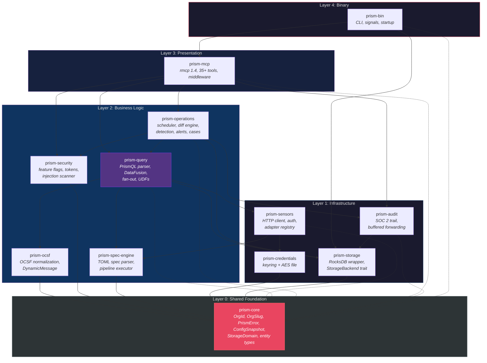
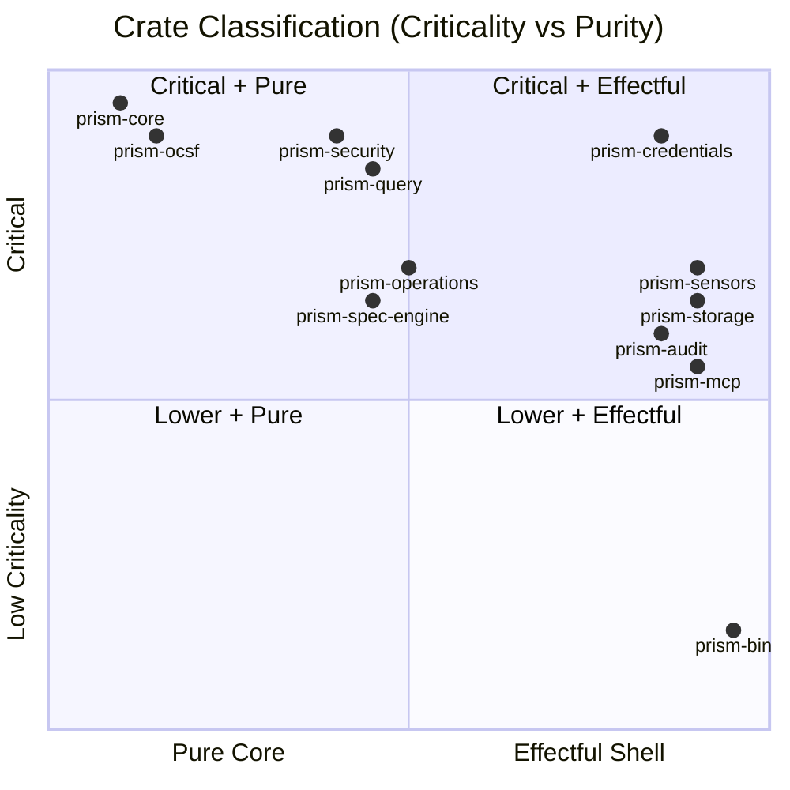

# Module Decomposition

## [Section Content]

## Cargo Workspace Structure

Prism is a Cargo workspace with 22 crates (11 non-DTU production/build-helper + 11 DTU test-only) organized in 4 layers: binary, application, domain, and infrastructure. Each crate has a single responsibility and explicit public API. The DTU crates (`prism-dtu-common` plus 10 per-surface sensor/action/infusion clones; log-forwarding clones are planned for future waves) are dev-dependencies only, gated with `#[cfg(any(test, feature = "dtu"))]`, and never compiled into the production binary.

```
prism/
  Cargo.toml          (workspace root)
  prism-bin/           (binary crate — main entry point)
  prism-mcp/           (MCP server, tool registration, routing)
  prism-query/         (PrismQL parser + DataFusion query engine)
  prism-sensors/       (sensor adapter orchestration, auth traits)
  prism-spec-engine/   (TOML spec parser, pipeline executor)
  prism-ocsf/          (OCSF normalization via DynamicMessage)
  prism-operations/    (scheduler, differential, detection, alerts, cases)
  prism-security/      (feature flags, confirmation tokens, prompt injection)
  prism-credentials/   (credential store trait, keyring + file backends)
  prism-storage/       (RocksDB wrapper, StorageDomain, StorageBackend trait)
  prism-audit/         (audit entry construction, buffered forwarding)
  prism-core/          (shared types, errors, OrgId, OrgSlug, config, decorators)
  --- DTU crates (dev-dependencies only; not compiled into production binary) ---
  prism-dtu-common/         (shared DTU test infrastructure — LatencyLayer, FailureLayer, fixture loader, BehavioralClone trait, SyslogReceiver, WebhookReceiver)
  --- Sensor DTU clones ---
  prism-dtu-crowdstrike/    (behavioral DTU clone for CrowdStrike API — L4 (adversarial); depends on prism-dtu-common)
  prism-dtu-claroty/        (behavioral DTU clone for Claroty xDome API — L4 (adversarial); depends on prism-dtu-common)
  prism-dtu-cyberint/       (behavioral DTU clone for Cyberint API — L2 (stateful); depends on prism-dtu-common)
  prism-dtu-armis/          (behavioral DTU clone for Armis API — L2 (stateful); depends on prism-dtu-common)
  --- Action DTU clones ---
  prism-dtu-slack/          (behavioral DTU clone for Slack webhook API — L2 (stateful); depends on prism-dtu-common)
  prism-dtu-pagerduty/      (behavioral DTU clone for PagerDuty Events API v2 — L3 (behavioral); depends on prism-dtu-common)
  prism-dtu-jira/           (behavioral DTU clone for Jira REST API v3 — L3 (behavioral); depends on prism-dtu-common)
  --- Infusion DTU clones ---
  prism-dtu-threatintel/    (behavioral DTU clone for threat-intel aggregator — L2 (stateful); depends on prism-dtu-common)
  prism-dtu-nvd/            (behavioral DTU clone for NVD/NIST CVSS API — L2 (stateful); depends on prism-dtu-common)
  --- Log-forwarding DTU clones (planned — not yet in Cargo.toml) ---
  prism-dtu-datadog/        (behavioral DTU clone for Datadog Logs API — L2 (stateful); depends on prism-dtu-common) [planned]
  prism-dtu-splunk-hec/     (behavioral DTU clone for Splunk HTTP Event Collector — L2 (stateful); depends on prism-dtu-common) [planned]
  prism-dtu-elasticsearch/  (behavioral DTU clone for Elasticsearch Bulk API — L2 (stateful); depends on prism-dtu-common) [planned]
  prism-dtu-otlp/           (behavioral DTU clone for OTLP/HTTP log ingestion — L2 (stateful); depends on prism-dtu-common) [planned]
```

## Layered Architecture Diagram



## Crate Criticality & Purity



## Component Map (Machine-Readable)

```yaml
components:
  - id: COMP-001
    name: "prism-bin"
    layer: "infrastructure"
    purity: "effectful-shell"
    criticality: "LOW"
    dependencies: [COMP-002, COMP-010, COMP-012]
    interfaces_provided: ["main() entry point", "CLI argument parsing", "signal handling"]
    interfaces_consumed: ["PrismServer from prism-mcp", "Storage from prism-storage", "Config from prism-core"]

  - id: COMP-002
    name: "prism-mcp"
    layer: "presentation"
    purity: "effectful-shell"
    criticality: "HIGH"
    dependencies: [COMP-003, COMP-008, COMP-009, COMP-011, COMP-012, COMP-007]
    interfaces_provided: ["PrismServer (rmcp ServerHandler)", "Tool registration", "MCP resources/prompts"]
    interfaces_consumed: ["QueryEngine", "FeatureFlagEvaluator", "CredentialStore", "AuditEmitter", "ConfigSnapshot"]

  - id: COMP-003
    name: "prism-query"
    layer: "business-logic"
    purity: "mixed"
    criticality: "CRITICAL"
    dependencies: [COMP-004, COMP-005, COMP-006, COMP-010, COMP-012]
    interfaces_provided: ["QueryEngine::execute()", "QueryEngine::execute_scheduled() -> (results, SessionContext)", "QueryEngine::explain()", "PrismQL parser", "UDF registry", "Infusion UDF registration"]
    interfaces_consumed: ["SensorAdapter", "SpecEngine", "OcsfNormalizer", "StorageBackend", "ConfigSnapshot", "InfusionRegistry"]

  - id: COMP-004
    name: "prism-sensors"
    layer: "infrastructure"
    purity: "effectful-shell"
    criticality: "HIGH"
    dependencies: [COMP-005, COMP-009, COMP-012]
    interfaces_provided: ["SensorAdapter trait", "SensorAuth sealed trait", "AdapterRegistry"]
    interfaces_consumed: ["SpecEngine", "CredentialStore", "ConfigSnapshot"]

  - id: COMP-005
    name: "prism-spec-engine"
    layer: "business-logic"
    purity: "mixed"
    criticality: "HIGH"
    dependencies: [COMP-012]
    interfaces_provided: ["SpecParser", "PipelineExecutor", "ConfigManager (arc-swap)", "PluginRuntime (wasmtime)", "InfusionRegistry", "InfusionPluginExecutor"]
    interfaces_consumed: ["ConfigSnapshot"]
    notes: "Owns WASM plugin runtime (AD-019), infusion spec loading + plugin execution (AD-020), sensor spec loading. Infusion UDFs are registered into prism-query's DataFusion SessionContext via InfusionRegistry."

  - id: COMP-006
    name: "prism-ocsf"
    layer: "business-logic"
    purity: "pure-core"
    criticality: "CRITICAL"
    dependencies: [COMP-012]
    interfaces_provided: ["OcsfNormalizer", "DynamicMessage", "FieldResolver", "EventClassSelector"]
    interfaces_consumed: ["OcsfSchema (compiled protobuf descriptors)"]

  - id: COMP-007
    name: "prism-operations"
    layer: "business-logic"
    purity: "mixed"
    criticality: "HIGH"
    dependencies: [COMP-003, COMP-005, COMP-008, COMP-010, COMP-011, COMP-012]
    interfaces_provided: ["Scheduler", "DiffEngine", "DetectionEngine", "AlertStore", "CaseManager", "ActionEngine"]
    interfaces_consumed: ["QueryEngine", "StorageBackend", "ConfigSnapshot", "InjectionScanner", "AuditEmitter", "PluginRuntime"]
    notes: "Owns action delivery (AD-021) — ActionEngine evaluates action specs against alerts/cases/schedules, renders templates, delivers via built-in types or WASM plugins. Action report queries execute through QueryEngine."

  - id: COMP-008
    name: "prism-security"
    layer: "business-logic"
    purity: "mixed"
    criticality: "CRITICAL"
    dependencies: [COMP-012]
    interfaces_provided: ["FeatureFlagEvaluator", "ConfirmationTokenStore", "PromptInjectionScanner", "SafetyFlagAggregator"]
    interfaces_consumed: ["ConfigSnapshot"]

  - id: COMP-009
    name: "prism-credentials"
    layer: "infrastructure"
    purity: "effectful-shell"
    criticality: "CRITICAL"
    dependencies: [COMP-012]
    interfaces_provided: ["CredentialStore trait", "KeyringBackend", "EncryptedFileBackend"]
    interfaces_consumed: ["OrgId", "OrgSlug", "error types"]

  - id: COMP-010
    name: "prism-storage"
    layer: "infrastructure"
    purity: "effectful-shell"
    criticality: "HIGH"
    dependencies: [COMP-012]
    interfaces_provided: ["StorageBackend trait", "RocksDbBackend", "InMemoryBackend (tests)"]
    interfaces_consumed: ["error types"]

  - id: COMP-011
    name: "prism-audit"
    layer: "infrastructure"
    purity: "effectful-shell"
    criticality: "HIGH"
    dependencies: [COMP-010, COMP-012]
    interfaces_provided: ["AuditEmitter", "BufferedForwarder", "AuditEntry construction"]
    interfaces_consumed: ["StorageBackend", "tracing subscriber"]

  - id: COMP-012
    name: "prism-core"
    layer: "shared"
    purity: "pure-core"
    criticality: "CRITICAL"
    dependencies: []
    interfaces_provided: ["OrgId", "OrgSlug", "PrismError", "ConfigSnapshot", "StorageDomain enum", "ColumnOptions", "entity types", "decorator types"]
    interfaces_consumed: []

  # DTU crates — test-only, never in production binary
  # NOTE: COMP-DTU-005 (prism-dtu-common) is placed first despite its higher ID number because
  # it is the foundational shared-infrastructure crate on which all 13 per-surface DTU crates
  # depend. Renumbering to COMP-DTU-000 was rejected to avoid breaking references in dtu-assessment.md,
  # story frontmatter (S-6.06), and VP traceability. The ordering here reflects dependency precedence,
  # not ID sequence.
  - id: COMP-DTU-005
    name: "prism-dtu-common"
    layer: "test-infrastructure"
    purity: "effectful-shell"
    criticality: "LOW"
    gate: "#[cfg(any(test, feature = \"dtu\"))]"
    fidelity: "N/A (shared harness, not a clone itself)"
    owned_bcs: "none (infrastructure only)"
    dependencies: [axum, tokio, tower, serde]
    interfaces_provided: ["LatencyLayer (tower middleware)", "FailureLayer (tower middleware)", "fixture_loader()", "BehavioralClone trait", "SyslogReceiver (RFC 5424 UDP+TCP)", "WebhookReceiver (generic HTTP receiver)"]
    interfaces_consumed: []
    notes: "Shared test infrastructure consumed by all 13 per-surface DTU crates. Provides tower middleware layers for latency simulation and failure injection, a JSON fixture loader, the BehavioralClone trait that each per-surface crate implements (e.g., impl BehavioralClone for CrowdStrikeDTU), a generic RFC 5424 syslog receiver (SyslogReceiver, covering syslog action and log-forward syslog tests), and a generic HTTP POST capture server (WebhookReceiver, covering webhook action and generic forwarder tests). Dev-dependency only; never compiled into production binary."

  - id: COMP-DTU-001
    name: "prism-dtu-crowdstrike"
    layer: "test-infrastructure"
    purity: "effectful-shell"
    criticality: "LOW"
    gate: "#[cfg(any(test, feature = \"dtu\"))]"
    fidelity: "L4 (adversarial)"
    dependencies: [COMP-DTU-005, axum, tokio, serde_json]
    interfaces_provided: ["CrowdStrikeApiServer (Axum router)", "failure injection hooks", "stateful detection/alert lifecycle", "impl BehavioralClone for CrowdStrikeDTU"]
    interfaces_consumed: ["BehavioralClone trait (prism-dtu-common)", "LatencyLayer, FailureLayer (prism-dtu-common)", "fixture_loader (prism-dtu-common)"]
    notes: "Implements full CrowdStrike API surface at L4 (adversarial) fidelity per dtu-assessment.md §4. Used by integration tests in prism-sensors and prism-operations. Depends on prism-dtu-common for shared infrastructure. Linked as dev-dependency only. reqwest removed: the DTU is a pure Axum server (receives requests, never sends outbound HTTP). The OAuth2 token endpoint is served by the DTU itself; Prism is the HTTP client. No outbound calls originate from this crate."

  - id: COMP-DTU-002
    name: "prism-dtu-claroty"
    layer: "test-infrastructure"
    purity: "effectful-shell"
    criticality: "LOW"
    gate: "#[cfg(any(test, feature = \"dtu\"))]"
    fidelity: "L4 (adversarial)"
    dependencies: [COMP-DTU-005, axum, tokio, serde_json]
    interfaces_provided: ["ClarotyApiServer (Axum router)", "stateful xDome asset/alert lifecycle", "impl BehavioralClone for ClarotyDTU"]
    interfaces_consumed: ["BehavioralClone trait (prism-dtu-common)", "LatencyLayer, FailureLayer (prism-dtu-common)", "fixture_loader (prism-dtu-common)"]
    notes: "L4 (adversarial) clone for Claroty xDome API (re-classified from L2 in Burst 5.5a — see dtu-assessment.md §3.2). Implements adversarial-grade error injection and stateful write paths per S-6.08. Depends on prism-dtu-common for shared infrastructure. Dev-dependency only."

  - id: COMP-DTU-003
    name: "prism-dtu-cyberint"
    layer: "test-infrastructure"
    purity: "effectful-shell"
    criticality: "LOW"
    gate: "#[cfg(any(test, feature = \"dtu\"))]"
    fidelity: "L2 (stateful)"
    dependencies: [COMP-DTU-005, axum, tokio, serde_json]
    interfaces_provided: ["CyberintApiServer (Axum router)", "cookie-auth simulation", "stateful alert lifecycle", "impl BehavioralClone for CyberintDTU"]
    interfaces_consumed: ["BehavioralClone trait (prism-dtu-common)", "LatencyLayer, FailureLayer (prism-dtu-common)", "fixture_loader (prism-dtu-common)"]
    notes: "Stateful CRUD clone including cookie-roundtrip auth simulation. Depends on prism-dtu-common for shared infrastructure. Dev-dependency only."

  - id: COMP-DTU-004
    name: "prism-dtu-armis"
    layer: "test-infrastructure"
    purity: "effectful-shell"
    criticality: "LOW"
    gate: "#[cfg(any(test, feature = \"dtu\"))]"
    fidelity: "L2 (stateful)"
    dependencies: [COMP-DTU-005, axum, tokio, serde_json]
    interfaces_provided: ["ArmisApiServer (Axum router)", "AQL query pass-through", "stateful device/alert lifecycle", "impl BehavioralClone for ArmisDTU"]
    interfaces_consumed: ["BehavioralClone trait (prism-dtu-common)", "LatencyLayer, FailureLayer (prism-dtu-common)", "fixture_loader (prism-dtu-common)"]
    notes: "Stateful CRUD clone for Armis API including AQL forwarding. Depends on prism-dtu-common for shared infrastructure. Dev-dependency only."

  # Actions DTU crates
  - id: COMP-DTU-006
    name: "prism-dtu-slack"
    layer: "test-infrastructure"
    purity: "effectful-shell"
    criticality: "LOW"
    gate: "#[cfg(any(test, feature = \"dtu\"))]"
    fidelity: "L2 (stateful)"
    category: "action"
    real_service: "hooks.slack.com"
    dependencies: [COMP-DTU-005, axum, tokio, serde_json]
    interfaces_provided: ["SlackWebhookServer (Axum router)", "Block Kit payload validation", "rate-limit simulation", "received_payloads() test API", "impl BehavioralClone for SlackDTU"]
    interfaces_consumed: ["BehavioralClone trait (prism-dtu-common)", "LatencyLayer, FailureLayer (prism-dtu-common)", "fixture_loader (prism-dtu-common)"]
    notes: "Webhook receiver clone for Slack incoming webhooks. Validates Block Kit payload shape, simulates 429 with Retry-After, captures received payloads for test assertion. Dev-dependency only."

  - id: COMP-DTU-007
    name: "prism-dtu-pagerduty"
    layer: "test-infrastructure"
    purity: "effectful-shell"
    criticality: "LOW"
    gate: "#[cfg(any(test, feature = \"dtu\"))]"
    fidelity: "L3 (behavioral)"
    category: "action"
    real_service: "events.pagerduty.com/v2/enqueue"
    dependencies: [COMP-DTU-005, axum, tokio, serde_json]
    interfaces_provided: ["PagerDutyEventsServer (Axum router)", "stateful incident lifecycle (trigger→ack→resolve)", "dedup key tracking", "incidents() test API", "impl BehavioralClone for PagerDutyDTU"]
    interfaces_consumed: ["BehavioralClone trait (prism-dtu-common)", "LatencyLayer, FailureLayer (prism-dtu-common)", "fixture_loader (prism-dtu-common)"]
    notes: "Stateful behavioral clone for PagerDuty Events API v2. Full incident lifecycle (trigger→acknowledge→resolve) with dedup key tracking. L3 fidelity — models state machine transitions, not just schema. Dev-dependency only."

  - id: COMP-DTU-008
    name: "prism-dtu-jira"
    layer: "test-infrastructure"
    purity: "effectful-shell"
    criticality: "LOW"
    gate: "#[cfg(any(test, feature = \"dtu\"))]"
    fidelity: "L3 (behavioral)"
    category: "action"
    real_service: "Jira Cloud REST API v3 ({tenant}.atlassian.net)"
    dependencies: [COMP-DTU-005, axum, tokio, serde_json]
    interfaces_provided: ["JiraApiServer (Axum router)", "stateful issue lifecycle (Open→In Progress→Done)", "comment history", "issues() test API", "impl BehavioralClone for JiraDTU"]
    interfaces_consumed: ["BehavioralClone trait (prism-dtu-common)", "LatencyLayer, FailureLayer (prism-dtu-common)", "fixture_loader (prism-dtu-common)"]
    notes: "Stateful behavioral clone for Jira REST API v3. Full issue status machine with field validation and comment tracking. L3 fidelity — models Jira's transition constraints. Basic auth primary; OAuth fixture optional. Dev-dependency only."

  # Infusion DTU crates
  - id: COMP-DTU-009
    name: "prism-dtu-threatintel"
    layer: "test-infrastructure"
    purity: "effectful-shell"
    criticality: "LOW"
    gate: "#[cfg(any(test, feature = \"dtu\"))]"
    fidelity: "L2 (stateful)"
    category: "infusion"
    real_service: "GreyNoise API v3 (primary); VirusTotal + AbuseIPDB (secondary fixtures)"
    dependencies: [COMP-DTU-005, axum, tokio, serde_json]
    interfaces_provided: ["ThreatIntelServer (Axum router)", "IP/domain/hash lookup endpoints", "multi-source aggregated response shape", "rate-limit simulation", "fixture registry configurable via POST /dtu/configure", "impl BehavioralClone for ThreatIntelDTU"]
    interfaces_consumed: ["BehavioralClone trait (prism-dtu-common)", "LatencyLayer, FailureLayer (prism-dtu-common)", "fixture_loader (prism-dtu-common)"]
    notes: "Models the GreyNoise-primary multi-provider threat-intel aggregator plugin output. Returns unified threat_score + threat_sources + threat_is_known_malicious shape. Fixture registry pre-loaded with malicious/benign/unknown IP test cases. Dev-dependency only."

  - id: COMP-DTU-010
    name: "prism-dtu-nvd"
    layer: "test-infrastructure"
    purity: "effectful-shell"
    criticality: "LOW"
    gate: "#[cfg(any(test, feature = \"dtu\"))]"
    fidelity: "L2 (stateful)"
    category: "infusion"
    real_service: "services.nvd.nist.gov/rest/json/cves/2.0"
    dependencies: [COMP-DTU-005, axum, tokio, serde_json]
    interfaces_provided: ["NvdApiServer (Axum router)", "CVE fetch (single + bulk)", "rate-limit buckets (authenticated 50/30s + unauthenticated 5/30s)", "cache-miss validation via request counter", "impl BehavioralClone for NvdDTU"]
    interfaces_consumed: ["BehavioralClone trait (prism-dtu-common)", "LatencyLayer, FailureLayer (prism-dtu-common)", "fixture_loader (prism-dtu-common)"]
    notes: "NVD API 2.0 clone with CVSS v3.1 fixture CVEs and dual rate-limit buckets (authed/unauthed). Request counter per CVE enables assertion that Prism's infusion_cache CF prevents duplicate API calls. Dev-dependency only."

  # Log-forwarding DTU crates
  - id: COMP-DTU-011
    name: "prism-dtu-datadog"
    layer: "test-infrastructure"
    purity: "effectful-shell"
    criticality: "LOW"
    gate: "#[cfg(any(test, feature = \"dtu\"))]"
    fidelity: "L2 (stateful)"
    category: "log-forwarding"
    real_service: "http-intake.logs.datadoghq.com/api/v2/logs"
    dependencies: [COMP-DTU-005, axum, tokio, serde_json]
    interfaces_provided: ["DatadogLogsServer (Axum router)", "batched log ingestion endpoint", "DD-API-KEY validation", "413/429 simulation", "received_logs() test API", "impl BehavioralClone for DatadogDTU"]
    interfaces_consumed: ["BehavioralClone trait (prism-dtu-common)", "LatencyLayer, FailureLayer (prism-dtu-common)", "fixture_loader (prism-dtu-common)"]
    notes: "Datadog Logs API v2 clone. Validates DD-API-KEY header, accepts JSON log batches, simulates 413 (oversized batch) and 429 (rate limit). Captured logs accessible via test API. Dev-dependency only."

  - id: COMP-DTU-012
    name: "prism-dtu-splunk-hec"
    layer: "test-infrastructure"
    purity: "effectful-shell"
    criticality: "LOW"
    gate: "#[cfg(any(test, feature = \"dtu\"))]"
    fidelity: "L2 (stateful)"
    category: "log-forwarding"
    real_service: "Splunk HEC :{8088}/services/collector"
    dependencies: [COMP-DTU-005, axum, tokio, serde_json]
    interfaces_provided: ["SplunkHecServer (Axum router)", "HEC event + raw endpoints", "Splunk token auth", "index/sourcetype routing capture", "HEC response codes (0=success, 6=invalid format)", "received_events() test API", "impl BehavioralClone for SplunkHecDTU"]
    interfaces_consumed: ["BehavioralClone trait (prism-dtu-common)", "LatencyLayer, FailureLayer (prism-dtu-common)", "fixture_loader (prism-dtu-common)"]
    notes: "Splunk HEC clone. Validates Authorization: Splunk {token} header, parses newline-delimited JSON event batches, returns HEC response code structure. Index and sourcetype captured for test assertion. Dev-dependency only."

  - id: COMP-DTU-013
    name: "prism-dtu-elasticsearch"
    layer: "test-infrastructure"
    purity: "effectful-shell"
    criticality: "LOW"
    gate: "#[cfg(any(test, feature = \"dtu\"))]"
    fidelity: "L2 (stateful)"
    category: "log-forwarding"
    real_service: "Elasticsearch 8.x /{index}/_bulk"
    dependencies: [COMP-DTU-005, axum, tokio, serde_json]
    interfaces_provided: ["ElasticsearchBulkServer (Axum router)", "NDJSON bulk parsing", "index auto-create semantics", "partial failure responses (errors:true)", "mapping conflict simulation", "received_documents(index) test API", "impl BehavioralClone for ElasticsearchDTU"]
    interfaces_consumed: ["BehavioralClone trait (prism-dtu-common)", "LatencyLayer, FailureLayer (prism-dtu-common)", "fixture_loader (prism-dtu-common)"]
    notes: "Elasticsearch Bulk API clone. Parses NDJSON action+document pairs, tracks per-index implied mapping, can return partial failure responses (200 OK with errors:true) to exercise Prism's bulk error handling. Dev-dependency only."

  - id: COMP-DTU-014
    name: "prism-dtu-otlp"
    layer: "test-infrastructure"
    purity: "effectful-shell"
    criticality: "LOW"
    gate: "#[cfg(any(test, feature = \"dtu\"))]"
    fidelity: "L2 (stateful)"
    category: "log-forwarding"
    real_service: "OpenTelemetry Collector /v1/logs (OTLP/HTTP)"
    dependencies: [COMP-DTU-005, axum, tokio, prost, serde_json]
    interfaces_provided: ["OtlpHttpServer (Axum router)", "protobuf ExportLogsServiceRequest parsing", "JSON fallback", "400/429/503 simulation", "received_requests() test API", "impl BehavioralClone for OtlpDTU"]
    interfaces_consumed: ["BehavioralClone trait (prism-dtu-common)", "LatencyLayer, FailureLayer (prism-dtu-common)", "fixture_loader (prism-dtu-common)"]
    notes: "OTLP/HTTP log collector clone. Accepts protobuf-encoded ExportLogsServiceRequest (Content-Type: application/x-protobuf) and JSON fallback. OTLP schema pinned to opentelemetry-proto version matching Prism's forwarder. gRPC deferred. Dev-dependency only."
```

## Crate Responsibilities

| Crate | Subsystems | BC Count | Key Exports |
|-------|-----------|----------|-------------|
| prism-core | (shared) | — | OrgId, OrgSlug, PrismError, ConfigSnapshot, entity types, decorator types |
| prism-mcp | SS-10, SS-06, SS-08, SS-20 | 35 | PrismServer, tool dispatch, resource/prompt handlers, config tool surface, health probe tools |
| prism-query | SS-11, SS-07 (partial) | 21 | QueryEngine, PrismQlParser, AliasResolver, UdfRegistry |
| prism-sensors | SS-01, SS-08 (partial) | 9 | SensorAdapter, SensorAuth, AdapterRegistry, health probe impl |
| prism-spec-engine | SS-16, SS-17, SS-19 | 21 | SpecParser, PipelineExecutor, ConfigManager, PluginRuntime, InfusionRegistry |
| prism-ocsf | SS-02 | 12 | OcsfNormalizer, DynamicMessage, FieldResolver |
| prism-operations | SS-12, SS-13, SS-14, SS-18 | 45 | Scheduler, DiffEngine, DetectionEngine, AlertStore, CaseManager, ActionEngine |
| prism-security | SS-04, SS-09 | 23 | FeatureFlagEvaluator, TokenStore, InjectionScanner |
| prism-credentials | SS-03 | 12 | CredentialStore, KeyringBackend, FileBackend |
| prism-storage | SS-15 (partial) | 11 | StorageBackend, RocksDbBackend, InMemoryBackend |
| prism-audit | SS-05 | 11 | AuditEmitter, BufferedForwarder |
| prism-bin | — | — | main(), CLI, signal handling, startup orchestration |
| **DTU crates (dev-dependencies only — 11 in workspace; log-forwarding clones planned for future waves)** | | | |
| prism-dtu-common | (test infra) | — | BehavioralClone trait, LatencyLayer, FailureLayer, fixture_loader, SyslogReceiver, WebhookReceiver |
| **Sensor DTU clones** | | | |
| prism-dtu-crowdstrike | (test — sensor) | — | CrowdStrikeApiServer, L4 (adversarial) behavioral clone |
| prism-dtu-claroty | (test — sensor) | — | ClarotyApiServer, L4 (adversarial) behavioral clone |
| prism-dtu-cyberint | (test — sensor) | — | CyberintApiServer, L2 (stateful) behavioral clone |
| prism-dtu-armis | (test — sensor) | — | ArmisApiServer, L2 (stateful) behavioral clone |
| **Action DTU clones** | | | |
| prism-dtu-slack | (test — action) | — | SlackWebhookServer, L2 (stateful); Block Kit validation, 429 simulation |
| prism-dtu-pagerduty | (test — action) | — | PagerDutyEventsServer, L3 (behavioral); incident lifecycle (trigger→ack→resolve) |
| prism-dtu-jira | (test — action) | — | JiraApiServer, L3 (behavioral); issue status machine, comment history |
| **Infusion DTU clones** | | | |
| prism-dtu-threatintel | (test — infusion) | — | ThreatIntelServer, L2 (stateful); IP/domain/hash lookup, multi-source score shape |
| prism-dtu-nvd | (test — infusion) | — | NvdApiServer, L2 (stateful); CVE fetch, rate-limit buckets, request counter |
| **Log-forwarding DTU clones** | | | |
| prism-dtu-datadog | (test — log-fwd, planned) | — | DatadogLogsServer, L2 (stateful); batched ingestion, API key auth, 413/429 |
| prism-dtu-splunk-hec | (test — log-fwd, planned) | — | SplunkHecServer, L2 (stateful); HEC event+raw, token auth, HEC response codes |
| prism-dtu-elasticsearch | (test — log-fwd, planned) | — | ElasticsearchBulkServer, L2 (stateful); NDJSON bulk, partial failure responses |
| prism-dtu-otlp | (test — log-fwd, planned) | — | OtlpHttpServer, L2 (stateful); OTLP/HTTP protobuf, 400/429/503 simulation |

> **Note (BC counts):** prism-operations row assumes PO CRIT-001 fix applied (SS-12=10 active BCs). Raw sum: SS-12=10 + SS-13=14 + SS-14=12 + SS-18=9 = 45. prism-spec-engine sum: SS-16=10 + SS-17=6 + SS-19=5 = 21. prism-mcp sum: SS-10=11 + SS-06=10 + SS-08=9 + SS-20=5 = 35. prism-security sum: SS-04=15 + SS-09=8 = 23. SS-20 (Observability / Log Forwarding) now has 5 BCs (BC-2.20.001..005) anchored to CAP-035, introduced via pass-80 F80-002 remediation. Grand total across 11 production crates: 35+21+9+21+12+45+23+12+11+11 = 200 active Phase 1-2 BCs (BC-INDEX v4.23 active_contracts = 222 including Wave 3 additions).

## Changelog

| Version | Pass | Date | Author | Change |
|---------|------|------|--------|--------|
| 1.5 | pass-15-remediation | 2026-04-27 | product-owner | m-15-001: COMP-009 prism-credentials interfaces_consumed updated ["TenantId", "error types"] → ["OrgId", "OrgSlug", "error types"] per ADR-006 Wave 3 rename. |
| 1.4 | pass-14-remediation | 2026-04-27 | product-owner | M-14-003: BC counts footnote updated — "10 production crates" corrected to "11 production crates"; BC-INDEX version reference updated v4.12 → v4.23; log-forwarding DTU table rows marked (planned). M-14-004: TenantId references updated to OrgId/OrgSlug throughout — opening paragraph, Mermaid L0 node, COMP-012 interfaces_provided, and Crate Responsibilities table. |
| 1.3 | pass-13-remediation | 2026-04-27 | product-owner | M-001/Audit-G: opening paragraph updated — "12 production crates plus 14 test-only" corrected to "22 crates (11 non-DTU production/build-helper + 11 DTU test-only)"; "13 per-surface crates" corrected to "10 per-surface" (log-forwarding DTUs planned for future waves, not yet in Cargo.toml). Crate Responsibilities table "14 total" note updated. |
| 1.2 | pass-82 | 2026-04-21 | architect | F82-002+F82-003: corrected prism-mcp BC count 33→35 (SS-10=11, SS-06=10); corrected prism-security BC count 22→23 (SS-04=15, SS-09=8); updated BC counts footnote with correct per-crate arithmetic and grand total 200. |
| 1.1 | pass-81 | 2026-04-21 | architect | F81-002: updated prism-mcp BC count 28→33 (SS-20=5); updated BC counts note; added ## [Section Content] section header for template compliance. |
| 1.0 | pass-15 | 2026-04-15 | architect | Initial version |
