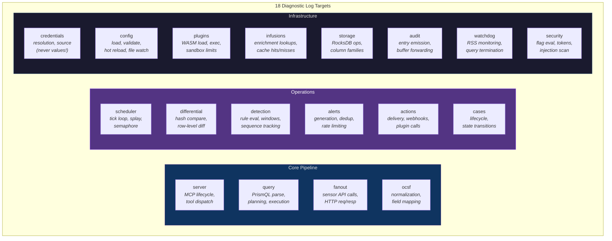

# Observability — Diagnostic Logging & Debugging

## Overview

Prism has two logging systems serving different purposes:

| System | Purpose | Destination | Consumer |
|--------|---------|-------------|----------|
| **Audit log** | SOC 2 compliance — what happened, who did it, when | RocksDB `audit_buffer` → external SIEM | Compliance, security review |
| **Diagnostic log** | Operational debugging — why did something happen (or not happen) | stderr → structured JSON or pretty-print | Analyst, operator, AI agent |

The audit log is covered in security-architecture.md. This document covers the diagnostic log.

## Subsystem Log Targets



### Per-Subsystem Log Levels

Each subsystem can be independently configured. Default is `info` for all.

```toml
# prism.toml
[server]
log_level = "info"                       # Global default

[server.log_targets]
# Override per-subsystem (any not listed uses global default)
server = "info"
query = "info"
fanout = "warn"                          # Noisy at info — only errors/warnings
ocsf = "warn"
scheduler = "info"
differential = "info"
detection = "info"
alerts = "info"
actions = "info"
cases = "info"
credentials = "warn"                     # Sensitive — only errors
config = "info"
plugins = "info"
infusions = "info"
storage = "warn"                         # Noisy at info
audit = "warn"
watchdog = "info"
security = "info"
```

### What Each Level Provides

| Level | What you see | When to use |
|-------|-------------|-------------|
| **error** | Failures that stop an operation — query aborted, credential not found, plugin crash, RocksDB I/O failure | Production default for noisy subsystems |
| **warn** | Degraded behavior — rate limit hit, cache miss, stale detection state, config validation warning, partial sensor failure | Production default |
| **info** | Normal operations — query executed (timing + record count), schedule fired, detection evaluated (match/no-match), alert generated, action delivered, config reloaded | Production recommended |
| **debug** | Decision details — push-down classification per predicate, DataFusion plan, correlation window state, dedup key computation, credential source resolution path, WASM fuel consumption | Active debugging |
| **trace** | Full data flow — raw HTTP request/response bodies (redacted), Arrow schema details, RocksDB key/value sizes, every scheduler tick, every file watcher event | Development only (extremely verbose) |

### Subsystem Log Detail Reference

#### `detection` (most commonly debugged)

| Level | Log entries |
|-------|------------|
| error | Rule compilation failed, detection state corruption, RocksDB write failure |
| warn | Rate limit hit (alerts suppressed), group key evicted (LRU cap), correlation window expired with partial matches |
| **info** | Rule evaluated: `brute_force` against 8 records → 3 matches → threshold 5 not met (count: 3/5). Rule evaluated: `critical_severity` → 1 match → ALERT FIRED (alert_id: 019...) |
| debug | Correlation window state: rule=brute_force, group=10.0.1.50, window_start=10:00:00, events=[evt1,evt2,evt3], threshold=5, count=3. Compiled SQL: `WHERE activity_name = 'Authentication' AND status = 'Failure'`. Dedup key: (brute_force, hash(10.0.1.50), bucket_7) → not duplicate. |
| trace | Full differential RecordBatch schema. Per-row hash computation. Detection state RocksDB key encoding bytes. |

#### `scheduler`

| Level | Log entries |
|-------|------------|
| error | Schedule execution panic, semaphore poisoned |
| warn | Execution skipped (semaphore full), schedule overrun (execution took longer than interval), splay collision |
| **info** | Schedule fired: `cs_detections` for client `acme` (next_run: 10:05:03). Schedule skipped: `cs_detections` for `acme` (previous run in-flight). Tick: 12 schedules checked, 3 fired, 0 skipped. |
| debug | Splay offset computation: hash("acme","cs_detections")=0x7f3a → offset=14.7s. Epoch/counter: (4, 127). Semaphore state: 3/16 permits used. |
| trace | Every tick (1/second). Full schedule state dump. |

#### `fanout`

| Level | Log entries |
|-------|------------|
| error | HTTP connection failed, auth refresh failed, all retries exhausted |
| warn | HTTP 429 (rate limited), HTTP 503 (retry scheduled), partial failure (3/5 clients succeeded) |
| **info** | Fan-out: crowdstrike/acme → 47 records (234ms). Fan-out: armis/acme → 12 records (156ms). Total: 59 records from 2 sensors. |
| debug | Push-down filter: `?filter=severity:>=4&filter=created_timestamp:>1712744403`. HTTP request: GET /detects/queries/detects/v1 (headers redacted). Response: 200 OK, 1.2KB body. OAuth2 token refresh: new token valid until 10:25:03. |
| trace | Full HTTP request/response bodies (credential values redacted). Connection pool state. TLS handshake details. |

#### `actions`

| Level | Log entries |
|-------|------------|
| error | Delivery failed after max retries, plugin execution error, SMTP connection refused |
| warn | Rate limit suppressed (action: slack_soc, suppressed 3 alerts this hour), cooldown active, delivery retrying (attempt 2/5) |
| **info** | Action fired: `slack_soc_critical` for alert 019... → webhook 200 OK (145ms). Action fired: `jira_case_sync` for case 019... → ticket ACME-SEC-1234 created. Action skipped: `pagerduty_critical` filter didn't match (severity 4 < 5). |
| debug | Template rendering: title="Brute Force: 5+ failed logins from 10.0.1.50". Rate limit state: slack_soc=7/100 this hour, global=23/1000. Dedup window: hash=0x7f3a, last_seen=09:55:00, window=5m → not duplicate. |
| trace | Full rendered webhook body. Plugin fuel consumption. SMTP conversation. |

## Trace IDs

Every operation gets a trace ID that follows it through the entire pipeline. This lets you correlate a single scheduled query execution across all subsystems:

```
trace_id: 01905a7b-3f2a-7d4e-8b1c-9e0f2a3b4c5d

[INFO scheduler] Schedule fired: cs_detections for acme (trace: 01905a7b)
[INFO fanout] Fan-out: crowdstrike/acme → 47 records (234ms) (trace: 01905a7b)
[INFO ocsf] Normalized: 47 records → 47 OCSF events (trace: 01905a7b)
[INFO differential] Diff: 8 added, 3 removed (hash changed) (trace: 01905a7b)
[INFO detection] Rule brute_force: 3 matches, count 5/5 → ALERT FIRED (trace: 01905a7b)
[INFO alerts] Alert generated: 019... severity=high (trace: 01905a7b)
[INFO actions] Action slack_soc: webhook 200 OK (trace: 01905a7b)
```

The trace ID is:
- Generated at the start of each ad-hoc query or scheduled execution
- Propagated through every `tracing::Span` in the pipeline
- Included in the MCP response `_meta.trace_id` field
- Included in audit log entries
- Queryable via `prism logs --trace-id`

## CLI: `prism logs`

Query diagnostic logs without the AI. Logs are written to `{state_dir}/logs/` as rolling JSON files (configurable retention).

```bash
# Recent logs for a subsystem
prism logs --subsystem detection --since 1h

# Filter by client and rule
prism logs --subsystem detection --client acme --filter 'rule=brute_force'

# Follow a trace across all subsystems
prism logs --trace-id 01905a7b

# Tail live logs (like tail -f)
prism logs --follow --subsystem scheduler

# Show only errors/warnings
prism logs --level warn --since 24h

# Export for sharing with engineering
prism logs --since 1h --format json > diagnostics.json

# Search log content
prism logs --grep "rate limit" --since 6h

# Show config reload history
prism logs --subsystem config --filter 'event=reload' --since 24h
```

### Log Storage

```toml
# prism.toml
[server.log_storage]
enabled = true                           # Write diagnostic logs to disk
directory = "{state_dir}/logs"           # Default: ~/.prism/state/logs/
max_file_size_mb = 50                    # Rotate after 50 MB
max_files = 10                           # Keep last 10 rotated files (500 MB total)
format = "json"                          # json (machine-parseable) or pretty (human-readable)
```

Diagnostic logs are **separate from the audit log**. Audit goes to RocksDB `audit_buffer` (durable, SOC 2). Diagnostic logs go to rolling files (best-effort, debugging).

## MCP Tool: `get_diagnostics`

The AI can query diagnostic state to help troubleshoot issues:

```json
// AI calls: get_diagnostics(subsystem: "detection", client_id: "acme", since: "1h")
{
  "subsystem": "detection",
  "client": "acme",
  "period": "last 1h",
  "summary": {
    "rules_evaluated": 47,
    "rules_fired": 3,
    "alerts_generated": 3,
    "alerts_suppressed": 0,
    "rules_with_errors": 0
  },
  "rule_details": [
    {
      "rule_id": "brute_force",
      "evaluations": 12,
      "matches": 3,
      "fires": 1,
      "last_fire": "2026-04-15T10:00:03Z",
      "correlation_state": {
        "active_groups": 14,
        "largest_group": { "key": "10.0.1.50", "count": 5 }
      }
    },
    {
      "rule_id": "critical_severity",
      "evaluations": 12,
      "matches": 7,
      "fires": 2,
      "last_fire": "2026-04-15T09:45:01Z"
    }
  ],
  "recent_errors": [],
  "recent_warnings": [
    { "time": "09:30:00", "message": "Rate limit approaching for rule lateral_movement (87/100 this hour)" }
  ]
}
```

```json
// AI calls: get_diagnostics(subsystem: "scheduler")
{
  "subsystem": "scheduler",
  "summary": {
    "active_schedules": 12,
    "schedules_fired_last_hour": 144,
    "schedules_skipped_last_hour": 2,
    "semaphore_state": "3/16 permits in use",
    "overruns_last_hour": 0
  },
  "schedule_details": [
    {
      "name": "cs_detections",
      "client": "acme",
      "interval": "5m",
      "last_run": "2026-04-15T10:00:03Z",
      "next_run": "2026-04-15T10:05:03Z",
      "last_duration_ms": 1234,
      "status": "idle"
    }
  ],
  "recent_skips": [
    { "schedule": "armis_devices", "client": "globex", "reason": "semaphore_full", "time": "09:12:00" }
  ]
}
```

```json
// AI calls: get_diagnostics(subsystem: "config")
{
  "subsystem": "config",
  "last_reload": {
    "time": "2026-04-15T09:45:00Z",
    "source": "file_watch",
    "result": "success",
    "changes": ["sensors/crowdstrike.sensor.toml modified", "rules/global/brute_force.detect modified"],
    "duration_ms": 45
  },
  "config_sources": [
    { "name": "core", "repo": "git@github.com:1898co/prism-config-core.git", "last_sync": "09:40:00", "status": "synced" },
    { "name": "clients", "repo": "git@github.com:1898co/prism-config-clients.git", "last_sync": "09:40:00", "status": "synced" }
  ],
  "file_watcher": {
    "status": "active",
    "watched_directories": 6,
    "events_last_hour": 3
  },
  "validation_warnings": []
}
```

### Subsystems Available for `get_diagnostics`

| Subsystem | Key diagnostics returned |
|-----------|------------------------|
| `scheduler` | Active schedules, fire/skip counts, semaphore state, overruns, per-schedule timing |
| `detection` | Rule evaluation counts, match/fire/suppress counts, correlation window state, per-rule details |
| `actions` | Delivery success/failure counts, rate limit state, retry queue, per-action status |
| `config` | Last reload time/source/result, config source sync status, file watcher state, validation warnings |
| `plugins` | Loaded plugins, WASM compilation status, memory/fuel usage, per-plugin health |
| `infusions` | Loaded infusions, cache hit/miss rates, lookup counts, data file freshness |
| `credentials` | Per-client credential status (set/missing/source type — never values), resolution failures |
| `fanout` | Per-sensor request counts, latency percentiles, error rates, rate limit state |
| `watchdog` | Current RSS, per-query memory usage, denylist entries, recent terminations |
| `storage` | RocksDB column family sizes, compaction state, dirty bit count |

## MCP Resource: `prism://diagnostics`

A live diagnostic resource the AI can read for troubleshooting context:

```
prism://diagnostics/summary           # Overall health — errors, warnings, subsystem status
prism://diagnostics/{subsystem}       # Per-subsystem diagnostic state (same data as get_diagnostics tool)
prism://diagnostics/trace/{trace_id}  # Full trace of a specific operation across all subsystems
```

These are resource templates — the AI can read them proactively when the analyst reports an issue ("my rule isn't firing"), or the host application can load them when errors are detected.

## Common Debugging Workflows

### "Why isn't my detection rule firing?"

```
Analyst: "My brute force rule for Acme isn't detecting anything."

AI reads: prism://diagnostics/detection
AI calls: get_diagnostics(subsystem: "detection", client_id: "acme")

Possible diagnoses:
1. Rule not loaded → check config reload logs, validation errors
2. Rule loaded but filter doesn't match → show compiled SQL, recent differential records
3. Matches found but threshold not met → show correlation window count vs threshold
4. Threshold met but rate limited → show rate limit state
5. Threshold met but dedup suppressed → show dedup window
6. Schedule not running → check scheduler diagnostics
7. Schedule running but no differential → data hasn't changed since last check
8. Differential exists but empty → sensor API returned same results
```

### "Why is this query slow?"

```
AI calls: get_diagnostics(subsystem: "fanout")
AI calls: get_diagnostics(subsystem: "watchdog")

Possible diagnoses:
1. Sensor API slow (check per-sensor latency in fanout diagnostics)
2. Too many records materialized (check watchdog per-query memory)
3. Push-down not working (check query plan at debug level)
4. Memory pressure from concurrent queries (check watchdog RSS)
5. Rate limited by sensor API (check fanout rate limit state)
```

### "Config reload failed"

```
AI calls: get_diagnostics(subsystem: "config")

Shows: last reload source (file_watch or manual), validation errors per tier,
       which specific files failed, config source sync status
```

## External Log Forwarding (Optional)

Diagnostic logs can optionally be forwarded to external logging platforms. Forwarding is configured in `prism.toml` and supports multiple simultaneous destinations:

```toml
# prism.toml — external log forwarding (all optional)

# Forward to Datadog
[[server.log_forward]]
name = "datadog"
type = "datadog"
api_key = { source = "env", key = "DD_API_KEY" }
site = "datadoghq.com"                   # or datadoghq.eu, us3.datadoghq.com, etc.
service = "prism"
source = "prism-mcp"
tags = ["env:production", "team:soc"]
min_level = "warn"                       # Only forward warn+ to save costs
batch_size = 100
flush_interval_seconds = 10

# Forward to Splunk HEC
[[server.log_forward]]
name = "splunk"
type = "splunk_hec"
endpoint = "https://splunk.1898co.com:8088"
token = { source = "env", key = "SPLUNK_HEC_TOKEN" }
index = "prism_diagnostics"
sourcetype = "prism:diagnostic"
min_level = "info"

# Forward to Elastic / OpenSearch
[[server.log_forward]]
name = "elastic"
type = "elasticsearch"
endpoint = "https://elastic.1898co.com:9200"
index_pattern = "prism-logs-{date}"
username = { source = "env", key = "ELASTIC_USER" }
password = { source = "env", key = "ELASTIC_PASSWORD" }
min_level = "info"

# Forward to any OpenTelemetry-compatible collector
[[server.log_forward]]
name = "otel"
type = "otlp"
endpoint = "https://otel-collector.1898co.com:4317"
protocol = "grpc"                        # grpc or http
min_level = "info"

# Forward to generic webhook (custom destinations)
[[server.log_forward]]
name = "custom"
type = "webhook"
url = "https://logs.1898co.com/ingest"
method = "POST"
headers = [{ name = "Authorization", value = { source = "env", key = "LOG_API_KEY" } }]
content_type = "application/json"
min_level = "warn"
batch_size = 50
```

### Built-in Forwarder Types

| Type | Destination | Protocol | Notes |
|------|------------|----------|-------|
| `datadog` | Datadog Logs API | HTTPS | Uses DD API v2, automatic tagging |
| `splunk_hec` | Splunk HTTP Event Collector | HTTPS | HEC token auth, custom index/sourcetype |
| `elasticsearch` | Elasticsearch / OpenSearch | HTTPS | Index per day, basic auth or API key |
| `otlp` | OpenTelemetry Collector | gRPC or HTTP | OTLP log protocol, standard attributes |
| `webhook` | Any HTTP endpoint | HTTPS | Generic — body is JSON log batch |
| `syslog` | Syslog receiver | UDP/TCP/TLS | RFC 5424 or RFC 3164 format |
| `plugin` | `.prx` WASM plugin | WASM sandbox | Custom forwarding via polyglot plugin |

### Expandability via `.prx` Plugins

For destinations not covered by built-in types, log forwarding supports `.prx` WASM plugins using the same plugin system as sensors, infusions, and actions:

```toml
[[server.log_forward]]
name = "custom_siem"
type = "plugin"
plugin = "log_forward_custom.prx"
min_level = "info"

[server.log_forward.plugin_config]
endpoint = "https://custom-siem.example.com/api/logs"
format = "cef"
```

The plugin WIT interface for log forwarding:

```wit
// prism-log-forwarder-plugin.wit
package prism:log-forwarder-plugin@0.1.0;

interface log-forwarder {
    record log-entry {
        timestamp: string,
        level: string,
        subsystem: string,
        trace-id: option<string>,
        message: string,
        fields-json: string,
    }

    /// Receive a batch of log entries for forwarding
    forward-batch: func(entries: list<log-entry>) -> result<u32, string>;

    name: func() -> string;
    version: func() -> string;
}

/// Same host interface as sensor, infusion, and action plugins
interface host {
    record http-header { name: string, value: string }
    record http-response { status: u16, headers: list<http-header>, body: string }

    http-request: func(method: string, url: string, headers: list<http-header>, body: option<string>) -> http-response;
    log: func(level: log-level, message: string);
    get-config: func(key: string) -> option<string>;
    enum log-level { trace, debug, info, warn, error }
}
```

### Forwarding Guarantees

- **Best-effort delivery** — diagnostic log forwarding does not block query execution. If the external destination is unreachable, entries are dropped after retry exhaustion (3 attempts, exponential backoff).
- **No recursive forwarding** — log entries emitted by plugins via `host.log()` during a `forward-batch()` call are written to the local stderr/file sink ONLY — they are NOT re-enqueued for that plugin's forwarding queue. This prevents an infinite loop where forwarding failures generate error logs that are themselves forwarded.
- **Batched** — entries are batched (configurable `batch_size`, default 100) and flushed at configurable intervals (`flush_interval_seconds`, default 10). Per-forwarder in-memory batch queue is capped at 10 × `batch_size` (default 1,000 entries). Entries beyond the cap are dropped with a WARN. Maximum 5 concurrent forwarders (total memory: ~5 MB worst-case for all forwarder queues combined, accounted in the system-overview.md headroom budget).
- **Per-destination `min_level`** — each forwarder can set its own minimum level. Forward only `warn+` to expensive destinations (Datadog), full `info` to internal Splunk.
- **Credential safety** — forwarder credentials use the same AI-opaque reference model (AD-017). API keys are never in TOML values.
- **Independent of audit log** — diagnostic log forwarding is completely separate from the SOC 2 audit trail. Audit logs use the `[audit.forward]` config and have stronger durability guarantees (at-least-once via RocksDB buffer).

## Security Constraints on Diagnostic Logs

- **Credential values are NEVER logged** at any level — only `source_type` and `credential_name`
- **Sensor API response bodies** are logged only at `trace` level and are **redacted** (secrets, tokens, session cookies removed)
- **Alert template variables** from sensor data are logged with injection scanner flags
- **Diagnostic logs are NOT forwarded to the audit pipeline** — they are local debugging artifacts
- **`prism logs` CLI** does not expose diagnostic logs through MCP — it reads local files directly. The `get_diagnostics` MCP tool returns aggregated summaries, not raw log entries.
