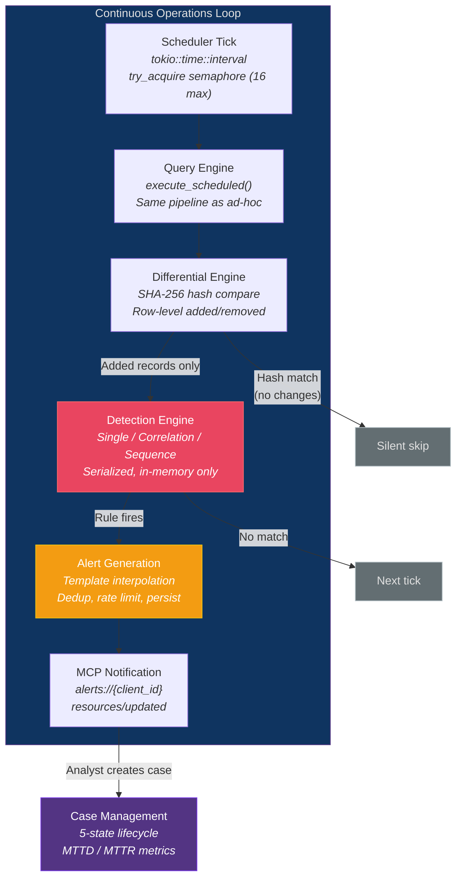
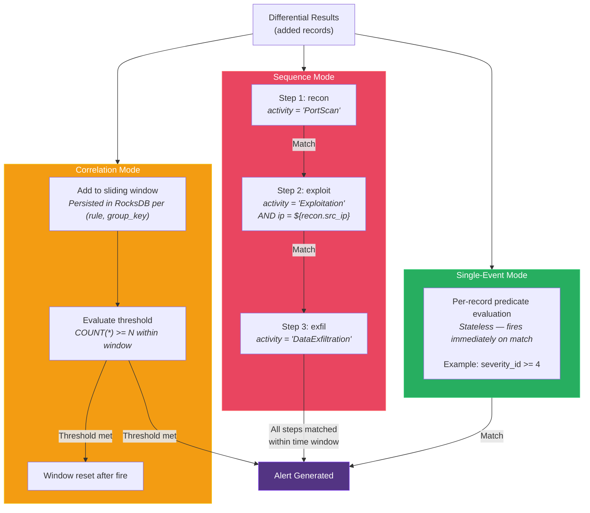
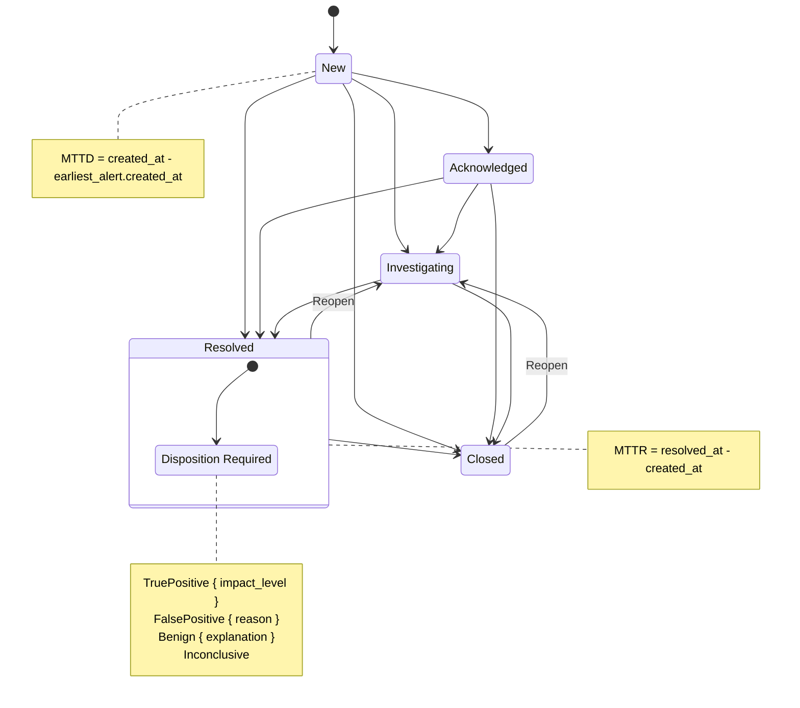

# Operational Pipeline

## Overview

Beyond ad-hoc queries, Prism provides a continuous operations loop: scheduled queries -> differential results -> detection evaluation -> alert generation -> case management. All operational components live in `prism-operations` and use `prism-query` (the query engine) as their data source.

## Detection Engine — Three Match Modes

## Case Management Lifecycle

## Scheduler

The scheduler operates on a tick-based loop using `tokio::time::interval`. Each tick:

1. Scan all active schedules
2. For each schedule where `now >= next_run`: check concurrency semaphore (max 16 concurrent)
3. If previous execution for same `(query, client)` is in-flight → skip (DEC-028)
4. Execute via standard query engine pipeline
5. Compute differential results
6. Run detection evaluation on differential output
7. Update schedule state in RocksDB (last_run, next_run, epoch, counter)

**Detection state on spec reload:** When `reload_config` changes a sensor spec's `table_name` or column schema, detection_state entries for rules whose `condition.source` references the changed table are not synchronously purged. Stale entries expire naturally via the 7-day eviction sweep. Stale group_by values harmlessly fail to match against the new schema's field names.

**Splay distribution:** `splay_offset = (interval * splay_percent / 100) * hash(client_id, schedule_name) / MAX_HASH`. Deterministic per `(query_name, client_id)`, persisted to RocksDB for stability across restarts.

**Time drift compensation:** If a tick runs late (e.g., system was busy), the next pause duration is shortened to compensate. Accumulated drift beyond 60s is dropped.

## Differential Results Engine

Per `(query_name, client_id)` pair, maintains in RocksDB:
- `previous_results_hash` — SHA-256 for fast change detection
- `previous_results` — bincode-serialized Arrow RecordBatch for row-level diff
- `epoch` / `counter` — exactly-once semantics

**Algorithm:**
1. Hash current results
2. Compare against stored hash → if equal, silent skip (no output)
3. If different, compute row-level diff using per-row hashes: identify added and removed records
4. Store current results as new previous state
5. Pass DiffResults.added to detection engine (removed records do not trigger detection rules)

Large diffs (10K+ new records) are truncated with analyst notification (DEC-029).

## Detection Engine

Three match modes evaluated against differential results:

### Single-Event Mode
Stateless per-record evaluation. Each new record from the differential is tested against the rule's PrismQL predicate. Fires immediately on match.

### Correlation Mode
Threshold over time window with group-by. New records are added to the persisted sliding window state (RocksDB `detection_state` domain). The full window is evaluated after each addition. Fires when threshold is met; resets window after fire.

### Sequence Mode
Ordered multi-event pattern matching. New records advance the persisted sequence tracker. The tracker maintains progress through the step list per group key. Fires when all steps are matched in order within the time window.

**Rule-to-SQL compilation:** Detection rule predicates are compiled to DataFusion WHERE clauses for push-down optimization. This allows the same DataFusion engine to evaluate both ad-hoc queries and detection rules.

**Rule scoping:** Global (MSSP baseline) → per-client (overrides/additions) → analyst-defined (ad-hoc, runtime). Per-client rules with the same `rule_id` override global rules.

## Alert Generation

When a detection rule fires:
1. Generate `alert_id` (UUID v7, time-sortable)
2. Render alert template with variable interpolation (4 resolution levels)
3. Check deduplication key (varies by match mode)
4. Persist to RocksDB `alerts` domain
5. Broadcast via `notifications/resources/updated` on `alerts://{client_id}` resource

**Deduplication keys by match mode:**
- Single-event: `(rule_id, event_uid)` — same event cannot trigger same rule twice
- Correlation: `(rule_id, group_by_value_hash, window_bucket)` — one alert per correlation window
- Sequence: `(rule_id, sequence_completion_hash)` — one alert per completed sequence

**RocksDB key encoding for detection_state:** Keys use length-prefixed encoding with a type tag byte: `[rule_id_len: u16][rule_id bytes][type_tag: u8][group_key bytes]`. Type tags:
- `\x00` = correlation/sequence group key (UTF-8 group_by values concatenated, or SHA-256 hash for keys > 128 bytes)
- `\x01` = rate limit entry (group_key bytes = ASCII `rate_limit`)
- `\x02` = dedup entry (group_key bytes = dedup key hash)

The type tag byte prevents collision between group keys and sentinel entries regardless of whether the group_key is UTF-8 or a SHA-256 hash (both use type `\x00`, while rate limit uses `\x01`). No two entry types share the same type tag prefix.

## Case Management

5-state lifecycle: New -> Acknowledged -> Investigating -> Resolved -> Closed.

12 valid transitions: 4 forward linear, 6 skip-ahead, 2 reopen (Resolved/Closed -> Investigating). Exhaustive match in `CaseStatus::can_transition_to()`.

**Auto-computed metrics:**
- MTTD: `case.created_at - earliest_linked_alert.created_at`
- MTTR: `case.resolved_at - case.created_at`

Cases are scoped by `client_id`. Cross-client case access prevented by TenantId typing.

## Query Packs

Named bundles of scheduled queries + detection rules + aliases for specific MSSP workflows:
- **incident-response** — recent detections, quarantined hosts, lateral movement (every 5 min)
- **daily-triage** — overnight alerts, new assets, credential changes (every 24 hours)
- **compliance** — policy violations, config drift, audit gaps (every 12 hours)

Discovery queries: optional PrismQL query that must return >= 1 row for the pack to activate for a client. Results cached 3600s per `(pack_id, client_id)`.
