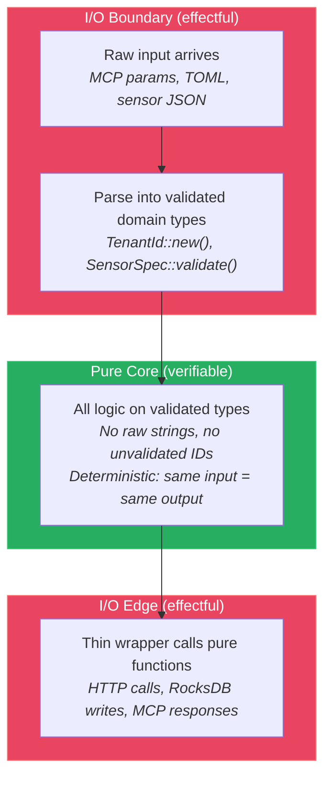

# Purity Boundary Map

## Purity Classification Overview

```mermaid
graph LR
    subgraph PURE["Pure Core (formally verifiable)"]
        CORE["prism-core<br/><i>TenantId, PrismError,<br/>ConfigSnapshot, entities</i>"]
        OCSF["prism-ocsf<br/><i>OCSF normalization,<br/>DynamicMessage</i>"]
    end

    subgraph MIXED["Mixed (pure logic + effectful I/O)"]
        QUERY["prism-query<br/><i>Pure: parser, alias resolution,<br/>push-down classification<br/>Effect: DataFusion SessionContext</i>"]
        SEC["prism-security<br/><i>Pure: flag eval, injection scan<br/>Effect: SystemTime for token expiry</i>"]
        SPEC["prism-spec-engine<br/><i>Pure: TOML parse, validation<br/>Effect: HTTP calls, arc-swap</i>"]
        OPS["prism-operations<br/><i>Pure: state machines, diff, detection<br/>Effect: RocksDB, timer ticks</i>"]
    end

    subgraph SHELL["Effectful Shell (integration tested)"]
        SENS["prism-sensors<br/><i>HTTP client, auth</i>"]
        CRED["prism-credentials<br/><i>keyring, file encryption</i>"]
        STOR["prism-storage<br/><i>RocksDB operations</i>"]
        AUD["prism-audit<br/><i>tracing, RocksDB buffer</i>"]
        MCP["prism-mcp<br/><i>MCP transport I/O</i>"]
        BIN["prism-bin<br/><i>CLI, signals, lifecycle</i>"]
    end

    PURE -->|"extract pure functions"| MIXED
    MIXED -->|"thin I/O wrappers"| SHELL

    style PURE fill:#27ae60,stroke:#2ecc71,color:#fff
    style MIXED fill:#f39c12,stroke:#f1c40f,color:#fff
    style SHELL fill:#e94560,stroke:#ff6b6b,color:#fff
```

## The Three-Step Purity Pattern

## Decision: Pure Core / Effectful Shell Separation (AD-008)

**Status:** accepted
**Context:** Formal verification (Kani, proptest) works best on pure functions without I/O dependencies. The more logic we can push into the pure core, the higher our verification coverage.
**Decision:** Strict separation of pure domain logic from effectful I/O. All crates are classified as pure-core, effectful-shell, or mixed (with documented I/O boundary).
**Rationale:** Pure functions are deterministic — same input always produces same output. This makes them ideal targets for property-based testing and formal proofs. The effectful shell is thin and tested via integration tests.
**Consequences:** Domain logic must not import I/O crates (reqwest, rocksdb, keyring, tokio::fs). Effectful code calls pure functions, not the other way around.

## Classification

| Crate | Classification | I/O Boundary | Verification Strategy |
|-------|---------------|-------------|----------------------|
| prism-core | **pure-core** | None — no I/O imports | Kani proofs for invariants, proptest for all types |
| prism-ocsf | **pure-core** | Build-time only: `DescriptorPool` initialized from compiled proto bytes via `OnceLock`. At runtime, `OcsfNormalizer` takes `&DescriptorPool` as a parameter — normalization is a pure transformation once the pool is constructed. The pool initialization is a one-time effect at startup, not per-call. | Proptest for normalization correctness, fuzz for panic-freedom. Kani proofs deferred: prost-reflect's `DescriptorPool` uses internal `HashMap` which Kani cannot efficiently model. The 0-Kani-proof status for a CRITICAL crate is mitigated by comprehensive proptest coverage (2 properties) and fuzz testing (1 target). |
| prism-security | **mixed** | Token store uses SystemTime for expiry; injection scanner is pure | Pure: flag evaluation, path resolution, pattern detection. Effect: clock access for token expiry |
| prism-query | **mixed** | Parser is pure; DataFusion execution has internal state | Pure: PrismQL parser, alias resolution, push-down classification, UDF implementations. Effect: DataFusion SessionContext lifecycle |
| prism-spec-engine | **mixed** | Spec parsing is pure; pipeline execution makes HTTP calls | Pure: TOML parsing, validation, variable resolution. Effect: HTTP calls via reqwest, arc-swap config swap |
| prism-operations | **mixed** | State machines and diff logic are pure; RocksDB access is effectful | Pure: case state transitions, diff computation, detection rule evaluation, template interpolation. Effect: RocksDB reads/writes, timer ticks |
| prism-sensors | **effectful-shell** | HTTP client, auth token management | Pure: none (thin adapter orchestration). Effect: HTTP calls, auth flows |
| prism-credentials | **effectful-shell** | OS keyring, filesystem encryption/decryption | Pure: credential name validation (moved to prism-core). Effect: keyring access, file I/O, AES encryption |
| prism-storage | **effectful-shell** | RocksDB (in production), BTreeMap (in tests) | Pure: key construction, domain enum mapping. Effect: RocksDB operations |
| prism-audit | **effectful-shell** | tracing subscriber, RocksDB buffer writes | Pure: audit entry construction. Effect: tracing emission, RocksDB writes |
| prism-mcp | **effectful-shell** | MCP transport (stdio), tool dispatch | Pure: response construction, error formatting. Effect: MCP transport I/O |
| prism-bin | **effectful-shell** | CLI parsing, signal handling, process lifecycle | Pure: none. Effect: everything |

## Pure Core Catalog

Functions in the pure core are the primary targets for formal verification:

| Function / Module | Crate | Inputs | Outputs | Properties |
|-------------------|-------|--------|---------|-----------|
| `TenantId::new(s)` | prism-core | raw string | Result<TenantId, Error> | Validates `[a-zA-Z0-9_-]+`, non-empty |
| `ClientCapabilities::is_allowed(path)` | prism-core | capability path | bool + CapabilityExplanation | DI-003: deny-by-default, most-specific wins |
| `CaseStatus::can_transition_to(target)` | prism-core | (current, target) status pair | bool | DI-025: exactly 12 valid transitions |
| `AxiqlParser::parse(input)` | prism-query | &str | Result<Ast, Vec<Error>> | DI-019: security limits enforced |
| `AliasResolver::expand(query, aliases)` | prism-query | query + alias map | expanded query | DI-020: depth 3, no cycles |
| `PushDownClassifier::classify(predicate, schema)` | prism-query | predicate + column options | PushDown or PostFilter | DI-021: REQUIRED columns enforced |
| `OcsfNormalizer::normalize(record, mapping)` | prism-ocsf | raw record + field map | OcsfEvent | DI-005: valid OCSF message |
| `FieldResolver::resolve(field_path)` | prism-ocsf | dot-notation path | resolved value | Four-tier resolution |
| `DetectionRule::validate(rule)` | prism-operations | rule definition | Result<(), Vec<Error>> | DI-024: all validation rules |
| `DiffEngine::compute_diff(prev, curr)` | prism-operations | two Arrow RecordBatches | DiffResult (added, removed) | Deterministic, order-independent |
| `TemplateInterpolator::render(template, vars)` | prism-operations | template + variable map | rendered string | 4-level resolution, no panics |
| `InjectionScanner::scan(text)` | prism-security | string | Vec<SafetyFlag> | Regex-based, never modifies input |
| `FeatureFlagEvaluator::evaluate(path, caps)` | prism-security | path + BTreeMap | Effect (Allow/Deny) + trace | DI-003: hierarchical resolution |
| `SpecValidator::validate(spec)` | prism-spec-engine | SensorSpec | Result<(), Vec<Error>> | DI-030: all validation rules |

## Purity Strategy

The boundary between pure and effectful code follows this pattern:

1. **Parse at the boundary.** Raw inputs (MCP tool parameters, TOML config, sensor API responses) are parsed into validated domain types at the I/O boundary.
2. **Transform in the core.** All logic operates on validated domain types. No raw strings, no unvalidated IDs, no optional fields that should be required.
3. **Effect at the edge.** I/O operations (HTTP, RocksDB, keyring, MCP transport) are thin wrappers that call pure functions for all decision-making.

This pattern maximizes the surface area available for formal verification while keeping the effectful shell minimal and testable via integration tests.
