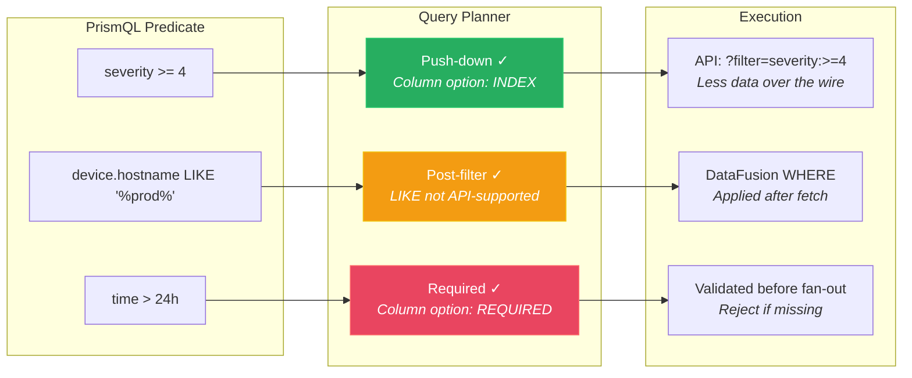
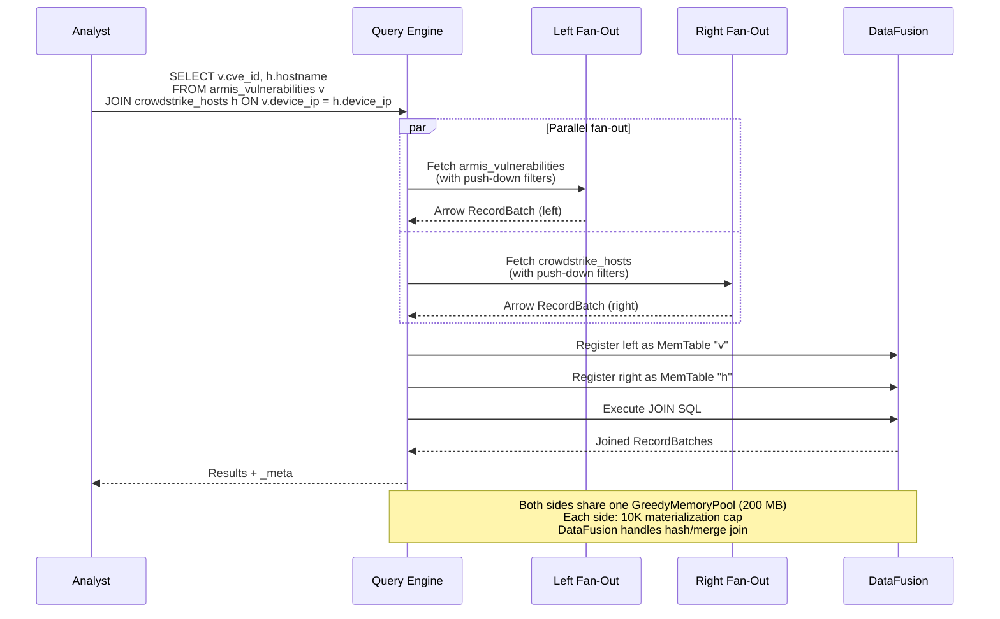

# Query Engine

## [Section Content]

## Architecture Overview

The query engine is Prism's central component. It transforms PrismQL query strings into orchestrated live API calls and DataFusion SQL execution. The engine lives in `prism-query` and owns the full pipeline from parse to result.

```mermaid
graph TD
    INPUT["PrismQL string<br/><i>'severity = high | stats count by _sensor'</i>"]

    subgraph PARSE["Phase 1: Parse (pure, no I/O)"]
        A1["1. Alias Expansion<br/><i>depth 3 max, cycle-checked</i>"]
        A2["2. Chumsky Parser<br/><i>zero-copy AST, mode auto-detect<br/>filter | SQL | pipe</i>"]
        A3["3. Query Planner<br/><i>push-down classification,<br/>security limits, scope resolution</i>"]
    end

    subgraph FETCH["Phase 2: Fetch (parallel I/O)"]
        A4["4. Sensor Fan-Out<br/><i>parallel (client, sensor) HTTPS calls<br/>bounded by semaphore (10/query)</i>"]
    end

    subgraph TRANSFORM["Phase 3: Transform (pure)"]
        A5["5. OCSF Normalization<br/><i>DynamicMessage per record,<br/>field mapping, raw_extensions</i>"]
        A6["6. Arrow Materialization<br/><i>RecordBatch, virtual fields<br/>(_sensor, _client, _source_table), 10K cap</i>"]
    end

    subgraph EXECUTE["Phase 4: Execute (DataFusion)"]
        A7["7. DataFusion SQL<br/><i>SessionContext + GreedyMemoryPool<br/>post-filter, agg, sort, limit, UDFs</i>"]
    end

    subgraph RETURN["Phase 5: Return + Cleanup"]
        A8["8. Response Construction<br/><i>query_context, sensor_errors,<br/>decorator injection, safety_flags</i>"]
        A9["9. Teardown<br/><i>SessionContext dropped,<br/>all memory freed</i>"]
    end

    INPUT --> A1 --> A2 --> A3 --> A4 --> A5 --> A6 --> A7 --> A8 --> A9

    style PARSE fill:#0f3460,stroke:#533483,color:#e0e0e0
    style FETCH fill:#e94560,stroke:#ff6b6b,color:#fff
    style TRANSFORM fill:#533483,stroke:#7c3aed,color:#fff
    style EXECUTE fill:#0f3460,stroke:#533483,color:#e0e0e0
    style RETURN fill:#1a1a2e,stroke:#636e72,color:#e0e0e0
    style INPUT fill:#533483,stroke:#7c3aed,color:#fff,font-weight:bold
```



## Push-Down Optimization



## Parser Design (Chumsky 0.12)

### Decision: Chumsky 0.12 for PrismQL Parsing (AD-003)

**Status:** accepted
**Context:** Need a parser for PrismQL's three modes (filter, SQL, pipe) with error recovery and span tracking. Options: Chumsky, nom, pest, winnow.
**Options considered:**
1. Chumsky 0.12 — zero-copy, composable combinators, built-in error recovery, Rich error types
2. nom — mature, fast, but no built-in error recovery; lower-level
3. pest — PEG-based, good for grammars but weaker at error recovery
4. winnow — nom successor, better ergonomics but less ecosystem adoption
**Decision:** Chumsky 0.12 (latest stable).
**Rationale:** Reference: axiathon uses Chumsky 0.10 for PrismQL parsing, proving the pattern works. Chumsky 0.12 adds improved error types and recovery strategies. Zero-copy parsing aligns with our performance goals (parser should add <5ms overhead). Error recovery is critical for AI-generated queries that may have syntax errors.
**Consequences:** PrismQL parser is a pure function: `&str -> Result<Ast, Vec<RichError>>`. No I/O, no state. Fully testable and verifiable.

### Mode Auto-Detection

The parser examines the first token to determine mode:
- Starts with `SELECT` or field comparison → SQL mode or filter mode (disambiguated by SELECT keyword)
- Starts with `FROM` → pipe mode
- Default: filter mode (simple field predicates)

All three modes compile to the same `QueryPlan` struct. DataFusion receives a unified logical plan regardless of surface syntax.

## DataFusion Integration

### Decision: DataFusion as SQL Engine (AD-002)

**Status:** accepted
**Context:** Need a SQL execution engine for filtering, aggregation, sorting, and limiting over Arrow RecordBatches. Options: custom engine, DataFusion, DuckDB (FFI).
**Decision:** DataFusion 53 (latest stable).
**Rationale:** Arrow-native, async execution, UDF extensibility, per-query SessionContext model (ephemeral by design). Reference: axiathon used DataFusion 51 for the same pattern. Monthly release cadence ensures active maintenance.
**Consequences:** Prism's query semantics are bounded by what DataFusion supports. Custom operations are implemented as UDFs.

### SessionContext Lifecycle

```rust
// Per-query: create with memory pool, register, execute, drop
// DataFusion 53 memory pool API — GreedyMemoryPool enforces hard limit, no spill-to-disk
let memory_pool = Arc::new(GreedyMemoryPool::new(per_query_memory_budget));
let runtime_config = RuntimeConfig::new()
    .with_memory_pool(memory_pool);
let runtime_env = Arc::new(RuntimeEnv::new(runtime_config)?);
let session_config = SessionConfig::new()
    .with_target_partitions(1)  // Single-process, no inter-partition overhead
    .set("datafusion.execution.batch_size", &batch_size.to_string());
let ctx = SessionContext::new_with_config_rt(session_config, runtime_env);
ctx.register_table("events", mem_table)?;
// Register UDFs
ctx.register_udf(subnet_contains_udf());
ctx.register_udf(time_window_udf());
ctx.register_udf(ioc_match_udf());
// Execute — DataFusion enforces memory_limit internally for sort/agg/join buffers
let df = ctx.sql(&datafusion_sql).await?;
let batches = df.collect().await?;
// ctx drops here — all memory freed (including DataFusion internal allocations)
```

**DataFusion memory enforcement:** `GreedyMemoryPool` (from `datafusion::execution::memory_pool`) enforces the per-query budget on all intermediate allocations (sort buffers, hash tables for GROUP BY, join probe tables). When the pool limit is reached, DataFusion returns `ResourcesExhausted` error which Prism translates to `E-WATCHDOG-001`. This is critical because the watchdog's RecordBatch byte tracking (DI-027) only measures materialized data, not DataFusion's internal state. With both enforcement layers active, a complex aggregation query cannot silently exceed the memory budget through DataFusion's intermediate allocations.

**DataFusion memory pool API validation (ASM-013):** The exact DataFusion 53 memory pool API must be validated during implementation. If `GreedyMemoryPool` is unavailable or renamed:
1. **Preferred fallback:** Use `datafusion::execution::memory_pool::TrackConsumersPool` wrapping an `UnboundedMemoryPool` with manual size checks after each batch
2. **Minimum viable fallback:** Configure `SessionConfig::with_target_partitions(1)` and set `datafusion.execution.batch_size` to a small value (2048), then rely solely on the RecordBatch byte tracking in DI-027's watchdog for memory enforcement
3. **Unacceptable:** Running without any DataFusion memory enforcement — if no pool API is available, the per-query memory budget from DI-027's RecordBatch tracking must be the sole enforcement, and the two-check grace period must account for DataFusion's internal allocations (which can be 2-5x the RecordBatch size for complex aggregations)

Add a CI smoke test that verifies the DataFusion memory pool integration compiles and limits memory correctly.

### Security UDFs (CAP-027)

| UDF | Signature | Implementation |
|-----|----------|---------------|
| `subnet_contains` | `(cidr: Utf8, ip: Utf8) -> Boolean` | ipnet crate, vectorized over Arrow arrays |
| `time_window` | `(timestamp: Timestamp, duration: Utf8) -> Boolean` | Computes `now - duration <= timestamp` |
| `ioc_match` | `(field: Utf8, ioc_list_name: Utf8) -> Boolean` | Matches field against a named IOC list (see IOC File Specification below) |
| ~~`stix_pattern_match`~~ | ~~`(field: Utf8, pattern: Utf8) -> Boolean`~~ | **Deferred to post-v1.** STIX 2.1 comparison expression parsing requires a non-trivial grammar parser with no established Rust crate. Needs ADR and dependency evaluation before implementation. |
| `mitre_tactic` | `(technique_id: Utf8) -> Utf8` | Static ATT&CK v14 lookup table |
| `severity_label` | `(severity: Int32) -> Utf8` | Configurable threshold mapping |
| `json_extract_string` | `(json: Utf8, path: Utf8) -> Utf8` | JSONPath extraction from event_data column |

## QueryEngine API Contract

The `QueryEngine` provides two execution methods:

1. **`execute(query, scope) -> QueryResult`** — Standard ad-hoc query execution. Creates a `SessionContext`, executes the query, collects results, drops the context, returns `QueryResult` containing `Vec<RecordBatch>`, metadata, and `sensor_errors`.

2. **`execute_scheduled(query, scope) -> ScheduledQueryResult`** — Scheduled query execution for detection integration. Creates a `SessionContext` with `GreedyMemoryPool`, executes the query, collects results, but **does not drop the context**. Returns `ScheduledQueryResult` containing `Vec<RecordBatch>`, metadata, `sensor_errors`, and the live `SessionContext`. The caller (`prism-operations::Scheduler`) is responsible for: (a) computing differential results, (b) registering the differential as a MemTable in the returned `SessionContext`, (c) running detection evaluation, and (d) dropping the `SessionContext` when complete. This enables detection to reuse the same `GreedyMemoryPool` without creating a separate allocation.

   **Error path (REQUIRED):** The `SessionContext` MUST be dropped before any error is propagated from the scheduler task. Use `scopeguard::defer!(drop(ctx))` at the call site or wrap the `SessionContext` in an RAII guard type that drops on any exit path. Rust's implicit drop on stack unwind may defer the drop during `?` propagation, holding the `GreedyMemoryPool` allocation (up to 200 MB) alive until the task stack unwinds. With 8 concurrent schedule tasks (per D-209 LOCKED 8/8 independent split), deferred drops during error cascades could temporarily hold 1.6 GB — exceeding the 512 MB RSS budget before the process-level watchdog fires. Verified by VP-036 (integration test).

## IOC File Specification

The `ioc_match` UDF matches field values against named indicator-of-compromise (IOC) lists.

**File format:** One indicator per line, plain text. Lines starting with `#` are comments. Empty lines are ignored. Each line is compiled as a `regex::Regex` pattern (finite automaton, no backtracking — CWE-1333 safe). The compiled patterns are aggregated into a `regex::RegexSet` for efficient multi-pattern matching.

**File location:** IOC files are stored in `{config_dir}/ioc/` (alongside `prism.toml`). Each file is named `{list_name}.ioc` — the `ioc_list_name` parameter in the UDF references the filename without extension (e.g., `ioc_match(src_endpoint.ip, "known_bad_ips")` reads from `ioc/known_bad_ips.ioc`).

**Loading:** IOC files are loaded at startup and on `reload_config` (Tier 3 — per-file independent, same as sensor specs). Each file is compiled into a `RegexSet` and cached in memory. Invalid patterns cause the file to be rejected with `E-IOC-001` (file logged as invalid, other IOC files still load).

**Size limits:** Max 100,000 patterns per IOC file. Max 10 MB per file. Max 50 IOC files. The compiled `RegexSet` memory is included in the baseline process memory budget (~2-5 MB per 10K patterns). Total IOC memory is bounded at ~50 MB worst-case (50 files × 100K patterns × ~10 bytes compiled per pattern).

**Missing file behavior:** If `ioc_match` references a list name that doesn't exist, the UDF returns `false` for all rows (no match) and a WARN is logged. This prevents a missing IOC file from crashing queries but may produce false negatives — the `check_sensor_health` tool reports IOC file status (loaded, missing, invalid) for operational visibility.

**Hot reload:** IOC files participate in `reload_config` Tier 3 (per-file independent validation). Changed files are recompiled; in-flight queries use the pre-reload RegexSet snapshot (arc-swap pattern, CI-002).

## Push-Down Filter Classification

During query planning, each predicate is classified:

| Classification | Behavior | Example |
|---------------|----------|---------|
| **Push-down** | Translated to sensor API parameters, reduces API response size | `severity >= high` on CrowdStrike → `?filter=severity:>=4` |
| **Post-filter** | Applied by DataFusion after materialization | `device.hostname LIKE '%prod%'` |
| **Required** | Must be constrained or query is rejected (DI-021) | `timestamp` on unbounded endpoints |

Push-down capability is declared per column in sensor spec files via `ColumnOptions` (REQUIRED, INDEX, ADDITIONAL, OPTIMIZED) — the same taxonomy as osquery's `QueryContext`.

## Unified Query Surface (CAP-028)

The query engine registers two table types in DataFusion:

| Table Type | Backed By | Lifetime | Example |
|-----------|----------|----------|---------|
| External (composite) | Sensor APIs (ephemeral fan-out) | Per-query | `EVENTS`, `ALERTS`, `DEVICES`, `ASSETS` — map to sensor-specific sources |
| External (specific) | Single sensor API | Per-query | `crowdstrike_detections`, `claroty_devices`, `armis_alerts`, etc. |
| Internal | RocksDB storage domains | Process lifetime | `prism_alerts`, `prism_cases`, `prism_rules` |

**Source disambiguation:** `FROM ALERTS` queries external sensor alert sources only (crowdstrike_detections, cyberint_alerts, etc. per prismql-grammar.md section 11.2). Internal Prism tables use underscore-delimited names that match the PrismQL `identifier` grammar: `FROM prism_alerts`, `FROM prism_cases`, `FROM prism_rules`. These are registered as DataFusion tables alongside the external sensor tables. The `prism_` prefix prevents collision with sensor table names (sensor tables use `{sensor_id}_{source}` format, and no sensor_id is `prism`).

Note: The original `prism.alerts` dotted notation was replaced with `prism_alerts` because dots are not valid in the PrismQL `source` production rule (`identifier` allows only letters, digits, underscores). All references to internal tables must use the underscore form.

Both are queryable via the same `query` MCP tool and same PrismQL syntax. Internal tables are read-only via PrismQL — mutations go through dedicated MCP tools.

### Cross-Source Correlation — Two Patterns

PrismQL supports two correlation patterns depending on the use case:

**Pattern 1: Composite Sources (same data type, cross-sensor)**

When an analyst queries `FROM EVENTS`, all event-type sources across sensors are materialized into a single MemTable with unified schema. The `_sensor` and `_source_table` virtual fields distinguish the origin:

```sql
-- Cross-sensor events for the same IP (no JOIN needed — composite source handles it)
SELECT _sensor, device_hostname, COUNT(*) AS total
FROM EVENTS
WHERE device_ip = '10.0.1.50' AND time > 24h
GROUP BY _sensor, device_hostname
```

**Pattern 2: JOINs (different data types, cross-source)**

When an analyst needs to correlate different data types — vulnerabilities with hosts, alerts with devices, internal alerts with sensor events — JOINs combine separate tables:

```sql
-- Vulnerable endpoints with active CrowdStrike detections
SELECT v.cve_id, v.severity, h.hostname, h.last_seen
FROM armis_vulnerabilities v
INNER JOIN crowdstrike_hosts h ON v.device_ip = h.device_ip
WHERE v.severity_id >= 4

-- Coverage gap: which devices appear in only one sensor?
SELECT COALESCE(c.device_ip, a.device_ip) AS ip,
       c.hostname AS cs_name, a.hostname AS armis_name
FROM crowdstrike_hosts c
FULL OUTER JOIN armis_devices a ON c.device_ip = a.device_ip

-- Enrich internal alerts with sensor context
SELECT al.alert_id, al.severity, h.hostname, h.os_version
FROM prism_alerts al
LEFT JOIN crowdstrike_hosts h ON al.device_ip = h.device_ip
WHERE al.severity_id >= 4
```

### JOIN Data Flow



### JOIN Implementation

**Supported JOIN types:** INNER, LEFT, RIGHT, FULL OUTER, CROSS — all standard SQL JOINs. DataFusion handles all join execution natively.

**Multi-table fan-out:** Both sides of the JOIN trigger independent sensor fan-out, running in parallel. Each side has its own 10K materialization cap. Both are registered as separate MemTables in the same DataFusion `SessionContext`, and DataFusion handles the join.

**Memory budget for JOINs:** Both sides share the same `GreedyMemoryPool` (200 MB cap at normal watchdog level). DataFusion's hash join and merge join operators allocate from this pool. A join that exceeds the pool receives `ResourcesExhausted` → `E-WATCHDOG-001`.

**Pipe mode JOINs:** The `join` pipe stage triggers a second fan-out for the right-side source:

```
-- Pipe mode join (same semantics as SQL JOIN)
FROM crowdstrike_hosts | join armis_devices on device_ip | fields + _sensor, hostname, cve_id

-- Explicit join kind
FROM crowdstrike_hosts | join left armis_vulnerabilities on device_ip | where severity_id >= 4

-- Different field names on each side
FROM crowdstrike_hosts | join claroty_devices on device_ip == asset_ip

-- Full pipeline with join + aggregation
FROM crowdstrike_hosts | join full armis_devices on device_ip | stats count by _sensor | sort count desc
```

**Composite sources are still the primary pattern** for same-type cross-sensor queries. JOINs are for cross-type correlation — combining different data types from different or same sensors. Both can be used in the same query (e.g., join two composite sources).

### Real-World MSSP Query Scenarios

These scenarios demonstrate why PrismQL's federated query engine with JOIN support is critical for MSSP operations. Each scenario shows both SQL and pipe mode.

#### Scenario 1: Vulnerable Endpoints with Active Detections

*"Which devices have known vulnerabilities AND active CrowdStrike detections? These are the highest-priority hosts."*

```sql
-- SQL mode
SELECT v.cve_id, v.severity AS vuln_severity, d.severity AS detection_severity,
       v.device_ip, d.device_hostname, d.message AS detection_summary
FROM armis_vulnerabilities v
INNER JOIN crowdstrike_detections d ON v.device_ip = d.device_ip
WHERE v.severity_id >= 4 AND d.severity_id >= 3
ORDER BY v.severity_id DESC, d.severity_id DESC
LIMIT 50
```

```prismql
-- Pipe mode
FROM armis_vulnerabilities | join crowdstrike_detections on device_ip
  | where severity_id >= 3
  | sort severity_id desc
  | head 50
```

#### Scenario 2: OT/IT Convergence — Claroty Devices with CrowdStrike Alerts

*"Which OT devices (Claroty) have corresponding IT security alerts (CrowdStrike)? This is the IT/OT convergence view."*

```sql
-- SQL mode
SELECT c.device_hostname AS ot_device, c.device_type, c.zone,
       d.message AS it_alert, d.severity, d.time
FROM claroty_devices c
INNER JOIN crowdstrike_detections d ON c.device_ip = d.device_ip
WHERE d.time > 24h
ORDER BY d.severity_id DESC
```

```prismql
-- Pipe mode
FROM claroty_devices | join crowdstrike_detections on device_ip
  | where time > 24h
  | sort severity_id desc
  | fields + device_hostname, device_type, zone, message, severity, time
```

#### Scenario 3: Sensor Coverage Gaps

*"Which devices appear in CrowdStrike but NOT in Armis, and vice versa? These are coverage blind spots."*

```sql
-- SQL mode
SELECT COALESCE(c.device_ip, a.device_ip) AS ip,
       c.device_hostname AS crowdstrike_name,
       a.device_hostname AS armis_name,
       CASE
         WHEN c.device_ip IS NULL THEN 'armis_only'
         WHEN a.device_ip IS NULL THEN 'crowdstrike_only'
         ELSE 'both_sensors'
       END AS coverage_status
FROM crowdstrike_hosts c
FULL OUTER JOIN armis_devices a ON c.device_ip = a.device_ip
ORDER BY coverage_status, ip
```

```prismql
-- Pipe mode
FROM crowdstrike_hosts | join full armis_devices on device_ip
  | fields + _sensor, device_ip, device_hostname
  | sort _sensor, device_ip
```

#### Scenario 4: Alert Enrichment — Internal Alerts with Host Context

*"Show me Prism alerts enriched with the host's operating system, department, and last seen time from CrowdStrike."*

```sql
-- SQL mode
SELECT al.alert_id, al.severity, al.message,
       h.device_hostname, h.os_version, h.last_seen,
       h.ou AS department
FROM prism_alerts al
LEFT JOIN crowdstrike_hosts h ON al.device_ip = h.device_ip
WHERE al.severity_id >= 4
ORDER BY al.time DESC
```

```prismql
-- Pipe mode
FROM prism_alerts | join left crowdstrike_hosts on device_ip
  | where severity_id >= 4
  | sort time desc
  | fields + alert_id, severity, message, device_hostname, os_version, last_seen
```

#### Scenario 5: Vulnerability + Threat Intelligence Correlation

*"Do any of our known vulnerabilities match active threat intel from Cyberint? These need immediate attention."*

```sql
-- SQL mode
SELECT v.cve_id, v.device_ip, v.severity AS vuln_severity,
       t.severity AS threat_severity, t.message AS threat_description,
       t.source AS intel_source
FROM armis_vulnerabilities v
INNER JOIN cyberint_alerts t ON v.cve_id = t.cve_id
WHERE v.severity_id >= 3
ORDER BY t.severity_id DESC
```

```prismql
-- Pipe mode
FROM armis_vulnerabilities | join cyberint_alerts on cve_id
  | where severity_id >= 3
  | sort severity_id desc
```

#### Scenario 6: Cross-Client Device Count Comparison

*"How many devices does each sensor see across all clients? (Uses composite source, no JOIN needed)"*

```sql
-- SQL mode — composite source pattern
SELECT _client, _sensor, COUNT(*) AS device_count
FROM DEVICES
GROUP BY _client, _sensor
ORDER BY _client, device_count DESC
```

```prismql
-- Pipe mode — composite source pattern
FROM DEVICES | stats count by _client, _sensor | sort _client, count desc
```

#### Scenario 7: Multi-Sensor Timeline for Incident Response

*"Show me everything that happened to IP 10.0.1.50 across ALL sensors in the last 24 hours. (Composite source — all events unified)"*

```sql
-- SQL mode — composite source, cross-sensor timeline
SELECT _sensor, _source_table, time, severity, message, device_hostname
FROM EVENTS
WHERE device_ip = '10.0.1.50' AND time > 24h
ORDER BY time ASC
```

```prismql
-- Pipe mode
severity >= 0 AND device_ip = "10.0.1.50" AND time > 24h | sort time | fields + _sensor, _source_table, time, severity, message
```

#### Scenario 8: Stale Hosts — Devices Not Seen Recently

*"Which CrowdStrike hosts haven't reported in over 7 days but still appear in Armis? The agent might be dead."*

```sql
-- SQL mode
SELECT c.device_hostname, c.device_ip, c.last_seen AS cs_last_seen,
       a.last_seen AS armis_last_seen
FROM crowdstrike_hosts c
INNER JOIN armis_devices a ON c.device_ip = a.device_ip
WHERE c.last_seen < 7d AND a.last_seen > 1d
ORDER BY c.last_seen ASC
```

These scenarios demonstrate PrismQL's two correlation patterns working together:
- **Composite sources** (Scenarios 6, 7): Cross-sensor same-type queries — `FROM EVENTS` gives you everything from all sensors in one result. No JOINs needed.
- **JOINs** (Scenarios 1-5, 8): Cross-type correlation — combining vulnerabilities with detections, OT devices with IT alerts, internal alerts with host context. This is what makes Prism a federated query engine, not just an API wrapper.

### Virtual Fields

The query engine injects three virtual fields into every materialized RecordBatch:

| Virtual Field | Arrow Type | Description |
|--------------|-----------|-------------|
| `_sensor` | `Utf8` | Source sensor identifier (e.g., `crowdstrike`, `armis`) |
| `_client` | `Utf8` | Client identifier (OrgSlug value; formerly TenantId, renamed per ADR-006) |
| `_source_table` | `Utf8` | Specific table name (e.g., `crowdstrike_detections`, `armis_alerts`) |

These fields are prefixed with `_` to distinguish them from OCSF fields. They are queryable in `WHERE`, `GROUP BY`, `ORDER BY`, and `SELECT` clauses. The naming is consistent across all architecture documents — `_sensor`, `_client`, `_source_table` (with underscore prefix).

## Changelog

| Version | Date | Author | Change |
|---------|------|--------|--------|
| 1.2 | 2026-05-03 | architect | F-PreP24-H-002: corrected `execute_scheduled` error-path memory-budget text — 16 concurrent tasks → 8 (D-209 LOCKED), 3.2 GB → 1.6 GB (8 × 200 MB). Watchdog-exceeds-512-MB-RSS risk reasoning preserved. POL-6 compliance. |
| 1.1 | 2026-04-27 | product-owner | Pass 15 sweep: `_client` virtual field description updated TenantId → OrgSlug (ADR-006); added `## [Section Content]` template compliance marker. |
