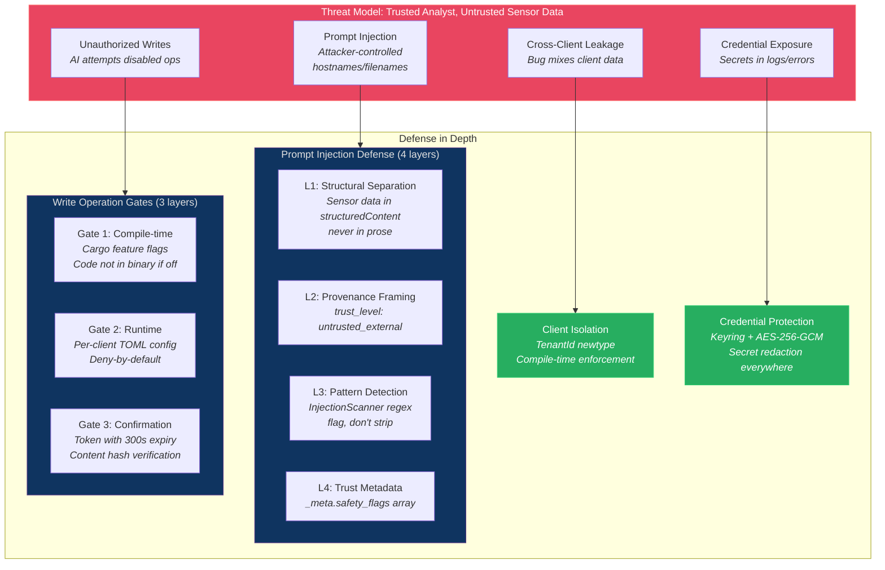
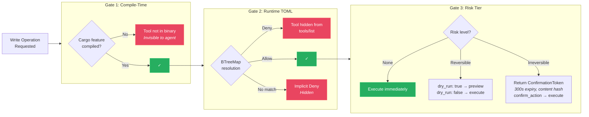
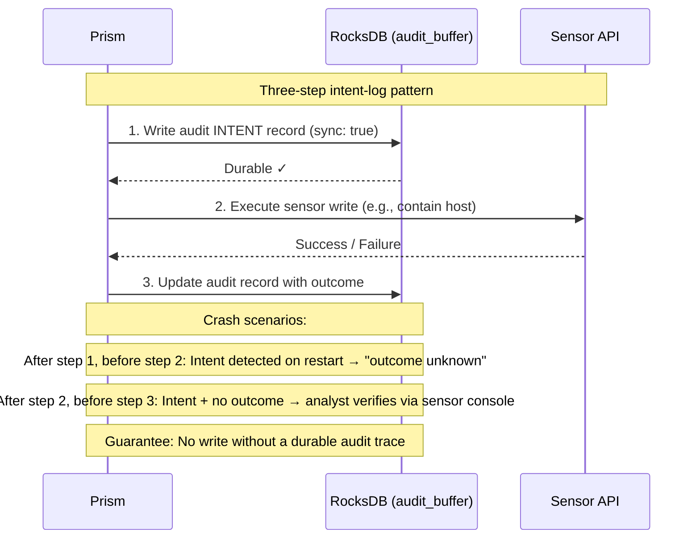
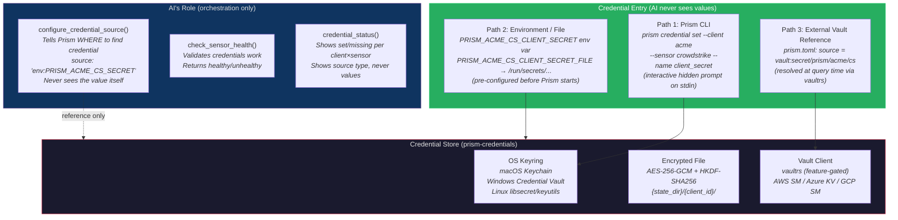
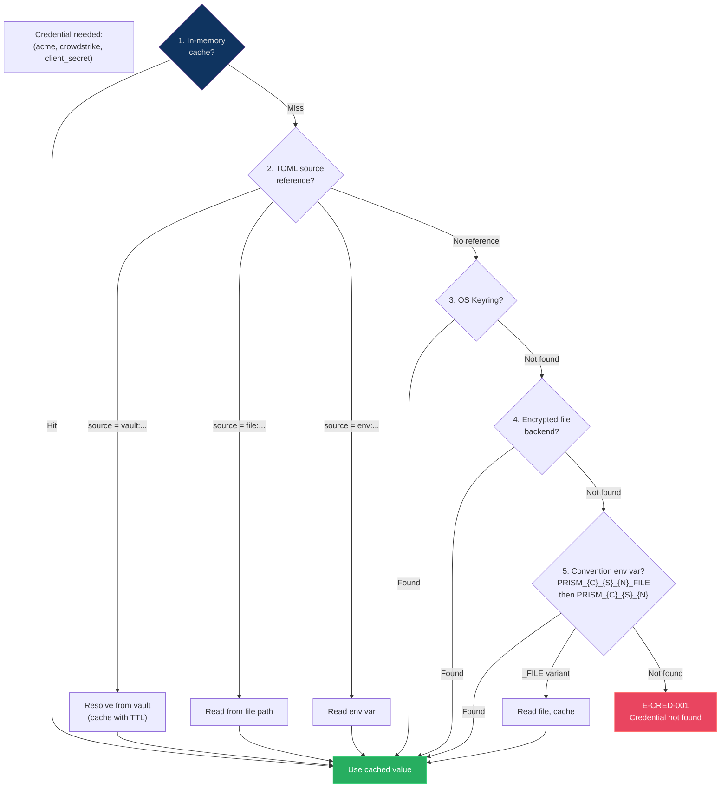

# Security Architecture

## Security Architecture Overview



## Feature Flag Resolution — Three Gates



## Write-Audit Ordering (AD-016)



## Threat Model

Prism operates in a **trusted analyst, untrusted sensor data** model. The analyst is an MSSP employee — client isolation is about data correctness, not security isolation between adversarial tenants. However, sensor data (hostnames, file paths, process names) is attacker-controlled content that flows through the LLM context.

### Primary Threats

| Threat | Vector | Mitigation |
|--------|--------|-----------|
| Prompt injection via sensor data | Attacker-controlled hostnames/filenames in sensor responses | 4-layer sanitization (SS-09) |
| Cross-client data leakage | Bug mixes client data in responses/cache/logs | TenantId newtype (DI-008, AD-010) |
| Credential exposure | Secrets in logs, errors, MCP responses | Secret redaction at every boundary (DI-002) |
| Unauthorized write operations | AI agent attempts disabled operations | Two-tier feature flags + hidden tools (AD-011) |
| Path traversal in credentials | Malicious credential names | Name sanitization regex (DI-014) |
| Token replay | Reuse of confirmation tokens | Single-use + content hash verification (DI-007) |
| libgit2 FFI vulnerabilities | Malformed git objects in community config repos (CVE history in libgit2: path traversal, buffer overflows in pack parsing) | `cargo-audit` in CI catches advisories; `git2` version pinned in Cargo.toml; community repos (`read_only = true`) are untrusted input — content validated post-clone via Tier 3 per-file validation before loading into config directory; git sync runs on a dedicated tokio blocking thread (not WASM-sandboxed — accepted risk given libgit2 maturity and cargo-audit coverage) |

## Credential Management (prism-credentials)

### Decision: AI-Opaque Credential Management (AD-017)

**Status:** accepted
**Context:** Prism is consumed by a commercial AI agent (Claude Code). Credential values must NEVER transit through the AI's context window — the AI orchestrates credential configuration (where to find secrets) but never sees the secret values themselves. This is a security requirement for MSSP operations where credentials grant access to client security infrastructure (CrowdStrike Falcon, Claroty xDome, etc.).
**Decision:** Reference-based credential model. Three ingestion paths, all bypassing the AI. Resolution at query time from multiple backend sources.

### Credential Ingestion — Three Paths (All Bypass the AI)



### Path 1: Prism CLI (Interactive, Out-of-Band)

Direct credential entry via the `prism` binary CLI, completely outside the MCP/AI context:

```bash
# Interactive hidden prompt (value never echoed, never in shell history)
$ prism credential set --client acme --sensor crowdstrike --name client_secret
Enter value: ****
Stored to keyring: acme/crowdstrike/client_secret ✓

# From file (for PEM keys, multi-line tokens)
$ prism credential set --client acme --sensor claroty --name api_key --from-file /path/to/key.txt

# From stdin (pipe-safe for scripted bootstrap)
$ echo "$SECRET" | prism credential set --client acme --sensor armis --name api_secret --from-stdin

# Import from environment variables matching PRISM_{CLIENT}_{SENSOR}_{NAME} pattern
$ prism credential import --from-env --client acme

# Check status
$ prism credential status --client acme
  crowdstrike/client_id      [set]     source: keyring
  crowdstrike/client_secret  [set]     source: keyring
  cyberint/api_token         [missing]
  claroty/api_key            [set]     source: env:CLAROTY_API_KEY_FILE
  armis/api_secret           [missing]
```

### Path 2: Environment Variables + `_FILE` Pattern

The proven pattern from the reference pollers (poller-cobra, poller-express, poller-bear, poller-coaster), adopted for Kubernetes and container deployments:

```bash
# Direct env var (local dev, CI)
export PRISM_ACME_CROWDSTRIKE_CLIENT_SECRET="xyz789"

# File reference (Kubernetes secrets, Docker secrets)
export PRISM_ACME_CROWDSTRIKE_CLIENT_SECRET_FILE="/run/secrets/acme_cs_secret"
```

Env var naming convention: `PRISM_{CLIENT_ID}_{SENSOR_ID}_{CREDENTIAL_NAME}` (uppercased, hyphens to underscores). The `_FILE` variant takes precedence over the direct variant.

### Path 3: External Vault References (Enterprise)

For MSSP deployments with centralized secrets management:

```toml
# prism.toml — credential REFERENCES, not values
[clients.acme.sensors.crowdstrike.credentials]
client_id = { source = "vault", path = "secret/data/prism/acme/crowdstrike", key = "client_id" }
client_secret = { source = "vault", path = "secret/data/prism/acme/crowdstrike", key = "client_secret" }

[clients.acme.sensors.claroty.credentials]
api_key = { source = "file", path = "/run/secrets/acme_claroty_key" }
```

Supported vault backends (feature-gated in `prism-credentials`):
- `vault` — HashiCorp Vault via `vaultrs` crate (AppRole, Token, K8s auth)
- `aws-sm` — AWS Secrets Manager via `aws-sdk-secretsmanager`
- `azure-kv` — Azure Key Vault via `azure_security_keyvault_secrets`
- `gcp-sm` — GCP Secret Manager via `google-cloud-secretmanager-v1`

### Credential Resolution Order (Query Time)

When `prism-sensors` needs a credential for `(client_id, sensor_id, credential_name)`:



Resolution is lazy (on first access) and cached in-memory as `SecretString` for the process lifetime. Cache is invalidated on `reload_config`.

### Credential Namespace

`(client_id, sensor_id, credential_name)` — three-component key. No "get all credentials" method that crosses client boundaries (DI-002).

Keyring namespace: `service = "prism"`, `user = "{client_id}/{sensor_id}/{credential_name}"`

### Credential Access Audit Path

Credential access audit logging (BC-2.05.005, BC-2.03.010) is handled by the `prism-mcp` dispatch middleware for MCP tool-initiated credential operations (`configure_credential_source`, `delete_credential`, `list_credentials`). For scheduled query credential resolution (prism-sensors calling prism-credentials during fan-out), audit is emitted by prism-operations using its `AuditEmitter` dependency. `prism-credentials` and `prism-sensors` do not depend on `prism-audit` directly. Credential values are NEVER logged — only `(client_id, sensor_id, credential_name, source_type, operation, timestamp)`.

### Encrypted File Backend

- AES-256-GCM with HKDF-SHA256 key derivation
- Per-credential 32-byte random salt
- Key material from environment variable (`PRISM_MASTER_KEY`) or K8s secret mount (`PRISM_MASTER_KEY_FILE`)
- File permissions: 0600 (files), 0700 (directories)
- Stored in `{state_dir}/{client_id}/` directory structure

### Startup Probe

Keyring availability check at startup (pre-authorize macOS Keychain permission prompt) before any credential access. If keyring is unavailable, falls back to encrypted file backend with a startup INFO log.

## Feature Flag System (prism-security)

### Decision: Two-Tier Feature Flags (AD-011)

**Status:** accepted
**Context:** Write operations need defense-in-depth gating. Must be possible to compile a binary with no write code at all.
**Decision:** Tier 1: Cargo compile-time features (`--features crowdstrike-write`). Tier 2: Runtime per-client TOML config (`BTreeMap<String, Effect>`).
**Rationale:** Compile-time gates ensure write operation code is not present in the binary when not needed. Runtime gates enable per-client control without recompilation.

**Resolution algorithm:**
1. Check compile-time feature. If absent → deny (tool code not compiled).
2. Walk capability path from most-specific to least-specific (BTreeMap iteration).
3. First matching rule determines effect (Allow or Deny).
4. At same specificity, Deny beats Allow.
5. No match → implicit Deny.

**Hidden tools pattern:** Tools whose capability resolves to Deny are omitted from `tools/list`. The AI agent never sees disabled operations.

## Confirmation Token System

For irreversible write operations (host containment, credential deletion, schedule deletion):

1. First call returns `ConfirmationToken` with action summary and 300s expiry
2. Agent presents summary to analyst (human-in-the-loop)
3. `confirm_action(token_id)` executes the operation
4. Token content hash prevents action parameter tampering between steps

Caps: 100 active tokens max (DI-015). In-memory only — lost on restart.

### Write-Audit Ordering (AD-016)

**Status:** accepted
**Context:** When `confirm_action` executes an irreversible write (e.g., host containment), the sensor API side-effect is not atomic with the RocksDB audit record. A crash between sensor write and audit persistence could lose the audit trail for a completed write.
**Decision:** Write operations follow a three-step sequence: (1) write audit intent record to RocksDB (`audit_buffer` domain, sync write), (2) execute sensor API write, (3) update audit record with outcome (success/failure). If Prism crashes after step 1 but before step 2, the intent record is detected on restart and logged as "write attempted, outcome unknown." If Prism crashes after step 2 but before step 3, the intent record is detected and the audit trail shows the write was attempted — the analyst can verify the outcome via the sensor's native console.
**Rationale:** The intent-log pattern ensures no write operation can occur without a durable audit trace, even across crashes. The narrow window between step 2 and step 3 is acceptable because: (a) the intent record proves the write was authorized and attempted, (b) the analyst can verify outcome externally, and (c) crashes in this window are extremely rare for a single-process stdio server.
**Consequences:** Startup crash recovery must scan `audit_buffer` for intent records without completion records. SOC 2 auditors can verify that every write operation has at least an intent record.

## Prompt Injection Defense (prism-security)

Four-layer defense operating on all sensor data in MCP responses:

| Layer | Mechanism | Component |
|-------|-----------|-----------|
| 1. Structural separation | Sensor data in `structuredContent` JSON, never interpolated into prose | Response construction in prism-mcp |
| 2. Provenance framing | Tool descriptions warn about untrusted data; `trust_level: "untrusted_external"` | Tool registration in prism-mcp |
| 3. Pattern detection | Regex scanner for injection patterns ("ignore previous", "system:", etc.) | `InjectionScanner` in prism-security |
| 4. Trust metadata | Per-response `_meta.safety_flags` array aggregating flagged fields | Response envelope in prism-mcp |

Safety flags **flag** suspicious content — they never strip it. The analyst needs full forensic data.

## Audit Trail (prism-audit)

Every MCP tool invocation, scheduled query execution, and detection evaluation produces exactly one `AuditEntry`. Structured JSON via `tracing` crate.

**Fail-closed for writes (DI-004/DI-016):** If audit emission fails, write operations are aborted. Read operations proceed with warning. Scheduled/detection operations proceed with warning.

**Buffered forwarding (CAP-025):** Audit entries are written to RocksDB (WAL-synced) before external delivery attempt. Exponential backoff on delivery failure (2s base, 60s max). 100K entry buffer with oldest-first purge.

## Client Isolation (TenantId Newtype)

### Decision: TenantId Newtype for Client Isolation (AD-010)

**Status:** accepted
**Context:** Cross-client data leakage is the highest-impact correctness bug in an MSSP system.
**Decision:** `TenantId` newtype wrapping a validated `String`. Every function that handles client-scoped data takes `&TenantId` as a parameter.
**Rationale:** Compile-time enforcement via the type system. You cannot accidentally pass a raw string where a TenantId is expected. Validation occurs once at the boundary (MCP parameter parsing), then the validated type propagates through the call chain.
**Consequences:** All storage keys, cache keys, log spans, and error messages include `TenantId`. Code review can verify client isolation by checking TenantId threading.
