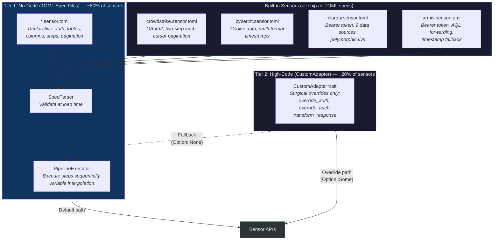
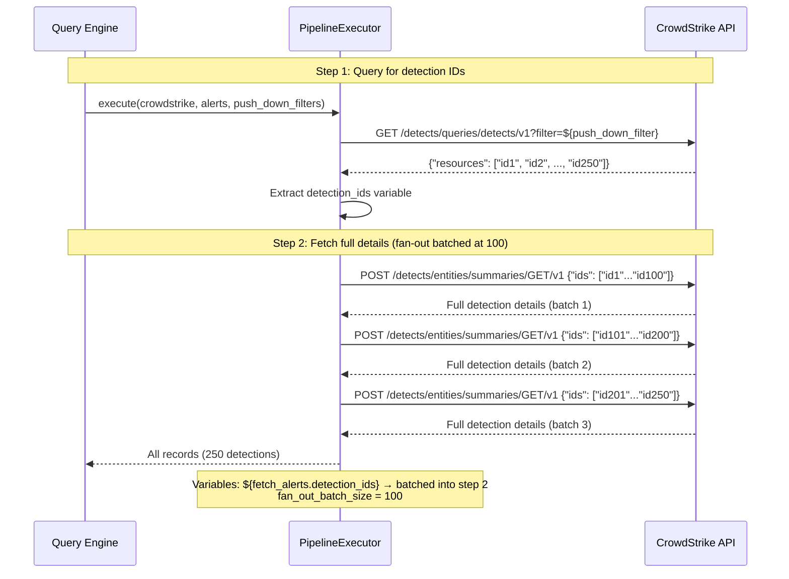
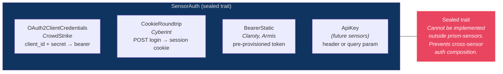
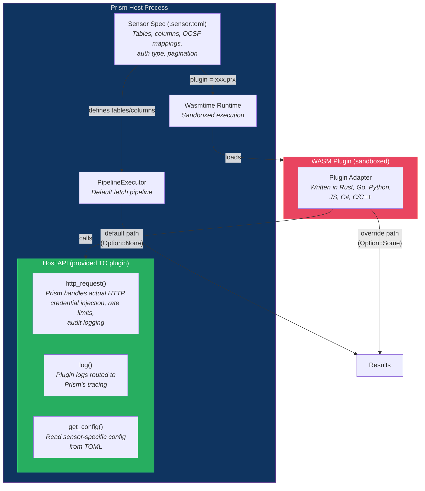
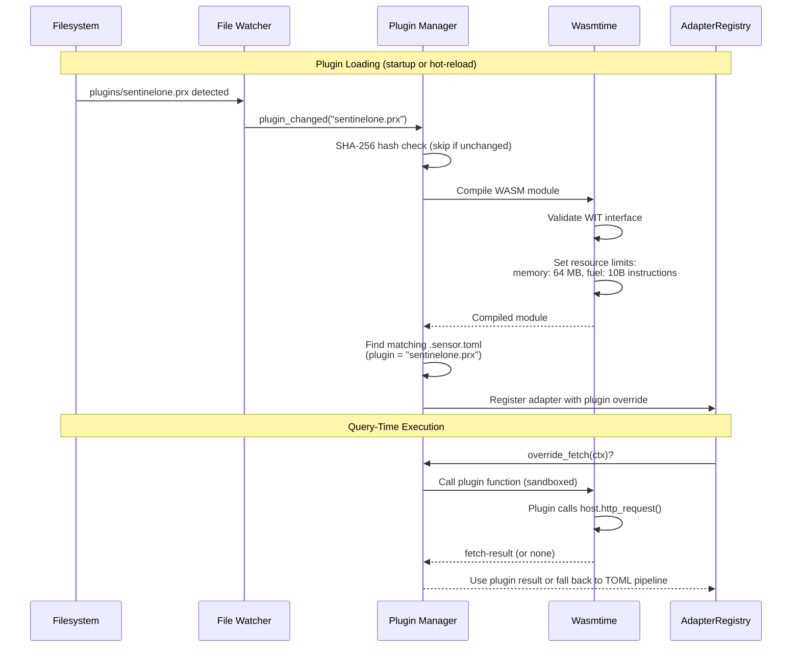

# Sensor Adapters

## Two-Tier Architecture Overview



## CrowdStrike Two-Step Fetch Pipeline



## Authentication Patterns



## Two-Tier Adapter Architecture

### Decision: Config-Driven Sensor Adapters (AD-006)

**Status:** accepted
**Context:** Prism must support 4 initial sensors and be extensible to future sensors. Options: hardcoded per-sensor adapters, config-driven spec files, code generation.
**Options considered:**
1. Hardcoded Rust adapters per sensor — maximum control but requires recompilation for every new sensor
2. Config-driven TOML spec files interpreted at runtime — zero Rust code for ~80% of REST API sensors
3. Code generation from OpenAPI specs — generates Rust code but adds build complexity and may not match real API behavior
**Decision:** Config-driven TOML spec files as the primary mechanism, with a Rust escape hatch (CustomAdapter trait) for the ~20% requiring exotic behavior.
**Rationale:** The four initial sensors (CrowdStrike, Cyberint, Claroty, Armis) ship as TOML spec files alongside the binary. This proves the spec system is sufficient for real-world REST APIs (eat our own dog food) and ensures no special-casing between built-in and third-party sensors.
**Consequences:** Adding a new REST API sensor requires zero Rust code changes. The spec engine must be powerful enough to express all four initial sensors' API patterns.

## Tier 1: No-Code (TOML Spec Files)

A sensor spec file (`*.sensor.toml`) declares everything needed to query a sensor:

```toml
[sensor]
sensor_id = "crowdstrike"
name = "CrowdStrike Falcon"
auth_type = "OAuth2ClientCredentials"
base_url = "https://api.crowdstrike.com"

[[sensor.tables]]
table_name = "alerts"
ocsf_class = "security_finding"
pagination = { type = "cursor_token", cursor_response_path = "$.meta.pagination.next_token" }

[[sensor.tables.columns]]
name = "severity"
col_type = "Integer"
options = ["Index"]
ocsf_field = "severity_id"

[[sensor.tables.steps]]
name = "fetch_alerts"
method = "GET"
path_template = "/detects/queries/detects/v1?filter=${push_down_filter}"
response_path = "$.resources"
variables_produced = ["detection_ids"]

[[sensor.tables.steps]]
name = "fetch_details"
method = "POST"
path_template = "/detects/entities/summaries/GET/v1"
body_template = '{"ids": ${fetch_alerts.detection_ids}}'
response_path = "$.resources"
fan_out_batch_size = 100
```

### Spec Engine Pipeline

The `prism-spec-engine` crate processes spec files through three components:

1. **SpecParser** — Deserializes TOML into `SensorSpec` structs. Validates schema structure, variable references (no forward refs, no undefined steps — DEC-038), OCSF field paths (warnings, not errors), pagination consistency, and rate limit hints. Multi-error reporting.

2. **PipelineExecutor** — Executes the `[[steps]]` array sequentially for a table. Each step makes an HTTP call, extracts results via `response_path`, and produces variables for downstream steps. Fan-out occurs when a variable resolves to an array (batched per `fan_out_batch_size`). Rate-limit-aware pacing using spec-declared hints.

   **Variable interpolation safety:** When substituting `${step_name.field}` values into `body_template` or `path_template`, the PipelineExecutor applies context-aware encoding:
   - **In JSON body templates:** Substituted values are JSON-string-escaped (backslash-escaping `"`, `\`, control characters). The value is always treated as a JSON string value, never raw text — preventing JSON structure injection from attacker-controlled sensor API response values.
   - **In URL path templates:** Substituted values are percent-encoded per RFC 3986.
   - **In array contexts** (`${step.ids}` resolving to a JSON array): The array is serialized as a JSON array literal with each element string-escaped.
   - The `${...}` pattern itself is never recursively expanded — a sensor API response containing `${other_step.secret}` is treated as a literal string, not a variable reference.

3. **ConfigManager** — Stores the active `ConfigSnapshot` in `arc_swap::ArcSwap<ConfigSnapshot>` for lock-free query-time reads. Config reload can be triggered three ways: the `reload_config` MCP tool (explicit), the `add_sensor_spec` MCP tool (write + reload), or the **filesystem watcher** (automatic on file changes). All three paths use the same validation and swap logic. Hash-based change detection (SHA-256) skips reload when nothing actually changed.

   **Automatic filesystem watching (AD-018):**

   ```mermaid
   sequenceDiagram
       participant FS as Filesystem
       participant W as File Watcher (notify crate)
       participant CM as ConfigManager
       participant AS as ArcSwap
       participant MCP as MCP Layer

       FS->>W: File modified/created/deleted<br/>in config directory
       W->>W: Debounce (500ms)
       W->>CM: reload_triggered(source: "file_watch")
       CM->>CM: SHA-256 hash check<br/>(skip if unchanged)
       CM->>CM: Validate (3-tier atomicity)
       
       alt Validation passes
           CM->>AS: Atomic swap (new ConfigSnapshot)
           CM->>MCP: notifications/tools/list_changed<br/>(if tool set changed)
           CM->>MCP: notifications/resources/list_changed<br/>(if schemas changed)
       else Validation fails
           CM->>CM: Log WARN with validation errors
           CM->>CM: Retain old ConfigSnapshot
           Note over CM: No MCP notification on failure —<br/>analyst sees errors via watchdog_status<br/>or next reload_config(dry_run: true)
       end
   ```

   The file watcher monitors six directories for changes:
   - `{config_dir}/` — `prism.toml`, `aliases.toml`
   - `{config_dir}/sensors/*.sensor.toml` — sensor spec files
   - `{config_dir}/infusions/*.infusion.toml` — infusion spec files (AD-020)
   - `{config_dir}/actions/*.action.toml` — action spec files (AD-021)
   - `{config_dir}/ioc/` — IOC pattern files
   - `{config_dir}/plugins/` — WASM plugin files for sensors, infusions, and actions (AD-019)

   **Implementation:** Uses the `notify` crate (cross-platform: inotify on Linux, FSEvents on macOS, ReadDirectoryChangesW on Windows). Events are debounced at 500ms to coalesce rapid multi-file saves (e.g., editor write + backup cycle). The debounce window is configurable via `[defaults.config].file_watch_debounce_ms` in TOML (default 500, min 100, max 5000).

   **Disable option:** File watching can be disabled with `--no-file-watch` CLI flag or `PRISM_NO_FILE_WATCH=true` env var. When disabled, only explicit `reload_config` MCP tool calls trigger reloads. Useful for CI environments or when config is managed by external tooling (Ansible, Puppet) that should control reload timing.

   **Interaction with explicit `reload_config`:** The file watcher and the MCP tool share the same `ConfigManager::reload()` code path. If both trigger simultaneously (file change + MCP call), the SHA-256 hash check ensures the reload only runs once — the second trigger sees no changes and skips.

   **Audit:** File-watch-triggered reloads emit the same `AuditEntry` as explicit reloads, with `query_source: "file_watch"` (vs `query_source: "mcp_tool"` for explicit reloads). The analyst can distinguish automatic vs manual reloads in the audit log.

   **`add_sensor_spec` MCP tool:** Writes the provided TOML content to the spec directory, then triggers a `reload_config` cycle. All reload guarantees apply: Tier 3 per-file independent validation (DI-030), atomic swap via arc-swap, in-flight queries unaffected (CI-002/CI-007). If validation fails, the spec file is removed and `E-SPEC-001` is returned. If file removal itself fails (permissions, filesystem error), `E-SPEC-002` is returned with the file path so the operator can manually remove it. On success, `notifications/tools/list_changed` is sent if the new spec adds tables. The tool is effectively a convenience wrapper: `write_file + reload_config`. Note: the file watcher would also detect this write, but the SHA-256 hash check prevents a duplicate reload.

## Tier 2: Plugin Adapters (WASM — Polyglot, Sandboxed, Hot-Reloadable)

### Decision: WASM Plugins for Custom Sensor Behavior (AD-019)

**Status:** accepted
**Context:** ~20% of sensors require behavior that TOML spec files cannot express: binary protocols, exotic auth flows, complex response transforms, streaming APIs. These overrides must be deployable without recompiling Prism, writable in multiple languages, and sandboxed for security.
**Decision:** WebAssembly Component Model plugins via `wasmtime`. Plugins implement a WIT (WebAssembly Interface Type) interface and are loaded at runtime from the `{config_dir}/plugins/` directory. The filesystem watcher (AD-018) hot-reloads plugins on change.
**Rationale:** WASM provides: (1) polyglot support — Rust, Go, Python, JavaScript, C#, C/C++ all compile to WASM; (2) sandboxing — plugins cannot access network, filesystem, or process memory directly; (3) hot-reloadable — no binary recompile, no restart; (4) resource-bounded — wasmtime enforces memory limits and fuel-based execution caps. This matches Prism's deployment model (per-analyst process) and extensibility goals (MSSPs adding sensors without Rust expertise).
**Consequences:** Adds `wasmtime` dependency (~15 MB binary size increase). Plugin authors must compile to `wasm32-wasip2` target. The host provides HTTP capabilities — plugins cannot make raw network calls.

### Plugin Architecture



### WIT Interface Definition

```wit
// prism-sensor-plugin.wit
package prism:sensor-plugin@0.1.0;

/// The interface a plugin implements (all methods optional via Option returns)
interface adapter {
    /// Sensor record as JSON string
    type json-string = string;

    /// HTTP request/response types provided by host
    record http-header { name: string, value: string }
    record http-response { status: u16, headers: list<http-header>, body: string }

    /// Context for a fetch override
    record fetch-context {
        client-id: string,
        sensor-id: string,
        table-name: string,
        step-name: string,
        base-url: string,
        push-down-filters: json-string,
        page-cursor: option<string>,
    }

    record fetch-result {
        records: list<json-string>,
        next-cursor: option<string>,
    }

    /// Auth override — return custom auth headers, or none to use TOML-declared auth
    override-auth: func(client-id: string) -> option<list<http-header>>;

    /// Fetch override — return custom fetch result, or none to use TOML pipeline step
    override-fetch: func(ctx: fetch-context) -> option<fetch-result>;

    /// Response transform — modify raw JSON before OCSF normalization, or none for passthrough
    transform-response: func(table-name: string, raw-json: json-string) -> option<json-string>;

    /// Plugin metadata
    name: func() -> string;
    version: func() -> string;
}

/// Capabilities the HOST provides TO the plugin (plugin calls these)
interface host {
    record http-header { name: string, value: string }
    record http-response { status: u16, headers: list<http-header>, body: string }

    /// HTTP client — Prism handles actual network call, credential injection, rate limiting, audit
    http-request: func(method: string, url: string, headers: list<http-header>, body: option<string>) -> http-response;

    /// Logging — routed to Prism's tracing subsystem
    enum log-level { trace, debug, info, warn, error }
    log: func(level: log-level, message: string);

    /// Read sensor-specific config values from the TOML spec's [plugin_config] section
    get-config: func(key: string) -> option<string>;
}
```

### Plugin Lifecycle



### Polyglot Plugin Examples

**Rust** (first-class WASM target):
```rust
// sentinelone_plugin/src/lib.rs
wit_bindgen::generate!("prism-sensor-plugin");

struct SentinelOnePlugin;

impl adapter::Guest for SentinelOnePlugin {
    fn override_fetch(ctx: adapter::FetchContext) -> Option<adapter::FetchResult> {
        if ctx.table_name == "deep_visibility" {
            let resp = host::http_request("GET",
                &format!("{}/web/api/v2.1/dv/events", ctx.base_url),
                &[], None);
            Some(parse_dv_response(&resp.body))
        } else {
            None // use TOML pipeline
        }
    }
    // ... other overrides return None
}
```
```bash
cargo build --target wasm32-wasip2 --release
cp target/wasm32-wasip2/release/sentinelone_plugin.wasm ~/.prism/plugins/
```

**Go** (via TinyGo):
```go
// paloalto_plugin/main.go
package main

import "prism/host"

//go:export override-fetch
func OverrideFetch(ctx FetchContext) *FetchResult {
    if ctx.TableName == "threats" {
        resp := host.HttpRequest("POST", ctx.BaseURL+"/api/", nil, &xmlBody)
        return &FetchResult{Records: parseXMLThreats(resp.Body)}
    }
    return nil
}
```
```bash
tinygo build -target=wasip2 -o paloalto.prx main.go
```

**Python** (via componentize-py):
```python
# rapid7_plugin.py
import prism.host as host

class Rapid7Plugin:
    def override_fetch(self, ctx):
        if ctx.table_name == "vulnerabilities":
            resp = host.http_request("GET",
                f"{ctx.base_url}/api/3/vulnerabilities",
                [("X-Api-Key", host.get_config("api_key_header"))])
            return {"records": transform_rapid7_vulns(resp["body"])}
        return None
```
```bash
componentize-py -o rapid7.prx rapid7_plugin.py
```

### Sensor Spec with Plugin Reference

```toml
# sentinelone.sensor.toml
[sensor]
sensor_id = "sentinelone"
name = "SentinelOne Singularity"
auth_type = "ApiKey"
base_url = "https://usea1.sentinelone.net"
plugin = "sentinelone.prx"    # WASM plugin in {config_dir}/plugins/

[sensor.plugin_config]
# Plugin-specific config (readable via host.get_config())
stream_batch_size = "1000"
dv_query_timeout = "60"

[[sensor.tables]]
table_name = "threats"
ocsf_class = "security_finding"
# ... columns, OCSF mappings, pagination all still in TOML
# Plugin only overrides the steps where TOML falls short

[[sensor.tables.steps]]
name = "fetch_threats"
method = "GET"
path_template = "/web/api/v2.1/threats?${push_down_filter}"
response_path = "$.data"
# If the plugin's override_fetch returns Some for this step, it takes over
# If it returns None, the PipelineExecutor runs this step normally
```

### Security Sandbox

| Constraint | Enforcement | Rationale |
|-----------|-------------|-----------|
| **No direct network** | Plugin calls `host.http_request()` — Prism makes the actual HTTP call | Credential injection, rate limiting, and audit logging happen at the host level. Plugin never sees raw credentials. |
| **No filesystem** | No WASI filesystem capability granted | Plugin cannot read config files, credential stores, or other state |
| **No process access** | No WASI process capability granted | Cannot shell out, read `/proc`, or access memory outside sandbox |
| **Memory bounded** | `wasmtime::Config::max_wasm_memory(64 MB)` | Prevents runaway allocation. 64 MB is generous for JSON transforms. Configurable via `[defaults.plugins].max_memory_mb` |
| **CPU bounded** | `wasmtime::Config::consume_fuel(true)` with 10 billion fuel limit | Prevents infinite loops. Each WASM instruction consumes fuel. Configurable via `[defaults.plugins].max_fuel` |
| **Credential isolation** | Auth headers injected by host into HTTP calls, not passed to plugin | Plugin requests HTTP calls; Prism adds auth headers based on the credential store. Plugin never sees `client_secret` or `api_key` values. |
| **Audit** | All `host.http_request()` calls are audit-logged with plugin name + sensor context | Full visibility into what plugins do, at the same audit granularity as Prism's own adapter calls |

### Hot Reload for Plugins

Plugins participate in the same filesystem watching system (AD-018):

- **Watch path:** `{config_dir}/plugins/*.prx`
- **Debounce:** Same 500ms window as config files
- **On change:** Recompile WASM module → validate WIT interface → swap into AdapterRegistry
- **In-flight queries:** Continue using the old plugin instance (Arc reference captured at query start, CI-007)
- **Failure:** Invalid WASM (corrupt, missing interface methods) → log ERROR, retain old plugin, sensor remains functional using TOML-only pipeline
- **Removal:** Deleting a `.prx` file falls back to TOML-only pipeline for that sensor (no plugin override)

### Built-in Sensors — Eat Our Own Dog Food

All four initial sensors (CrowdStrike, Cyberint, Claroty, Armis) ship as TOML spec files ONLY — no `.prx` plugins needed. There is **no compiled-in sensor-specific Rust code** in `prism-sensors`. Every sensor, including the built-in ones, goes through the same spec engine and plugin system that third-party sensors use.

This proves:
- The spec engine handles real-world REST APIs (OAuth2, cookie auth, two-step fetch, polymorphic IDs, 9 data sources)
- The `.prx` plugin system is genuinely optional — not a required crutch for incomplete TOML expressiveness
- Third-party sensors get exactly the same capabilities as built-in sensors — no special treatment

If a future version of a built-in sensor's API requires exotic behavior (binary protocol, streaming), the fix is a `.prx` plugin — not compiled Rust in `prism-sensors`.

### Two-Tier Model (No Compiled-In Adapters)

| Tier | Mechanism | Files | When to use |
|------|-----------|-------|-------------|
| **No-Code** | TOML spec file interpreted at runtime | `{sensor}.sensor.toml` | ~80% of REST API sensors — standard auth, JSON responses, pagination |
| **Plugin** | TOML spec + WASM plugin for overrides | `{sensor}.sensor.toml` + `{sensor}.prx` | ~20% with exotic behavior — binary protocols, streaming, XML, complex transforms |

`prism-sensors` provides: auth trait (`SensorAuth` sealed), adapter registry (`AdapterRegistry`). Uses: spec engine and plugin runtime from `prism-spec-engine` (AD-019). **Zero sensor-specific code.**

## Authentication Sealed Trait

### Decision: Sealed SensorAuth Trait (AD-009)

**Status:** accepted
**Context:** Four auth patterns across sensors. Cross-sensor auth composition must be prevented.
**Decision:** `SensorAuth` trait is sealed — only implementable within `prism-sensors`.
**Rationale:** Prevents routing CrowdStrike OAuth2 tokens through Cyberint cookie middleware. Reference: recovered from security posture analysis.

```rust
// Sealed trait — cannot be implemented outside prism-sensors
pub trait SensorAuth: sealed::Sealed + Send + Sync {
    async fn authenticate(&self, client: &reqwest::Client) -> Result<AuthToken>;
    async fn refresh(&self, client: &reqwest::Client, token: &AuthToken) -> Result<AuthToken>;
}
```

| Auth Type | Sensor | Pattern |
|-----------|--------|---------|
| OAuth2ClientCredentials | CrowdStrike | client_id + client_secret → bearer token with expiry |
| CookieRoundtrip | Cyberint | POST login → session cookie |
| BearerStatic | Claroty, Armis | Pre-provisioned bearer token |
| ApiKey | (future sensors) | API key in header or query param |

## Adapter Registry

At startup, `prism-sensors` builds an `AdapterRegistry` mapping `(sensor_id, client_id)` → `SensorAdapter`. Each adapter owns a `reqwest::Client` instance (connection pool + cookie jar for Cyberint). Adapters are instantiated from loaded spec files + credential source configuration. Credentials are resolved lazily at first query — the adapter calls `prism-credentials::resolve(client_id, sensor_id, credential_name)` which walks the resolution order (in-memory cache → TOML source reference → keyring → encrypted file → env var). The secret value never leaves `prism-credentials` except as a `SecretString` passed directly to the auth handler — it is never serialized, logged, or returned via MCP. Sensors with no configured credential source are registered but marked unavailable (tables excluded from query schema).

**Config reload lifecycle:** The registry is rebuilt on config reload. The old `Arc<AdapterRegistry>` is released when all in-flight tasks holding references complete (CI-007). When the last reference is dropped, the old `reqwest::Client` instances are dropped, gracefully closing idle connections. In-flight HTTP requests on the old client complete normally — `reqwest` does not abort outstanding requests on client drop, it waits for them. For Cyberint cookie auth specifically, the session cookie is bound to the old client's cookie jar — the new registry creates a fresh client with a new auth flow. The old client's in-flight request completes with the old session cookie (DEC-039).
