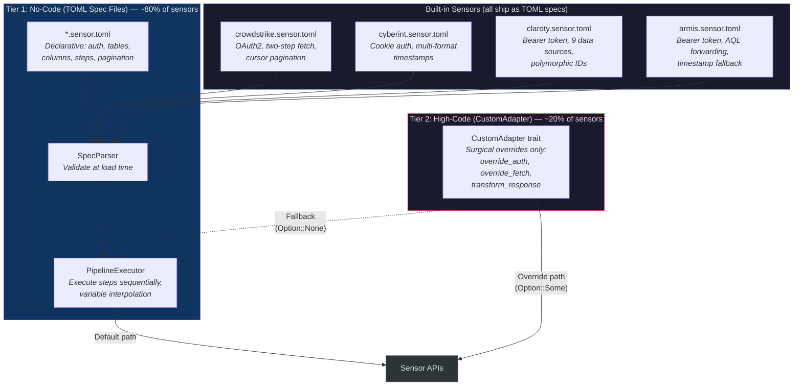
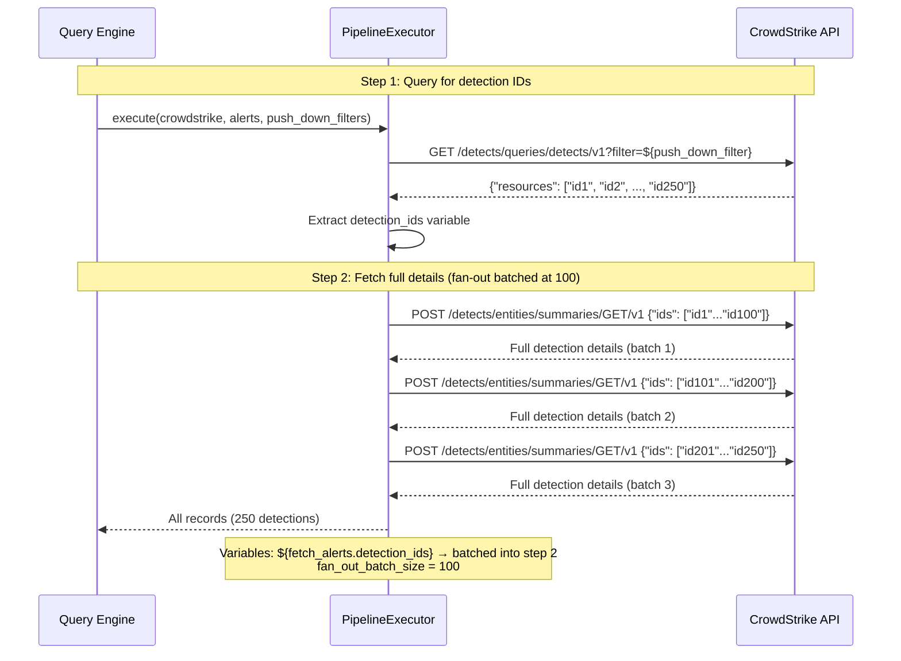
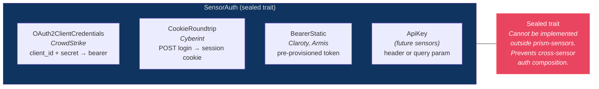

# Sensor Adapters

## Two-Tier Architecture Overview



## CrowdStrike Two-Step Fetch Pipeline



## Authentication Patterns



## Two-Tier Adapter Architecture

### Decision: Config-Driven Sensor Adapters (AD-006)

**Status:** accepted
**Context:** Prism must support 4 initial sensors and be extensible to future sensors. Options: hardcoded per-sensor adapters, config-driven spec files, code generation.
**Options considered:**
1. Hardcoded Rust adapters per sensor — maximum control but requires recompilation for every new sensor
2. Config-driven TOML spec files interpreted at runtime — zero Rust code for ~80% of REST API sensors
3. Code generation from OpenAPI specs — generates Rust code but adds build complexity and may not match real API behavior
**Decision:** Config-driven TOML spec files as the primary mechanism, with a Rust escape hatch (CustomAdapter trait) for the ~20% requiring exotic behavior.
**Rationale:** The four initial sensors (CrowdStrike, Cyberint, Claroty, Armis) ship as TOML spec files alongside the binary. This proves the spec system is sufficient for real-world REST APIs (eat our own dog food) and ensures no special-casing between built-in and third-party sensors.
**Consequences:** Adding a new REST API sensor requires zero Rust code changes. The spec engine must be powerful enough to express all four initial sensors' API patterns.

## Tier 1: No-Code (TOML Spec Files)

A sensor spec file (`*.sensor.toml`) declares everything needed to query a sensor:

```toml
[sensor]
sensor_id = "crowdstrike"
name = "CrowdStrike Falcon"
auth_type = "OAuth2ClientCredentials"
base_url = "https://api.crowdstrike.com"

[[sensor.tables]]
table_name = "alerts"
ocsf_class = "security_finding"
pagination = { type = "cursor_token", cursor_response_path = "$.meta.pagination.next_token" }

[[sensor.tables.columns]]
name = "severity"
col_type = "Integer"
options = ["Index"]
ocsf_field = "severity_id"

[[sensor.tables.steps]]
name = "fetch_alerts"
method = "GET"
path_template = "/detects/queries/detects/v1?filter=${push_down_filter}"
response_path = "$.resources"
variables_produced = ["detection_ids"]

[[sensor.tables.steps]]
name = "fetch_details"
method = "POST"
path_template = "/detects/entities/summaries/GET/v1"
body_template = '{"ids": ${fetch_alerts.detection_ids}}'
response_path = "$.resources"
fan_out_batch_size = 100
```

### Spec Engine Pipeline

The `prism-spec-engine` crate processes spec files through three components:

1. **SpecParser** — Deserializes TOML into `SensorSpec` structs. Validates schema structure, variable references (no forward refs, no undefined steps — DEC-038), OCSF field paths (warnings, not errors), pagination consistency, and rate limit hints. Multi-error reporting.

2. **PipelineExecutor** — Executes the `[[steps]]` array sequentially for a table. Each step makes an HTTP call, extracts results via `response_path`, and produces variables for downstream steps. Fan-out occurs when a variable resolves to an array (batched per `fan_out_batch_size`). Rate-limit-aware pacing using spec-declared hints.

   **Variable interpolation safety:** When substituting `${step_name.field}` values into `body_template` or `path_template`, the PipelineExecutor applies context-aware encoding:
   - **In JSON body templates:** Substituted values are JSON-string-escaped (backslash-escaping `"`, `\`, control characters). The value is always treated as a JSON string value, never raw text — preventing JSON structure injection from attacker-controlled sensor API response values.
   - **In URL path templates:** Substituted values are percent-encoded per RFC 3986.
   - **In array contexts** (`${step.ids}` resolving to a JSON array): The array is serialized as a JSON array literal with each element string-escaped.
   - The `${...}` pattern itself is never recursively expanded — a sensor API response containing `${other_step.secret}` is treated as a literal string, not a variable reference.

3. **ConfigManager** — Stores the active `ConfigSnapshot` in `arc_swap::ArcSwap<ConfigSnapshot>` for lock-free query-time reads. The `reload_config` MCP tool constructs a new snapshot, validates it, and atomically swaps it. Hash-based change detection (SHA-256) skips reload when nothing changed.

   **`add_sensor_spec` MCP tool:** Writes the provided TOML content to the spec directory, then triggers a `reload_config` cycle. All reload guarantees apply: Tier 3 per-file independent validation (DI-030), atomic swap via arc-swap, in-flight queries unaffected (CI-002/CI-007). If validation fails, the spec file is removed and `E-SPEC-001` is returned. If file removal itself fails (permissions, filesystem error), `E-SPEC-002` is returned with the file path so the operator can manually remove it. On success, `notifications/tools/list_changed` is sent if the new spec adds tables. The tool is effectively a convenience wrapper: `write_file + reload_config`.

## Tier 2: High-Code (CustomAdapter Trait)

For sensors requiring behavior TOML cannot express (binary protocols, exotic auth, complex response transforms):

```rust
trait CustomAdapter: Send + Sync {
    fn sensor_id(&self) -> &str;
    fn override_auth(&self, client_id: &TenantId) -> Option<Box<dyn SensorAuth>>;
    fn override_fetch(&self, table: &str, step: &FetchStep, ctx: &FetchContext)
        -> Option<Pin<Box<dyn Future<Output = Result<Vec<RecordBatch>>>>>>;
    fn transform_response(&self, table: &str, raw: &Value) -> Option<Value>;
}
```

A CustomAdapter is a **surgical override** of specific pipeline stages, not a replacement for the spec file. The sensor still has a `.sensor.toml` defining tables, columns, OCSF mappings. The custom adapter only overrides what TOML cannot express. Each `Option`-returning method: `None` means "use spec-driven default."

## Authentication Sealed Trait

### Decision: Sealed SensorAuth Trait (AD-009)

**Status:** accepted
**Context:** Four auth patterns across sensors. Cross-sensor auth composition must be prevented.
**Decision:** `SensorAuth` trait is sealed — only implementable within `prism-sensors`.
**Rationale:** Prevents routing CrowdStrike OAuth2 tokens through Cyberint cookie middleware. Reference: recovered from security posture analysis.

```rust
// Sealed trait — cannot be implemented outside prism-sensors
pub trait SensorAuth: sealed::Sealed + Send + Sync {
    async fn authenticate(&self, client: &reqwest::Client) -> Result<AuthToken>;
    async fn refresh(&self, client: &reqwest::Client, token: &AuthToken) -> Result<AuthToken>;
}
```

| Auth Type | Sensor | Pattern |
|-----------|--------|---------|
| OAuth2ClientCredentials | CrowdStrike | client_id + client_secret → bearer token with expiry |
| CookieRoundtrip | Cyberint | POST login → session cookie |
| BearerStatic | Claroty, Armis | Pre-provisioned bearer token |
| ApiKey | (future sensors) | API key in header or query param |

## Adapter Registry

At startup, `prism-sensors` builds an `AdapterRegistry` mapping `(sensor_id, client_id)` → `SensorAdapter`. Each adapter owns a `reqwest::Client` instance (connection pool + cookie jar for Cyberint). Adapters are instantiated from loaded spec files + client credential config. Sensors with no configured credentials are registered but marked unavailable (tables excluded from query schema).

**Config reload lifecycle:** The registry is rebuilt on config reload. The old `Arc<AdapterRegistry>` is released when all in-flight tasks holding references complete (CI-007). When the last reference is dropped, the old `reqwest::Client` instances are dropped, gracefully closing idle connections. In-flight HTTP requests on the old client complete normally — `reqwest` does not abort outstanding requests on client drop, it waits for them. For Cyberint cookie auth specifically, the session cookie is bound to the old client's cookie jar — the new registry creates a fresh client with a new auth flow. The old client's in-flight request completes with the old session cookie (DEC-039).
