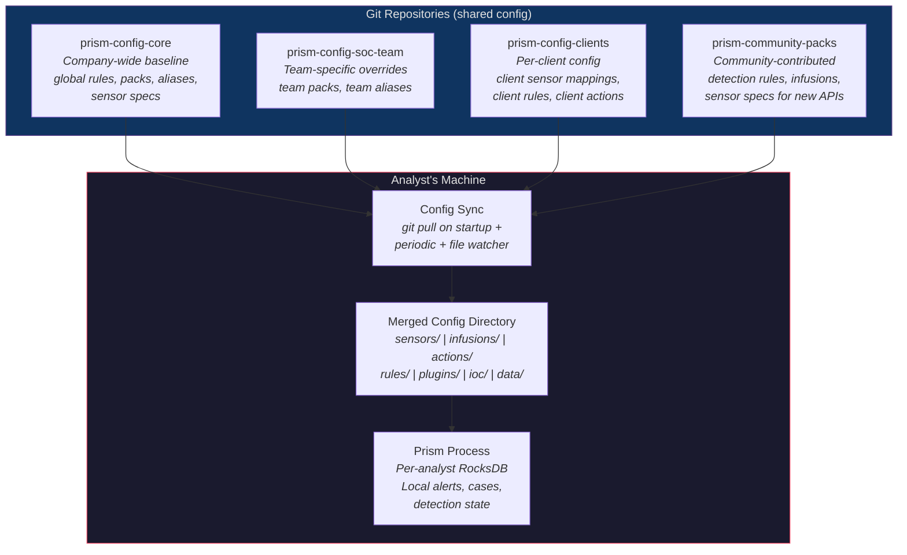
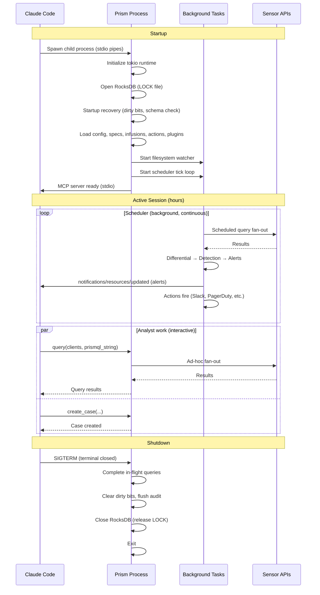
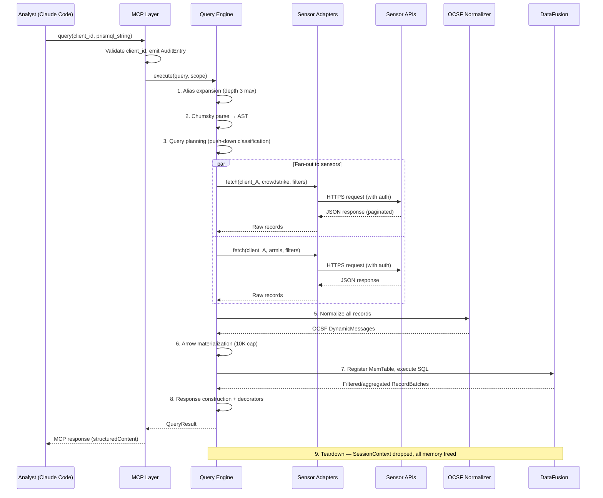
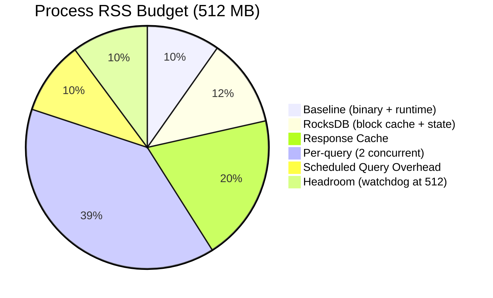
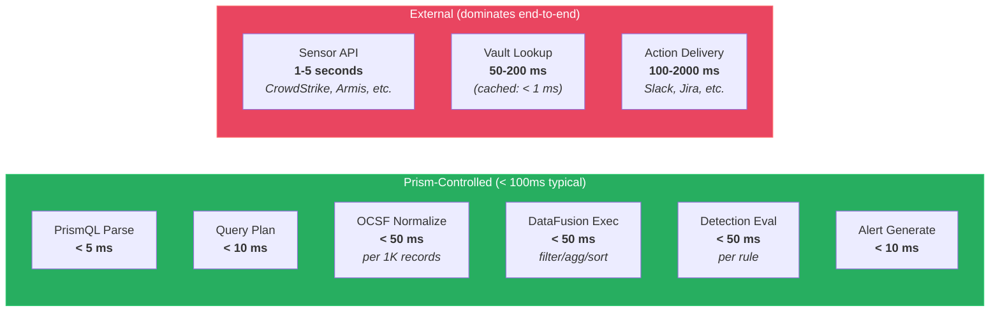

# System Overview

## [Section Content]

## Architecture Vision

Prism is an **ephemeral federated query engine** for MSSP security operations, implemented as a single Rust binary exposing an MCP tool interface over stdio transport. It follows the **data-in-flight** model: Query -> Fetch -> Normalize -> Compute -> Return -> Teardown. No data lake, no ETL pipeline, no index maintenance.

Architecturally analogous to Trino/Presto (federated SQL over heterogeneous sources) but purpose-built for the security domain: OCSF as universal schema, per-client multi-sensor fan-out, MCP as the AI-native interface.

## Architecture Pattern

**Modular monolith** via Cargo workspace. 22 crates (11 non-DTU production/build-helper + 11 DTU test-only) with enforced dependency boundaries, compiled to a single binary. This matches the deployment model (one process per analyst in Claude Code) while providing module isolation through Rust's crate visibility system.

This is NOT a microservices architecture. There is no inter-service communication, no service discovery, no distributed state. The single-process invariant (DI-017) is a feature, not a limitation.

## Deployment Model

- **Runtime:** Per-analyst MCP server in Claude Code (stdio transport)
- **Process model:** One Prism binary per analyst terminal session
- **Concurrency:** Tokio multi-threaded runtime within the single process
- **State:** RocksDB in a local directory (`--state-dir`, default `./state`) — per-analyst, isolated
- **Configuration:** Git-synced config directory (shared across analysts) — see Config Sharing below
- **Credentials:** OS keyring (primary) with AES-256-GCM encrypted file fallback (AD-017)

### Config Sharing — Multi-Repo Git Subscriptions



Configuration files (sensor specs, packs, detection rules, aliases, infusions, actions, IOC files, plugins) are shared across analysts via **git repositories**. Prism supports subscribing to multiple config repos that are layered with merge precedence:

```toml
# prism.toml
[[config_sources]]
name = "core"
repo = "git@github.com:1898co/prism-config-core.git"
branch = "main"
priority = 0                             # lowest priority (base layer)
sync_interval = "5m"

[[config_sources]]
name = "soc-team"
repo = "git@github.com:1898co/prism-config-soc.git"
branch = "main"
priority = 10

[[config_sources]]
name = "clients"
repo = "git@github.com:1898co/prism-config-clients.git"
branch = "main"
priority = 20                            # highest priority (overrides)

[[config_sources]]
name = "community"
repo = "git@github.com:prism-community/detection-packs.git"
branch = "stable"
priority = 5
read_only = true                         # community packs cannot override core
```

**Merge precedence:** Higher priority overrides lower. A detection rule with the same `rule_id` in `clients` (priority 20) overrides the same rule in `core` (priority 0). This is the same three-scope override pattern as detection rules (global → per-client → analyst).

**Sync lifecycle:**
1. On Prism startup: `git pull` each subscribed repo
2. Merge config directories by priority into the working config path
3. Periodic re-sync at configurable interval (default 5m)
4. Filesystem watcher detects merged changes → hot-reload (AD-018)
5. `reload_config` MCP tool can also trigger manual re-sync

**Git client:** Uses the `git2` crate (libgit2 Rust bindings) for repo operations — no dependency on system `git` binary. SSH authentication uses `git2`'s SSH agent forwarding by default; explicit `ssh_key` in config is passed via `git2::Cred::ssh_key()` callback.

**`read_only` enforcement:** Config sources with `read_only = true` cannot override files from non-read-only sources at any priority level (same or higher). They can only ADD files that don't exist in non-read-only sources. If a read-only source contains `rules/global/brute_force.detect` and a higher-priority source has the same file, the higher-priority version wins. Read-only sources are intended for community packs that supplement but cannot override organizational policy.

**Same-priority conflict:** If two sources at the same priority contain the same filename, the source listed later in `[[config_sources]]` wins (last-writer-wins within a priority tier). A WARN is logged identifying the conflict.

**Sync failure behavior:** If `git pull` fails for a config source (network error, auth failure, corrupt repo):
- **On startup:** Prism logs ERROR but continues startup using the last successfully synced content in the local clone. If no local clone exists (first ever sync), the source is skipped with ERROR and the analyst is told to check `prism health`.
- **On periodic re-sync:** WARN logged, previous content retained. Next sync attempt at the configured interval. Three consecutive failures for the same source trigger a `prism://diagnostics/config` warning visible to the AI via `get_diagnostics`.

### Analyst Collaboration Model

**Shared via git (all analysts see the same):**
- Packs, detection rules, aliases, sensor specs, infusions, actions, IOC files, plugins

**Per-analyst (isolated in local RocksDB):**
- Alerts generated by that analyst's detection engine
- Cases created by that analyst
- Differential state (scheduler history)
- Detection state (correlation windows)
- Runtime-created rules, aliases, schedules (analyst-scope)

**Cross-analyst collaboration** uses Actions (AD-021) to bridge to external systems:
- Jira action auto-creates tickets from alerts — all analysts see the same Jira board
- Slack action notifies the SOC channel — all analysts see the same Slack messages
- ServiceNow action creates incidents — shared incident management

Prism's local cases are the analyst's private workspace for triage. The Jira/ServiceNow ticket is the shared system of record.

### Future: Shared Operational State

> **Deferred to post-v1.** A future version may support shared operational state (alerts, cases) via a shared database backend (PostgreSQL) alongside per-analyst RocksDB for process-local state. This would allow multiple analysts to see each other's alerts and collaborate on cases within Prism directly, without requiring an external ticketing system. The split: shared PostgreSQL for alerts/cases (collaboration points), local RocksDB for differential state/detection windows/dirty bits (inherently per-process). This requires careful concurrency design (optimistic locking for cases, append-only for alerts) and is not needed for v1 given the Jira/ServiceNow action integration path.

## Process Lifecycle



The Prism process runs for the **entire Claude Code session** — it is a persistent, long-running child process, not a request-response server. The scheduler, filesystem watcher, and MCP server all run concurrently within the same tokio runtime. When the analyst closes their terminal, Prism receives SIGTERM and shuts down gracefully.

**Next session:** When the analyst opens Claude Code tomorrow, Prism restarts fresh. The startup recovery protocol detects any dirty bits from unclean shutdown, the differential engine treats the first execution as a full diff (epoch changes on restart), and scheduled queries resume from where they left off.

## Design Principles

1. **Data in flight, not at rest.** Sensor data exists only during query execution. The response cache is a performance optimization with TTL, not a data store.
2. **Query engine as universal interface.** All data access (external sensor APIs and internal Prism state) flows through PrismQL and DataFusion. The analyst writes one query language for everything.
3. **Config-driven extensibility.** New sensors are added by dropping a TOML spec file. Built-in sensors use the same spec system (eat our own dog food).
4. **Pure core, effectful shell.** Domain logic (parsing, validation, normalization, state machines) is separated from I/O (HTTP calls, RocksDB, keyring access) for testability and verification.
5. **Defense in depth for writes.** Compile-time cargo features + runtime per-client TOML flags + risk-tiered confirmation tokens. Three independent layers must all permit a write operation.
6. **Client isolation by construction.** `TenantId` newtype threading prevents cross-client data leakage at compile time.
7. **AI-first response design.** Every MCP response is structured for LLM consumption with `outputSchema`, trust annotations, and provenance framing for untrusted sensor data.

## System Boundaries


## Data Flow — Ad-Hoc Query Lifecycle



## Memory Budget Visualization



## Resource Constraints

| Resource | Budget | Source |
|----------|--------|--------|
| Process RSS | 512 MB | NFR-015, DI-027 |
| Per-query memory | 200 MB (normal), 100 MB (restrictive), 512 MB (permissive) | CAP-024 |
| Max concurrent ad-hoc queries | 2 (normal mode) | NFR-015 memory budget |
| Max materialized records | 10,000 per query | DI-019 |
| Query timeout | 30 seconds | DI-019 |
| Max concurrent schedules | 16 | DI-032 |
| Max active confirmation tokens | 100 | DI-015 |
| Cache entries | 50 per client per sensor (default) | DI-018 |
| RocksDB block cache | 32 MB (explicit cap) | AD-004 |
| Audit buffer | 100,000 entries max | CAP-025 |
| Max schedules | 500 | DI-028 |
| Max detection rules | 1,000 | DI-028 |
| Max internal table scan | 50,000 rows | BC-2.15.011 (`PRISM_MAX_INTERNAL_TABLE_SCAN`) |

### Memory Budget Derivation

The 512MB process RSS budget is allocated as follows under worst-case normal operation:

| Component | Budget | Notes |
|-----------|--------|-------|
| Baseline (binary, runtime, static data) | ~50 MB | Rust binary + tokio runtime + static lookup tables |
| RocksDB (block cache + open state) | ~40-80 MB | 32 MB block cache cap + column family metadata + memtable/compaction overhead. NFR-015 estimates 50-100 MB range; budget uses conservative midpoint. Detection state and diff_results on-disk caps (100 MB and 200 MB respectively) constrain the working set that drives RSS. |
| Response cache (worst case) | ~100 MB | 50 entries × 4 sensors × 50 clients × ~10 KB avg per cached response (post-OCSF normalization). See NFR-015 for derivation. |
| Per-query memory (2 concurrent) | ~200 MB | 2 × 100 MB typical (200 MB is the hard cap per query) |
| Scheduled query overhead | ~50 MB | Schedule executions share per-query memory budget; counted separately when running concurrent with ad-hoc queries |
| Headroom | ~72 MB | Absorbs spikes from RocksDB compaction, detection state, tokio task overhead; RSS watchdog triggers at 512 MB |

The "max concurrent queries: 50" in prismql-grammar.md section 8.1 is the hard ceiling for the `permissive` watchdog level (512 MB per-query budget, intended for single-query debugging). Under the default `normal` level (200 MB per-query), the practical limit is 2 concurrent ad-hoc queries. Additional queries beyond this receive `E-WATCHDOG-001` with `retryable: true` and a suggestion to wait. The watchdog's two-check grace period (DI-027) means brief spikes to ~550 MB are possible before self-SIGTERM; this is acceptable for a per-analyst process.

### Latency Targets (p95)

Latency is split into two domains: **Prism-controlled** (parsing, normalization, DataFusion, RocksDB) and **external** (sensor API response time, vault lookups, action destination latency). Prism targets control the parts we own; external latency varies by sensor and network.



#### End-to-End Operation Targets

| Operation | Target (p95) | Prism overhead | External dependency |
|-----------|-------------|----------------|-------------------|
| **Ad-hoc query (single sensor)** | < 3 seconds | < 100 ms | Sensor API ~1-3s |
| **Ad-hoc query (cross-sensor, 4 sensors)** | < 5 seconds | < 100 ms | Slowest sensor (parallel fan-out) |
| **Ad-hoc query (with JOIN)** | < 8 seconds | < 200 ms | Both sides in parallel |
| **Ad-hoc query (with local infusions)** | < 5 seconds | < 150 ms | Sensor API + GeoIP/CSV < 1 ms |
| **Ad-hoc query (with API infusions)** | < 10 seconds | < 150 ms | Sensor API + threat intel API 100-500 ms |
| **explain_query (dry-run)** | < 100 ms | 100 ms | None (no fan-out) |
| **Scheduled query + differential + detection** | < 10 seconds | < 300 ms | Sensor API |
| **Config reload** | < 500 ms | 500 ms | None (local files) |
| **Config reload (with git sync)** | < 5 seconds | < 500 ms | Git pull latency |

#### Prism-Internal Operation Targets

| Operation | Target (p95) | Notes |
|-----------|-------------|-------|
| **PrismQL parse** | < 5 ms | Pure computation, Chumsky zero-copy |
| **Query planning (push-down classification)** | < 10 ms | AST walk + column option lookup |
| **OCSF normalization** | < 50 ms per 1K records | DynamicMessage field mapping |
| **Arrow materialization** | < 20 ms per 1K records | RecordBatch construction + virtual fields |
| **DataFusion execution** | < 50 ms | Filter/agg/sort/limit over in-memory MemTable |
| **DataFusion JOIN** | < 100 ms | Hash join over two MemTables (each < 10K records) |
| **Detection rule evaluation** | < 50 ms per rule | DataFusion SQL against differential RecordBatch |
| **Correlation window update** | < 5 ms | RocksDB read + write to detection_state |
| **Alert generation + snapshot** | < 10 ms | Template render + EventSnapshot + RocksDB write |
| **Credential resolution (cached)** | < 1 ms | In-memory SecretString lookup |
| **Credential resolution (keyring)** | < 50 ms | OS keyring API call |
| **Credential resolution (vault)** | < 200 ms | Network call to vault (cached after first access) |
| **RocksDB read** | < 1 ms | Single-key get from column family |
| **RocksDB write (sync)** | < 5 ms | WAL flush (dirty bits, audit intent) |
| **RocksDB write (async)** | < 1 ms | Buffered write (detection state, rate limits) |
| **WASM plugin invocation** | < 1 second | Plugin-dependent; fuel limit prevents runaway |
| **Infusion UDF (local lookup)** | < 1 ms per value | GeoIP MMDB, CSV, JSON — in-memory after load |
| **Infusion UDF (API, cached)** | < 1 ms per value | In-memory LRU cache hit |
| **Infusion UDF (API, cache miss)** | < 500 ms per value | External API call (VirusTotal, GreyNoise, etc.) |
| **File watcher event processing** | < 50 ms | Debounced at 500ms, processing is fast |
| **MCP resource read** | < 10 ms | Static content or config snapshot |
| **get_help / get_diagnostics** | < 50 ms | Read from in-memory state or static docs |

#### What We Measure

The `get_diagnostics(subsystem: "fanout")` tool reports per-sensor latency percentiles so the analyst (or AI) can identify slow sensors:

```json
{
  "sensor_latencies": {
    "crowdstrike": { "p50": 890, "p95": 2340, "p99": 4100, "unit": "ms" },
    "armis": { "p50": 450, "p95": 1200, "p99": 2800, "unit": "ms" },
    "claroty": { "p50": 620, "p95": 1800, "p99": 3500, "unit": "ms" },
    "cyberint": { "p50": 380, "p95": 980, "p99": 1900, "unit": "ms" }
  },
  "prism_overhead": {
    "parse_ms": { "p50": 1, "p95": 3, "p99": 5 },
    "normalize_ms": { "p50": 12, "p95": 35, "p99": 48 },
    "datafusion_ms": { "p50": 8, "p95": 28, "p99": 45 },
    "total_prism_ms": { "p50": 25, "p95": 72, "p99": 98 }
  }
}
```

This lets the AI say: "Your query took 4.2 seconds. Prism's overhead was 72 ms — the remaining 4.1 seconds was waiting for CrowdStrike's API to respond. This is normal for CrowdStrike at p95."
