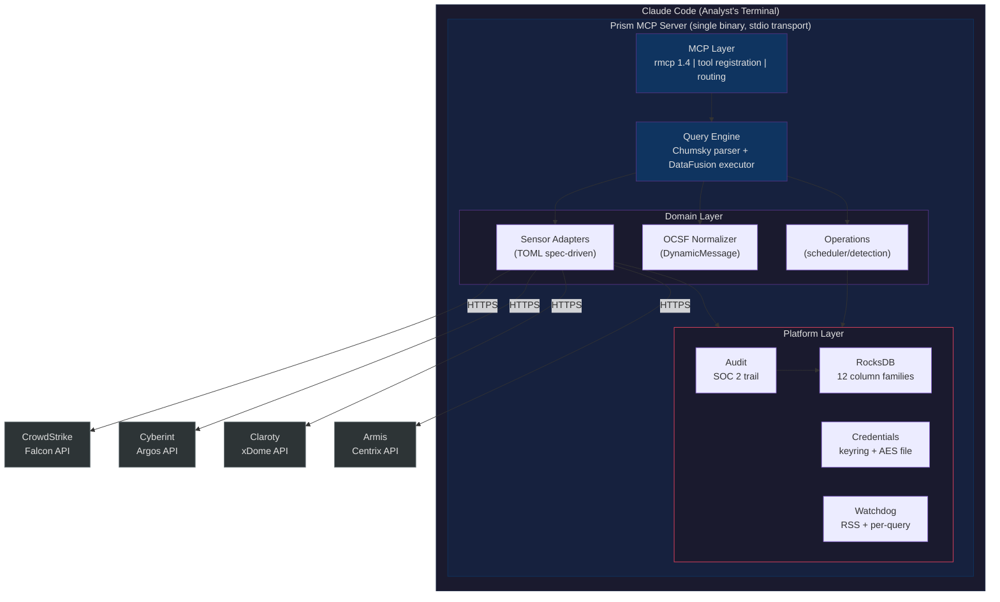
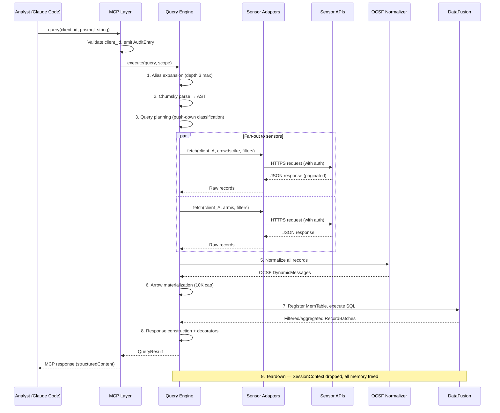
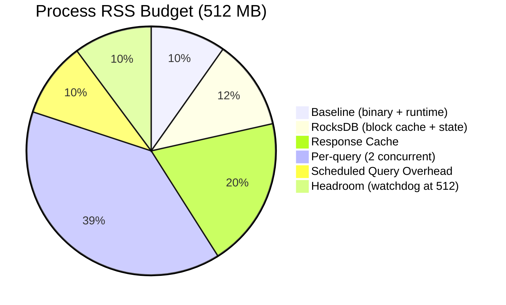

# System Overview

## Architecture Vision

Prism is an **ephemeral federated query engine** for MSSP security operations, implemented as a single Rust binary exposing an MCP tool interface over stdio transport. It follows the **data-in-flight** model: Query -> Fetch -> Normalize -> Compute -> Return -> Teardown. No data lake, no ETL pipeline, no index maintenance.

Architecturally analogous to Trino/Presto (federated SQL over heterogeneous sources) but purpose-built for the security domain: OCSF as universal schema, per-client multi-sensor fan-out, MCP as the AI-native interface.

## Architecture Pattern

**Modular monolith** via Cargo workspace. 12 crates with enforced dependency boundaries, compiled to a single binary. This matches the deployment model (one process per analyst in Claude Code) while providing module isolation through Rust's crate visibility system.

This is NOT a microservices architecture. There is no inter-service communication, no service discovery, no distributed state. The single-process invariant (DI-017) is a feature, not a limitation.

## Deployment Model

- **Runtime:** Per-analyst MCP server in Claude Code (stdio transport)
- **Process model:** One Prism binary per analyst terminal session
- **Concurrency:** Tokio multi-threaded runtime within the single process
- **State:** RocksDB in a local directory (`--state-dir`, default `./state`)
- **Configuration:** `prism.toml` + `aliases.toml` + `*.sensor.toml` spec files
- **Credentials:** OS keyring (primary) with AES-256-GCM encrypted file fallback

## Design Principles

1. **Data in flight, not at rest.** Sensor data exists only during query execution. The response cache is a performance optimization with TTL, not a data store.
2. **Query engine as universal interface.** All data access (external sensor APIs and internal Prism state) flows through PrismQL and DataFusion. The analyst writes one query language for everything.
3. **Config-driven extensibility.** New sensors are added by dropping a TOML spec file. Built-in sensors use the same spec system (eat our own dog food).
4. **Pure core, effectful shell.** Domain logic (parsing, validation, normalization, state machines) is separated from I/O (HTTP calls, RocksDB, keyring access) for testability and verification.
5. **Defense in depth for writes.** Compile-time cargo features + runtime per-client TOML flags + risk-tiered confirmation tokens. Three independent layers must all permit a write operation.
6. **Client isolation by construction.** `TenantId` newtype threading prevents cross-client data leakage at compile time.
7. **AI-first response design.** Every MCP response is structured for LLM consumption with `outputSchema`, trust annotations, and provenance framing for untrusted sensor data.

## System Boundaries

## Data Flow — Ad-Hoc Query Lifecycle

## Memory Budget Visualization

## Resource Constraints

| Resource | Budget | Source |
|----------|--------|--------|
| Process RSS | 512 MB | NFR-015, DI-027 |
| Per-query memory | 200 MB (normal), 100 MB (restrictive), 512 MB (permissive) | CAP-024 |
| Max concurrent ad-hoc queries | 2 (normal mode) | NFR-015 memory budget |
| Max materialized records | 10,000 per query | DI-019 |
| Query timeout | 30 seconds | DI-019 |
| Max concurrent schedules | 16 | DI-032 |
| Max active confirmation tokens | 100 | DI-015 |
| Cache entries | 50 per client per sensor (default) | DI-018 |
| RocksDB block cache | 32 MB (explicit cap) | AD-004 |
| Audit buffer | 100,000 entries max | CAP-025 |
| Max schedules | 500 | DI-028 |
| Max detection rules | 1,000 | DI-028 |
| Max internal table scan | 50,000 rows | BC-2.15.011 (`PRISM_MAX_INTERNAL_TABLE_SCAN`) |

### Memory Budget Derivation

The 512MB process RSS budget is allocated as follows under worst-case normal operation:

| Component | Budget | Notes |
|-----------|--------|-------|
| Baseline (binary, runtime, static data) | ~50 MB | Rust binary + tokio runtime + static lookup tables |
| RocksDB (block cache + open state) | ~40-80 MB | 32 MB block cache cap + column family metadata + memtable/compaction overhead. NFR-015 estimates 50-100 MB range; budget uses conservative midpoint. Detection state and diff_results on-disk caps (100 MB and 200 MB respectively) constrain the working set that drives RSS. |
| Response cache (worst case) | ~100 MB | 50 entries × 4 sensors × 50 clients × ~10 KB avg per cached response (post-OCSF normalization). See NFR-015 for derivation. |
| Per-query memory (2 concurrent) | ~200 MB | 2 × 100 MB typical (200 MB is the hard cap per query) |
| Scheduled query overhead | ~50 MB | Schedule executions share per-query memory budget; counted separately when running concurrent with ad-hoc queries |
| Headroom | ~72 MB | Absorbs spikes from RocksDB compaction, detection state, tokio task overhead; RSS watchdog triggers at 512 MB |

The "max concurrent queries: 50" in prismql-grammar.md section 8.1 is the hard ceiling for the `permissive` watchdog level (512 MB per-query budget, intended for single-query debugging). Under the default `normal` level (200 MB per-query), the practical limit is 2 concurrent ad-hoc queries. Additional queries beyond this receive `E-WATCHDOG-001` with `retryable: true` and a suggestion to wait. The watchdog's two-check grace period (DI-027) means brief spikes to ~550 MB are possible before self-SIGTERM; this is acceptable for a per-analyst process.
