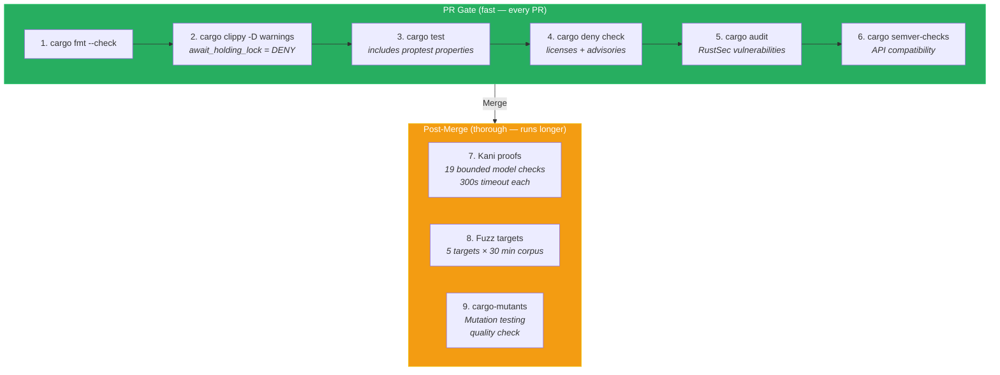

# Tooling Selection

## CI Pipeline Overview



## Verification Toolchain

| Tool | Purpose | Version | Configuration | CI Integration |
|------|---------|---------|---------------|----------------|
| Kani | Bounded model checking (formal proofs) | latest stable | `kani.toml` at workspace root | Separate CI job (long-running) |
| proptest | Property-based testing | 1.x | `proptest.toml` per crate | Runs with `cargo test` |
| cargo-fuzz | Fuzz testing (libFuzzer) | latest | `fuzz/` directory per target crate | Separate CI job (continuous) |
| cargo-mutants | Mutation testing | latest | default config | Post-merge quality check |
| cargo-semver-checks | API compatibility validation | latest | default config | PR gate |

## Build Toolchain

| Tool | Purpose | Version |
|------|---------|---------|
| Rust | Language compiler | stable (latest) |
| cargo | Build system / package manager | (bundled with Rust) |
| just | Task runner (replaces Makefiles) | latest |
| lefthook | Git hooks | latest |

## Development Toolchain

| Tool | Purpose | Configuration |
|------|---------|---------------|
| clippy | Lint | `clippy.toml` — deny `clippy::await_holding_lock`, warn `clippy::unwrap_used` |
| rustfmt | Formatting | `rustfmt.toml` — edition 2021, max_width 100 |
| cargo-deny | Dependency audit (licenses, advisories) | `deny.toml` |
| cargo-udeps | Unused dependency detection | default config |
| cargo-machete | Unused dependency detection (faster) | default config |

## Security Scanning

| Tool | Purpose | Configuration |
|------|---------|---------------|
| cargo-audit | Known vulnerability database (RustSec) | CI gate, runs on PR |
| Semgrep | SAST rules for Rust | `.semgrep/` rules directory |
| cargo-deny | License compliance + advisory check | `deny.toml` |

## Kani Configuration

```toml
# kani.toml
[general]
# Default bound for loops and recursion
default-unwind = 10

[verification]
# Timeout per proof (seconds)
timeout = 300

# Memory limit per proof (MB)
memory-limit = 8192
```

Kani proofs are marked with `#[kani::proof]` and live alongside the module they verify. Each proof is bounded — unbounded input spaces use `kani::assume()` to constrain to relevant ranges.

## Fuzz Target Structure

```
prism-query/fuzz/
  Cargo.toml
  fuzz_targets/
    fuzz_prismql_parser.rs    -- arbitrary bytes -> parse()
    fuzz_alias_expansion.rs -- arbitrary alias graphs -> expand()

prism-ocsf/fuzz/
  Cargo.toml
  fuzz_targets/
    fuzz_normalize.rs       -- arbitrary JSON -> normalize()

prism-spec-engine/fuzz/
  Cargo.toml
  fuzz_targets/
    fuzz_spec_parser.rs     -- arbitrary TOML -> parse_spec()

prism-security/fuzz/
  Cargo.toml
  fuzz_targets/
    fuzz_injection_scanner.rs -- arbitrary strings -> scan()
```

## CI Pipeline Structure

```
PR opened:
  1. cargo fmt --check
  2. cargo clippy -- -D warnings
  3. cargo test (includes proptest)
  4. cargo deny check
  5. cargo audit
  6. cargo semver-checks (if lib crate changed)

Post-merge:
  7. Kani proofs (all VP-* targets)
  8. Fuzz (30-minute corpus run)
  9. cargo-mutants (mutation testing)
```
