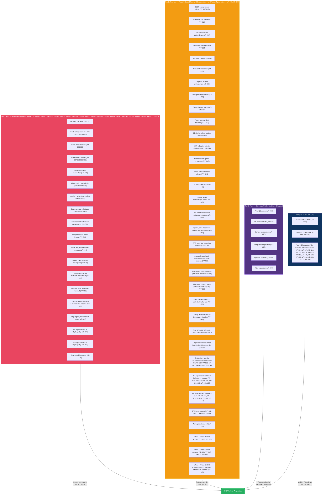

# Verification Architecture

## [Section Content]

See verification strategy, provable properties catalog, and proof harness patterns below.

## VP Priority Tier vs BC Priority Tier Convention

Verification property (VP) priority tiers (P0/P1) reflect the formal-verification roadmap, not the underlying behavior's runtime priority. A behavioral contract (BC) may be P0 (required for v1 launch) while its enforcing VP is P1 — meaning the behavior ships v1 but the formal proof may land during hardening rather than initial launch. This pattern applies to 12+ VP-BC pairs in the current catalog (e.g., VP-061 P1 verifies BC-2.20.002 P0; VP-054 P1 verifies BC-2.14.008 P0). This is intentional: runtime behavior is enforced by tests and the BC contract; formal proof adds defense-in-depth verification on a separate schedule.

## Verification Strategy Overview



## Verification Strategy

Prism uses a three-tier verification approach, with tool selection driven by module purity and criticality:

| Tier | Tool | Target | Scope |
|------|------|--------|-------|
| Formal proofs | Kani | Pure-core functions with safety-critical invariants | Bounded model checking of all paths |
| Property tests | proptest | Pure-core functions with complex input spaces | Randomized exploration of input space |
| Fuzz testing | cargo-fuzz (libFuzzer) | Parser inputs, deserialization, untrusted data processing | Coverage-guided mutation of byte streams |

## Provable Properties Catalog

Properties are organized by the domain invariant or BC postcondition they verify. Each VP traces to a specific Source Invariant / BC and, where applicable, a domain-spec DI-NNN or a BC-level postcondition ID.

| ID | Property | Module | Method | Feasibility | Priority | Source Invariant / BC |
|----|----------|--------|--------|-------------|----------|-----------------------|
| VP-001 | OrgSlug rejects invalid characters | prism-core | kani | feasible | P0 | BC-3.1.001 |
| VP-002 | Capability resolution: deny-by-default | prism-core | kani | feasible | P0 | DI-003 |
| VP-003 | Capability resolution: most-specific-path wins | prism-core | kani | feasible | P0 | DI-003 |
| VP-004 | Capability resolution: deny overrides allow at same specificity | prism-core | kani | feasible | P0 | DI-003 |
| VP-005 | Case state machine: exactly 12 valid transitions | prism-core | kani | feasible | P0 | DI-025 |
| VP-006 | Case state machine: no self-transitions | prism-core | kani | feasible | P0 | DI-025 |
| VP-007 | Confirmation token expiry: expired at boundary (inclusive) | prism-security | kani | feasible | P0 | DI-007 |
| VP-008 | Confirmation token: single-use (consumed rejects second use) | prism-security | kani | feasible | P0 | DI-007 |
| VP-009 | Confirmation token: content hash mismatch rejects | prism-security | kani | feasible | P0 | DI-007 |
| VP-010 | Token cap: store rejects at 100 active tokens | prism-security | kani | feasible | P0 | DI-015 |
| VP-011 | Credential name sanitization: rejects path traversal | prism-core | kani | feasible | P0 | DI-014 |
| VP-012 | Alias depth: rejects composition beyond depth 3 | prism-query | kani | feasible | P0 | DI-020 |
| VP-013 | Alias cycles: detects and rejects cyclic references | prism-query | proptest | feasible | P0 | DI-020 |
| VP-014 | Query security limits: rejects oversized queries | prism-query | kani | feasible | P0 | DI-019 |
| VP-015 | Query security limits: rejects excessive nesting depth | prism-query | kani | feasible | P0 | DI-019 |
| VP-016 | OCSF normalization: output is valid protobuf | prism-ocsf | proptest | feasible | P0 | DI-005 |
| VP-017 | OCSF normalization: unmapped fields preserved in raw_extensions | prism-ocsf | proptest | feasible | P0 | DI-005 |
| VP-018 | Detection rule validation: rejects invalid rules | prism-operations | proptest | feasible | P0 | DI-024 |
| VP-019 | Diff computation: deterministic (same inputs -> same output) | prism-operations | proptest | feasible | P0 | DI-023 |
| VP-020 | Feature flag: compile-time AND runtime must both permit | prism-security | kani | feasible | P0 | DI-003 |
| VP-021 | PrismQL parser: never panics on arbitrary input | prism-query | fuzz | feasible | P0 | DI-019 |
| VP-022 | OCSF normalizer: never panics on arbitrary sensor response | prism-ocsf | fuzz | feasible | P0 | DI-005 |
| VP-023 | Sensor spec parser: never panics on arbitrary TOML | prism-spec-engine | fuzz | feasible | P0 | DI-030 |
| VP-024 | Injection scanner: detects known injection patterns | prism-security | proptest | feasible | P0 | DI-006 |
| VP-025 | Cache key derivation: deterministic for same parameters | prism-query | kani | feasible | P1 | DI-018 |
| VP-026 | Splay computation: deterministic per (query, client) | prism-operations | kani | feasible | P1 | DI-022 |
| VP-027 | Alert dedup key: correct per match mode | prism-operations | proptest | feasible | P0 | BC-2.13.013 |
| VP-028 | Template interpolation: never panics, handles missing vars | prism-operations | fuzz | feasible | P0 | BC-2.13.005 |
| VP-029 | Cursor cap: rejects at 200 active cursors | prism-core | kani | feasible | P1 | DI-001 |
| VP-030 | Schedule/rule count caps: rejects beyond limits | prism-operations | kani | feasible | P1 | DI-028 |
| VP-031 | Required column enforcement: rejects unconstrained queries | prism-query | proptest | feasible | P0 | DI-021 |
| VP-032 | Hot reload atomicity: failed validation retains old config | prism-spec-engine | proptest | feasible | P1 | DI-031 |
| VP-033 | Audit buffer: RocksDB write completes before delivery attempt | prism-dtu-crowdstrike | integration_test | feasible | P0 | DI-026 |
| VP-034 | Encryption round-trip: encrypt then decrypt with same key returns plaintext | prism-credentials | proptest | feasible | P0 | NFR-004 |
| VP-035 | Key derivation: different salts produce different keys; same inputs produce same key | prism-credentials | proptest | feasible | P1 | NFR-004 |
| VP-036 | SessionContext dropped before error propagation and on panic in execute_scheduled callers | prism-dtu-crowdstrike | integration_test | feasible | P0 | DI-027 |
| VP-037 | Alias expansion: never panics on arbitrary alias graphs (cycles, deep nesting, self-reference) | prism-query | fuzz | feasible | P1 | DI-020 |
| VP-038 | Injection scanner: never panics on arbitrary input strings | prism-security | fuzz | feasible | P0 | DI-006 |
| VP-039 | Audit forward watermark: monotonically non-decreasing per destination across ACK, failure, and restart sequences | prism-audit | kani | feasible | P0 | BC-2.05.011 |
| VP-040 | Plugin linker excludes all WASI namespace imports | prism-spec-engine | kani | feasible | P1 | BC-2.17.002 |
| VP-041 | Plugin memory limit boundary: at-limit succeeds, over-limit traps | prism-spec-engine | proptest | feasible | P1 | BC-2.17.003 |
| VP-042 | Plugin hot reload: failed compile retains old InstancePre | prism-spec-engine | proptest | feasible | P1 | BC-2.17.005 |
| VP-043 | WIT validation rejects component missing required exports | prism-spec-engine | proptest | feasible | P1 | BC-2.17.006 |
| VP-044 | Action retry state machine: bounded by 5 attempts, dead-letter terminal | prism-operations | kani | feasible | P0 | BC-2.18.001 |
| VP-045 | Schedule semaphore: try_acquire used (non-blocking), never acquire | prism-operations | proptest | feasible | P0 | BC-2.18.004 |
| VP-046 | Action inline credential rejected at load time; value not in error message | prism-operations | proptest | feasible | P0 | BC-2.18.007 |
| VP-047 | UUID v7 validation: non-v7 always rejected, v7 always accepted, order preserved | prism-operations | proptest | feasible | P0 | BC-2.18.009 |
| VP-048 | Infusion spec: N fields produces exactly N UDF descriptors; duplicates error | prism-spec-engine | kani | feasible | P1 | BC-2.19.001 |
| VP-049 | Infusion per-query dedup: source calls = unique value count | prism-spec-engine | proptest | feasible | P1 | BC-2.19.002 |
| VP-050 | MCP sensor resource response redacts credentials and full API URLs | prism-mcp | proptest | feasible | P0 | BC-2.10.008 |
| VP-051 | Case state machine: exhaustive 5x5 transition table — 12 accept, 13 reject | prism-core | kani | feasible | P0 | DI-025 |
| VP-052 | update_case: disposition applied before status transition in single-call update | prism-operations | proptest | feasible | P0 | BC-2.14.003 |
| VP-053 | Resolved case always has non-null disposition; transition rejects without disposition | prism-operations | kani | feasible | P0 | BC-2.14.006 |
| VP-054 | TTR uses first resolution timestamp across reopen cycles; null aggregate when no resolved cases | prism-operations | proptest | feasible | P1 | BC-2.14.008 |
| VP-055 | StorageEngine put_batch atomicity and domain isolation (MockStorageEngine) | prism-storage | proptest | feasible | P1 | BC-2.15.002 |
| VP-056 | Audit buffer overflow purge: oldest entries deleted, newest preserved, purge-event produced | prism-audit | proptest | feasible | P1 | BC-2.15.004 |
| VP-057 | Crash recovery: denylist triggered at consecutive_crashes >= 3; exact threshold | prism-storage | kani | feasible | P0 | BC-2.15.005 |
| VP-058 | Watchdog memory grace period: single check does not terminate; two consecutive checks do | prism-storage | proptest | feasible | P0 | DI-027 |
| VP-059 | Spec validator: all errors collected (no fail-fast); warning-only specs return Ok | prism-spec-engine | proptest | feasible | P1 | DI-030 |
| VP-060 | Dedup decision: Link(c.id) iff existing case within window; Create otherwise | prism-operations | proptest | feasible | P0 | BC-2.14.013 |
| VP-061 | Log forwarder min-level filter: per-destination enqueue/discard matches level-rank ordering for all 5×5 level pairs | prism-mcp | proptest | feasible | P1 | BC-2.20.002 |
| VP-062 | Log forwarder queue cap: queue.len() never exceeds 10 × batch_size; drop_count +1 per overflow enqueue | prism-mcp | proptest | feasible | P1 | BC-2.20.003 |
| VP-063 | OrgRegistry round-trip resolve/slug_for returns original slug | prism-core | proptest | feasible | P0 | BC-3.1.001 |
| VP-064 | OrgRegistry resolve/slug_for leaves registry size unchanged | prism-core | proptest | feasible | P0 | BC-3.1.001 |
| VP-065 | OrgRegistry lookup completes in bounded steps regardless of registry size | prism-core | kani | feasible | P1 | BC-3.1.001 |
| VP-066 | Every AuditEntry has non-null org_id and non-null org_slug | prism-audit | proptest | feasible | P0 | BC-3.1.002 |
| VP-067 | org_id is stable across slug rename | prism-audit | proptest | feasible | P0 | BC-3.1.002 |
| VP-068 | Denormalized slug matches OrgRegistry slug at time of emission | prism-audit | integration_test | feasible | P0 | BC-3.1.002 |
| VP-069 | OrgRegistry bijection: forward-map size == reverse-map size after every operation | prism-core | proptest | feasible | P0 | BC-3.1.003 |
| VP-070 | No duplicate slug: two successful registrations with same slug is impossible | prism-core | kani | feasible | P0 | BC-3.1.003 |
| VP-071 | No duplicate uuid: two successful registrations with same uuid is impossible | prism-core | kani | feasible | P0 | BC-3.1.003 |
| VP-072 | Rename atomicity: no intermediate state observed by concurrent reader | prism-core | proptest | feasible | P0 | BC-3.1.003 |
| VP-073 | Registry size unchanged after any Err return from register | prism-core | proptest | feasible | P0 | BC-3.1.004 |
| VP-074 | Err(SlugConflict) message contains both existing UUID and attempted UUID | prism-core | proptest | feasible | P0 | BC-3.1.004 |
| VP-075 | Err(IdConflict) message contains both existing slug and attempted slug | prism-core | proptest | feasible | P0 | BC-3.1.004 |
| VP-076 | After N successful registrations and one rejected, resolve correct for all N pairs | prism-core | proptest | feasible | P0 | BC-3.1.004 |
| VP-077 | Cross-org lookup returns empty/None: write under org_id_A, lookup under org_id_B | prism-sensors | proptest | feasible | P0 | BC-3.2.001 |
| VP-078 | Write under org_id_A does not modify any entry keyed under org_id_B | prism-sensors | proptest | feasible | P0 | BC-3.2.001 |
| VP-079 | OrgId-flipping mutation: replacing org_id in lookup key returns wrong result | prism-sensors | proptest | feasible | P0 | BC-3.2.001 |
| VP-080 | reset_for(org_id_A) removes exactly org_id_A entries and no others | prism-sensors | proptest | feasible | P0 | BC-3.2.001 |
| VP-081 | Cross-org cred lookup returns NotFound for org_id_B after storing under org_id_A | prism-credentials | proptest | feasible | P0 | BC-3.2.002 |
| VP-082 | Namespace key never contains slug string after OrgId migration | prism-credentials | proptest | feasible | P0 | BC-3.2.002 |
| VP-083 | Rename does not invalidate credential: same org_id returns same cred before/after rename | prism-credentials | integration_test | feasible | P0 | BC-3.2.002 |
| VP-084 | Cross-org token validation always false: org_id_A token invalid in org_id_B context | prism-credentials | proptest | feasible | P0 | BC-3.2.003 |
| VP-085 | Refresh preserves org binding: new token stored under same org_id as expired token | prism-credentials | proptest | feasible | P0 | BC-3.2.003 |
| VP-086 | reset_for(org_id_A) removes only org_id_A tokens; org_id_B tokens survive | prism-credentials | proptest | feasible | P0 | BC-3.2.003 |
| VP-087 | OrgId appears in payload body: shared-mode payload JSON contains org_id key | prism-sensors | proptest | feasible | P0 | BC-3.2.004 |
| VP-088 | OrgId absent from HTTP routing fields: URL and headers contain no org_id or org_slug | prism-sensors | proptest | feasible | P0 | BC-3.2.004 |
| VP-089 | Concurrent sends produce independent payloads with distinct org_id values | prism-sensors | proptest | feasible | P0 | BC-3.2.004 |
| VP-090 | Mode metadata absent from query results: result rows contain no mode field | prism-sensors | integration_test | feasible | P0 | BC-3.2.004 |
| VP-091 | DtuMode has no setter: no public method accepts DtuMode after startup | prism-sensors | proptest | feasible | P0 | BC-3.2.005 |
| VP-092 | Startup rejects unknown mode values: serde of non-shared/non-client string returns Err | prism-sensors | proptest | feasible | P0 | BC-3.2.005 |
| VP-093 | Security Telemetry type with mode=shared causes startup error | prism-sensors | proptest | feasible | P0 | BC-3.2.005 |
| VP-094 | reload_config does not apply mode changes | prism-sensors | integration_test | feasible | P0 | BC-3.2.005 |
| VP-095 | Every ST type in DTU_DEFAULT_MODE triggers startup error when paired with mode=shared | prism-spec-engine | unit_test | feasible | P0 | BC-3.3.001 |
| VP-096 | No MSSP Coordination type triggers startup error when paired with mode=client | prism-spec-engine | unit_test | feasible | P0 | BC-3.3.001 |
| VP-097 | Startup error message contains DTU type string and config file path | prism-spec-engine | unit_test | feasible | P0 | BC-3.3.001 |
| VP-098 | Multi-error: N violations produce N errors in one pass before abort | prism-spec-engine | unit_test | feasible | P0 | BC-3.3.001 |
| VP-099 | Non-scheme credential-pattern field value always causes exit code 1 | prism-spec-engine | proptest | feasible | P0 | BC-3.3.002 |
| VP-100 | E-CFG-020 error message never contains the literal field value | prism-spec-engine | proptest | feasible | P0 | BC-3.3.002 |
| VP-101 | All four allowed scheme prefixes accepted for credential-pattern fields | prism-spec-engine | proptest | feasible | P0 | BC-3.3.002 |
| VP-102 | All integer schema_version values != 1 produce exit code 1 | prism-spec-engine | proptest | feasible | P0 | BC-3.3.003 |
| VP-103 | Absent schema_version produces E-CFG-030, not E-CFG-031 | prism-spec-engine | proptest | feasible | P0 | BC-3.3.003 |
| VP-104 | schema_version=1 never produces schema-version error regardless of other fields | prism-spec-engine | proptest | feasible | P0 | BC-3.3.003 |
| VP-105 | Exit code 0 implies OrgRegistry entry count equals file count | prism-spec-engine | proptest | feasible | P0 | BC-3.3.004 |
| VP-106 | Any validation error implies exit code 1 and empty OrgRegistry | prism-spec-engine | proptest | feasible | P0 | BC-3.3.004 |
| VP-107 | Validation error output always includes the offending filename | prism-spec-engine | integration_test | feasible | P0 | BC-3.3.004 |
| VP-108 | Generator idempotent: generate(inputs) == generate(inputs) for identical inputs | prism-dtu-common | kani | feasible | P0 | BC-3.4.001 |
| VP-109 | Different seeds produce different records with overwhelming probability | prism-dtu-common | proptest | feasible | P0 | BC-3.4.001 |
| VP-110 | Different orgs produce different records for same seed with overwhelming probability | prism-dtu-common | proptest | feasible | P0 | BC-3.4.001 |
| VP-111 | No thread_rng or SystemTime::now in generator call stack | prism-dtu-common | proptest | feasible | P0 | BC-3.4.001 |
| VP-112 | All non-SchemaDrift archetype records pass schema validation | prism-dtu-common | integration_test | feasible | P0 | BC-3.4.002 |
| VP-113 | SchemaDrift archetype: schema_valid false and at least one record fails | prism-dtu-common | proptest | feasible | P0 | BC-3.4.002 |
| VP-114 | Schema validation absent from release build (cfg(test) gate) | prism-dtu-common | proptest | feasible | P0 | BC-3.4.002 |
| VP-115 | Each archetype at scale=1.0 produces documented baseline record count | prism-dtu-common | integration_test | feasible | P0 | BC-3.4.003 |
| VP-116 | floor(baseline*scale) formula holds for all archetypes and scales in [0.01,100.0] | prism-dtu-common | proptest | feasible | P0 | BC-3.4.003 |
| VP-117 | DormantTenant always produces 0 records for all scale values | prism-dtu-common | proptest | feasible | P0 | BC-3.4.003 |
| VP-118 | SchemaDrift always produces exactly 1 non-conformant record | prism-dtu-common | proptest | feasible | P0 | BC-3.4.003 |
| VP-119 | Generated record ID sets disjoint for all org pairs with distinct slugs | prism-dtu-common | proptest | feasible | P0 | BC-3.4.004 |
| VP-120 | Every record primary ID contains org slug as a substring | prism-dtu-common | proptest | feasible | P0 | BC-3.4.004 |
| VP-121 | OrgRegistry lookup failure returns Err(UnregisteredOrg) and does not panic | prism-dtu-common | proptest | feasible | P0 | BC-3.4.004 |
| VP-122 | endpoints entry count equals orgs-count times dtu-types-per-org after build() | prism-dtu-harness | proptest | feasible | P0 | BC-3.5.001 |
| VP-123 | All socket addresses in endpoints are pairwise distinct (no port collision) | prism-dtu-harness | proptest | feasible | P0 | BC-3.5.001 |
| VP-124 | After drop(harness), TcpStream::connect to every clone addr returns ConnectionRefused | prism-dtu-harness | integration_test | feasible | P0 | BC-3.5.001 |
| VP-125 | All SocketAddrs in customer_endpoints pairwise distinct after build() | prism-dtu-harness | proptest | feasible | P0 | BC-3.5.002 |
| VP-126 | Wrong-org credentials to live clone returns HTTP 401, never HTTP 200 | prism-dtu-harness | integration_test | feasible | P0 | BC-3.5.002 |
| VP-127 | devices(OrgA) ∩ devices(OrgB) = ∅ for all org pairs in 3-org canonical scenario | prism-dtu-harness | integration_test | feasible | P0 | BC-3.5.002 |
| VP-128 | inject_failure on (OrgA,X) does not mutate FailureLayerShared of (OrgB,Y) | prism-dtu-harness | proptest | feasible | P0 | BC-3.6.001 |
| VP-129 | All FailureMode variants produce the documented HTTP status code or behavior | prism-dtu-harness | integration_test | feasible | P0 | BC-3.6.001 |
| VP-130 | clear_failure followed by request always returns HTTP 200 | prism-dtu-harness | integration_test | feasible | P0 | BC-3.6.001 |
| VP-131 | Clone panic detected within 1s of task exit | prism-dtu-harness | integration_test | feasible | P0 | BC-3.6.002 |
| VP-132 | drop(harness) after any number of clone crashes completes without hanging | prism-dtu-harness | integration_test | feasible | P0 | BC-3.6.002 |
| VP-133 | Targeted crashed clone returns CloneCrashed, never ConnectionRefused | prism-dtu-harness | integration_test | feasible | P0 | BC-3.6.002 |
| VP-134 | check-crate-layout.sh exits 0 for all 22 workspace crates after fixture migration | prism-bin | integration_test | feasible | P1 | BC-3.7.001 |
| VP-135 | check-crate-layout.sh exits non-zero for synthetic non-conformant crate | prism-bin | proptest | feasible | P1 | BC-3.7.001 |
| VP-136 | check-crate-layout.sh is read-only: no files created, modified, or deleted | prism-bin | integration_test | feasible | P1 | BC-3.7.001 |
| VP-137 | Schedule executor liveness: per-subsystem semaphore non-starvation | prism-operations | proptest | feasible | P1 | ADR-013 / D-209 |
| VP-138 | Cross-org case access denied (INV-CASE-003): Wave 4 case-management isolation invariant | prism-operations | proptest | feasible | P0 | ADR-017 / D-213 |
| VP-139 | IOC matching layered correctness (aho-corasick + RegexSet split equivalence) | prism-operations | proptest | feasible | P1 | ADR-015 §4 |
| VP-140 | Dedup window scheduling-time resolution + invalidation correctness | prism-operations | proptest | feasible | P1 | ADR-015 §5 |
| VP-141 | Epoch counter merge_operator atomicity (concurrent increments never lost) | prism-operations | proptest | feasible | P1 | ADR-018 §2 |
| VP-142 | Pack expansion idempotence (double-register produces identical ScheduleEntry set) | prism-operations | proptest | feasible | P1 | ADR-018 §3, §6 |
| VP-143 | Action delivery non-starvation (per-subsystem semaphore non-starvation for action delivery side) | prism-operations | proptest | feasible | P1 | ADR-016 §2.11 |
| VP-144 | CEF v0 + LEEF 2.0 encoder correctness (13 proptest invariants: INV-CEF-001..005, INV-LEEF-001..005, INV-RT-001..003) | prism-siem-formats | proptest | feasible | P1 | ADR-019 §7 |
| VP-145 | Case reopen_count monotonic increment (INV-CASE-006) | prism-operations | proptest | feasible | P1 | ADR-017 §3.3 |

## Verification Priority

**P0 (must-verify before release):** VP-001 through VP-024, VP-027, VP-028, VP-031, VP-033, VP-034, VP-036, VP-038, VP-039, VP-044, VP-045, VP-046, VP-047, VP-050, VP-051, VP-052, VP-053, VP-057, VP-058, VP-060 (Phase 1-2 baseline, 43); plus Wave 3 P0: VP-063, VP-064, VP-066, VP-067, VP-068, VP-069, VP-070, VP-071, VP-072, VP-073, VP-074, VP-075, VP-076, VP-077, VP-078, VP-079, VP-080, VP-081, VP-082, VP-083, VP-084, VP-085, VP-086, VP-087, VP-088, VP-089, VP-090, VP-091, VP-092, VP-093, VP-094, VP-095, VP-096, VP-097, VP-098, VP-099, VP-100, VP-101, VP-102, VP-103, VP-104, VP-105, VP-106, VP-107, VP-108, VP-109, VP-110, VP-111, VP-112, VP-113, VP-114, VP-115, VP-116, VP-117, VP-118, VP-119, VP-120, VP-121, VP-122, VP-123, VP-124, VP-125, VP-126, VP-127, VP-128, VP-129, VP-130, VP-131, VP-132, VP-133 (70); plus Wave 4 Phase 4.A pass-4 P0 elevation: VP-138 (1) — all safety-critical invariants and security properties. (**114 total P0**)

**P1 (verify during hardening):** VP-025, VP-026, VP-029, VP-030, VP-032, VP-035, VP-037, VP-040, VP-041, VP-042, VP-043, VP-048, VP-049, VP-054, VP-055, VP-056, VP-059, VP-061, VP-062 (Phase 1-2 baseline, 19); plus Wave 3 P1: VP-065, VP-134, VP-135, VP-136 (4); plus Wave 4 Phase 1 ADR P1: VP-137 (1); plus Wave 4 ADR P1: VP-139, VP-140, VP-141, VP-142, VP-143, VP-144, VP-145 (7) — correctness properties that are important but not safety-critical. (**31 total P1**)

## Proof Harness Patterns

All Kani proofs follow the precondition-execute-assert pattern:

```rust
#[kani::proof]
fn verify_capability_deny_by_default() {
    let path: String = kani::any();
    kani::assume(path.len() <= 64 && path.chars().all(|c| c.is_alphanumeric() || c == '.'));
    let caps = BTreeMap::new(); // empty capabilities
    let result = evaluate_capability(&path, &caps);
    assert_eq!(result.effect, Effect::Deny, "Empty capabilities must deny");
}
```

Proptest strategies generate complex inputs (alias graphs, detection rules, OCSF records) for property exploration. Fuzz targets wrap parser entry points to find panics and crashes.

## Changelog

| Version | Pass | Date | Author | Notes |
|---------|------|------|--------|-------|
| 1.26 | F-P13-H-002 | 2026-05-03 | state-manager | Pass 13 HIGH: VP-053 module column corrected `prism-core` → `prism-operations` (POL-9 propagation from VP-INDEX, verification-coverage-matrix, ADR-017 §3.2/§5, S-4.06 Task 11). |
| 1.25 | W4-Phase4A-Pass10-fix | 2026-05-03 | state-manager | Pass 10 fix-burst: VP-143 section anchor corrected ADR-016 §11→§2.11 (invalid §11 reference; §2.11 is the per-subsystem semaphore section; F-P10-M-001). |
| 1.24 | W4-Phase4A-Pass5 | 2026-05-02 | state-manager | P5 architecture aggregate sync: TIER2 header updated 79→86 proptest; P31 node added (VP-139..142 Wave 4 Phase 2 ADR proptest); P32 node added (VP-143, VP-144 Phase 3 ADR proptest; VP-145 Phase 1 fix proptest); SAFE node updated 138→145 Verified Properties. |
| 1.23 | W4-Phase4A-Pass4 | 2026-05-02 | state-manager | VP-138 priority elevated P1→P0 (INV-CASE-003 cross-org case isolation is safety-critical). P0 enumeration updated 113→114; P1 updated 25→31 (adding VP-137 + VP-139..145). |
| 1.22 | W4-ADR-burst | 2026-05-02 | state-manager | Wave 4 Phase 1 ADR burst: VP-137 + VP-138 added to Provable Properties Catalog (proptest, P1, prism-operations). TIER2 Mermaid header updated 77→79 proptest properties; P30 node added for VP-137/VP-138. SAFE node updated 136→138 Verified Properties. P1 enumeration updated 23→25 total P1 (added Wave 4 Phase 1 ADR P1: VP-137, VP-138). |
| 1.21 | pass-30-remediation | 2026-04-27 | product-owner | m-30-002: VP-001 source invariant corrected — changed from DI-033 (OrgRegistry Bijectivity, which is bijection-only) to BC-3.1.001 (OrgRegistry resolution, which depends on valid slug characters). Aligns with Wave 3 VP convention used by VP-063..VP-136. |
| 1.20 | pass-16-remediation | 2026-04-27 | product-owner | m-16-003: VP-127 description updated from prose "devices(OrgA) and devices(OrgB) are disjoint for all org pairs in 3-org scenario" to set notation "devices(OrgA) ∩ devices(OrgB) = ∅ for all org pairs in 3-org canonical scenario" to match VP-INDEX entry exactly. |
| 1.19 | pass-15-remediation | 2026-04-27 | product-owner | m-15-002: VP-001 source invariant re-anchored DI-008 → DI-033 (OrgRegistry Bijectivity). DI-008 (Client Data Separation / cache scoping) was a semantic mismatch for OrgSlug character validation; DI-033 is the correct anchor as it governs OrgSlug validity via the OrgRegistry bijection invariant. |
| 1.18 | pass-14-remediation | 2026-04-27 | product-owner | M-14-002: VP-001 description updated "TenantId rejects invalid characters" → "OrgSlug rejects invalid characters" in Provable Properties Catalog (line 127) to reflect Wave-3 OrgSlug rename; K1 Mermaid node label updated to match. |
| 1.17 | pass-10-remediation | 2026-04-27 | product-owner | M-002: P27 Mermaid label split to exclude wrong-tier VPs — kani VP-065/070/071 already in K16/K17/K18; integration_test VP-068 already in I3. P27 now proptest-only: VP-063, VP-064, VP-066, VP-067, VP-069, VP-072..076. P28 split to exclude integration_test VP-083 and VP-090 (already in I3); P28 now proptest-only: VP-077..082, VP-084..089, VP-091..093, VP-095..106. |
| 1.16 | pass-9-remediation | 2026-04-27 | product-owner | m-001: P29 Mermaid label split into three nodes — "Multi-tenant data generator (VP-109..111, VP-113..114, VP-116..121)" anchored to S-3.7.xx stories; "DTU test harness (VP-122, VP-123, VP-125, VP-128)" anchored to S-3.3.03/04; "Workspace layout lint (VP-135)" anchored to S-3.5.01. Previous P29 incorrectly grouped data-generator and lint VPs under "DTU test harness logical/network isolation". |
| 1.15 | pass-4-remediation | 2026-04-27 | product-owner | M-002: P0 enumeration updated 43→113 (Wave 3 VPs VP-063..VP-133 added; 70 new P0 VPs); P1 updated 19→23 (VP-065, VP-134, VP-135, VP-136); totals now 113 P0 / 23 P1 / 136 total. M-004: VP-094 added to INTEG I3 bullet (reload_config mode-change prevention; prism-sensors; integration_test; P0; S-3.3.06). |
| 1.14 | pass-3-adversary | 2026-04-27 | product-owner | M-001: Provable Properties Catalog rows VP-095, VP-096, VP-097, VP-098 method column corrected `proptest` → `unit_test` (BC-3.3.001 bounded DTU type enumeration; POL 9 compliance; consistent with Pass 2 M-006 fix that already updated coverage matrix and Mermaid header). |
| 1.13 | pass-2-adversary | 2026-04-27 | product-owner | C-001: Mermaid TIER1 header updated 26→30 Kani properties with Wave 3 IDs (VP-065, VP-070, VP-071, VP-108); TIER2 header updated 28→81 proptest properties; INTEG header updated 2→19 integration VPs with Wave 3 IDs; SAFE node label updated 62→136; Wave 3 Kani nodes K16–K19 and Wave 3 proptest group nodes P27–P29 added. VP-INDEX v1.12 counts (Kani=30, Proptest=81, Fuzz=6, Integration=19, Total=136) are now reflected throughout. |
| 1.12 | pass-90-F90-004 | 2026-04-21 | architect | F90-004: VP-052 and VP-054 module canonicalized prism-core → prism-operations in Provable Properties Catalog table. |
| 1.11 | pass-87-remediation | 2026-04-21 | architect | F87-004: VP-055/057/058 module prism-persistence → prism-storage in Provable Properties Catalog table. |
| 1.10 | pass-85 OBS-85-001 | 2026-04-21 | architect | Added "VP Priority Tier vs BC Priority Tier Convention" section clarifying that VP P0/P1 reflects the formal-verification roadmap, not runtime behavior priority. |
| 1.9 | pass-84 F84-001 + F84-003 | 2026-04-21 | architect | VP-056 Source Invariant re-anchored BC-2.05.010 → BC-2.15.004 (missed in pass-83 sweep). Column header "Source Invariant" → "Source Invariant / BC" to reflect 23 rows now carrying BC IDs post-pass-83 re-anchor. |
| 1.8 | pass-83-remediation | 2026-04-21 | architect | F83-002: re-anchored VP-055 source from DI-033→BC-2.15.002, VP-057 from DI-034→BC-2.15.005 (DI-033/034 do not exist; VP files authoritative). F83-006: re-anchored VP-052 BC-4.06.001→BC-2.14.003, VP-053 BC-4.06.002→BC-2.14.006, VP-054 BC-4.06.003→BC-2.14.008 (BC-4.NN.NNN schema invalid; VP files authoritative). |
| 1.7 | pass-81-remediation | 2026-04-21 | architect | F81-009: added VP-061 and VP-062 (proptest, P1) to Provable Properties Catalog and TIER2 Mermaid block. Updated P1 list (17→19 total). Updated SAFE node label 60→62. |
| 1.6 | pass-76-fix | 2026-04-20 | architect | OBS-004: corrected TIER1 Mermaid label range "VP-001..VP-015" → "VP-001..VP-012, VP-014, VP-015" (VP-013 is Proptest, not Kani; "26 properties" count confirmed correct per VP-INDEX). Backfilled ## Changelog with v1.0–v1.4 history per HIGH-002 fix. |
| 1.5 | pass-75-fix | 2026-04-20 | architect | Fixed CRIT-001/HIGH-001/HIGH-002: added VP-060 to Provable Properties Catalog table; updated SAFE node label 59→60; updated P0 enumeration 42→43 total. Closes pass-75 architect-doc drift findings. |
| 1.4 | pass-74-CRIT-002 | 2026-04-20 | architect | Pass-74 CRIT-002 remediation: updated P0/P1 enumeration lists and totals to reflect VP-051–VP-059 additions. Kani=26, Proptest=24, Fuzz=6, Integration=2, Total=59, P0=42, P1=17. |
| 1.3 | pass-74-CRIT-002 | 2026-04-20 | architect | Pass-74 CRIT-002: added VP-051 through VP-059 to Provable Properties Catalog table (prism-core +4 kani/proptest; prism-persistence +3; prism-audit +1; prism-spec-engine +1). VP count 50→59; architect decision matrix v1.1 extended. |
| 1.2 | housekeeping | 2026-04-20 | architect | Housekeeping burst: added VP-040 through VP-050 (11 new VPs) to catalog table. Kani 20→23; Proptest 11→19; grand total 39→50. Mermaid TIER1/TIER2 blocks updated. |
| 1.1 | pass-24-fix | 2026-04-18 | architect | Fixed LOW-002 from verification-coverage-matrix: added Integration Tests row to verification strategy table; prism-dtu-crowdstrike VP-033/VP-036 integration_test entries confirmed. P0 list updated. |
| 1.0 | initial | 2026-04-15 | architect | Initial version — verification strategy overview, Provable Properties Catalog (VP-001–VP-039), Tier 1/2/3 classification, Kani proof harness patterns. |
