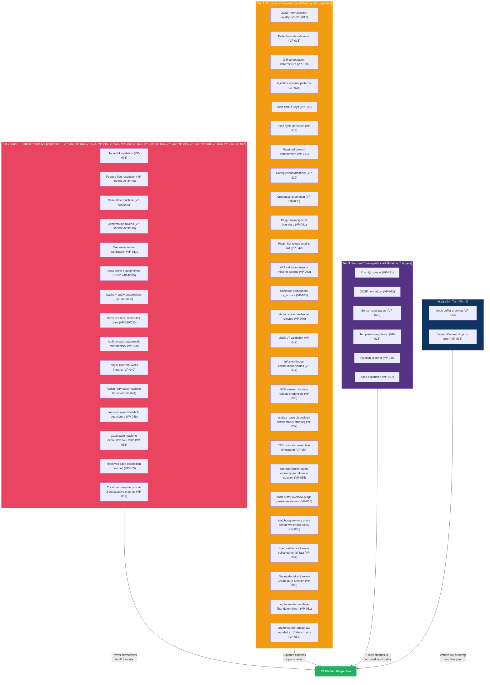

# Verification Architecture

## [Section Content]

See verification strategy, provable properties catalog, and proof harness patterns below.

## VP Priority Tier vs BC Priority Tier Convention

Verification property (VP) priority tiers (P0/P1) reflect the formal-verification roadmap, not the underlying behavior's runtime priority. A behavioral contract (BC) may be P0 (required for v1 launch) while its enforcing VP is P1 — meaning the behavior ships v1 but the formal proof may land during hardening rather than initial launch. This pattern applies to 12+ VP-BC pairs in the current catalog (e.g., VP-061 P1 verifies BC-2.20.002 P0; VP-054 P1 verifies BC-2.14.008 P0). This is intentional: runtime behavior is enforced by tests and the BC contract; formal proof adds defense-in-depth verification on a separate schedule.

## Verification Strategy Overview



## Verification Strategy

Prism uses a three-tier verification approach, with tool selection driven by module purity and criticality:

| Tier | Tool | Target | Scope |
|------|------|--------|-------|
| Formal proofs | Kani | Pure-core functions with safety-critical invariants | Bounded model checking of all paths |
| Property tests | proptest | Pure-core functions with complex input spaces | Randomized exploration of input space |
| Fuzz testing | cargo-fuzz (libFuzzer) | Parser inputs, deserialization, untrusted data processing | Coverage-guided mutation of byte streams |

## Provable Properties Catalog

Properties are organized by the domain invariant or BC postcondition they verify. Each VP traces to a specific Source Invariant / BC and, where applicable, a domain-spec DI-NNN or a BC-level postcondition ID.

| ID | Property | Module | Method | Feasibility | Priority | Source Invariant / BC |
|----|----------|--------|--------|-------------|----------|-----------------------|
| VP-001 | TenantId rejects invalid characters | prism-core | kani | feasible | P0 | DI-008 |
| VP-002 | Capability resolution: deny-by-default | prism-core | kani | feasible | P0 | DI-003 |
| VP-003 | Capability resolution: most-specific-path wins | prism-core | kani | feasible | P0 | DI-003 |
| VP-004 | Capability resolution: deny overrides allow at same specificity | prism-core | kani | feasible | P0 | DI-003 |
| VP-005 | Case state machine: exactly 12 valid transitions | prism-core | kani | feasible | P0 | DI-025 |
| VP-006 | Case state machine: no self-transitions | prism-core | kani | feasible | P0 | DI-025 |
| VP-007 | Confirmation token expiry: expired at boundary (inclusive) | prism-security | kani | feasible | P0 | DI-007 |
| VP-008 | Confirmation token: single-use (consumed rejects second use) | prism-security | kani | feasible | P0 | DI-007 |
| VP-009 | Confirmation token: content hash mismatch rejects | prism-security | kani | feasible | P0 | DI-007 |
| VP-010 | Token cap: store rejects at 100 active tokens | prism-security | kani | feasible | P0 | DI-015 |
| VP-011 | Credential name sanitization: rejects path traversal | prism-core | kani | feasible | P0 | DI-014 |
| VP-012 | Alias depth: rejects composition beyond depth 3 | prism-query | kani | feasible | P0 | DI-020 |
| VP-013 | Alias cycles: detects and rejects cyclic references | prism-query | proptest | feasible | P0 | DI-020 |
| VP-014 | Query security limits: rejects oversized queries | prism-query | kani | feasible | P0 | DI-019 |
| VP-015 | Query security limits: rejects excessive nesting depth | prism-query | kani | feasible | P0 | DI-019 |
| VP-016 | OCSF normalization: output is valid protobuf | prism-ocsf | proptest | feasible | P0 | DI-005 |
| VP-017 | OCSF normalization: unmapped fields preserved in raw_extensions | prism-ocsf | proptest | feasible | P0 | DI-005 |
| VP-018 | Detection rule validation: rejects invalid rules | prism-operations | proptest | feasible | P0 | DI-024 |
| VP-019 | Diff computation: deterministic (same inputs -> same output) | prism-operations | proptest | feasible | P0 | DI-023 |
| VP-020 | Feature flag: compile-time AND runtime must both permit | prism-security | kani | feasible | P0 | DI-003 |
| VP-021 | PrismQL parser: never panics on arbitrary input | prism-query | fuzz | feasible | P0 | DI-019 |
| VP-022 | OCSF normalizer: never panics on arbitrary sensor response | prism-ocsf | fuzz | feasible | P0 | DI-005 |
| VP-023 | Sensor spec parser: never panics on arbitrary TOML | prism-spec-engine | fuzz | feasible | P0 | DI-030 |
| VP-024 | Injection scanner: detects known injection patterns | prism-security | proptest | feasible | P0 | DI-006 |
| VP-025 | Cache key derivation: deterministic for same parameters | prism-query | kani | feasible | P1 | DI-018 |
| VP-026 | Splay computation: deterministic per (query, client) | prism-operations | kani | feasible | P1 | DI-022 |
| VP-027 | Alert dedup key: correct per match mode | prism-operations | proptest | feasible | P0 | BC-2.13.013 |
| VP-028 | Template interpolation: never panics, handles missing vars | prism-operations | fuzz | feasible | P0 | BC-2.13.005 |
| VP-029 | Cursor cap: rejects at 200 active cursors | prism-core | kani | feasible | P1 | DI-001 |
| VP-030 | Schedule/rule count caps: rejects beyond limits | prism-operations | kani | feasible | P1 | DI-028 |
| VP-031 | Required column enforcement: rejects unconstrained queries | prism-query | proptest | feasible | P0 | DI-021 |
| VP-032 | Hot reload atomicity: failed validation retains old config | prism-spec-engine | proptest | feasible | P1 | DI-031 |
| VP-033 | Audit buffer: RocksDB write completes before delivery attempt | prism-dtu-crowdstrike | integration_test | feasible | P0 | DI-026 |
| VP-034 | Encryption round-trip: encrypt then decrypt with same key returns plaintext | prism-credentials | proptest | feasible | P0 | NFR-004 |
| VP-035 | Key derivation: different salts produce different keys; same inputs produce same key | prism-credentials | proptest | feasible | P1 | NFR-004 |
| VP-036 | SessionContext dropped before error propagation and on panic in execute_scheduled callers | prism-dtu-crowdstrike | integration_test | feasible | P0 | DI-027 |
| VP-037 | Alias expansion: never panics on arbitrary alias graphs (cycles, deep nesting, self-reference) | prism-query | fuzz | feasible | P1 | DI-020 |
| VP-038 | Injection scanner: never panics on arbitrary input strings | prism-security | fuzz | feasible | P0 | DI-006 |
| VP-039 | Audit forward watermark: monotonically non-decreasing per destination across ACK, failure, and restart sequences | prism-audit | kani | feasible | P0 | BC-2.05.011 |
| VP-040 | Plugin linker excludes all WASI namespace imports | prism-spec-engine | kani | feasible | P1 | BC-2.17.002 |
| VP-041 | Plugin memory limit boundary: at-limit succeeds, over-limit traps | prism-spec-engine | proptest | feasible | P1 | BC-2.17.003 |
| VP-042 | Plugin hot reload: failed compile retains old InstancePre | prism-spec-engine | proptest | feasible | P1 | BC-2.17.005 |
| VP-043 | WIT validation rejects component missing required exports | prism-spec-engine | proptest | feasible | P1 | BC-2.17.006 |
| VP-044 | Action retry state machine: bounded by 5 attempts, dead-letter terminal | prism-operations | kani | feasible | P0 | BC-2.18.001 |
| VP-045 | Schedule semaphore: try_acquire used (non-blocking), never acquire | prism-operations | proptest | feasible | P0 | BC-2.18.004 |
| VP-046 | Action inline credential rejected at load time; value not in error message | prism-operations | proptest | feasible | P0 | BC-2.18.007 |
| VP-047 | UUID v7 validation: non-v7 always rejected, v7 always accepted, order preserved | prism-operations | proptest | feasible | P0 | BC-2.18.009 |
| VP-048 | Infusion spec: N fields produces exactly N UDF descriptors; duplicates error | prism-spec-engine | kani | feasible | P1 | BC-2.19.001 |
| VP-049 | Infusion per-query dedup: source calls = unique value count | prism-spec-engine | proptest | feasible | P1 | BC-2.19.002 |
| VP-050 | MCP sensor resource response redacts credentials and full API URLs | prism-mcp | proptest | feasible | P0 | BC-2.10.008 |
| VP-051 | Case state machine: exhaustive 5x5 transition table — 12 accept, 13 reject | prism-core | kani | feasible | P0 | DI-025 |
| VP-052 | update_case: disposition applied before status transition in single-call update | prism-core | proptest | feasible | P0 | BC-2.14.003 |
| VP-053 | Resolved case always has non-null disposition; transition rejects without disposition | prism-core | kani | feasible | P0 | BC-2.14.006 |
| VP-054 | TTR uses first resolution timestamp across reopen cycles; null aggregate when no resolved cases | prism-core | proptest | feasible | P1 | BC-2.14.008 |
| VP-055 | StorageEngine put_batch atomicity and domain isolation (MockStorageEngine) | prism-persistence | proptest | feasible | P1 | BC-2.15.002 |
| VP-056 | Audit buffer overflow purge: oldest entries deleted, newest preserved, purge-event produced | prism-audit | proptest | feasible | P1 | BC-2.15.004 |
| VP-057 | Crash recovery: denylist triggered at consecutive_crashes >= 3; exact threshold | prism-persistence | kani | feasible | P0 | BC-2.15.005 |
| VP-058 | Watchdog memory grace period: single check does not terminate; two consecutive checks do | prism-persistence | proptest | feasible | P0 | DI-027 |
| VP-059 | Spec validator: all errors collected (no fail-fast); warning-only specs return Ok | prism-spec-engine | proptest | feasible | P1 | DI-030 |
| VP-060 | Dedup decision: Link(c.id) iff existing case within window; Create otherwise | prism-operations | proptest | feasible | P0 | BC-2.14.013 |
| VP-061 | Log forwarder min-level filter: per-destination enqueue/discard matches level-rank ordering for all 5×5 level pairs | prism-mcp | proptest | feasible | P1 | BC-2.20.002 |
| VP-062 | Log forwarder queue cap: queue.len() never exceeds 10 × batch_size; drop_count +1 per overflow enqueue | prism-mcp | proptest | feasible | P1 | BC-2.20.003 |

## Verification Priority

**P0 (must-verify before release):** VP-001 through VP-024, VP-027, VP-028, VP-031, VP-033, VP-034, VP-036, VP-038, VP-039, VP-044, VP-045, VP-046, VP-047, VP-050, VP-051, VP-052, VP-053, VP-057, VP-058, VP-060 — all safety-critical invariants and security properties. (43 total)

**P1 (verify during hardening):** VP-025, VP-026, VP-029, VP-030, VP-032, VP-035, VP-037, VP-040, VP-041, VP-042, VP-043, VP-048, VP-049, VP-054, VP-055, VP-056, VP-059, VP-061, VP-062 — correctness properties that are important but not safety-critical. (19 total)

## Proof Harness Patterns

All Kani proofs follow the precondition-execute-assert pattern:

```rust
#[kani::proof]
fn verify_capability_deny_by_default() {
    let path: String = kani::any();
    kani::assume(path.len() <= 64 && path.chars().all(|c| c.is_alphanumeric() || c == '.'));
    let caps = BTreeMap::new(); // empty capabilities
    let result = evaluate_capability(&path, &caps);
    assert_eq!(result.effect, Effect::Deny, "Empty capabilities must deny");
}
```

Proptest strategies generate complex inputs (alias graphs, detection rules, OCSF records) for property exploration. Fuzz targets wrap parser entry points to find panics and crashes.

## Changelog

| Version | Pass | Date | Author | Notes |
|---------|------|------|--------|-------|
| 1.10 | pass-85 OBS-85-001 | 2026-04-21 | architect | Added "VP Priority Tier vs BC Priority Tier Convention" section clarifying that VP P0/P1 reflects the formal-verification roadmap, not runtime behavior priority. |
| 1.9 | pass-84 F84-001 + F84-003 | 2026-04-21 | architect | VP-056 Source Invariant re-anchored BC-2.05.010 → BC-2.15.004 (missed in pass-83 sweep). Column header "Source Invariant" → "Source Invariant / BC" to reflect 23 rows now carrying BC IDs post-pass-83 re-anchor. |
| 1.8 | pass-83-remediation | 2026-04-21 | architect | F83-002: re-anchored VP-055 source from DI-033→BC-2.15.002, VP-057 from DI-034→BC-2.15.005 (DI-033/034 do not exist; VP files authoritative). F83-006: re-anchored VP-052 BC-4.06.001→BC-2.14.003, VP-053 BC-4.06.002→BC-2.14.006, VP-054 BC-4.06.003→BC-2.14.008 (BC-4.NN.NNN schema invalid; VP files authoritative). |
| 1.7 | pass-81-remediation | 2026-04-21 | architect | F81-009: added VP-061 and VP-062 (proptest, P1) to Provable Properties Catalog and TIER2 Mermaid block. Updated P1 list (17→19 total). Updated SAFE node label 60→62. |
| 1.6 | pass-76-fix | 2026-04-20 | architect | OBS-004: corrected TIER1 Mermaid label range "VP-001..VP-015" → "VP-001..VP-012, VP-014, VP-015" (VP-013 is Proptest, not Kani; "26 properties" count confirmed correct per VP-INDEX). Backfilled ## Changelog with v1.0–v1.4 history per HIGH-002 fix. |
| 1.5 | pass-75-fix | 2026-04-20 | architect | Fixed CRIT-001/HIGH-001/HIGH-002: added VP-060 to Provable Properties Catalog table; updated SAFE node label 59→60; updated P0 enumeration 42→43 total. Closes pass-75 architect-doc drift findings. |
| 1.4 | pass-74-CRIT-002 | 2026-04-20 | architect | Pass-74 CRIT-002 remediation: updated P0/P1 enumeration lists and totals to reflect VP-051–VP-059 additions. Kani=26, Proptest=24, Fuzz=6, Integration=2, Total=59, P0=42, P1=17. |
| 1.3 | pass-74-CRIT-002 | 2026-04-20 | architect | Pass-74 CRIT-002: added VP-051 through VP-059 to Provable Properties Catalog table (prism-core +4 kani/proptest; prism-persistence +3; prism-audit +1; prism-spec-engine +1). VP count 50→59; architect decision matrix v1.1 extended. |
| 1.2 | housekeeping | 2026-04-20 | architect | Housekeeping burst: added VP-040 through VP-050 (11 new VPs) to catalog table. Kani 20→23; Proptest 11→19; grand total 39→50. Mermaid TIER1/TIER2 blocks updated. |
| 1.1 | pass-24-fix | 2026-04-18 | architect | Fixed LOW-002 from verification-coverage-matrix: added Integration Tests row to verification strategy table; prism-dtu-crowdstrike VP-033/VP-036 integration_test entries confirmed. P0 list updated. |
| 1.0 | initial | 2026-04-15 | architect | Initial version — verification strategy overview, Provable Properties Catalog (VP-001–VP-039), Tier 1/2/3 classification, Kani proof harness patterns. |
