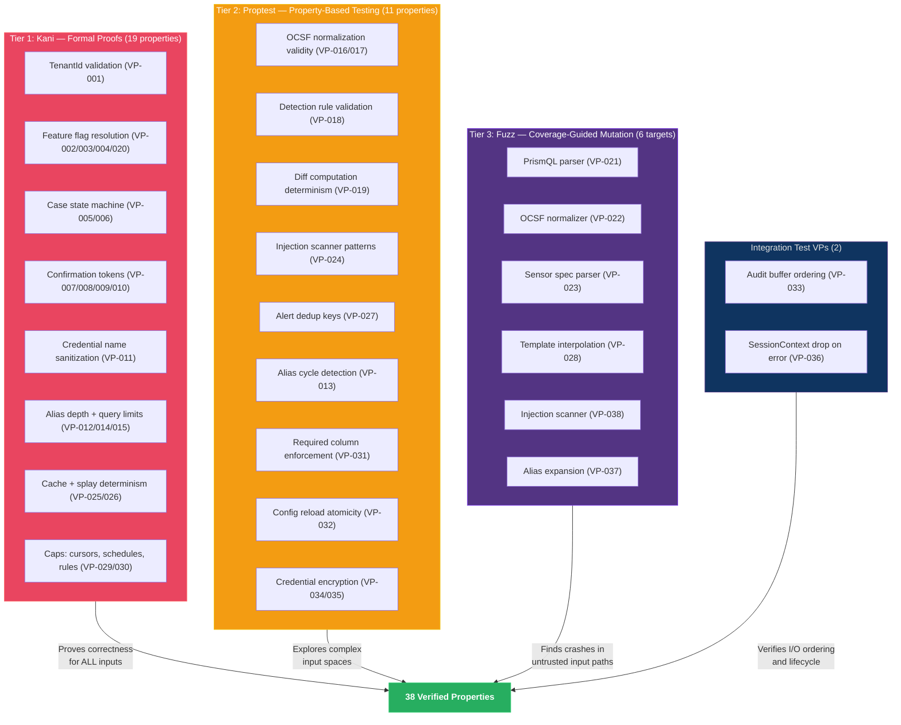

# Verification Architecture

## Verification Strategy Overview



## Verification Strategy

Prism uses a three-tier verification approach, with tool selection driven by module purity and criticality:

| Tier | Tool | Target | Scope |
|------|------|--------|-------|
| Formal proofs | Kani | Pure-core functions with safety-critical invariants | Bounded model checking of all paths |
| Property tests | proptest | Pure-core functions with complex input spaces | Randomized exploration of input space |
| Fuzz testing | cargo-fuzz (libFuzzer) | Parser inputs, deserialization, untrusted data processing | Coverage-guided mutation of byte streams |

## Provable Properties Catalog

Properties are organized by the domain invariant they verify. Each VP traces to a specific BC and invariant.

| ID | Property | Module | Method | Feasibility | Priority | Source Invariant |
|----|----------|--------|--------|-------------|----------|-----------------|
| VP-001 | TenantId rejects invalid characters | prism-core | kani | feasible | P0 | DI-008 |
| VP-002 | Capability resolution: deny-by-default | prism-core | kani | feasible | P0 | DI-003 |
| VP-003 | Capability resolution: most-specific-path wins | prism-core | kani | feasible | P0 | DI-003 |
| VP-004 | Capability resolution: deny overrides allow at same specificity | prism-core | kani | feasible | P0 | DI-003 |
| VP-005 | Case state machine: exactly 12 valid transitions | prism-core | kani | feasible | P0 | DI-025 |
| VP-006 | Case state machine: no self-transitions | prism-core | kani | feasible | P0 | DI-025 |
| VP-007 | Confirmation token expiry: expired at boundary (inclusive) | prism-security | kani | feasible | P0 | DI-007 |
| VP-008 | Confirmation token: single-use (consumed rejects second use) | prism-security | kani | feasible | P0 | DI-007 |
| VP-009 | Confirmation token: content hash mismatch rejects | prism-security | kani | feasible | P0 | DI-007 |
| VP-010 | Token cap: store rejects at 100 active tokens | prism-security | kani | feasible | P0 | DI-015 |
| VP-011 | Credential name sanitization: rejects path traversal | prism-core | kani | feasible | P0 | DI-014 |
| VP-012 | Alias depth: rejects composition beyond depth 3 | prism-query | kani | feasible | P0 | DI-020 |
| VP-013 | Alias cycles: detects and rejects cyclic references | prism-query | proptest | feasible | P0 | DI-020 |
| VP-014 | Query security limits: rejects oversized queries | prism-query | kani | feasible | P0 | DI-019 |
| VP-015 | Query security limits: rejects excessive nesting depth | prism-query | kani | feasible | P0 | DI-019 |
| VP-016 | OCSF normalization: output is valid protobuf | prism-ocsf | proptest | feasible | P0 | DI-005 |
| VP-017 | OCSF normalization: unmapped fields preserved in raw_extensions | prism-ocsf | proptest | feasible | P0 | DI-005 |
| VP-018 | Detection rule validation: rejects invalid rules | prism-operations | proptest | feasible | P0 | DI-024 |
| VP-019 | Diff computation: deterministic (same inputs -> same output) | prism-operations | proptest | feasible | P0 | DI-023 |
| VP-020 | Feature flag: compile-time AND runtime must both permit | prism-security | kani | feasible | P0 | DI-003 |
| VP-021 | PrismQL parser: never panics on arbitrary input | prism-query | fuzz | feasible | P0 | DI-019 |
| VP-022 | OCSF normalizer: never panics on arbitrary sensor response | prism-ocsf | fuzz | feasible | P0 | DI-005 |
| VP-023 | Sensor spec parser: never panics on arbitrary TOML | prism-spec-engine | fuzz | feasible | P0 | DI-030 |
| VP-024 | Injection scanner: detects known injection patterns | prism-security | proptest | feasible | P0 | DI-006 |
| VP-025 | Cache key derivation: deterministic for same parameters | prism-query | kani | feasible | P1 | DI-018 |
| VP-026 | Splay computation: deterministic per (query, client) | prism-operations | kani | feasible | P1 | DI-022 |
| VP-027 | Alert dedup key: correct per match mode | prism-operations | proptest | feasible | P0 | BC-2.13.013 |
| VP-028 | Template interpolation: never panics, handles missing vars | prism-operations | fuzz | feasible | P0 | BC-2.13.005 |
| VP-029 | Cursor cap: rejects at 200 active cursors | prism-core | kani | feasible | P1 | DI-001 |
| VP-030 | Schedule/rule count caps: rejects beyond limits | prism-operations | kani | feasible | P1 | DI-028 |
| VP-031 | Required column enforcement: rejects unconstrained queries | prism-query | proptest | feasible | P0 | DI-021 |
| VP-032 | Hot reload atomicity: failed validation retains old config | prism-spec-engine | proptest | feasible | P1 | DI-031 |
| VP-033 | Audit buffer: RocksDB write completes before delivery attempt | prism-audit | integration_test | feasible | P0 | DI-026 |
| VP-034 | Encryption round-trip: encrypt then decrypt with same key returns plaintext | prism-credentials | proptest | feasible | P0 | NFR-004 |
| VP-035 | Key derivation: different salts produce different keys; same inputs produce same key | prism-credentials | proptest | feasible | P1 | NFR-004 |
| VP-036 | SessionContext dropped before error propagation and on panic in execute_scheduled callers | prism-operations | integration_test | feasible | P0 | DI-027 |
| VP-037 | Alias expansion: never panics on arbitrary alias graphs (cycles, deep nesting, self-reference) | prism-query | fuzz | feasible | P1 | DI-020 |
| VP-038 | Injection scanner: never panics on arbitrary input strings | prism-security | fuzz | feasible | P0 | DI-006 |

## Verification Priority

**P0 (must-verify before release):** VP-001 through VP-024, VP-027, VP-028, VP-031, VP-033, VP-034, VP-036, VP-038 — all safety-critical invariants and security properties.

**P1 (verify during hardening):** VP-025, VP-026, VP-029, VP-030, VP-032, VP-035, VP-037 — correctness properties that are important but not safety-critical.

## Proof Harness Patterns

All Kani proofs follow the precondition-execute-assert pattern:

```rust
#[kani::proof]
fn verify_capability_deny_by_default() {
    let path: String = kani::any();
    kani::assume(path.len() <= 64 && path.chars().all(|c| c.is_alphanumeric() || c == '.'));
    let caps = BTreeMap::new(); // empty capabilities
    let result = evaluate_capability(&path, &caps);
    assert_eq!(result.effect, Effect::Deny, "Empty capabilities must deny");
}
```

Proptest strategies generate complex inputs (alias graphs, detection rules, OCSF records) for property exploration. Fuzz targets wrap parser entry points to find panics and crashes.
