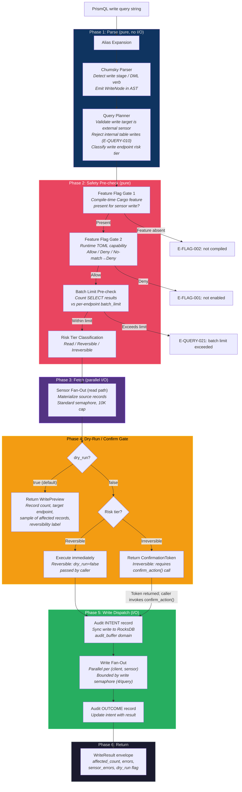

# Write Operations — PrismQL Write Extensions

## AD-022: PrismQL Write Operations

**Status:** accepted
**Context:** Prism's MSSP deployment model requires write-back to sensor APIs — contain hosts, acknowledge alerts, tag devices, update detection status, quarantine files. The initial architecture exposed write operations exclusively through dedicated MCP tools (e.g., `crowdstrike_contain_host`). This is correct for single well-known actions but creates friction at scale: analysts cannot compose write operations with query results, cannot express batch writes from filter results, and cannot use the PrismQL pipe model to take action on the output of a query. MSSPs operate at volume; the gap between "query which hosts match this criteria" and "contain them all" should be closable in a single PrismQL expression.

**Options considered:**
1. Dedicated MCP tools only — each write action is a separate named tool. Simple, explicit, but no composability with query results.
2. PrismQL write extensions — pipe mode adds terminal action stages; SQL mode adds DML (INSERT INTO, UPDATE, DELETE). All writes route through the identical safety system as dedicated tools.
3. Separate write CLI — a `prism write` subcommand outside MCP scope. Rejected: breaks the unified query model and requires separate UX.

**Decision:** PrismQL supports write operations in pipe mode (bare action verbs as terminal stages) and SQL mode (standard DML syntax via DataFusion's `TableProvider` write methods). Filter mode remains read-only. All writes flow through the same parser, the same DataFusion execution engine, and the same sensor adapter layer as reads — with an additional write path added after the fetch/transform phases. The three-tier safety system (feature flags, risk classification, dry-run/confirmation tokens, audit) applies without exception.

**Rationale:**
- Composability: `FROM crowdstrike_hosts WHERE last_seen < 7d | contain` is a single atomic operator expression. No multi-step MCP tool orchestration needed.
- Consistency: writes use the same TenantId scoping, the same push-down filter classification, the same OCSF normalized record surface that reads use. There is no second mental model.
- Safety non-negotiation: routing writes through the identical safety stack as dedicated tools means no capability is bypassed by using query syntax. The three gates (compile-time feature, runtime TOML capability, risk-tier confirmation) fire identically whether the write originates from a PrismQL expression or a direct MCP tool call.
- DataFusion alignment: DataFusion 53 already defines `TableProvider::insert_into()`, `update()`, and `delete_from()` on the same trait used for reads. Write operations reuse the registered table and memory pool infrastructure rather than building a second path.

**Consequences:**
- `prism-query` gains a write dispatch module separate from read fan-out.
- `prism-spec-engine` sensor spec format gains a `[write_endpoints]` section per table.
- The Chumsky 0.12 PrismQL grammar is extended with terminal pipe stages and DML keywords.
- Internal Prism tables (`prism_alerts`, `prism_cases`, etc.) remain write-protected via PrismQL (E-QUERY-010 stands); their mutations go through dedicated MCP tools.
- Batch write limits are declared per endpoint in sensor spec and enforced before any API call is made.

---

## Write Mode Grammar

### Filter Mode — Read-Only

Filter mode is explicitly and permanently read-only. The parser rejects any filter-mode expression that contains a write verb. This is architectural, not configurable.

```prismql
-- Filter mode: read-only predicate. Always produces a read query.
severity_id >= 4 AND device_ip = "10.0.1.50"
```

The rationale: filter mode is the implicit default when a query begins with a field predicate. Making it writable would allow accidental writes from ambiguous expressions. The restriction is enforced at parse time by the Chumsky grammar — write verbs are not valid productions in the filter-mode rule set.

### Pipe Mode — Terminal Action Stages

In pipe mode, write operations appear as bare action verbs at the terminal position of a pipeline. A pipeline that ends in a write verb is a write pipeline. Exactly one write stage is permitted per pipeline; it must be the final stage.

```prismql
-- Contain all CrowdStrike hosts not seen in 7 days
FROM crowdstrike_hosts
  | where last_seen < 7d
  | contain

-- Acknowledge high-severity alerts older than 4 hours
FROM crowdstrike_detections
  | where severity_id >= 4 AND time < 4h
  | acknowledge

-- Tag all Armis devices in the OT zone with "review-pending"
FROM armis_devices
  | where zone = "OT-Production"
  | tag key="review" value="pending"

-- Update detection status to "in_progress" for a specific analyst
FROM crowdstrike_detections
  | where assignee = "unassigned" AND severity_id >= 3
  | update_status status="in_progress" assignee="jmagady"

-- Quarantine a specific file hash across all hosts (irreversible)
FROM crowdstrike_hosts
  | where last_seen > 1h
  | quarantine_file sha256="d41d8cd98f00b204e9800998ecf8427e"
```

**Grammar production (Chumsky 0.12 extension):**

```
pipe_pipeline = source_stage ("|" pipe_stage)* ("|" write_stage)?
write_stage   = write_verb (write_arg)*
write_verb    = "contain" | "acknowledge" | "tag" | "update_status"
              | "quarantine_file" | "uncontain" | "remove_tag" | ...
write_arg     = identifier "=" literal
```

Write verbs are registered in `prism-spec-engine` from the sensor spec's `[write_endpoints]` table. The Chumsky grammar dynamically accepts only verbs that correspond to registered write endpoints for the source in scope. An unknown verb produces `E-QUERY-001` (parse error) with a suggestion listing available verbs for the source table.

### SQL Mode — DML Syntax

SQL mode accepts standard DML statements. DataFusion's `TableProvider` write methods are used as the execution substrate.

```sql
-- Update detection status (reversible write)
UPDATE crowdstrike_detections
SET status = 'acknowledged', comment = 'Reviewed by SOC'
WHERE severity_id <= 2 AND time < 48h

-- Contain hosts via INSERT INTO a virtual "contained_hosts" write endpoint
INSERT INTO crowdstrike_contained_hosts (device_id, comment)
SELECT device_id, 'Auto-contained: no recent activity'
FROM crowdstrike_hosts
WHERE last_seen < 7d AND containment_status = 'normal'

-- Remove a tag from Armis devices (reversible)
DELETE FROM armis_device_tags
WHERE device_id IN (
  SELECT device_id FROM armis_devices WHERE zone = 'decommissioned'
) AND tag_key = 'active-monitoring'
```

**Internal tables are write-protected.** `UPDATE prism_alerts`, `DELETE FROM prism_cases`, and similar statements targeting internal Prism tables produce `E-QUERY-010`. Internal table mutations go through dedicated MCP tools where the business logic, validation, and side effects are fully controlled.

**SQL write target resolution:** The parser uses the table name prefix to determine the sensor. `crowdstrike_contained_hosts` maps to sensor `crowdstrike`, write endpoint `contained_hosts`. The sensor spec declares write endpoints as writable `TableProvider` implementations registered in DataFusion's catalog alongside the read-side tables.

---

## Write Execution Pipeline

The read pipeline (Phases 1–5 in `query-engine.md`) is extended with a Write Dispatch Phase that executes only when the query plan contains a write node.



### Phase sequencing invariants

- Safety pre-check (Phase 2) runs entirely before any I/O. No sensor API is contacted until both feature flag gates pass and the batch limit is known-satisfiable.
- The read fan-out (Phase 3) materializes the source records that write operations will target. The same 10K materialization cap and `GreedyMemoryPool` apply as in a read-only query.
- Dry-run (Phase 4) returns before Phase 5. No audit intent record is written for a dry-run — audit entries are created only when execution is imminent.
- The audit INTENT record (Phase 5, step 1) is a sync RocksDB write. No sensor API is called until this record is durable. This is the AD-016 intent-log pattern applied unchanged.
- Write fan-out (Phase 5, step 2) uses a dedicated write semaphore (4 concurrent writes per query, separate from the read semaphore of 10). Write operations are intentionally throttled more aggressively than reads.
- Phase 5 only executes when `dry_run = false` AND (risk tier is Reversible, OR a valid ConfirmationToken has been presented and consumed).

---

## Write Result Envelope

Every write execution (non-dry-run) produces a `WriteResult`. Dry-run executions produce a `WritePreview`.

### WriteResult

```json
{
  "_meta": {
    "query_id": "01jc...",
    "dry_run": false,
    "write_endpoint": "crowdstrike.contained_hosts",
    "risk_tier": "irreversible",
    "confirmed_by_token": "tok_01jc...",
    "execution_started_at": "2026-04-16T18:00:01Z",
    "execution_completed_at": "2026-04-16T18:00:03Z",
    "audit_intent_id": "aud_01jc...",
    "sensor_errors": [
      {
        "sensor": "crowdstrike",
        "client_id": "acme",
        "error_code": "E-WRITE-001",
        "message": "CrowdStrike API rejected contain for device_id=abc123: already contained",
        "retryable": false
      }
    ]
  },
  "affected_count": 12,
  "succeeded_count": 11,
  "failed_count": 1,
  "results": [
    {
      "record_id": "dev_01...",
      "status": "success",
      "sensor_response": { "containment_status": "contained" }
    }
  ]
}
```

### WritePreview (dry-run)

```json
{
  "_meta": {
    "query_id": "01jc...",
    "dry_run": true,
    "write_endpoint": "crowdstrike.contained_hosts",
    "risk_tier": "irreversible",
    "confirmation_token": {
      "token_id": "tok_01jc...",
      "expires_at": "2026-04-16T18:05:01Z",
      "action_hash": "sha256:4a9f...",
      "action_summary": "Contain 12 CrowdStrike hosts for client 'acme' — last_seen < 7d"
    }
  },
  "would_affect_count": 12,
  "sample_records": [
    { "device_id": "dev_01...", "hostname": "WORKSTATION-7", "last_seen": "2026-04-08T10:00:00Z" }
  ],
  "reversibility": "irreversible",
  "confirmation_prompt": "This will contain 12 hosts in CrowdStrike for client 'acme'. This action cannot be automatically undone. Present token_id 'tok_01jc...' to confirm."
}
```

**Key invariants of the result envelope:**
- `dry_run` is always present and always reflects the actual execution mode.
- `sensor_errors` in `WriteResult._meta` aggregates per-record failures that did not abort the batch. Partial success is normal: some records may succeed while others fail.
- `confirmation_token` is only present in `WritePreview` when the risk tier is `irreversible`. Reversible dry-run previews have no token — `dry_run: false` is sufficient to execute.
- `audit_intent_id` links the result to the RocksDB audit record for SOC 2 traceability.

---

## Sensor Spec `[write_endpoints]` Schema

Write endpoints are declared in sensor spec TOML files, co-located with the read-side table declarations. The presence of a `[write_endpoints]` section is the spec-engine's signal that this sensor has writable capabilities.

```toml
# crowdstrike.sensor.toml (excerpt — write section)

[[sensor.write_endpoints]]
endpoint_id       = "contained_hosts"
display_name      = "Host Containment"
pipe_verb         = "contain"               # Verb used in pipe mode
sql_table         = "crowdstrike_contained_hosts"  # Table name in SQL DML

# Risk classification — must match three-tier system (BC-2.04.007)
risk_tier         = "irreversible"          # "read" | "reversible" | "irreversible"
reversibility_note = "CrowdStrike host containment isolates the host from the network. \
                      Use 'uncontain' to release. Action takes effect within ~30 seconds."

# Capability path for feature flag resolution (BC-2.04.001)
capability_path   = "sensor.crowdstrike.containment"

# Batch limits
batch_limit       = 100                     # Max records per write call. 0 = unlimited.
batch_limit_note  = "CrowdStrike Contain API accepts up to 1000 device IDs per request; \
                      we cap at 100 to limit blast radius."

# The HTTP call(s) to make for each batch of records
[[sensor.write_endpoints.steps]]
name              = "contain_hosts"
method            = "POST"
path_template     = "/devices/entities/devices-actions/v2?action_name=contain"
body_template     = '{"ids": ${record_ids}}'
# record_ids is auto-populated from the source query's device_id column
record_id_field   = "device_id"             # Column from the source RecordBatch to use as ID
response_path     = "$.resources"           # Path in API response to extract per-record results
success_status    = [200, 202]

[[sensor.write_endpoints]]
endpoint_id       = "update_detection_status"
display_name      = "Update Detection Status"
pipe_verb         = "update_status"
sql_table         = "crowdstrike_detection_status"
risk_tier         = "reversible"
reversibility_note = "Detection status can be changed back at any time."
capability_path   = "sensor.crowdstrike.detection_write"
batch_limit       = 500

[[sensor.write_endpoints.steps]]
name              = "update_status"
method            = "PATCH"
path_template     = "/detects/entities/detects/v2"
body_template     = '{"ids": ${record_ids}, "status": "${params.status}", \
                      "comment": "${params.comment|default:\"Updated via PrismQL\"}"}'
record_id_field   = "detection_id"
response_path     = "$.resources"
success_status    = [200]

# --- Armis device tagging ---
# armis.sensor.toml (excerpt)

[[sensor.write_endpoints]]
endpoint_id       = "device_tags"
display_name      = "Device Tag Management"
pipe_verb         = "tag"
sql_table         = "armis_device_tags"
risk_tier         = "reversible"
reversibility_note = "Tags can be removed with 'remove_tag'."
capability_path   = "sensor.armis.device_write"
batch_limit       = 200

[[sensor.write_endpoints.steps]]
name              = "add_tag"
method            = "POST"
path_template     = "/api/v1/devices/${record_id}/tags/"
body_template     = '{"tags": [{"name": "${params.key}", "value": "${params.value}"}]}'
record_id_field   = "device_id"
response_path     = "$.data"
success_status    = [200, 201]
```

### Write Endpoint Field Reference

| Field | Type | Required | Description |
|-------|------|----------|-------------|
| `endpoint_id` | string | yes | Unique within sensor. Used as key in capability path. |
| `display_name` | string | yes | Human-readable name for audit logs and dry-run prompts. |
| `pipe_verb` | string | yes | Terminal stage verb in pipe mode. Must match `[a-z_]+`. |
| `sql_table` | string | yes | DataFusion table name registered for DML targeting. |
| `risk_tier` | enum | yes | `reversible` or `irreversible`. Never `read` (read-only endpoints are declared in `[[sensor.tables]]`). |
| `reversibility_note` | string | yes | Human-readable explanation of reversibility / blast radius. Surfaced in dry-run previews. |
| `capability_path` | string | yes | Dot-separated path evaluated by the feature flag system (BC-2.04.001). |
| `batch_limit` | integer | yes | Max records per write call. `0` = unlimited (use only for provably low-risk operations). |
| `batch_limit_note` | string | no | Explanation of why this limit was chosen. Surfaced in E-QUERY-021 errors. |
| `steps` | array | yes | Sequential HTTP steps (same structure as read-side steps, with `record_id_field` for write targeting). |
| `steps[].record_id_field` | string | yes | Column name in the source RecordBatch used as the target ID for the write. |
| `steps[].response_path` | string | yes | JSONPath into the API response to extract per-record outcomes. |
| `steps[].success_status` | int[] | yes | HTTP status codes treated as success. |

### Write Endpoint Validation (SpecParser)

The `SpecParser` validates write endpoints at load time:

- `pipe_verb` must be unique across all write endpoints in the sensor spec and must not collide with read-side pipe stage keywords (`where`, `fields`, `stats`, `sort`, `head`, `join`, `enrich`).
- `sql_table` must not collide with any read-side table name declared in `[[sensor.tables]]`.
- `capability_path` must be syntactically valid (dot-separated alphanumeric segments).
- `risk_tier` values other than `reversible` or `irreversible` are rejected at parse time.
- `batch_limit = 0` with `risk_tier = "irreversible"` produces a validation warning (not an error): unlimited irreversible batch writes require explicit acknowledgment in the spec.
- Variable references in `body_template` and `path_template` follow the same interpolation safety rules as read-side steps (RFC 3986 percent-encoding for URL templates, JSON-string-escaping for body templates).

---

## Batch Limit Configuration

Batch limits operate at two levels: per-endpoint in the sensor spec, and system-wide as a safety ceiling.

### Per-Endpoint Limits (Sensor Spec)

Declared in `[[sensor.write_endpoints]]` as `batch_limit`. This is the primary limit — it reflects the sensor API's documented limits and Prism's deliberate blast-radius policy per operation.

### System-Wide Ceiling (prism.toml)

```toml
[defaults.write_limits]
# Absolute maximum records across any single write operation, regardless of per-endpoint limit.
# Per-endpoint limits must be <= this value (validated at spec load time).
# Set to 0 to disable the ceiling (not recommended for MSSP deployments).
max_batch_size = 1000

# Maximum concurrent write fan-out coroutines per query (separate from the read semaphore)
max_concurrent_write_fan_out = 4

# Maximum total write operations per 60-second window (across all clients, all sensors)
# Prevents runaway scheduled queries from flooding sensor APIs with writes
write_rate_limit_per_minute = 200
```

### Per-Client Overrides

```toml
# prism.toml — per-client write limit overrides
[clients.acme.write_limits]
max_batch_size = 50          # Acme is conservative; hard cap at 50 regardless of endpoint default
```

### Batch Limit Enforcement Order

1. Parse time: `batch_limit` in spec is validated against `[defaults.write_limits].max_batch_size`.
2. Query time (Phase 2, pre-fetch): the write plan is inspected. If the query has no explicit `LIMIT` clause on the source, `E-QUERY-022` is returned suggesting the analyst add `| head N` or `LIMIT N` before the write stage.
3. Post-fetch (Phase 4, before dry-run gate): the materialized RecordBatch row count is checked against `min(per-endpoint batch_limit, client override, system ceiling)`. If exceeded, `E-QUERY-021` is returned with the counts. No write executes.

**Unlimited batch (`batch_limit = 0`):** Permitted only for endpoints explicitly declared unlimited in the spec. The system ceiling still applies unless also set to `0`. The query must contain an explicit `LIMIT` clause or `| head N` stage; without one, `E-QUERY-022` fires.

---

## Safety Integration

Write operations in PrismQL compose with all existing safety infrastructure without exception. There are no write-specific code paths that bypass the shared systems.

### Feature Flag Integration (BC-2.04.001, BC-2.04.005)

The `capability_path` declared in `[[sensor.write_endpoints]]` is evaluated identically to capability paths for dedicated MCP tool writes. Gate 1 (compile-time) and Gate 2 (runtime TOML) fire in sequence during Phase 2 (Safety Pre-check), before any I/O.

```toml
# prism.toml — capability configuration (unchanged from dedicated tool model)
[clients.acme.capabilities]
"sensor.crowdstrike.containment" = "Allow"
"sensor.crowdstrike.detection_write" = "Allow"
"sensor.armis.device_write" = "Deny"    # Acme does not permit Armis writes
```

If the capability resolves to Deny, `E-FLAG-001` is returned immediately. The feature flag evaluation is itself audit-logged (BC-2.05.009) regardless of Allow/Deny outcome.

**Hidden verb behavior:** When `capability_path` resolves to Deny for a given client, the corresponding `pipe_verb` is excluded from the PrismQL auto-complete hints returned by the `explain_query` tool, and the `sql_table` is not registered as a writable DataFusion table for that client. The verb still parses (it is grammar-valid) but fails at Gate 2 with a structured error. This matches the hidden-tools pattern from BC-2.04.005.

### Three-Tier Risk Classification (BC-2.04.007)

Risk tier is declared in the sensor spec and cannot be changed at runtime. The tier drives Phase 4 of the write pipeline:

| Risk Tier | Phase 4 Behavior | Analyst Action Required |
|-----------|-----------------|------------------------|
| `reversible` | `dry_run: true` (default) returns `WritePreview` with no token. `dry_run: false` executes immediately. | None for execution; dry-run is a preview aid only. |
| `irreversible` | Always returns `WritePreview` with a `ConfirmationToken` on first call. Token must be presented to `confirm_action()` within 300s to execute. | Present token to analyst; analyst confirms; agent calls `confirm_action(token_id)`. |

There is no mechanism to declare a write endpoint with `risk_tier = "read"`. Write endpoints are always at minimum `reversible`.

**Risk tier for SQL DML by target:** When the sensor spec does not declare a `risk_tier` override for a specific DML operation, the tier is inferred conservatively:
- `INSERT INTO` → tier of the corresponding write endpoint (from spec).
- `UPDATE` → tier of the corresponding write endpoint.
- `DELETE FROM` → always `irreversible`, regardless of spec declaration. Deletion is treated as maximally destructive until explicitly overridden with documented justification in the spec.

### Dry-Run Semantics (BC-2.04.008)

For write queries, `dry_run` is a query-level parameter passed through the MCP tool that invokes the query engine:

```
-- Pipe mode: dry_run controlled by MCP tool parameter, not query syntax
-- The analyst calls the `query` tool with dry_run: true (default)
-- or dry_run: false (explicit execution intent)

FROM crowdstrike_hosts | where last_seen < 7d | contain
```

A dry-run write query executes Phases 1–4 fully (parse, safety-check, fetch, dry-run gate) but stops before Phase 5. The `WritePreview` result includes `would_affect_count` and a sample of the records that would be written. For irreversible operations the `ConfirmationToken` is also generated and returned in the preview — the analyst presents the action summary to the user before calling `confirm_action`.

Dry-run never contacts the sensor write API. It only contacts the sensor read API to materialize the source records.

### Confirmation Token Integration (BC-2.04.010, BC-2.04.011)

For irreversible write operations, the `ConfirmationToken` generated in Phase 4 binds to:
- The exact query string (hashed).
- The `client_id`.
- The `write_endpoint` identifier.
- The `would_affect_count` at dry-run time.

If any of these change between the dry-run call and the `confirm_action()` call, the token's `action_hash` fails verification and `E-FLAG-005` is returned. This prevents an agent from previewing a small contained write and then expanding scope before confirmation.

Token capacity: 100 active tokens max (DI-015), shared with dedicated tool tokens. Write query tokens expire in 300s (BC-2.04.011).

### Audit Logging (BC-2.05.004)

Every write operation — whether dry-run, execution, or failure — produces an `AuditEntry`. The intent-log pattern (AD-016) applies:

1. `WRITE_INTENT` audit entry written sync to RocksDB `audit_buffer` before sensor API contact.
2. Sensor write API called.
3. `WRITE_OUTCOME` audit entry updates the intent with result (success, partial, failure).

For dry-run queries: a single `WRITE_DRY_RUN` audit entry is emitted. No intent record is written (no execution occurred).

For capability-denied queries: a `WRITE_DENIED` audit entry is emitted (BC-2.05.009 applies to write capability denials too).

**Fail-closed for write audit (DI-004):** If audit emission fails before Phase 5, the write is aborted. `E-AUDIT-001` is returned. The sensor write API is never called without a durable audit intent record.

---

## DataFusion Integration

### Read-Side (Unchanged)

The existing read pipeline registers external sensor tables as DataFusion `MemTable` instances derived from Arrow `RecordBatch` data. This is unmodified.

### Write-Side — TableProvider Write Methods

DataFusion 53 defines optional write methods on `TableProvider`:

```rust
#[async_trait]
pub trait TableProvider: Send + Sync {
    // ... existing read methods unchanged ...

    async fn insert_into(
        &self,
        state: &dyn Session,
        input: Arc<dyn ExecutionPlan>,
        overwrite: InsertOp,
    ) -> Result<Arc<dyn ExecutionPlan>>;

    async fn update(
        &self,
        state: &dyn Session,
        updates: HashMap<String, Arc<dyn PhysicalExpr>>,
        predicates: Vec<Arc<dyn PhysicalExpr>>,
    ) -> Result<Arc<dyn ExecutionPlan>>;

    async fn delete_from(
        &self,
        state: &dyn Session,
        filters: &[Expr],
    ) -> Result<Arc<dyn ExecutionPlan>>;
}
```

Prism registers `PrismWriteTable` instances for each declared write endpoint. `PrismWriteTable` implements `TableProvider` with:

- `table_type()` → `TableType::Base` (writable)
- `schema()` → derived from the write endpoint's declared columns and the source table's OCSF schema
- `insert_into()`, `update()`, `delete_from()` → delegate to `WriteDispatcher`

The `WriteDispatcher` holds a reference to the `SensorAdapter` for the write's target sensor. It:
1. Checks audit / safety gates (these are checked in Phase 2 pre-fetch, but `WriteDispatcher` performs a final check for defense in depth — e.g., if a hot-reload changed capabilities between Phase 2 and Phase 5).
2. Extracts `record_id_field` values from the input `RecordBatch`.
3. Batches IDs per `batch_limit`.
4. Calls `SensorAdapter::write(endpoint_id, batch, params)` for each batch in parallel (bounded by the write semaphore).

```rust
// Write execution in prism-query (WriteDispatcher)
pub struct WriteDispatcher {
    sensor_id: SensorId,
    endpoint_id: String,
    write_endpoint: WriteEndpoint,   // From sensor spec
    adapter: Arc<SensorAdapter>,
    security: Arc<SecurityContext>,  // Feature flags, confirmation state
    audit: Arc<AuditEmitter>,
}

impl WriteDispatcher {
    pub async fn execute(
        &self,
        tenant: &TenantId,
        source_batch: RecordBatch,
        params: WriteParams,          // From pipe verb args or SQL SET clause
        dry_run: bool,
        confirmed_token: Option<ConfirmationToken>,
    ) -> Result<WriteResult, PrismError> {
        // 1. Final safety gate (defense-in-depth re-check)
        self.security.check_write_capability(tenant, &self.write_endpoint.capability_path)?;

        // 2. Extract record IDs from source batch
        let ids = self.extract_ids(&source_batch)?;

        if dry_run {
            return Ok(WriteResult::preview(ids.len(), &source_batch, &self.write_endpoint));
        }

        // 3. For irreversible: verify confirmation token
        if self.write_endpoint.risk_tier == RiskTier::Irreversible {
            let token = confirmed_token.ok_or(PrismError::write_requires_confirmation())?;
            self.security.consume_confirmation_token(token, tenant, &ids)?;
        }

        // 4. Audit intent (sync)
        let intent_id = self.audit.write_intent(tenant, &self.write_endpoint, ids.len()).await?;

        // 5. Write fan-out (parallel, bounded by write semaphore)
        let results = self.write_fanout(tenant, &ids, &params).await;

        // 6. Audit outcome
        self.audit.write_outcome(intent_id, &results).await;

        Ok(WriteResult::from_fanout(results, intent_id))
    }
}
```

### Memory Budget for Write Queries

Write queries share the same `GreedyMemoryPool` as read queries (200 MB per-query budget). The source RecordBatch materialized in Phase 3 counts against this budget. The write dispatch in Phase 5 does not materialize additional data — it streams IDs from the existing RecordBatch to the sensor API in batches. Peak memory for a write query is approximately equal to peak memory for the equivalent read query.

### SessionContext Lifecycle for Writes

The `SessionContext` is created at the start of the write query (same as reads) and dropped after Phase 6 (after the `WriteResult` is returned). Write tables are registered in the same `SessionContext` as read tables, enabling mixed read-write queries (e.g., `SELECT ... FROM ... | contain` in pipe mode, or `INSERT INTO ... SELECT ...` in SQL mode that reads from one sensor and writes to another).

---

## Write Operation Error Codes

The following error codes are defined in the `E-QUERY-020` through `E-QUERY-029` range for write-specific failures. These extend the existing `QUERY` error taxonomy (error-taxonomy.md).

| Code | Severity | Retryable | Message Format | Description |
|------|----------|-----------|---------------|-------------|
| `E-QUERY-020` | broken | No | "Write operations are not supported on source '{source}'. Only external sensor tables support writes." | Analyst attempted a write targeting a composite source (`FROM EVENTS \| contain`) or an internal table. Write operations must target a specific sensor source. |
| `E-QUERY-021` | broken | No | "Write batch limit exceeded: query would affect {actual} records (endpoint limit: {endpoint_limit}, system limit: {system_limit}). Add \`\| head {endpoint_limit}\` to limit scope." | The source query materialized more records than the write endpoint's batch limit permits. The error includes a suggestion to add a `head` or `LIMIT` constraint. |
| `E-QUERY-022` | broken | No | "Write query has no record limit. Add \`\| head N\` or \`LIMIT N\` before the write stage to prevent unbounded writes." | Write query lacks an explicit record count ceiling. Required for all write operations; prevents accidental full-scan writes. |
| `E-QUERY-023` | broken | No | "Write verb '{verb}' is not available for source '{source}'. Available verbs for this source: [{verbs}]" | Pipe mode write verb does not match any registered write endpoint for the source table. Includes list of valid verbs. |
| `E-QUERY-024` | broken | No | "Write stage must be the terminal stage in a pipe pipeline. Found additional stages after '{verb}': [{remaining_stages}]" | A write verb appears in a non-terminal position. Writes cannot be piped into further transformations. |
| `E-QUERY-025` | broken | No | "Write operation failed for {count}/{total} records on {sensor}/{endpoint}. {succeeded_count} records succeeded. See WriteResult.results for per-record detail." | Partial write failure. Some records were successfully written; others failed. Non-retryable at the query level — the caller should inspect per-record results and retry only failed records if appropriate. |
| `E-QUERY-026` | broken | No | "Write to internal table '{table}' is not permitted via PrismQL. Use the dedicated MCP tool: {tool_name}" | Alias for E-QUERY-010, surfaced specifically in write context for SQL DML targeting internal tables. |
| `E-QUERY-027` | broken | No | "Confirmation token required for irreversible write to '{endpoint}'. Invoke with dry_run: true first to obtain a token." | Irreversible write called with `dry_run: false` but no confirmation token presented. Agent must call with `dry_run: true` first to get the token. |
| `E-QUERY-028` | degraded | Yes | "Write fan-out rate limit: sensor '{sensor}' write API is throttled ({retry_after}s). Retry after cooldown." | Sensor API returned 429 on a write call. The write was partially executed (records before the rate limit hit may have succeeded). Retryable after cooldown. |
| `E-QUERY-029` | broken | No | "Write endpoint '{endpoint}' declared in spec but not found in AdapterRegistry. Sensor may not be configured for client '{client_id}'." | The sensor spec declares a write endpoint but the sensor adapter for this client has not been initialized (credentials missing, sensor disabled). Structural error — fix sensor configuration. |

---

## Risk Classification Table for Write Operations

This table extends `BC-2.04.007` with PrismQL write endpoints for the four initial sensors. It is the authoritative risk tier register for write operations.

| Sensor | Write Endpoint | Pipe Verb | SQL Table | Risk Tier | Confirmation Required |
|--------|---------------|-----------|-----------|-----------|----------------------|
| CrowdStrike | `contained_hosts` | `contain` | `crowdstrike_contained_hosts` | Irreversible | Yes |
| CrowdStrike | `uncontained_hosts` | `uncontain` | `crowdstrike_uncontained_hosts` | Reversible | No |
| CrowdStrike | `detection_status` | `update_status` | `crowdstrike_detection_status` | Reversible | No |
| CrowdStrike | `detection_assignment` | `assign` | `crowdstrike_detection_assignment` | Reversible | No |
| Cyberint | `alert_status` | `acknowledge` | `cyberint_alert_status` | Reversible | No |
| Cyberint | `alert_status` | `close_alert` | `cyberint_closed_alerts` | Irreversible | Yes |
| Claroty | `device_tags` | `tag` | `claroty_device_tags` | Reversible | No |
| Claroty | `device_tags` | `remove_tag` | `claroty_removed_tags` | Reversible | No |
| Armis | `device_tags` | `tag` | `armis_device_tags` | Reversible | No |
| Armis | `device_tags` | `remove_tag` | `armis_removed_tags` | Reversible | No |

All write endpoints above require `sensor.{sensor_id}.{endpoint_id}` capability in the runtime TOML and the corresponding Cargo feature (`{sensor_id}-write`) at compile time.

---

## Purity Boundary for Write Operations

Write operations respect the existing purity boundary map (purity-boundary-map.md). The boundary is drawn at the same location as for reads: `prism-query`'s pure core handles plan construction, safety evaluation, and result envelope construction; effectful shell handles I/O.

| Component | Classification | Rationale |
|-----------|---------------|-----------|
| Write AST construction | Pure | `parse_write_query(&str) -> Result<WriteQueryPlan>` — no I/O |
| Risk tier classification | Pure | Determined from sensor spec data at plan time |
| Batch limit validation (pre-fetch) | Pure | Arithmetic check on plan metadata |
| `WritePreview` construction (dry-run) | Pure | Assembles preview from already-materialized `RecordBatch` |
| `ConfirmationToken` generation | Pure core with external state | Cryptographic hash over plan fields; token stored in `SecurityContext` |
| Audit intent write | Effectful | RocksDB sync write |
| Sensor write API call | Effectful | HTTP I/O via `SensorAdapter` |
| Audit outcome write | Effectful | RocksDB async write |

Formal verification scope: VP-NNN (to be defined) will cover `parse_write_query` (no panic, correct risk tier classification, correct batch limit arithmetic) and `WritePreview` construction (content hash determinism for token binding). The effectful write fan-out is outside formal verification scope and is covered by integration tests against DTU (behavioral clone) sensor stubs.

---

## Cross-Reference

| If you need... | Read together with |
|---|---|
| Feature flag resolution detail | security-architecture.md § Feature Flag Resolution |
| Confirmation token lifecycle | security-architecture.md § Confirmation Token System |
| Audit intent-log pattern | security-architecture.md § Write-Audit Ordering (AD-016) |
| Sensor spec TOML format | sensor-adapters.md § Tier 1: No-Code (TOML Spec Files) |
| DataFusion SessionContext lifecycle | query-engine.md § SessionContext Lifecycle |
| Read pipeline phases | query-engine.md § Architecture Overview |
| Error code ranges | prd-supplements/error-taxonomy.md § QUERY |
| Risk tier register | behavioral-contracts/BC-2.04.007 |
| Dry-run semantics | behavioral-contracts/BC-2.04.008 |
| Confirmation token consumption | behavioral-contracts/BC-2.04.010 |
