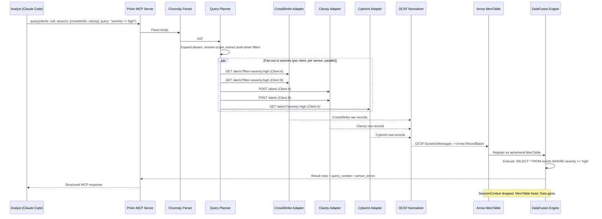

# Prism Architecture Concept: Ephemeral Federated Query Engine

## The Problem

Managed Security Service Provider (MSSP) analysts manage dozens of clients, each with a different mix of security sensors -- CrowdStrike for endpoints, Claroty for OT, Cyberint for threat intelligence, Armis for IoT/OT asset inventory. Every sensor has its own dashboard, its own query language, its own field names, and its own API.

To investigate an incident, an analyst context-switches between 4+ dashboards per client, multiplied by dozens of clients. Cross-sensor correlation ("show me the CrowdStrike alert and the Claroty event for the same IP") requires manually copying data between browser tabs. Cross-client visibility ("which clients have unresolved critical alerts?") requires checking each client individually.

There is no unified view. The data exists across dozens of API endpoints, locked behind vendor-specific schemas.

## The Insight

The analyst's core workflow is a query: "show me critical alerts from CrowdStrike across all clients" or "find devices with this hostname in both CrowdStrike and Claroty for client Acme." The problem is not that the data does not exist -- it is that every sensor speaks a different language and lives behind a different API.

The insight is that a **query language can serve as an API orchestration layer**. If the analyst writes a query using a unified schema, the engine can:

1. Parse the query to determine which sensors and clients are needed
2. Fan out live API calls to those sensors
3. Normalize all responses to a common schema
4. Materialize the results as a virtual table
5. Execute the original query against that table
6. Return results and discard the table

The data never needs to be stored. It exists only in flight -- fetched, normalized, queried, and discarded in a single operation.

## The Architecture

Prism implements this insight as an **ephemeral federated query engine** with the following component chain:

```
AxiQL (query language)
  -> Chumsky (parser, AST generation)
    -> Query Planner (alias expansion, scope resolution, push-down filter extraction)
      -> Sensor Adapters (parallel fan-out to live APIs)
        -> OCSF Normalizer (DynamicMessage protobuf pattern)
          -> Arrow RecordBatch (ephemeral in-memory columnar data)
            -> DataFusion (SQL execution engine)
              -> MCP Response (structured results to Claude Code)
                -> Teardown (SessionContext dropped, memory freed)
```

### AxiQL: The Query Language

AxiQL supports three modes, auto-detected from the first token:

- **Filter mode:** `severity >= high AND status = open` -- simple field predicates
- **SQL mode:** `SELECT client_id, COUNT(*) FROM events WHERE severity >= high GROUP BY client_id` -- full SQL with aggregation
- **Pipe mode:** `FROM alerts | where severity >= high | sort time desc | head 10` -- pipe-based data flow

All three modes compile to the same DataFusion logical plan. The analyst uses whichever feels natural.

### Chumsky: The Parser

Chumsky 0.10 provides a zero-copy, composable parser combinator library. It parses AxiQL into an AST with error recovery and precise span tracking for actionable error messages.

### DataFusion: The Execution Engine

DataFusion is an extensible SQL query engine built on Arrow. Prism registers ephemeral `MemTable` instances in a per-query `SessionContext`. DataFusion handles predicate evaluation, aggregation, sorting, and limiting. After the query completes, the `SessionContext` is dropped and all memory is freed.

### Arrow: The Data Format

Apache Arrow provides a columnar in-memory format. OCSF-normalized records are batched into Arrow `RecordBatch` structures, giving DataFusion zero-copy access to typed columnar data. Arrow is the materialization format -- it exists only in memory, only for the duration of the query.

### MCP: The Interface

The Model Context Protocol (MCP) is the AI-native interface. Prism exposes `query` and `explain_query` as MCP tools consumed by Claude Code. The analyst interacts through natural language; the AI agent constructs AxiQL queries and interprets results.

### prism-spec-engine: Config-Driven Sensor Adapters

The `prism-spec-engine` crate enables adding new REST API sensors without Rust code changes. It provides three components:

1. **TOML Spec Parser** -- Reads sensor spec files (`.toml`) from the sensor specs directory and deserializes them into `SensorSpec` structs. Each spec declares a sensor's identity, auth type, base URL, tables with typed columns and OCSF mappings, multi-step fetch pipelines with `${step_name.field}` variable interpolation, pagination config, and rate limit hints.

2. **Multi-Step Pipeline Executor** -- Executes the sequential `[[table.steps]]` pipeline defined in each table spec. Steps produce variables that downstream steps can reference. Supports fan-out (when a variable resolves to an array), pagination within steps, and rate-limit-aware request pacing. The final step's results are collected into Arrow RecordBatches using the table's column definitions and OCSF mappings.

3. **Arc-Swap Config Manager** -- Stores the active `ConfigSnapshot` in an `arc_swap::ArcSwap<ConfigSnapshot>` for lock-free query-time access. The `reload_config` MCP tool constructs a new snapshot, validates it, and atomically swaps it in. In-flight queries continue using the snapshot they captured at start. Hash-based change detection (SHA-256 of all config file contents) skips reload when nothing changed.

### Two-Tier Sensor Adapter Architecture

Prism supports two tiers for defining sensor adapters. Both tiers register through the same DataFusion `TableProvider` interface — the query engine, detection rules, and scheduled queries are completely tier-agnostic.

#### Tier 1: No-Code (TOML Spec Files) — default, ~80% of sensors

Every sensor — including the four initial sensors (CrowdStrike, Cyberint, Claroty, Armis) — is defined as a `.sensor.toml` file. The spec engine interprets these at runtime with zero Rust code per sensor.

A spec file declares: sensor identity (`sensor_id`, `name`, `auth_type`, `base_url`), one or more tables with typed columns and OCSF field mappings, a multi-step fetch pipeline per table with `${step_name.field}` variable interpolation, pagination config, and rate limit hints.

**Runtime dataflow for a no-code sensor query:**

1. Query arrives (e.g., `source = crowdstrike.alerts WHERE created_timestamp > '2026-04-01'`)
2. Planner checks REQUIRED columns are constrained (DI-021), classifies filters as push-down vs post-filter
3. Pipeline executor runs the table's `[[steps]]` in order — each step makes an HTTP call, extracts results via `response_path`, and produces variables for downstream steps. Fan-out occurs when a variable resolves to an array (batched per `fan_out_batch_size`)
4. Raw JSON responses are mapped to typed Arrow columns using `[[columns]]` definitions
5. Each column's `ocsf_field` mapping feeds the DynamicMessage protobuf pipeline — enabling cross-sensor correlation (e.g., CrowdStrike `hostname` and Claroty `device_name` both map to OCSF `device.hostname`)
6. Arrow RecordBatches are registered as a DataFusion MemTable, post-filters applied, aggregations/sorts executed
7. Results returned, MemTable dropped — data existed only in flight

**Adding a new sensor = drop a `.sensor.toml` file + configure client credentials + `reload_config` (or restart). No code changes, no recompilation.**

#### Tier 2: High-Code (Rust CustomAdapter trait) — escape hatch, ~20% of sensors

For sensors requiring behavior that TOML cannot express — binary protocols (protobuf/gRPC), exotic auth flows (multi-step OAuth with PKCE, SAML, mutual TLS), complex response transformations (XML parsing, polymorphic ID normalization), or stateful pagination — the `CustomAdapter` trait provides surgical overrides:

```
trait CustomAdapter: Send + Sync {
    fn sensor_id(&self) -> &str;
    fn override_auth(&self, client_id: &TenantId) -> Option<Box<dyn SensorAuth>>;
    fn override_fetch(&self, table: &str, step: &FetchStep, ctx: &FetchContext)
        -> Option<Pin<Box<dyn Future<Output = Result<Vec<RecordBatch>>>>>>;
    fn transform_response(&self, table: &str, raw: &Value) -> Option<Value>;
}
```

**Critical design: a CustomAdapter is not a replacement for a spec file — it is a surgical override of specific pipeline stages.** The sensor still has a `.sensor.toml` defining tables, columns, OCSF mappings, and pagination. The custom adapter only overrides the parts that TOML cannot express. All other spec-driven behavior (column mapping, OCSF normalization, rate limiting, caching) continues to apply around the overridden component.

**Override granularity:** `override_auth` replaces the spec-declared auth flow. `override_fetch` replaces the HTTP call for a specific step (not the entire table pipeline). `transform_response` applies custom parsing to a step's raw response before `response_path` extraction. Each override returns `Option` — `None` means "use the spec-driven default."

**Registration:** Custom adapters are registered at startup in `main.rs`. Each is associated with a `sensor_id` matching a spec file. A custom adapter without a spec file is a startup warning. A spec file without a custom adapter uses the fully config-driven pipeline.

#### Design Principle: Eat Our Own Dog Food

The four initial sensors (CrowdStrike, Cyberint, Claroty, Armis) ship as TOML spec files alongside the binary — they use the same config-driven system as any future sensor. If a built-in sensor cannot be expressed in TOML, the spec system needs to be expanded, not bypassed. This proves the spec system is sufficient for real-world REST APIs and ensures no special-casing between initial and third-party sensors.

## The Flow



### Step-by-Step

1. **Query** -- The analyst (via Claude Code) invokes the `query` MCP tool with client/sensor scope and an AxiQL string.
2. **Plan** -- The Chumsky parser produces an AST. The planner expands aliases, resolves scope parameters, and extracts filters that can be pushed down to sensor APIs.
3. **Fan-out** -- The planner dispatches parallel API calls to each (client, sensor) pair in scope. Push-down filters are translated to sensor-native query parameters where possible.
4. **Normalize** -- Each sensor adapter returns raw records. The OCSF normalizer maps them to DynamicMessage protobuf instances using per-sensor field mappings. Unmappable fields are preserved in `raw_extensions`.
5. **Materialize** -- Normalized OCSF records are converted to Arrow RecordBatches and registered as a `MemTable` in a fresh DataFusion `SessionContext`. Virtual columns `sensor`, `client_id`, and `source` are added.
6. **Execute** -- DataFusion executes the query (remaining predicates not pushed down, aggregations, sorting, limits) over the in-memory table.
7. **Return** -- Results are packaged as a structured MCP response with `query_context` (original query, expanded query, execution time) and `sensor_errors` (partial failure transparency).
8. **Teardown** -- The `SessionContext` is dropped. The `MemTable` is freed. The Arrow RecordBatches are deallocated. No data persists.

## Why Ephemeral

Prism does not store data. This is a deliberate architectural choice with specific benefits:

- **No stale data.** Every query fetches live data from sensor APIs. There is no ingestion lag, no failed pipeline, no "data is 4 hours behind" scenario.
- **No ETL pipeline.** Normalization is inline, per-query. There is no separate ingestion process to build, monitor, or debug.
- **No index maintenance.** No shards to rebalance, no mappings to update, no storage to provision.
- **No storage cost.** Data exists in memory for milliseconds to seconds, then is freed.
- **Complementary to SIEM.** Prism does not replace the existing Vector/SIEM pipeline for historical analysis and compliance retention. It provides a live query layer for operational workflows where freshness matters more than history.

The response cache (CAP-014) is a performance optimization, not a data store. It has configurable TTL (60s for alerts, 300s for devices), bounded entry count, and is invalidated synchronously on writes. The analyst can bypass it with `force_refresh: true`.

## Why OCSF

The Open Cybersecurity Schema Framework (OCSF) provides a vendor-neutral schema for security events. It is the key enabler of cross-sensor queries:

| Vendor Field | OCSF Field |
|-------------|------------|
| CrowdStrike `hostname` | `device.hostname` |
| Claroty `device_name` | `device.hostname` |
| Armis `name` | `device.hostname` |
| CrowdStrike `local_ip` | `device.ip` |
| Claroty `ip_address` | `device.ip` |
| Armis `ipAddress` | `device.ip` |

Without OCSF normalization, the analyst would need to know each sensor's field names and write separate queries per sensor. With OCSF, a single `WHERE device.hostname = "prod-db-01"` spans all sensors transparently.

Prism uses the DynamicMessage protobuf pattern (from axiathon) for OCSF normalization. This provides:

- **Runtime flexibility** -- New OCSF fields can be mapped without code changes via the four-tier field resolution strategy.
- **Schema validation** -- Protobuf enforces type correctness at the normalization boundary.
- **Vendor preservation** -- Unmappable vendor-specific fields are preserved in a `raw_extensions` JSON blob, so the analyst never loses forensic data.

## Why MCP

The Model Context Protocol (MCP) is the interface between Prism and AI agents. Prism is consumed by Claude Code, not by a web browser or a REST client.

- **AI-native.** MCP tools have structured input schemas (`JsonSchema`) and structured output (`outputSchema`). The AI agent can discover available tools, understand their parameters, and interpret results without custom integration code.
- **Natural language interface.** The analyst describes what they want ("show me critical alerts across all clients"); the AI agent translates this to AxiQL queries and `query` tool invocations.
- **Prompt injection defense.** Sensor data flows through the LLM context. Prism's four-layer sanitization pipeline (structural separation, provenance framing, suspicious pattern flagging, trust-level metadata) protects against attacker-controlled content in hostnames, file paths, and process names.
- **Tool-level access control.** Feature-flagged write operations use the MCP hidden-tools pattern -- disabled tools are omitted from `tools/list`, so the AI agent never attempts operations that are not permitted for a given client.

## Comparison Table

| Dimension | Prism | Traditional SIEM | Trino/Presto | Direct API Access |
|-----------|-------|-----------------|-------------|-------------------|
| **Data model** | Data in flight (ephemeral) | Data at rest (indexed) | Data in flight (distributed) | Data at rest (per-sensor) |
| **Query language** | AxiQL (filter/SQL/pipe) | Vendor-specific (SPL, KQL, etc.) | ANSI SQL | Vendor-specific API params |
| **Schema** | OCSF (universal, automatic) | Vendor-specific or CIM | Source-native (user-defined) | Vendor-specific |
| **Cross-sensor query** | Native (single WHERE clause) | Requires ingestion + index | Native (federated catalogs) | Manual (separate API calls) |
| **Cross-client query** | Native (`client_id: null`) | Requires multi-tenant index | Not built-in | Manual (per-client scripts) |
| **Data freshness** | Always live | Bounded by ingestion lag | Live (connector-dependent) | Live |
| **Storage required** | None | Yes (large, growing) | None (connectors) | None |
| **ETL pipeline** | None | Required | Connectors (simpler) | None |
| **Interface** | MCP (AI-native) | Web UI + API | JDBC/ODBC/REST | REST/SDK |
| **Domain** | Security (MSSP) | Security (general) | General-purpose | Per-sensor |
| **Normalization** | Automatic (OCSF + DynamicMessage) | Manual (field extraction rules) | Manual (view definitions) | None |
| **Historical queries** | No (live window only) | Yes (retained data) | Yes (if source retains) | Yes (if API supports) |

## Architectural Precedent: osquery

osquery is a SQL-powered operating system instrumentation framework that treats the OS as a relational database. It is the closest architectural precedent to Prism: both systems use SQL as an abstraction layer over non-database data sources, both implement virtual tables backed by data-fetching plugins, and both push query constraints down to the data source for efficiency.

Prism's design draws several key patterns from osquery while diverging where the problem domain demands it.

### Where Prism Follows osquery

| Pattern | osquery | Prism |
|---------|---------|-------|
| **SQL over non-SQL data** | SQLite virtual tables over OS APIs | DataFusion MemTables over security sensor APIs |
| **Constraint push-down** | `QueryContext` with `ColumnOptions` (INDEX, REQUIRED, ADDITIONAL, OPTIMIZED) taxonomy controls which WHERE predicates are passed to table plugins | Same taxonomy adapted for remote APIs: REQUIRED prevents full-scan of unbounded endpoints, INDEX maps to API filter parameters |
| **REQUIRED columns prevent full scans** | Query fails with `SQLITE_CONSTRAINT` if a REQUIRED column is unconstrained | Query fails with `E-QUERY-009` before any API calls if a REQUIRED column is unconstrained |
| **Column pruning** | `isColumnUsed()` lets plugins skip expensive column computations | `columns_used` set passed to adapters to populate API `fields`/`select` parameters |
| **In-query cache** | `VirtualTableContent::cache` prevents duplicate table scans within a single query | Per-query cache keyed by `(client_id, sensor_id, source_id, push_down_params)` prevents duplicate API calls |
| **Dual-mode generation** | `generate()` (batch) vs. `generator()` (streaming via coroutines) | `fetch_batch()` vs. async `Stream` yielding `RecordBatch` chunks |
| **Table availability from config** | `--disable_tables`/`--enable_tables` flags | Dynamic registration based on which clients have which sensor credentials configured |

## Unified Query Surface: External + Internal

The query engine is the universal data access layer for everything in Prism. It registers two types of DataFusion tables, both queryable through the same AxiQL interface:

**External tables** are ephemeral, API-backed tables that represent live sensor data. When accessed, they trigger the full fan-out pipeline: API calls to sensor endpoints, OCSF normalization, Arrow materialization, and DataFusion execution. Examples: `crowdstrike.alerts`, `claroty.devices`, `armis.vulnerabilities`, `cyberint.alerts`. These tables exist only for the duration of the query.

**Internal tables** are persistent, RocksDB-backed tables that represent Prism's own operational state. When accessed, they read directly from the appropriate RocksDB storage domain, deserialize bincode values into Arrow RecordBatches, and register them as DataFusion tables. Examples: `prism.alerts`, `prism.cases`, `prism.rules`, `prism.schedules`, `prism.diff_results`, `prism.audit`, `prism.aliases`. These tables are registered at startup and available for the lifetime of the process.

The analyst does not need to know the difference. Both table types are queryable via the same `query` MCP tool, the same AxiQL syntax, and the same virtual field system (`sensor`, `client_id`, `source`). Internal tables use `sensor = "prism"` and `source = "{table_name}"` (e.g., `source = "alerts"`).

Cross-source queries are supported -- an analyst can join external sensor data with internal Prism state in a single query:

```sql
FROM prism.alerts a, crowdstrike.alerts cs
WHERE a.matched_event_ids CONTAINS cs.event_uid
```

This query correlates Prism's persisted alert records with live CrowdStrike data in a single operation. DataFusion executes the join within one SessionContext containing both the RocksDB-backed internal table and the API-materialized external table.

This pattern follows osquery's precedent directly: osquery queries both OS APIs (external, like `processes`, `listening_ports`) and its own event store (internal, like `osquery_events`, `osquery_schedule`) through the same SQL interface. The user never needs to know whether a table is backed by a live system call or a RocksDB read.

Internal tables are **read-only via AxiQL**. Mutations to alerts, cases, rules, schedules, and aliases go through their dedicated MCP tools (`acknowledge_alert`, `update_case`, `create_rule`, `create_schedule`, `create_alias`, etc.). This separation ensures that the query engine remains a pure data access layer -- it reads everything but writes nothing.

### Where Prism Diverges from osquery

| Dimension | osquery | Prism | Rationale |
|-----------|---------|-------|-----------|
| **Data source** | Local OS APIs (microsecond latency, no authentication) | Remote sensor APIs (100ms-10s latency, authenticated, rate-limited) | Remote APIs require async I/O, rate limit awareness, credential management, and retry logic -- none of which osquery needs. |
| **Query engine** | SQLite (single-threaded, synchronous) | DataFusion (async, columnar, extensible) | DataFusion provides async execution essential for concurrent API fan-out, plus Arrow columnar format for efficient cross-sensor correlation. |
| **Data format** | `map<string, string>` (all data as strings) | Arrow RecordBatch (strongly-typed columnar) | Arrow provides zero-copy typed access, better memory efficiency for large result sets, and native DataFusion compatibility. |
| **Multi-source queries** | Single OS, all tables share the same machine context | Federated across multiple clients and sensors; cross-source constraint propagation needed | osquery never needs to propagate constraints from one table's results to another table's API call. Prism must handle this for cross-sensor correlation. |
| **Schema** | Per-table schemas defined in `.table` spec files | OCSF universal schema normalizing all sensors to common fields | osquery tables have independent schemas. Prism normalizes all sources to OCSF, enabling implicit cross-sensor queries without explicit JOINs. |
| **Caching** | Schedule-level caching to RocksDB for repeated scheduled queries | Ephemeral in-memory LRU cache with TTL, no persistent storage | Prism's data is always live from remote APIs; persistent caching would create stale data risks. |
| **Cost model** | Binary (1 vs. 1,000,000) based on index presence | Richer: estimated API latency, call count, rate limit headroom | Remote API calls have variable and significant cost; a binary model is insufficient. |
| **Security UDFs** | Hash functions, version comparison, CIDR matching | `subnet_contains()`, `time_window()`, `ioc_match()` -- security-operations focused | Prism's UDFs target MSSP analyst workflows rather than endpoint instrumentation. |
| **Event tables** | Publisher/subscriber with RocksDB backing store for streaming OS events | Extension point documented for future streaming API support (DEC-027) | Not needed for initial release; point-in-time API queries cover MVP use cases. |
