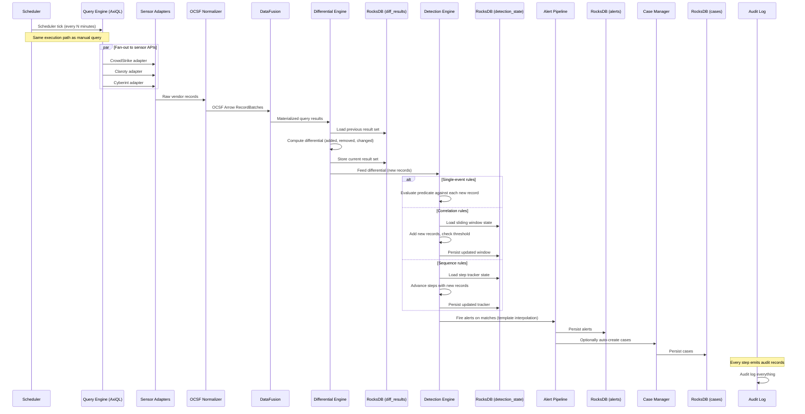

# Scheduled Queries & Detection Engine: Unified Data Pipeline

## The Insight

There is no separate detection polling loop. Scheduled queries ARE the detection engine's data source.

A scheduled query executes on a timer, fetches live data through the same query engine path the analyst uses interactively, computes a differential against previous results, and then feeds that differential to the detection engine as a post-processing step. One API call serves two purposes:

1. **Visibility** -- "what's new since last check?" (the differential result itself)
2. **Detection** -- "does anything new match a rule?" (predicates evaluated against the differential)

This is not two systems that happen to share data. It is one system where detection is a function applied to the output of a scheduled query. The scheduled query is the fetch. The detection rule is the filter. They are composed, not orchestrated.

### Why This Matters

- **One fetch, two purposes.** The sensor API call that produces the differential is the same call that feeds detection. There is no second poll, no ingestion delay, no event bus between "query results" and "detection input."
- **Same query language.** Detection rules are AxiQL predicates -- the same language the analyst uses in interactive queries. There is no separate rule language, no YAML-encoded conditions, no proprietary detection syntax to learn.
- **OCSF enables cross-sensor predicates.** Because all data is normalized to OCSF before detection evaluation, a single rule can reference fields from multiple sensors. A CrowdStrike event and a Claroty event both have `device.ip` -- a detection rule can correlate them without knowing which sensor produced each record.
- **Packs bundle everything.** A query pack ships scheduled queries and detection rules together as a single distributable unit. Install a pack, and you get both the data pipeline and the detection logic.

## The Flow



### Step-by-Step

1. **Scheduler tick** -- The scheduler fires at the configured interval (e.g., every 5 minutes). A splay offset prevents all scheduled queries from executing simultaneously (DI-022).
2. **Query execution** -- The scheduled query is executed through the same query engine path as a manual `query` MCP tool invocation: parse AxiQL, plan, fan-out to sensor adapters, normalize to OCSF, materialize Arrow RecordBatches, execute via DataFusion.
3. **Differential computation** -- The current result set is compared against the previous result set stored in RocksDB (`diff_results` domain). The differential identifies records that are added, removed, or changed.
4. **Detection evaluation** -- The differential (specifically, the new records) is fed to the detection engine. Each active detection rule bound to this scheduled query is evaluated against the differential. The detection mode determines how evaluation works (see below).
5. **Alert firing** -- When a rule matches, the alert pipeline interpolates the rule's template with matched record data, persists the alert to RocksDB (`alerts` domain), and optionally sends notifications.
6. **Case creation** -- Alerts can optionally auto-create cases in the case management system (`cases` domain), grouping related alerts for analyst triage.
7. **Audit** -- Every step is recorded in the buffered audit log for compliance and debugging.

## Three Detection Modes

Detection rules operate in one of three modes. Each mode consumes the differential differently and maintains different persistent state.

### Single-Event Rules

A single-event rule is a predicate evaluated independently against each new record in the differential. It answers: "does this individual record match a condition?"

**Evaluation:** For each record in the differential's `added` set, evaluate the AxiQL predicate. If it matches, fire an alert.

**Deduplication key:** `(rule_id, event_uid)`

No record produces more than one alert per rule, even if the same record appears in consecutive differentials (e.g., due to API pagination overlap).

**Persistence:** None beyond the alert itself. Single-event rules are stateless.

**Example rule:**
```yaml
id: "det-crowdstrike-critical-alert"
name: "CrowdStrike Critical Severity Alert"
mode: single_event
bound_query: "sched-crowdstrike-alerts"
predicate: "severity >= critical AND status = open"
template: "Critical alert on {{device.hostname}}: {{finding.title}}"
```

**Example scenario:** A scheduled query fetches CrowdStrike alerts every 5 minutes. The differential shows 3 new alerts since last check. The rule evaluates `severity >= critical AND status = open` against each. One of the three is severity `critical` -- the rule fires, producing an alert with the interpolated template.

### Correlation Rules

A correlation rule counts matching records within a sliding time window and fires when a threshold is exceeded. It answers: "have enough events of this type occurred within a time period?"

**Evaluation:** New records from the differential are added to a persisted sliding window. The window is pruned of expired entries. If the count of records matching the predicate within the window exceeds the threshold, fire an alert.

**Deduplication key:** `(rule_id, group_by_hash, window_bucket)`

The `group_by_hash` is computed from the rule's `group_by` fields (e.g., `device.ip`). The `window_bucket` is the discrete time bucket containing the threshold breach. After firing, the window resets (no re-firing until the threshold is exceeded again in a new window).

**Persistence:** The sliding window is stored in RocksDB (`detection_state` domain) keyed by `(rule_id, group_by_hash)`. This survives process restarts.

**Example rule:**
```yaml
id: "det-brute-force"
name: "Brute Force Login Attempts"
mode: correlation
bound_query: "sched-auth-events"
predicate: "activity_name = 'Logon' AND status = 'Failure'"
group_by: ["device.ip", "actor.user.name"]
window: "15m"
threshold: 10
template: "{{threshold}}+ failed logins for {{actor.user.name}} on {{device.ip}} in 15 minutes"
```

**Example scenario:** A scheduled query fetches authentication events every 5 minutes. Over three consecutive ticks, the differential adds 4, 3, and 5 failed login records for the same `(device.ip, actor.user.name)` pair. After the third tick, the sliding 15-minute window contains 12 matching records, exceeding the threshold of 10. The rule fires. The window resets. Subsequent ticks do not re-fire until 10+ failures accumulate again.

### Sequence Rules

A sequence rule tracks an ordered series of steps that must occur in order, optionally across different sensors, within a time window. It answers: "did this multi-step attack pattern occur?"

**Evaluation:** Each step in the sequence has its own predicate. New records from the differential are matched against the current step. If a record matches, the tracker advances to the next step. If all steps complete within the time window, fire an alert. Steps can match records from different sensors -- OCSF normalization makes cross-sensor fields comparable.

**Deduplication key:** `(rule_id, sequence_completion_hash)`

The `sequence_completion_hash` is derived from the event UIDs of the records that completed each step. A given set of events completes the sequence at most once.

**Persistence:** The step tracker is stored in RocksDB (`detection_state` domain) keyed by `(rule_id, correlation_field_hash)`. The correlation field (e.g., `device.ip`) links steps across different scheduled queries. This survives process restarts.

**Example rule:**
```yaml
id: "det-recon-to-firmware"
name: "Reconnaissance Followed by Firmware Change"
mode: sequence
correlation_field: "device.ip"
window: "4h"
steps:
  - name: "recon"
    bound_query: "sched-crowdstrike-network"
    predicate: "activity_name = 'Network Activity' AND category_name = 'Discovery'"
  - name: "firmware_change"
    bound_query: "sched-claroty-changes"
    predicate: "activity_name = 'Device Config Change' AND metadata.product.name = 'Claroty'"
template: "Recon on {{device.ip}} (CrowdStrike) followed by firmware change (Claroty) within 4h"
```

This rule is explained in detail in the cross-sensor detection example below.

## How Packs Bundle Queries and Rules

A query pack is a distributable unit that bundles scheduled queries, detection rules, and optionally query aliases into a single installable package. Packs are the deployment mechanism for detection content.

```yaml
id: "pack-ot-threat-detection"
name: "OT Threat Detection Pack"
version: "1.2.0"
description: "Cross-sensor detection for OT/ICS environments"

scheduled_queries:
  - id: "sched-crowdstrike-network"
    query: "FROM network_activity | where sensor = 'crowdstrike'"
    interval: "5m"
    clients: null  # all clients with CrowdStrike

  - id: "sched-claroty-changes"
    query: "FROM device_changes | where sensor = 'claroty'"
    interval: "5m"
    clients: null  # all clients with Claroty

detection_rules:
  - id: "det-recon-to-firmware"
    name: "Reconnaissance Followed by Firmware Change"
    mode: sequence
    # ... (as defined above)

  - id: "det-claroty-critical-change"
    name: "Critical OT Device Configuration Change"
    mode: single_event
    bound_query: "sched-claroty-changes"
    predicate: "severity >= high AND device.type = 'PLC'"
    template: "Critical config change on PLC {{device.hostname}}"

aliases:
  - id: "ot-recent-changes"
    expansion: "FROM device_changes | where sensor = 'claroty' | sort time desc | head 50"
```

When a pack is installed:

1. **Scheduled queries** are registered with the scheduler
2. **Detection rules** are validated (predicate parse check, bound query existence) and activated
3. **Aliases** are added to the alias registry
4. All three are linked by `pack_id` for lifecycle management (enable/disable/uninstall as a unit)

## The Role of Persistence

RocksDB provides durable storage across four domains, each serving a distinct purpose in the scheduled query and detection pipeline:

| Domain | Key Schema | Value | Purpose |
|--------|-----------|-------|---------|
| `diff_results` | `(schedule_id, execution_ts)` | Serialized result set (Arrow IPC) | Stores the previous result set for differential computation. Pruned after configurable retention (default: 2 executions). |
| `detection_state` | `(rule_id, group_hash)` | Sliding window entries or step tracker state | Persists correlation windows and sequence progress across process restarts. Pruned when windows expire or sequences complete/timeout. |
| `alerts` | `(alert_id)` | Alert record (rule_id, matched records, template output, timestamp, status) | Durable alert storage for analyst review. Status lifecycle: `open` -> `acknowledged` -> `resolved`. |
| `cases` | `(case_id)` | Case record (linked alert IDs, status, analyst notes, disposition) | Groups related alerts for triage. Status lifecycle: `open` -> `in_progress` -> `resolved` with disposition. |

All four domains are column families within a single RocksDB instance. Writes are atomic within a column family. Cross-domain consistency (e.g., alert creation + case linkage) uses RocksDB's `WriteBatch` for atomicity.

## Cross-Sensor Detection Example

**Scenario:** An attacker compromises an IT endpoint, performs network reconnaissance, then pivots to an OT network to modify PLC firmware. CrowdStrike detects the reconnaissance; Claroty detects the firmware change. No single sensor sees the full attack.

**Detection rule:** `det-recon-to-firmware` (sequence mode, defined above)

**How it works:**

```
Timeline:
  T+0m   Scheduler tick -> sched-crowdstrike-network executes
         Differential: 3 new network discovery events
         Detection: Step 1 (recon) matches for device.ip = 10.0.1.50
         Step tracker persisted: {step: 1, ip: 10.0.1.50, started: T+0m}

  T+5m   Scheduler tick -> sched-claroty-changes executes
         Differential: 0 new changes
         Detection: No step 2 match. Tracker unchanged.

  T+10m  Scheduler tick -> sched-crowdstrike-network executes
         Differential: 1 new network event (different IP). No impact on existing tracker.

  T+15m  Scheduler tick -> sched-claroty-changes executes
         Differential: 1 new config change on device.ip = 10.0.1.50
         Detection: Step 2 (firmware_change) matches for device.ip = 10.0.1.50
         Sequence complete! Within 4h window.
         -> Alert fired: "Recon on 10.0.1.50 (CrowdStrike) followed by firmware change (Claroty) within 4h"
         -> Case auto-created linking the alert
```

**What makes this possible:**

1. **OCSF normalization** -- CrowdStrike's `local_ip` and Claroty's `ip_address` are both normalized to `device.ip`. The sequence rule correlates on `device.ip` without knowing which sensor produced each record.
2. **Persistent step tracker** -- The tracker survives across scheduler ticks and across different scheduled queries. Step 1 matched from `sched-crowdstrike-network`; step 2 matched from `sched-claroty-changes`. The tracker links them via `correlation_field: device.ip`.
3. **Differential feeding** -- Each scheduled query independently feeds its differential to the detection engine. The detection engine evaluates all active rules, including multi-step sequence rules waiting for their next step.

## Why This Design

| Design Choice | Alternative | Why Prism Chose This |
|---------------|-------------|---------------------|
| Detection as post-processing on scheduled queries | Separate detection polling loop | One API call serves both visibility and detection. No duplicate fetches. No ingestion bus. No lag between "data available" and "detection evaluated." |
| AxiQL predicates as detection rules | YAML conditions, Sigma rules, proprietary DSL | Same language for interactive queries and detection rules. The analyst who writes a query to investigate can trivially promote it to a detection rule. No translation layer. |
| OCSF normalization before detection | Sensor-native detection rules | Cross-sensor detection rules are free. A single predicate can reference fields from any sensor because all data shares the same schema. Without OCSF, cross-sensor correlation would require per-sensor rule variants. |
| Packs bundle queries + rules | Separate management of queries and rules | A detection rule without its data source is useless. Packing them together ensures deployment is atomic: install a pack, and detection works. No "I installed the rules but forgot to configure the scheduled queries." |
| RocksDB for detection state | In-memory state, external database | Persistent state survives process restarts without external dependencies. RocksDB is embedded (no network calls), fast (LSM-tree optimized for writes), and supports atomic WriteBatch for cross-domain consistency. |
| Deduplication at three levels | Single dedup strategy | Each detection mode has different dedup semantics. Single-event dedup is per-record. Correlation dedup is per-window-bucket. Sequence dedup is per-completion. A single strategy would either miss duplicates or suppress valid alerts. |
